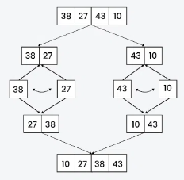
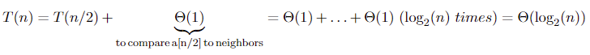
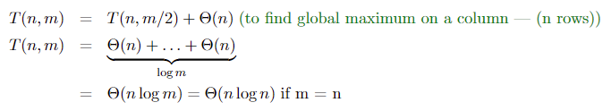
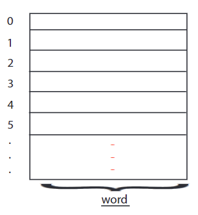
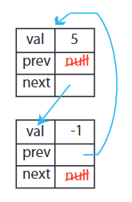
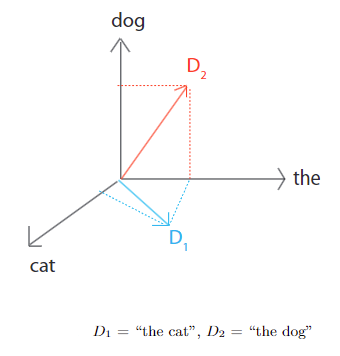
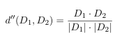
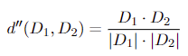
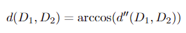
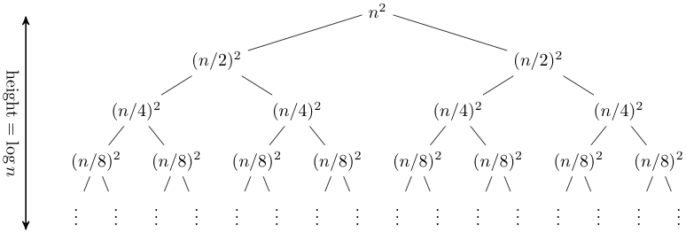

# algorithms & data structures
- [algorithmic thinking](#algorithmic-thinking)
- [models of computation](#models-of-computation)
- [sorting](#sorting)

## links  <!-- omit from toc -->
- [[lectures] introduction to algorithms](https://ocw.mit.edu/courses/6-006-introduction-to-algorithms-fall-2011/)
- [big O notation](https://adrianmejia.com/how-to-find-time-complexity-of-an-algorithm-code-big-o-notation/)

## todo  <!-- omit from toc -->
- document distance sorted vector add notes
- go through document distance variations
- [quick sort](https://www.youtube.com/watch?v=XE4VP_8Y0BU)
- [leetcode 75](https://leetcode.com/studyplan/leetcode-75/)

## algorithmic thinking
- efficient procedures for solving problems on large inputs (like human genome)
- **asymptotic complexity:** is used for (worst-case) estimation of computational complexity of algorithms  
example: for `f(n) = n^2 + 3n` as `n` grows `n^2` grows at a much faster rate than `3n` rendering it insignificant for large values of `n`, so `f(n)` is said to be asymptotically equivalent to `n^2`  
  
  ```
  // sequential = statement1 + statement2
  statement1;
  statement2;

  // conditional = max(condition1, condition2)
  if (flag)
      condition1;
  else
      condition2;

  // linear loop = iterations * (statement1 + statement 2)
  for (int i = 0; i < iterations; i++)
  {
      statement1;
      statement2;
  }

  // nested loop = iterations_i * (statement1 + j * statement2);
  for (int i = 0; i < iterations_i; i++)
  {
      statement1;
      for (int j = 0; j < iterations_j; j++)
      {
          statement2;
      }
  }

  // logarithmic loop = log2(iterations) * (statement1 + statement2)
  for (int i = iterations; i >= 1; i /= 2)
  {
      statement1;
      statement2;
  }
  ```
- **divide & conquer algorithm:** is a algorithm design paradigm that recursively breaks down a problem into sub-problems of the same or related type until they become simple enough to be solved directly  

- **peak:** position whose value is greater-than or equal-to (`>=`) all its neighbors, example: in 1D check left & right
- **1D peak finding:** find a peak in an array of size `n`  
with `>=` a peak will always exist, but with `>` a peak might exist, example: no peak if all elements have same value  

  - **straightforward:** start from first element and walks across all elements  
  **`O(n)`** if last element is the peak
    ```cpp 
    uint32_t find1DPeakStraightforward(array_t array)
    {
        printArray(array);

        // check first & last elements first
        if (array.addr[0] > array.addr[1])
        {
            return array.addr[0];
        }
        else if (array.addr[array.size - 1] > array.addr[array.size - 2])
        {
            return array.addr[array.size - 1];
        }

        // check remaining ones
        for (int i = 1; i < array.size - 2; ++i)
        {
            uint32_t left_value   = array.addr[i - 1];
            uint32_t centre_value = array.addr[i];
            uint32_t right_value  = array.addr[i + 1];

            if ((centre_value >= left_value) && (centre_value >= right_value))
            {
                return centre_value;
            }
        }

        return NOT_FOUND;
    }
    ```
  - **divide & conquer:** recursive algorithm where we look at `n/2` position and then look at its left to check if it is higher then look at left half for a peak, else check right position and go for right half, if neither then `n/2` is the peak  
  since the recursion part will run as many times as we can half the input array, recursions can be calculated using `log`, example: for array size `n = 8`, we need `log2(8) = 3` iterations, always assume base 2 for log in CS  
  **`O(log(n))`**, recurrence relation `T(n) = T(n/2) + O(1)`  
  
    ```cpp
    uint32_t find1DPeakDivideConquer(array_t array)
    {
        size_t midpoint  = array.size / 2;
        size_t new_start = 0;
        size_t new_end   = array.size;

        printArray(array);

        // check first & last elements first
        if (array.addr[0] > array.addr[1])
        {
            return array.addr[0];
        }
        else if (array.addr[array.size - 1] > array.addr[array.size - 2])
        {
            return array.addr[array.size - 1];
        }

        if (array.size > 2)
        {
            uint32_t left_value   = array.addr[midpoint - 1];
            uint32_t centre_value = array.addr[midpoint];
            uint32_t right_value  = array.addr[midpoint + 1];

            if (left_value > centre_value)    // check left first
            {
                new_end = midpoint;
            }
            else if (right_value > centre_value)    // then check right
            {
                new_start = midpoint;
            }
            else    // midpoint is the peak
            {
                return array.addr[midpoint];
            }
        }
        else
        {
            return NOT_FOUND;
        }

        // search peak in new sub-array
        array_t new_array = {0, new_end - new_start + 1};
        new_array.addr    = (uint8_t *)malloc(new_array.size);
        for (size_t i = 0; i < new_array.size; i++)
        {
            new_array.addr[i] = array.addr[new_start + i];
        }

        uint32_t peak = find1DPeakDivideConquer(new_array);

        free(new_array.addr);

        return peak;
    }
    ```
- **2D peak finding:** find a peak/hill (higher than all 4 neighbors) in a matrix with `n` rows & `m` columns  

  - **greedy ascent:** essentially picks the directions to follow, start at the middle position and similar to 1D divide & conquer keep checking in a  default pattern (like left ⟶ right ⟶ up ⟶ down) until you find a higher element to decide which direction to move until the peak is found  
  **`O(n * m)`**, `O(n^2)` for a square matrix  
  
    ```cpp
    uint32_t find2DPeakGreedyAscent(matrix_t matrix)
    {
        printMatrix(matrix);

        point2d_t position = {matrix.height / 2, matrix.width / 2};

        while (1)
        {
            int32_t centre_value = matrix.addr[position.row * matrix.width + position.col];
            int32_t left_value, right_value, up_value, down_value;

            printf("%4d ", centre_value);

            // init all neighbors
            left_value = right_value = up_value = down_value = INVALID;

            // check for edges
            if (position.col > 0)
                left_value = matrix.addr[position.row * matrix.width + (position.col - 1)];
            if (position.col < (matrix.width - 1))
                right_value = matrix.addr[position.row * matrix.width + (position.col + 1)];
            if (position.row > 0)
                up_value = matrix.addr[(position.row - 1) * matrix.width + position.col];
            if (position.row < (matrix.height - 1))
                down_value = matrix.addr[(position.row + 1) * matrix.width + position.col];

            // compare to neighbors
            if (matrix.width > 1 && matrix.height > 1)
            {
                if (left_value > centre_value)    // check left first
                {
                    printf(" -> ");
                    position.col--;
                }
                else if (right_value > centre_value)    // then check right
                {
                    printf(" -> ");
                    position.col++;
                }
                else if (up_value > centre_value)    // then check up
                {
                    printf(" -> ");
                    position.row--;
                }
                else if (down_value > centre_value)    // then check down
                {
                    printf(" -> ");
                    position.row++;
                }
                else    // midpoint is the peak
                {
                    printf("\n");
                    return matrix.addr[position.row * matrix.width + position.col];
                }
            }
            else
            {
                return NOT_FOUND;
            }
        }

        return NOT_FOUND;
    }
    ```
  - **2D divide & conquer:**
    - pick the middle column `j = m/2`, find the 1D peak at `(i, j)` then use `(i, j)` as a start to find a 1D peak in row `i`  
    **`O(log(m) * log(n))`**, but a 2D peak may not exist on row `i` so this algorithm is efficient but incorrect  
    example: 12 is a column 1D peak and in that row 14 is the 1D peak but is not a 2D peak  
    
    - pick the middle column `j = m/2`, find the global max in column `j` at `(i, j)`, then similar to 1D divide & conquer compare `(i, j)` to its left element, if higher then solve the new problem (maximum then comparison) with half the number of columns, else check right, if neither higher then `(i,j)` is the 2D peak (maximum so already compared vertically, and compared horizontally in previous step)  
      
    **`O(n * log(m))`**, worst-case peak in one of the corners of matrix then `O(log(m))` recursions since row size halves every recursion and `O(n)` for (constant size) column maximum value search  
    
      ```cpp
      uint32_t find2DPeakDivideConquer(matrix_t matrix)
      {
          printMatrix(matrix);

          uint32_t peak      = INVALID;
          point2d_t position = {matrix.height / 2, matrix.width / 2};

          position.row = findMatrixColumnMax(matrix, position.col);
          printf("max in column %d is %d\n", position.row, matrix.addr[position.row * matrix.width + position.col]);

          uint32_t centre_value = matrix.addr[position.row * matrix.width + position.col];
          uint32_t left_value, right_value;

          // check for edges
          left_value = right_value = INVALID;
          if (position.col > 0)
              left_value = matrix.addr[position.row * matrix.width + (position.col - 1)];
          if (position.col < (matrix.width - 1))
              right_value = matrix.addr[position.row * matrix.width + (position.col + 1)];

          // compare to neighbors
          if (left_value > centre_value)    // check left first
          {
              position.col = 0;
          }
          else if (right_value > centre_value)    // then check right
          {
              position.col = (matrix.width / 2) - 1;
          }
          else
          {
              return centre_value;
          }

          // search peak in new sub-array
          matrix_t new_matrix = {0, (matrix.width / 2) + 1, matrix.height};
          new_matrix.addr     = (uint8_t *)malloc(new_matrix.width * new_matrix.height);
          for (size_t row = 0; row < new_matrix.height; row++)
          {
              for (size_t col = 0; col < new_matrix.width; col++)
              {
                  new_matrix.addr[row * new_matrix.width + col] = matrix.addr[row * matrix.width + (col + position.col)];
              }
          }

          peak = find2DPeakDivideConquer(new_matrix);

          free(new_matrix.addr);

          return peak;
      }

      uint32_t findMatrixColumnMax(matrix_t matrix, uint32_t col)
      {
          uint32_t column_max_row = 0;
          for (int32_t i = 1; i < matrix.height; i++)
          {
              if (matrix.addr[i * matrix.width + col] > matrix.addr[column_max_row * matrix.width + col])
              {
                  column_max_row = i;
              }
          }

          return column_max_row;
      }
      ```

## models of computation
- **algorithm:** is mathematical abstraction of a computer program (computational procedure to solve a problem)  
**model of computation:** specifies what operations an algorithm is allowed and cost (time, space, etc) of each operation  
total cost of an algorithm is sum of operation costs
- **example: random access machine (RAM):** random access memory is modeled by a big array of `O(1)` registers (of 1 word each)  
in `O(1)` time an algorithm can load `O(1)` words, do `O(1)` computations and store `O(1)` words  
is similar to assembly programming and is realistic & powerful  

- **example: pointer machine:** dynamically allocated objects, each object has `O(1)` fields, fields are words or pointer
is similar to object oriented programming, is weaker than RAM but is simpler  
  
this can be implemented in RAM where pointer becomes index in array
- **python model:** has either mode of thinking: array `*i = *(i + 1)` or objects `x = x.next`
- **document distance:** shows the similarities between two text documents, think of document `D` as a vector of words `w` (whitespace & punctuations ignored), where `D[w]` gives the frequency of the word  
  
document distance can be defined as dot product of the two vectors  
  
but this will not be scale-invariant (long documents with 99%, same words will seem farther than short documents with 10% same words), this can be fixed through normalization  
  
recall dot product is `x . y = |x| |y| cosθ`, so apply arccosine (inverse function of cosine) to above function to get geometric representation (in radians)  

- **document distance algorithm:** split each document into words ⟶ count word frequencies in document vectors -> compute dot product and divide
  ```cpp
  void splitDocument(document *document)
  {
      // take a local copy of string
      char *string = (char *)calloc(strlen(document->line) + 1, sizeof(char));
      if (!string)
          assert(0);

      strcpy(string, document->line);

      // parse out words from line
      size_t pos = 0;
      char *word = strtok(string, " ,.-");
      while (word != NULL && (pos < document->max_word_size * document->max_num_words))
      {
          strcpy(&document->words[pos], word);
          pos += document->max_word_size;
          document->num_words++;

          word = strtok(NULL, " ,.-");
      }

      // free local buffer
      free(string);
  }

  void countWordFrequencies(document *document)
  {
      // initialize frequency
      for (size_t i = 0; i < document->num_words; i++)
      {
          document->frequency[i] = 1;
      }

      // check for frequencies by checking for duplicates
      for (size_t curr = 0; curr < document->num_words; curr++)
      {
          for (size_t search = curr + 1; search < document->num_words; search++)
          {
              if (!strcmp(&document->words[curr * document->max_word_size], &document->words[search * document->max_word_size]))
              {
                  document->frequency[search] = 0;
                  document->frequency[curr]++;
                  document->words[search * document->max_word_size] = 0;
                  break;
              }
          }
      }
  }

  uint32_t computeDotProduct(document *document1, document *document2)
  {
      uint32_t dot_product = 0;

      for (size_t curr = 0; curr < document1->num_words; curr++)
      {
          for (size_t ref = 0; ref < document2->num_words; ref++)
          {
              if (!strcmp(&document1->words[curr * document1->max_word_size], &document2->words[ref * document2->max_word_size]))
              {
                  dot_product += document1->frequency[curr] * document2->frequency[ref];
                  break;
              }
          }
      }

      return dot_product;
  }
  ```

## sorting
- **sorting:** refers to ordering data in an increasing/decreasing manner according to some linear relationship among the data items  
useful for problems (like find the median or binary search) that become easier if items are already in sorted order and for not so obvious usecases like finding duplicates during data compression
- **insertion sort:** insert key `A[j]` into the already sorted sub-array `A[1 .. j-1]` by pairwise key-swaps down to its right position  
**`O(n^2)`**, total `O(n)` steps and for each step worst-case `O(n)` pairwise compare-and-swap operations to move to correct position, so total `O(n^2) compares + O(n^2) swaps`  
for numbers compare and swap take `O(1)` each, but comparing other data structure elements could be more complex  
  

  - **binary insertion sort:** insert key by using binary search to find the right position, this is useful when compare complexity is much higher than swap complexity  
  swap to correct position still needs `O(n)` pairwise swaps  
  example: if compare function is `O(n^2)` & swap is `O(n)`, then insert sort would be `O(n) * (O(n^2) + O(n)) = O(n^3)`, but with binary insertion sort it is still `O(n) * (O(log(n^2)) + O(n)) = O(n^2)`
- **merge sort:** works by recursively dividing the input array in half and sorting those sub-arrays then merging them back together to obtain the sorted array  
  
**two-finger algorithm:** for merging two sorted sub-arrays, initially one finger is pointing to the bottom (smallest element) in left sub-array & other finger right, compare two elements and copy smaller value to final merged array, keep going until sub-arrays are merged  
  
**recursion tree:** is useful for visualizing what happens when a recurrence is iterated  
**complexity from recursion tree:** add up the cost of each level to get the total cost  
`n` elements are being merged on each level and we have `1 + log(n)` levels (size halves per level + root level), so `O(n) * O(1+log(n)) = O(n * log(n))`  
**`O(n * log(n))`**, recurrence relation `T(n) = 2T(n/2) + cn`  
  
merge sort needs `O(n)` auxiliary space, but insertion sort only needs `O(1)` (for temp variable for swapping)
- **example: complexity from recursion tree:** for `T(n) = 2T(n/2) + c * n^2`  
complexity for levels are `n^2 , (n^2)/2, (n^2)/4 . . .`, `O(log(n) * (n^2 + (n^2)/2 + (n^2)/4 + . . .)) = O(n^2 * log(n))`
  
similarly for `T(n) = 2T(n/2) + c`, all the work is done in the leaves `O(log(n) + (c + 2c + 4c + . . .)) = O(log(n))`