- [introduction](#introduction)
- [search](#search)
- [sorting](#sorting)
- [heap](#heap)
- [binary search trees](#binary-search-trees)
- [AVL tree (balanced BST)](#avl-tree-balanced-bst)

# links  <!-- omit from toc -->
- [introduction to algorithms](https://ocw.mit.edu/courses/6-006-introduction-to-algorithms-fall-2011/) ([recitation files](https://courses.csail.mit.edu/6.006/fall11/notes.shtml))
- [big O notation](https://adrianmejia.com/how-to-find-time-complexity-of-an-algorithm-code-big-o-notation/ )
- [why `log(n)`](https://www.youtube.com/watch?v=Xe9aq1WLpjU)
- [quick sort](https://www.youtube.com/watch?v=7h1s2SojIRw)
- [counting sort](https://www.youtube.com/watch?v=OKd534EWcdk)
- [radix sort](https://www.youtube.com/watch?v=XiuSW_mEn7g)

# introduction
- **data structures:** organize & store data for efficient access & manipulation  
  **algorithm:** efficient procedure for solving a (large-scale) problem  
  **model of computation:** specifies what operations an algorithm is allowed & its cost (time, space, etc)  
  total cost of an algorithm is sum of operation costs  
- **asymptotic complexity:** estimate algorithm's worst-case computational complexity as input scales  
  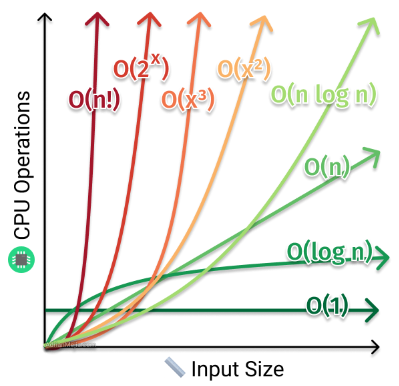
- **divide & conquer algorithm:** break down a problem into smaller subproblems, solve them recursively then combine the solutions
- **tail call recursion:** recursive call is the last action before returning  
  if next step needs current step result then pass it as arg  
  compiler will reuse current function's stack frame (prevent stack overflow)  
  example: binary search recursive call directly returns search position
  ```cpp
  template <typename T>
  bool binary_search(const std::vector<T> &input, T key, typename std::vector<T>::iterator start, typename std::vector<T>::iterator end)
  {
      cout << std::vector<T>(start, end) << endl;

      if (end >= start)
      {
          typename std::vector<T>::iterator mid = start + (end - start) / 2;
          T mid_value                           = *mid;

          if (key > mid_value)
          {
              return binary_search(input, key, mid + 1, end);
          }
          else if (key < mid_value)
          {
              return binary_search(input, key, start, mid - 1);
          }
          else
          {
              cout << "found key " << key << " at " << mid - input.begin() << endl;
              return true;
          }
      }

      cout << key << " not found" << endl;
      return false;
  }
  ```
- `ceil(log(n))` bits (or digits for base10) required to uniquely represent `[0, n)`  
  search (mapping value to index) needs atleast `log(n)` steps  
  sorting (index for each element) `n * log(n)`

# search
- **peak:** position whose value is `>=` (or `>`) all its neighbors, aka local maximum  
  with `>=` peak will always exist since (increasing ⟶ decreasing/equal) transition must take place at some index (edges for sorted arrays)  
  but with `>` peak might not exist (all array elements same value)
- **1D peak finding:**  
  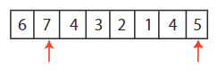
  - **linear:** walk across all elements  
    worst case `θ(n)` if last element peak
  - **divide & conquer (binary):** start at midpoint then pick higher neighbor's half  
    if neither higher then midpoint is the peak
    ```
    each recursion divides the input size by half:
    T(n) = T(n/2) + θ(1)          ⟶ θ(1) for midpoint comparison
         = T(n/4) + θ(1) + θ(1)
         .
         .
         = T(n/(2^k)) + k * θ(1)

    base case one element:
    T(1) = θ(1)
    n/(2^k) = 1
    k = log2(n)

    T(n) = T(1) + log(n) * θ(1)
         = (log(n) + 1) * θ(1)
         ≈ θ(log(n))
    ```
- **2D peak finding:**  
  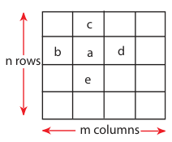
  - **greedy ascent:** from midpoint keep moving in the direction of highest neighbor until peak is found  
    worst-case `θ(n * m)` if all elements traversed  
    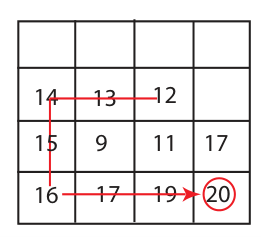
  - **divide & conquer 1:** find 1D peak `(i, j)` in middle column (`j == m/2`) and then find 1D peak in that row (`i`)  
    but 2D peak may not exist on row `i`  
    efficient (`θ(log(m) * log(n))`) but incorrect algorithm  
    example: 12 is a column 1D peak and in that row 14 is the 1D peak but is not a 2D peak  
    
  - **divide & conquer 2:** find (global) maximum `(i, j)` in middle column (`j == m/2`)  
    then pick higher left/right neighbor's half, 2D peak if neither higher  
    
    ```
    T(n, m) = T(n, m/2) + θ(n)          ⟶ θ(n) for global max
            = T(n, m/4) + θ(n) + θ(n)
            .
            .
            = T(n, m/(2^k)) + k * θ(n)

    base case one row:
    T(n, 1) = θ(n)
    m/(2^k) = 1
    k = log(m)

    T(n) = T(n, 1) + log(m) * θ(n)
         = (log(m) + 1) * θ(n)
         ≈ θ(n * log(m))                  ⟶ worst case if matrix corner peak
    ```

# sorting
- **sorting:** ordering data in increasing/decreasing manner  
  obvious usecases: finding median, binary search  
  not-so-obvious usecases: finding duplicates during data compression
- **insertion sort:** insert key `A[j]` into (already sorted) sub-array `A[1 ... j-1]` by pairwise-swaps down to correct position  
  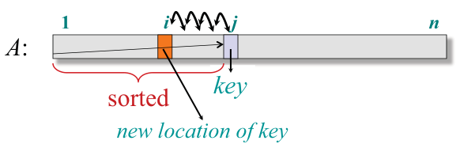  
  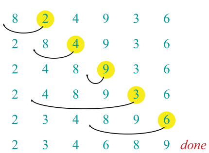  
  worst-case `θ(n^2)` since each element needs `θ(n)` pairwise compare-and-swaps  
  ideal for small input since minimal overhead (in-place no recursion) and efficient for nearly-sorted input
  for primitives compare & swap take `θ(1)` each, but aggregates compare could be more complex
- **binary insertion sort:** use binary search to find correct position  
  useful when compare complexity much higher than swap complexity  
  example: for sorting strings each compare `θ(n)` (swap still `θ(1)`)  
  per element insertion sort: `θ(n) * (θ(n) + θ(1)) = θ(n^2)`  
  binary insertion sort: `θ(n) * (θ(log(n)) + θ(1)) ≈ θ(n * log(n))`
- **merge sort:** recursively divide input array into halves and sort those sub-arrays then merge them back to obtain the sorted array  
  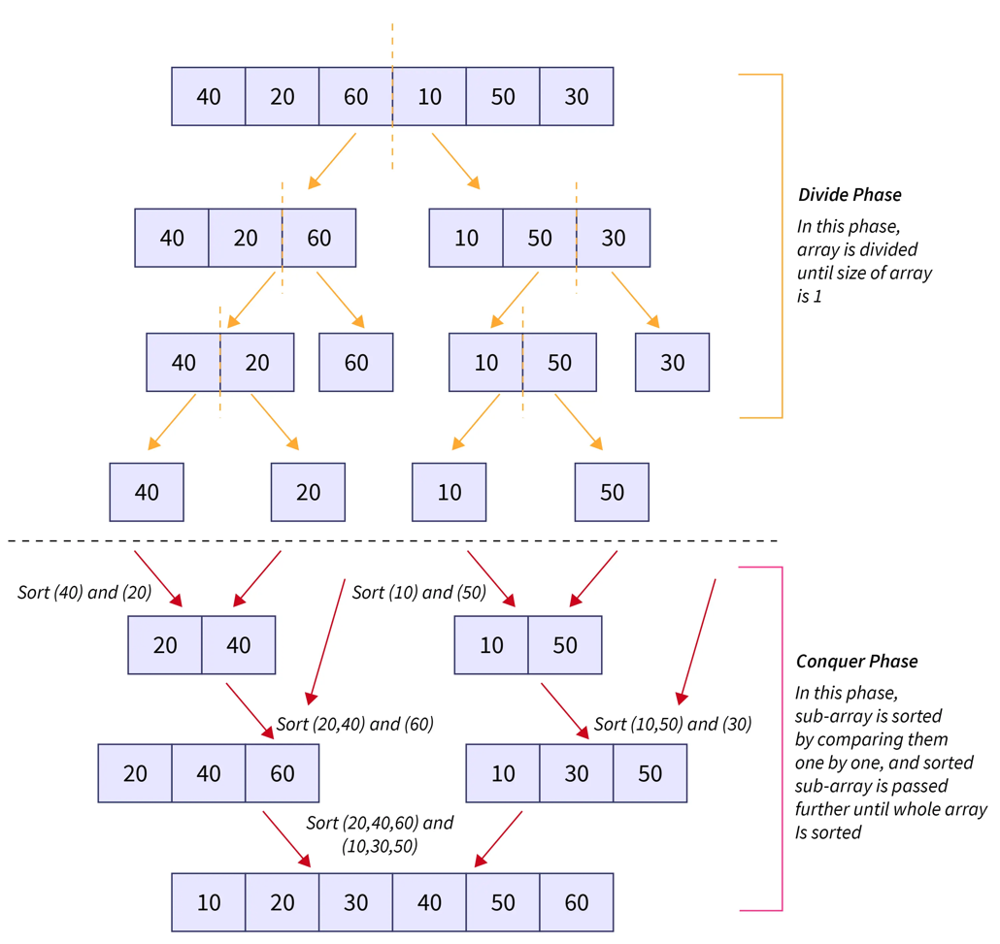  
  **two-finger approach:** initially pointing to bottom (smallest element) of two sub-arrays  
  keep pushing smaller value of two elements to final merged array  
  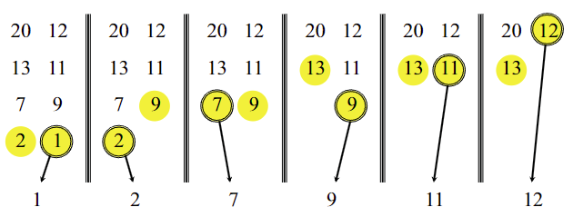  
  `θ(1)` for splitting input and `θ(n)` for merging two `n/2` sub-arrays
  ```
  T(n) = θ(1) + 2 * T(n/2) + θ(n)             ⟶ θ(1) split, θ(n) merge sub-arrays
       = 4 * T(n/4) + θ(n) + θ(n)
       .
       .
       = 2^k * T(n/(2^k)) + k * θ(n)

  base case sub-array with two elements:
  T(2) = θ(1)
  n/(2^k) = 2
  k = log(n/2)

  T(n) = n/2 * T(2) + log(n/2) * θ(n)
       ≈ θ(n * log(n))
  ```
  needs `θ(n)` auxiliary space, but insertion sort only needs `θ(1)` (for swap temp var)  
  memory for halves can be reused to reduce memory usage by half (but still `θ(n)`)
  ```cpp
  template <typename T>
  void merge_sort(std::vector<T> &input, typename std::vector<T>::iterator start, typename std::vector<T>::iterator end)
  {
      cout << std::vector<T>(start, end) << endl;

      size_t size = end - start;
      if (size == 2)
      {
          if (*start > *(end - 1))
          {
              uint32_t temp = *start;
              *start        = *(end - 1);
              *(end - 1)    = temp;
          }
      }
      else if (size == 1)
      {
      }
      else
      {
          size_t half_size = size / 2;
          std::vector<T> left(start, start + half_size);
          std::vector<T> right(start + half_size, end);

          merge_sort(left, left.begin(), left.end());
          merge_sort(right, right.begin(), right.end());

          input.clear();
          input = left + right;
          cout << input << endl;
      }
  }

  template <typename T>
  std::vector<T> operator+(std::vector<T> &left, std::vector<T> &right)
  {
      std::vector<T> result;
      result.reserve(left.size() + right.size());

      while (left.size() || right.size())
      {
          if (left.size() == 0)
          {
              result.push_back(right.at(0));
              right.erase(right.begin());
              continue;
          }

          if (right.size() == 0)
          {
              result.push_back(left.at(0));
              left.erase(left.begin());
              continue;
          }

          if (left.at(0) < right.at(0))
          {
              result.push_back(left.at(0));
              left.erase(left.begin());
          }
          else
          {
              result.push_back(right.at(0));
              right.erase(right.begin());
          }
      }

      return result;
  }
  ```
- **recursion tree:** visual representation of recursive calls  
  get complexity by adding up the costs of each level  
  each node is the cost of operations done for child nodes (split + merge)  
  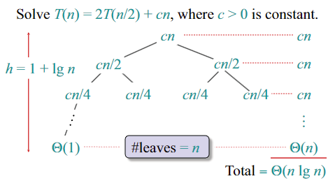  
  `n` elements merged per level for total of `1 + log(n)` levels (root level + size halves per level)  
  total `θ(n) * θ(1+log(n)) ≈ θ(n * log(n))`  
- **quick sort:** element in correct sorted position when all smaller elements to its left & larger right  
  recursively select pivot then partition input into `<=` & `>=` sub-arrays  
  partition by swapping larger elements on left with smaller element on right till two pointers meet  
  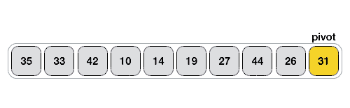  
  average-case `θ(n * log(n))` since balanced sub-arrays for truly random input  
  worst-case `θ(n^2)` for sorted/reverse-sorted input  
  **median-of-3:** first sort first, middle & last elements in-place then using middle as pivot (moved to end) sort ignoring first & last (already sorted wrt pivot)
  ```cpp
  template <typename T>
  void quick_sort(std::vector<T> &input, typename std::vector<T>::iterator start, typename std::vector<T>::iterator end)
  {
      if (start < end)
      {
          T pivot = *start;
          cout << "pivot:" << pivot << "  start:" << *start << "  end:" << *(end - 1) << endl;
          cout << std::vector<T>(start, end) << endl;
          auto low = start, high = end;

          // partition
          while (low < high)
          {
              do
              {
                  low++;
              } while ((low < end) && (*low <= pivot));

              do
              {
                  high--;
              } while ((high > start) && (*high >= pivot));

              if (low < high)
              {
                  std::swap(*low, *high);
              }
          }

          // swap pivot to correct index
          std::swap(*start, *high);
          cout << input << endl
              << endl;

          // recurse for sub-arrays
          quick_sort(input, start, high);
          quick_sort(input, high + 1, end);
      }
  }
  ```

## hybrid
- quick sort has high const factor due to recursion, bad cache locality (left & right ptr access), bad pivot selection  
  merge sort needs extra space  
  heap sort has bad cache locality (swaps)  
  insertion sort slow for large inputs
- **intro sort:** (C++ lib) hybrid of quick, heap & insertion sorts  
  start with quick sort till certain recursion depth (stop ongoing bad pivot selection)  
  switch to heap sort (better worst-case, in-place)  
  use insertion sort (better for smaller input) if num elements less than threshold  
  height of recursion tree controlled using threshold  
- **tim sort:** (python lib) hybrid of merge & insertion sorts  
  identify & merge (adjacent) sorted (varying-length) portions  
  reverse-sorted portions reversed before merging  
  if unsorted portion larger than threshold, recursevily break it then run insertion sort

## non-comparison
- **counting sort:** count occurrences of each element then place them in correct order  
  `θ(n + range)`, useful if keys have small range (like `uint8_t`)  
  calculate histogram's CDF then place each input element using CDF as offset  
  preserves relative order of equal elements (stable)  
  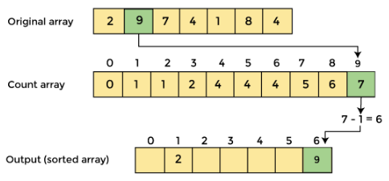
- **radix sort:** digit-by-digit (counting) sort from least to most significant digit  
  needs stable (counting) sort co-routine to maintain relative order  
  `θ(num_digits * (n + base))`, base 10 for decimal  
  `base ∝ 1/num_digits`, `base ∝ space_complexity` (CDF array), `num_digits ∝ 1/time_complexity` (num iterations)  
  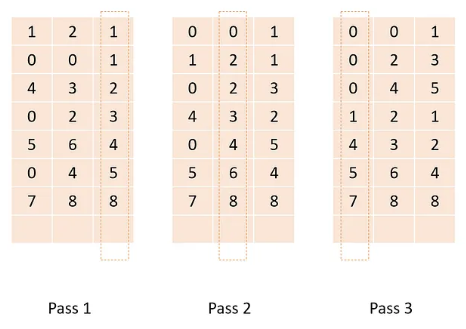

# heap
- **priority queue:** each element associated with key (priority)  
  elements served (dequeued) based on of their priority  
  element's insertion position based on its priority  
  supported operations: `insert`, `peek` (tip/root), `extract_max`, `update_key`
- **heap:** array structure visualized as nearly-complete binary tree  
  root of tree is first element `i = 0`, `parent(i) = (i - 1)/2`, `left(i) = 2 * i + 1`, `right(i) = 2 * i + 2`  
  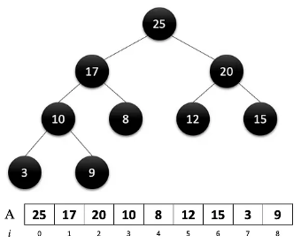  
  **max-heap property:** key of each node `>=` keys of its children  
  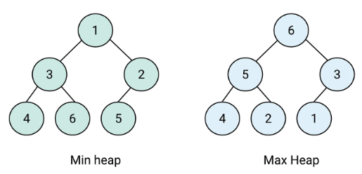
- **max-heapify:** correct single violation of max-heap property at subtree root  
  left & right child subtrees must already be max-heaps  
  swap root with child with larger key  
  repeat until that node fits max-heap property  
  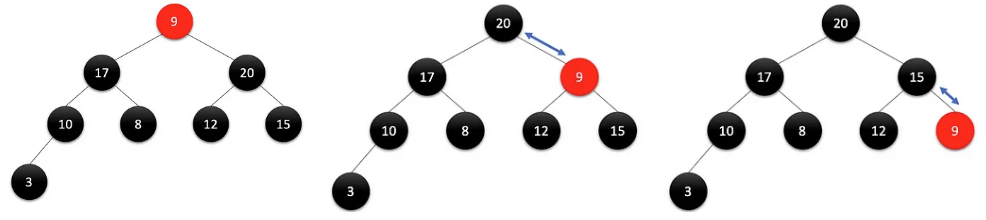  
  worst-case `θ(log(n))` root turns to leaf (tree height swaps)
- **build max-heap:** produce max-heap from unordered array by repeatedly using max-heapify (for `(n/2, 0]`)  
  total num nodes till `n` (`1 + 2 + ... + 2^n`) will have last `n` bits set or `2^(n+1) - 1`  
  so every new level doubles num nodes, so last `n/2` elements are all (alredy max-heap) leaves  
  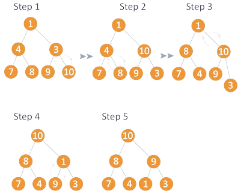  
  `θ(n * log(n))` by recursion tree analysis (`n/2` leaves, `log(n)` levels)  
  but (max node traversal) height increases as we move towards root  
  ```
  total cost = cost of heapifying each level
             = ∑ (num_elements * level_height)
             = n/4 * 1 + n/8 * 2 + ... + 2 *(log(n) - 1) + 1 * log(n)

  since every level has power-of-two num nodes: n/4 = 2^k

  total cost = 2^k * (1/(2^0) + 2/(2^1) + 3/(2^2) + ...)      ⟶ convergence series bounded by three
             = 2^k * θ(1)
             = c * n/4
             ≈ θ(n)
  ```
- **heap sort:** repeatedly push max-heap root node (largest element) to last  
  build max-heap (once) ⟶ (repeat) swap root with last element (& decrement size) ⟶ max-heapify new root  
  `θ(n) + n * θ(log(n)) ≈ θ(n * log(n))`  
  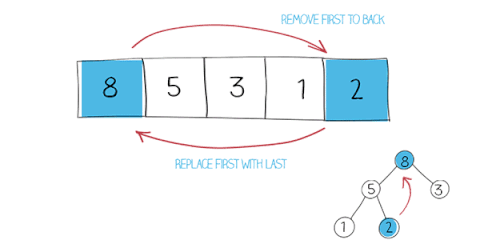

[continue](https://www.youtube.com/watch?v=9Jry5-82I68&list=PLUl4u3cNGP61Oq3tWYp6V_F-5jb5L2iHb&index=5)

# binary search trees
- **binary search tree:** each node `x` has a key and three pointers: parent (except root) and maybe left & right child  
  for any node `x` all nodes `y` in the left subtree of `x` `key(y) <= key(x)` and opposite for right tree `key(y) >= key(x)`  
  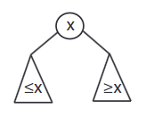  
  example:  
  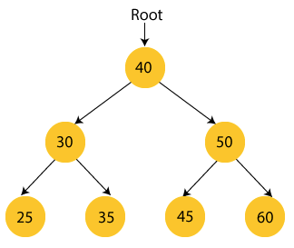  
  `insert(val)` is done by following left & right pointers from root till position is found  
  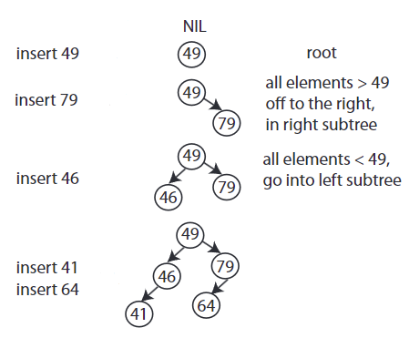  
  `find(val)` follow left & right pointers until value found or `NULL` hit  
  `find_min()` follow left till hit a leaf and right for `find_max()`  
  if `h` is height of the tree, all above operations takes `θ(h)`  
- **next larger (successor):** go to right and `find_min`  
  if no right then go up (parent) until a right found then `find_min`  
  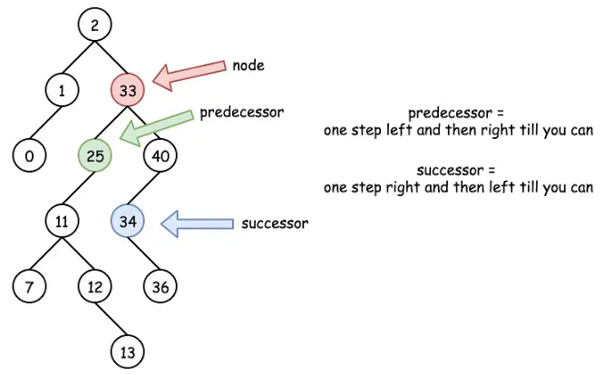  
- **delete:** leaf node deleted directly  
  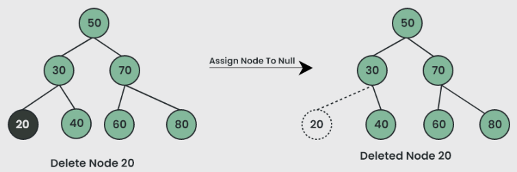  
  for node with one child just swap then delete  
  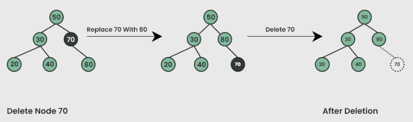  
  for node with both children swap with `next_larger(x)` then delete  
  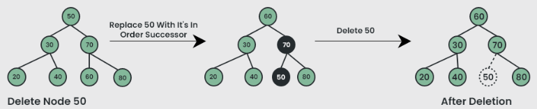
- **augmented BST:** add subtree size to each node, modify this during insert & delete  
  useful to get num nodes `>=` or `<=` a certain value in `θ(1)` time  
  similarly to get min/max in `θ(1)` time by storing subtree min/max  
  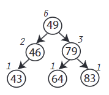  
  example: get `num_nodes <= 79` in above image  
  `79 > 49` so add left subtree size plus one (for `49`) and move to right  
  `79 == 79` so add one and left subtree size  
  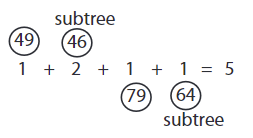  
  update value after insert/delete by go back up till the root while updating intermediate nodes

# AVL tree (balanced BST)
- height of a node is length (num link edges) of longest downward path to a leaf, decides the time complexity of BST operations  
  `height(x) = max(height(left(x)), height(right(x)))`  
  assume height of `NULL` children to be `-1` for convenience (useful for AVL check)  
  example: single node will have `max(-1, -1) + 1 = 0` height  
  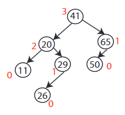  
  depth is length of upward path to root
- **balanced vs unbalanced:** balanced has nodes distributed evenly across levels, height `log(n)` so all operations `θ(log(n))`  
  unbalanced has nodes skewed to one side (uneven distribution), `θ(h)`  
  worst case if root is the smallest element (sorted data) BST forms a linked list, height `n` so `θ(n)`  
  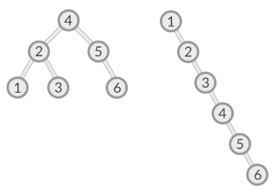
- **Adel’son-Vel’skii & Landis (AVL) tree** requires heights of left & right children of every node to differ by at-most `±1`  
  `|height(left) - height(right)| <= 1`  
  each node stores its height (augmented BST)  
  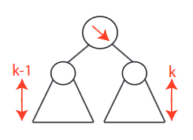  
  **rotation:** change binary tree structure without interfering with order of elements  
  in left-rotate root moves left  
  here `β` stays the nodes between `A` & `B`  
  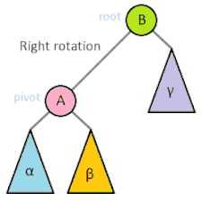
- **AVL insert:** start with simple BST insert and then work your way up restoring AVL property (and updating heights)  
  assume `x` is lowest node violating AVL and is right-heavy  
  dash for balanced, arrow for heavy & double arrow for double-heavy (one extra than expected)
  - if `x`'s right child right-heavy or balanced  
    rotate child node in the direction reverse of heavy path (left here)  
    heavy path from parent to grand-child straight line  
    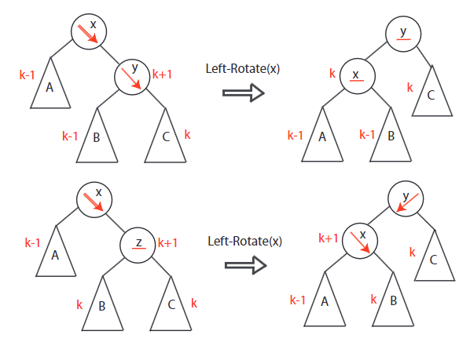
  - else do rotate child in reverse of its heavy direction (right here) to get straight line  
    then reverse rotate (left here) new child to get balanced subtree  
    heavy path zig-zags from parent to grand-child  
    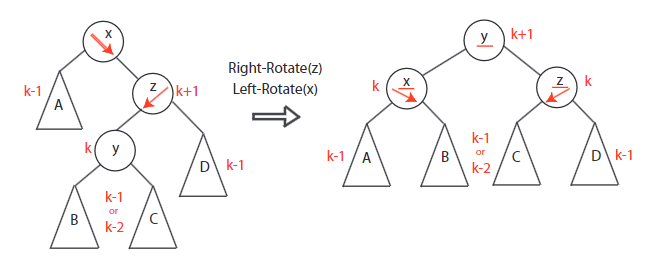
- **example: AVL insert:** insert 23 (single rotation) then 55 (double rotation)  
  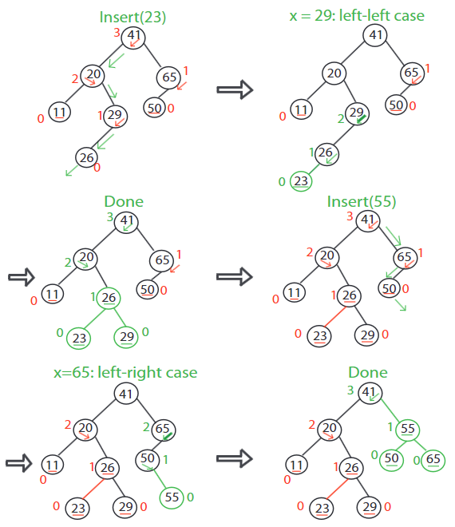
- **AVL sort:** insert `n` items (`n * θ(log(n))`) then in-order traversal (`θ(n)`)
- abstract data type is the interface specification (supported operations) like `insert`, `delete`, `find_min`, `successor` & `predecessor`  
  example: priority queue ADT needs `insert`, `delete` & `find_min`  
  data structure is the algorithm for each operation  
  there are many possible DSs for one ADT  
  example: priority queue can be implemented using heap or AVL tree, or sub-optimally sorted array

[continue](https://www.youtube.com/watch?v=Nz1KZXbghj8&list=PLUl4u3cNGP61Oq3tWYp6V_F-5jb5L2iHb&index=12)