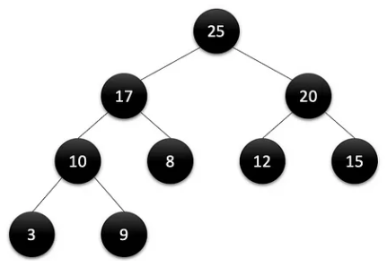
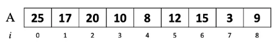
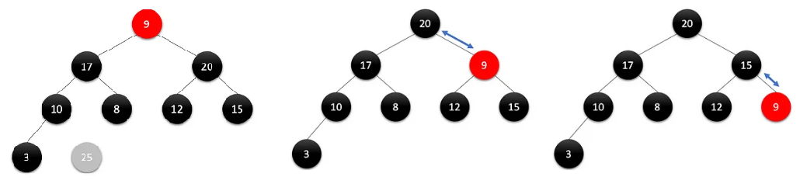
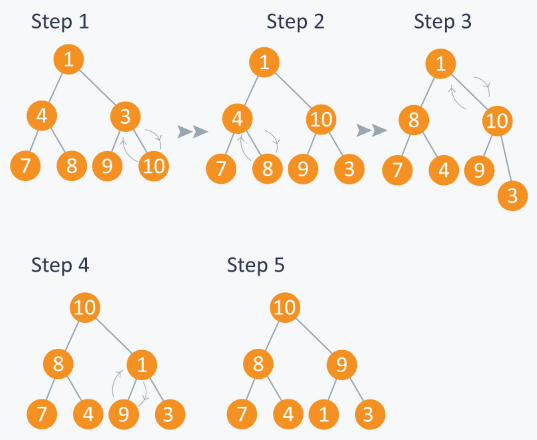
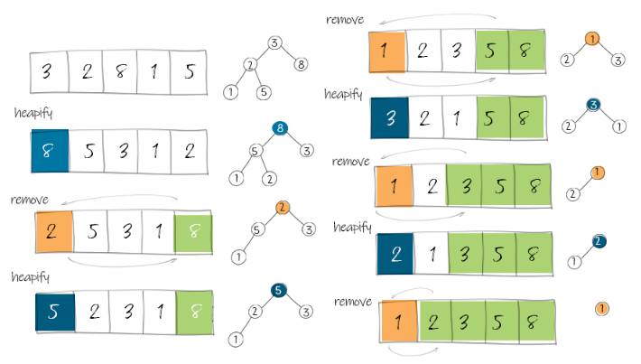

- [introduction](#introduction)
- [search](#search)
- [sorting](#sorting)
- [heap](#heap)
- [binary search trees](#binary-search-trees)
- [AVL tree (balanced BST)](#avl-tree-balanced-bst)

# links  <!-- omit from toc -->
- [introduction to algorithms](https://ocw.mit.edu/courses/6-006-introduction-to-algorithms-fall-2011/) ([recitation files](https://courses.csail.mit.edu/6.006/fall11/notes.shtml))
- [big O notation](https://adrianmejia.com/how-to-find-time-complexity-of-an-algorithm-code-big-o-notation/ )
- [quick sort](https://www.youtube.com/watch?v=7h1s2SojIRw)

# introduction
- **data structures:** organize & store data for efficient access & manipulation  
  **algorithm:** efficient procedure for solving a (large-scale) problem  
  **model of computation:** specifies what operations an algorithm is allowed & its cost (time, space, etc)  
  total cost of an algorithm is sum of operation costs  
- **asymptotic complexity:** estimate algorithm's worst-case computational complexity as input scales  
  
- **divide & conquer algorithm:** break down a problem into smaller subproblems, solve them recursively then combine the solutions
- **tail call recursion:** recursive call is the last action before returning  
  if next step needs current step result then pass it as arg  
  compiler will reuse current function's stack frame (prevent stack overflow)  
  example: binary search recursive call directly returns search position
  ```cpp
  bool binarySearch(const std::vector<uint32_t> &input, uint32_t key, uint32_t low, uint32_t high)
  {
      if (high >= low)
      {
          uint32_t mid = low + (high - low) / 2;
          if (key > input.at(mid))
          {
              return binarySearch(input, key, mid + 1, high);
          }
          else if (key < input.at(mid))
          {
              return binarySearch(input, key, low, mid - 1);
          }
          else
          {
              cout << "found key " << key << " at " << mid << endl;
              return true;
          }
      }

      cout << "key " << key << " not found" << endl;
      return false;
  }
  ```

# search
- **peak:** position whose value is `>=` (or `>`) all its neighbors, aka local maximum  
  with `>=` peak will always exist since (increasing ⟶ decreasing/equal) transition must take place at some index (edges for sorted arrays)  
  but with `>` peak might not exist (all array elements same value)
- **1D peak finding:**  
  
  - **linear:** walk across all elements  
    worst case `θ(n)` if last element peak
  - **divide & conquer (binary):** start at midpoint then pick higher neighbor's half  
    if neither higher then midpoint is the peak
    ```
    each recursion divides the input size by half:
    T(n) = T(n/2) + θ(1)          ⟶ θ(1) for midpoint comparison
         = T(n/4) + θ(1) + θ(1)
         .
         .
         = T(n/(2^k)) + k * θ(1)

    base case one element:
    T(1) = θ(1)
    n/(2^k) = 1
    k = log2(n)

    T(n) = T(1) + log(n) * θ(1)
         = (log(n) + 1) * θ(1)
         ≈ θ(log(n))
    ```
- **2D peak finding:**  
  
  - **greedy ascent:** from midpoint keep moving in the direction of highest neighbor until peak is found  
    worst-case `θ(n * m)` if all elements traversed  
    
  - **divide & conquer 1:** find 1D peak `(i, j)` in middle column (`j == m/2`) and then find 1D peak in that row (`i`)  
    but 2D peak may not exist on row `i`  
    efficient (`θ(log(m) * log(n))`) but incorrect algorithm  
    example: 12 is a column 1D peak and in that row 14 is the 1D peak but is not a 2D peak  
    
  - **divide & conquer 2:** find (global) maximum `(i, j)` in middle column (`j == m/2`)  
    then pick higher left/right neighbor's half, 2D peak if neither higher  
    
    ```
    T(n, m) = T(n, m/2) + θ(n)          ⟶ θ(n) for global max
            = T(n, m/4) + θ(n) + θ(n)
            .
            .
            = T(n, m/(2^k)) + k * θ(n)

    base case one row:
    T(n, 1) = θ(n)
    m/(2^k) = 1
    k = log(m)

    T(n) = T(n, 1) + log(m) * θ(n)
         = (log(m) + 1) * θ(n)
         ≈ θ(n * log(m))                ⟶ worst case if matrix corner peak
    ```

# sorting
- **sorting:** ordering data in increasing/decreasing manner  
  obvious usecases: finding median, binary search  
  not-so-obvious usecases: finding duplicates during data compression
- **insertion sort:** insert key `A[j]` into (already sorted) sub-array `A[1 ... j-1]` by pairwise-swaps down to correct position  
    
    
  worst-case `θ(n^2)` since each element needs `θ(n)` pairwise compare-and-swaps  
  for primitives compare & swap take `θ(1)` each, but aggregates compare could be more complex
- **binary insertion sort:** use binary search to find correct position  
  useful when compare complexity much higher than swap complexity  
  example: for sorting strings each compare `θ(n)` (swap still `θ(1)`)  
  per element insertion sort: `θ(n) * (θ(n) + θ(1)) = θ(n^2)`  
  binary insertion sort: `θ(n) * (θ(log(n)) + θ(1)) ≈ θ(n * log(n))`
- **merge sort:** recursively divide input array into halves and sort those sub-arrays then merge them back to obtain the sorted array  
    
  **two-finger approach:** initially pointing to bottom (smallest element) of two sub-arrays  
  keep pushing smaller value of two elements to final merged array  
    
  `θ(1)` for splitting input and `θ(n)` for merging two `n/2` sub-arrays
  ```
  T(n) = θ(1) + 2 * T(n/2) + θ(n)             ⟶ θ(1) split, θ(n) merge sub-arrays
       = 4 * T(n/4) + θ(n) + θ(n)
       .
       .
       = 2^k * T(n/(2^k)) + k * θ(n)

  base case sub-array with two elements:
  T(2) = θ(1)
  n/(2^k) = 2
  k = log(n/2)

  T(n) = n/2 * T(2) + log(n/2) * θ(n)
       ≈ θ(n * log(n))
  ```
  needs `θ(n)` auxiliary space, but insertion sort only needs `θ(1)` (for swap temp var)  
  memory for halves can be reused to reduce memory usage by half (but still `θ(n)`)
- **recursion tree:** visual representation of recursive calls  
  get complexity by adding up the costs of each level  
  each node is the cost of operations done for child nodes (split + merge)  
    
  `n` elements merged per level for total of `1 + log(n)` levels (root level + size halves per level)  
  total `θ(n) * θ(1+log(n)) ≈ θ(n * log(n))`  

# heap
- **priority queue:** special type of queue in which each element is associated with a priority (key) value  
  elements are dequeued/extracted on the basis of their key (higher key elements served first)  
  elements are inserted in a position based on its key value  
  supported operations: `insert`, `max` (return by peeking max key element), `extract_max` (return and remove) and `update_key` (of an element)
- **heap:** array structure visualized as a nearly complete binary tree  
  max-heap property is that the key of a node is `>=` keys of its children (min-heap analogous)  
    
    
    
  for a node at index `i` (assuming one-indexed array)
  - tree root node is the first element `i = 1`
  - `parent(i) = i/2`
  - `left(i) = 2 * i`
  - `right(i) = 2 * i + 1`
- heap can be used for sorting (reverse-sorted with max-heap) by repeatedly extracting the root node  
  just two operations are required to implement `insert`, `extract_max` & `heapsort`:
  - `build_max_heap`: produce max-heap from unordered array
  - `max_heapify` correct a single violation of the heap property at a subtree's root
- **max_heapify:** assumes that child subtrees (`left(i)` & `right(i)`) are max-heaps at the start  
  key value of the root (`A[i]`) violating max-heap property is swapped (`θ(log(n))`) with the child with the maximum key value  
  recurse process is repeated until the node involved maintains the property  
    
  `θ(log(n))` since only one violation and number of levels is `log(array_size)`, so worst case root node turns to leaf node
  ```
  l = left(i) 
  r = right(i) 
  if (l <= heap-size(A) and A[l] > A[i])
      then largest = l else largest = i 
  if (r <= heap-size(A) and A[r] > A[largest])
      then largest = r 
  if largest = i
      then exchange A[i] and A[largest]  
      max_heapify(A, largest)
  ```
- **build_max_heap:** any given array can be transformed to a max-heap by repeatedly using `max_heapify`  
  total num nodes till `n` would be `1 + 2 + 4 + ... + 2^n`  
  in binary sum will have last `n` bits set, same as `2^(n+1) - 1` (total num nodes doubles per level)  
  so last `n/2` elements are all leaves and leaves are already max-heaps  
  so iterate from `n/2` to `1`
    
  `n/2` leaves & `log(n)` levels, by recursion tree analysis `θ(n * log(n))`  
  observe that `max_heapify` takes `θ(1)` for nodes one level above leaves and in general `θ(l)` for nodes `l` levels above leaves  
  and level one has `n/4` nodes, `n/8` for one above that and so on till one node at `log(n)` level  
  so total work in loop is `n/4 * (1 * c) + n/8 * (2 * c) + ... + 1 * (log(n) * c)`  
  since every level has power-of-two number of nodes `n/4 = 2^k`  
  `c * 2^k (1/(2^0) + 2/(2^1) + ... + (k + 1)/(2^k))`, the series in the bracket is a convergence series bounded by three (constant)  
  so `c * 2^k * θ(1) = c * n/4 ≈ θ(n)`
- **heap sort:** first step takes `θ(n)`, last one takes `θ(log(n))` and ones in-between `θ(`n`)`  
  all steps after first one will be repeated `n` times, so `θ(n * log(n))`  
  
  - build max-heap from input array
  - `A[1]` will be the maximum element  
  - swap `A[n]` & `A[1]`, now max element is at the end of the array
  - discard node `n` from heap (by decrementing heap-size)
  - new root (old `A[n]`) may violate max heap property, but its children are max heaps  
    run `max_heapify` to fix this
  - goto step two unless heap is empty

# binary search trees
- **binary search tree:** each node `x` has a key and three pointers: parent (except root) and maybe left & right child  
  for any node `x` all nodes `y` in the left subtree of `x` `key(y) <= key(x)` and opposite for right tree `key(y) >= key(x)`  
    
  example:  
    
  `insert(val)` is done by following left & right pointers from root till position is found  
    
  `find(val)` follow left & right pointers until value found or `NULL` hit  
  `find_min()` follow left till hit a leaf and right for `find_max()`  
  if `h` is height of the tree, all above operations takes `θ(h)`  
- **next larger (successor):** go to right and `find_min`  
  if no right then go up (parent) until a right found then `find_min`  
    
- **delete:** leaf node deleted directly  
    
  for node with one child just swap then delete  
    
  for node with both children swap with `next_larger(x)` then delete  
  
- **augmented BST:** add subtree size to each node, modify this during insert & delete  
  useful to get num nodes `>=` or `<=` a certain value in `θ(1)` time  
  similarly to get min/max in `θ(1)` time by storing subtree min/max  
    
  example: get `num_nodes <= 79` in above image  
  `79 > 49` so add left subtree size plus one (for `49`) and move to right  
  `79 == 79` so add one and left subtree size  
    
  update value after insert/delete by go back up till the root while updating intermediate nodes

# AVL tree (balanced BST)
- height of a node is length (num link edges) of longest downward path to a leaf, decides the time complexity of BST operations  
  `height(x) = max(height(left(x)), height(right(x)))`  
  assume height of `NULL` children to be `-1` for convenience (useful for AVL check)  
  example: single node will have `max(-1, -1) + 1 = 0` height  
    
  depth is length of upward path to root
- **balanced vs unbalanced:** balanced has nodes distributed evenly across levels, height `log(n)` so all operations `θ(log(n))`  
  unbalanced has nodes skewed to one side (uneven distribution), `θ(h)`  
  worst case if root is the smallest element (sorted data) BST forms a linked list, height `n` so `θ(n)`  
  
- **Adel’son-Vel’skii & Landis (AVL) tree** requires heights of left & right children of every node to differ by at-most `±1`  
  `|height(left) - height(right)| <= 1`  
  each node stores its height (augmented BST)  
    
  **rotation:** change binary tree structure without interfering with order of elements  
  in left-rotate root moves left  
  here `β` stays the nodes between `A` & `B`  
  
- **AVL insert:** start with simple BST insert and then work your way up restoring AVL property (and updating heights)  
  assume `x` is lowest node violating AVL and is right-heavy  
  dash for balanced, arrow for heavy & double arrow for double-heavy (one extra than expected)
  - if `x`'s right child right-heavy or balanced  
    rotate child node in the direction reverse of heavy path (left here)  
    heavy path from parent to grand-child straight line  
    
  - else do rotate child in reverse of its heavy direction (right here) to get straight line  
    then reverse rotate (left here) new child to get balanced subtree  
    heavy path zig-zags from parent to grand-child  
    
- **example: AVL insert:** insert 23 (single rotation) then 55 (double rotation)  
  
- **AVL sort:** insert `n` items (`n * θ(log(n))`) then in-order traversal (`θ(n)`)
- abstract data type is the interface specification (supported operations) like `insert`, `delete`, `find_min`, `successor` & `predecessor`  
  example: priority queue ADT needs `insert`, `delete` & `find_min`  
  data structure is the algorithm for each operation  
  there are many possible DSs for one ADT  
  example: priority queue can be implemented using heap or AVL tree, or sub-optimally sorted array

[continue](https://www.youtube.com/watch?v=Nz1KZXbghj8&list=PLUl4u3cNGP61Oq3tWYp6V_F-5jb5L2iHb&index=12)