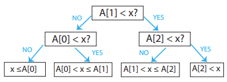
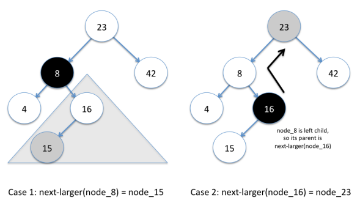
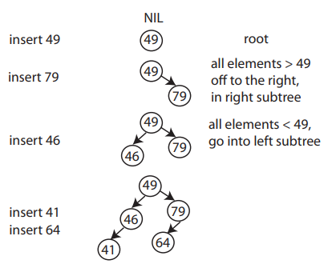
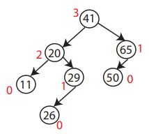
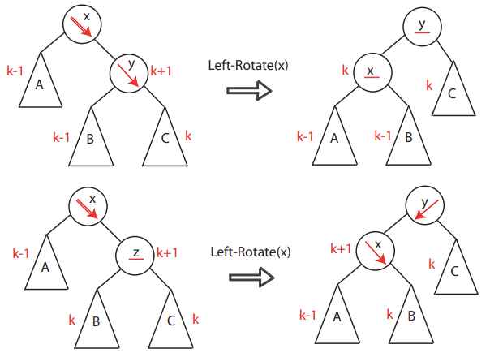
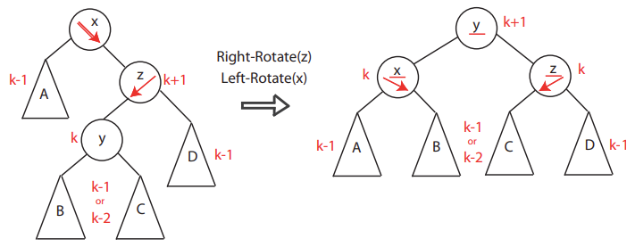
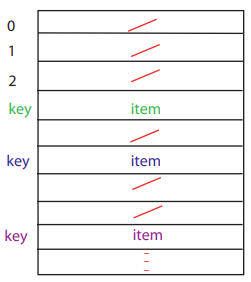
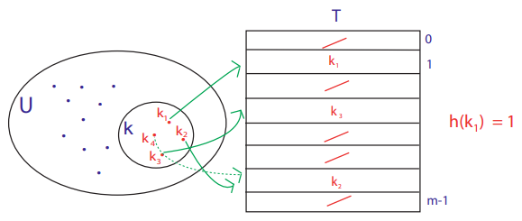
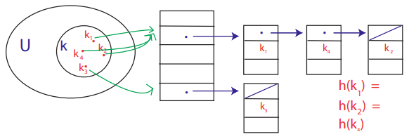

- [introduction](#introduction)
- [search](#search)
- [sorting](#sorting)
  - [hybrid](#hybrid)
  - [comparison model](#comparison-model)
  - [integer (non-comparison)](#integer-non-comparison)
- [heap](#heap)
- [binary search trees](#binary-search-trees)
  - [balanced BST (AVL tree)](#balanced-bst-avl-tree)
- [hashing](#hashing)

# links  <!-- omit from toc -->
- [introduction to algorithms](https://ocw.mit.edu/courses/6-006-introduction-to-algorithms-fall-2011/) ([recitation files](https://courses.csail.mit.edu/6.006/fall11/notes.shtml))
- [big O notation](https://adrianmejia.com/how-to-find-time-complexity-of-an-algorithm-code-big-o-notation/ )
- [why `log(n)`](https://www.youtube.com/watch?v=Xe9aq1WLpjU)
- [quick sort](https://www.youtube.com/watch?v=7h1s2SojIRw)
- [counting sort](https://www.youtube.com/watch?v=OKd534EWcdk)
- [radix sort](https://www.youtube.com/watch?v=XiuSW_mEn7g)

# introduction
- **data structures:** organize & store data for efficient access & manipulation  
  **algorithm:** efficient procedure for solving a (large-scale) problem  
- **abstract data type:** interface specification (required/supported operations)  
  there are many possible data structures for one ADT  
  example: priority queue (`insert`, `delete`, `find_min`) can be implemented using heap or AVL tree or sub-optimally sorted array
- **model of computation:** specifies what operations an algorithm is allowed & its cost (time, space, etc)  
  total cost of an algorithm is sum of operation costs  
- **asymptotic complexity:** estimate algorithm's worst-case computational complexity as input scales  
  
- **divide & conquer algorithm:** break down a problem into smaller subproblems, solve them recursively then combine the solutions
- **tail call recursion:** recursive call is the last action before returning  
  if next step needs current step result then pass it as arg  
  compiler will reuse current function's stack frame (prevent stack overflow)  
  example: binary search recursive call directly returns search position
  ```cpp
  template <typename T>
  bool binary_search(const std::vector<T> &input, T key, typename std::vector<T>::iterator start, typename std::vector<T>::iterator end)
  {
      cout << std::vector<T>(start, end) << endl;

      if (end >= start)
      {
          typename std::vector<T>::iterator mid = start + (end - start) / 2;
          T mid_value                           = *mid;

          if (key > mid_value)
          {
              return binary_search(input, key, mid + 1, end);
          }
          else if (key < mid_value)
          {
              return binary_search(input, key, start, mid - 1);
          }
          else
          {
              cout << "found key " << key << " at " << mid - input.begin() << endl;
              return true;
          }
      }

      cout << key << " not found" << endl;
      return false;
  }
  ```

# search
- **peak:** position whose value is `>=` (or `>`) all its neighbors, aka local maximum  
  with `>=` peak will always exist since (increasing ⟶ decreasing/equal) transition must take place at some index (edges for sorted arrays)  
  but with `>` peak might not exist (all array elements same value)
- **1D peak finding:**  
  
  - **linear:** walk across all elements  
    worst case `θ(n)` if last element peak
  - **divide & conquer (binary):** start at midpoint then pick higher neighbor's half  
    if neither higher then midpoint is the peak
    ```
    each recursion divides the input size by half:
    T(n) = T(n/2) + θ(1)          ⟶ θ(1) for midpoint comparison
         = T(n/4) + θ(1) + θ(1)
         .
         .
         = T(n/(2^k)) + k * θ(1)

    base case one element:
    T(1) = θ(1)
    n/(2^k) = 1
    k = log2(n)

    T(n) = T(1) + log(n) * θ(1)
         = (log(n) + 1) * θ(1)
         ≈ θ(log(n))
    ```
- **2D peak finding:**  
  
  - **greedy ascent:** from midpoint keep moving in the direction of highest neighbor until peak is found  
    worst-case `θ(n * m)` if all elements traversed  
    
  - **divide & conquer 1:** find 1D peak `(i, j)` in middle column (`j == m/2`) and then find 1D peak in that row (`i`)  
    but 2D peak may not exist on row `i`  
    efficient (`θ(log(m) * log(n))`) but incorrect algorithm  
    example: 12 is a column 1D peak and in that row 14 is the 1D peak but is not a 2D peak  
    
  - **divide & conquer 2:** find (global) maximum `(i, j)` in middle column (`j == m/2`)  
    then pick higher left/right neighbor's half, 2D peak if neither higher  
    
    ```
    T(n, m) = T(n, m/2) + θ(n)          ⟶ θ(n) for global max
            = T(n, m/4) + θ(n) + θ(n)
            .
            .
            = T(n, m/(2^k)) + k * θ(n)

    base case one row:
    T(n, 1) = θ(n)
    m/(2^k) = 1
    k = log(m)

    T(n) = T(n, 1) + log(m) * θ(n)
         = (log(m) + 1) * θ(n)
         ≈ θ(n * log(m))                  ⟶ worst case if matrix corner peak
    ```

# sorting
- **sorting:** ordering data in increasing/decreasing manner  
  obvious usecases: finding median, binary search  
  not-so-obvious usecases: finding duplicates during data compression
- **insertion sort:** insert key `A[j]` into (already sorted) sub-array `A[1 ... j-1]` by pairwise-swaps down to correct position  
    
    
  worst-case `θ(n^2)` since each element needs `θ(n)` pairwise compare-and-swaps  
  ideal for small input since minimal overhead (in-place no recursion) and efficient for nearly-sorted input
  for primitives compare & swap take `θ(1)` each, but aggregates compare could be more complex
- **binary insertion sort:** use binary search to find correct position  
  useful when compare complexity much higher than swap complexity  
  example: for sorting strings each compare `θ(n)` (swap still `θ(1)`)  
  per element insertion sort: `θ(n) * (θ(n) + θ(1)) = θ(n^2)`  
  binary insertion sort: `θ(n) * (θ(log(n)) + θ(1)) ≈ θ(n * log(n))`
- **merge sort:** recursively divide input array into halves and sort those sub-arrays then merge them back to obtain the sorted array  
    
  **two-finger approach:** initially pointing to bottom (smallest element) of two sub-arrays  
  keep pushing smaller value of two elements to final merged array  
    
  `θ(1)` for splitting input and `θ(n)` for merging two `n/2` sub-arrays
  ```
  T(n) = θ(1) + 2 * T(n/2) + θ(n)             ⟶ θ(1) split, θ(n) merge sub-arrays
       = 4 * T(n/4) + θ(n) + θ(n)
       .
       .
       = 2^k * T(n/(2^k)) + k * θ(n)

  base case sub-array with two elements:
  T(2) = θ(1)
  n/(2^k) = 2
  k = log(n/2)

  T(n) = n/2 * T(2) + log(n/2) * θ(n)
       ≈ θ(n * log(n))
  ```
  needs `θ(n)` auxiliary space, but insertion sort only needs `θ(1)` (for swap temp var)  
  memory for halves can be reused to reduce memory usage by half (but still `θ(n)`)
  ```cpp
  template <typename T>
  void merge_sort(std::vector<T> &input, typename std::vector<T>::iterator start, typename std::vector<T>::iterator end)
  {
      cout << std::vector<T>(start, end) << endl;

      size_t size = end - start;
      if (size == 2)
      {
          if (*start > *(end - 1))
          {
              uint32_t temp = *start;
              *start        = *(end - 1);
              *(end - 1)    = temp;
          }
      }
      else if (size == 1)
      {
      }
      else
      {
          size_t half_size = size / 2;
          std::vector<T> left(start, start + half_size);
          std::vector<T> right(start + half_size, end);

          merge_sort(left, left.begin(), left.end());
          merge_sort(right, right.begin(), right.end());

          input.clear();
          input = left + right;
          cout << input << endl;
      }
  }

  template <typename T>
  std::vector<T> operator+(std::vector<T> &left, std::vector<T> &right)
  {
      std::vector<T> result;
      result.reserve(left.size() + right.size());

      while (left.size() || right.size())
      {
          if (left.size() == 0)
          {
              result.push_back(right.at(0));
              right.erase(right.begin());
              continue;
          }

          if (right.size() == 0)
          {
              result.push_back(left.at(0));
              left.erase(left.begin());
              continue;
          }

          if (left.at(0) < right.at(0))
          {
              result.push_back(left.at(0));
              left.erase(left.begin());
          }
          else
          {
              result.push_back(right.at(0));
              right.erase(right.begin());
          }
      }

      return result;
  }
  ```
- **recursion tree:** visual representation of recursive calls  
  get complexity by adding up the costs of each level  
  each node is the cost of operations done for child nodes (split + merge)  
    
  `n` elements merged per level for total of `1 + log(n)` levels (root level + size halves per level)  
  total `θ(n) * θ(1+log(n)) ≈ θ(n * log(n))`  
- **quick sort:** element in correct sorted position when all smaller elements to its left & larger right  
  recursively select pivot then partition input into `<=` & `>=` sub-arrays  
  partition by swapping larger elements on left with smaller element on right till two pointers meet  
    
  average-case `θ(n * log(n))` since balanced sub-arrays for truly random input  
  worst-case `θ(n^2)` for sorted/reverse-sorted input  
  **median-of-3:** first sort first, middle & last elements in-place then using middle as pivot (moved to end) sort ignoring first & last (already sorted wrt pivot)
  ```cpp
  template <typename T>
  void quick_sort(std::vector<T> &input, typename std::vector<T>::iterator start, typename std::vector<T>::iterator end)
  {
      if (start < end)
      {
          T pivot = *start;
          cout << "pivot:" << pivot << "  start:" << *start << "  end:" << *(end - 1) << endl;
          cout << std::vector<T>(start, end) << endl;
          auto low = start, high = end;

          // partition
          while (low < high)
          {
              do
              {
                  low++;
              } while ((low < end) && (*low <= pivot));

              do
              {
                  high--;
              } while ((high > start) && (*high >= pivot));

              if (low < high)
              {
                  std::swap(*low, *high);
              }
          }

          // swap pivot to correct index
          std::swap(*start, *high);
          cout << input << endl
              << endl;

          // recurse for sub-arrays
          quick_sort(input, start, high);
          quick_sort(input, high + 1, end);
      }
  }
  ```

## hybrid
- quick sort has high const factor due to recursion, bad cache locality (left & right ptr access), bad pivot selection  
  merge sort needs extra space  
  heap sort has bad cache locality (swaps)  
  insertion sort slow for large inputs
- **intro sort:** (C++ lib) hybrid of quick, heap & insertion sorts  
  start with quick sort till certain recursion depth (stop ongoing bad pivot selection)  
  switch to heap sort (better worst-case, in-place)  
  use insertion sort (better for smaller input) if num elements less than threshold  
  height of recursion tree controlled using threshold  
- **tim sort:** (python lib) hybrid of merge & insertion sorts  
  identify & merge (adjacent) sorted (varying-length) portions  
  reverse-sorted portions reversed before merging  
  if unsorted portion larger than threshold, recursevily break it then run insertion sort

## comparison model
- **comparison model:** elements are black boxes (ADTs) with only comparison operations defined, then time cost is num comparisons
- **decision tree:** all comparison algos can be represented as a tree of possible outcomes & their results  
- **example: binary search decision tree:** for `n = 3`  
  
  | decision tree     | algorithm               |
  | ----------------- | ----------------------- |
  | internal node     | binary decision         |
  | leaf              | output                  |
  | root-to-leaf path | algo execution          |
  | path length       | running time            |
  | tree height       | worst-case running time |
- **search lower bound:** each leaf specifies an index in preprocessed (sorted) input
  ```
  num_leaves >= num_possible_answers >= n

  since decision tree is binary:
  height >= log(n)
          ≈ θ(n)
  ```
- **sorting lower bound:** each leaf specifies a permutataion of input
  ```
  num_leaves >= n!

  since decision tree is binary:
  height >= log(n!)
         >= log(1 * 2 ... (n-1) * (n))
         >= log(1) + log(2) ... log(n-1) + log(n)   ⟶ basically area under curve
         >= n * (log(n) - 1)
         >= n * log(n)
          ≈ θ(n * log(n))
  ```
- **alternate lower bound justification:** `ceil(log(n))` bits (or digits for base10) required to uniquely represent `[0, n)`  
  search (mapping value to index) needs atleast `log(n)` steps  
  sorting (index for each element) `n * log(n)`


## integer (non-comparison)
- **integer sorting:** if keys are integers (that fits in word) then can do more than comparisons
- **counting sort:** count occurrences of each element then place them in correct order  
  `θ(n + range)`, useful if keys have small range (like `uint8_t`)  
  calculate histogram's CDF (`<=` values cumulative sum) then place each input element using CDF as offset  
  preserves relative order of equal elements (stable)  
  
- **radix sort:** digit-by-digit (counting) sort from least to most significant digit  
  needs stable sort co-routine (counting) so that (previously sorted) lower digits maintain relative order  
  `θ(num_digits * (n + base))` base 10 for decimal  
  `base ∝ 1/num_digits`, `base ∝ space_complexity` (CDF array), `num_digits ∝ 1/time_complexity` (num iterations)  
  

# heap
- **priority queue:** each element associated with key (priority)  
  elements served (dequeued) based on of their priority  
  element's insertion position based on its priority  
  supported operations: `insert`, `peek` (tip/root), `extract_max`, `update_key`
- **heap:** array structure visualized as full binary tree (all levels except last completely populated)  
  root of tree is first element `i = 0`, `parent(i) = (i - 1)/2`, `left(i) = 2 * i + 1`, `right(i) = 2 * i + 2 `  
    
  **max-heap property:** key of each node `>=` keys of its children  
  
- **max-heapify:** correct single violation of max-heap property at subtree root  
  left & right child subtrees must already be max-heaps  
  swap root with child with larger key  
  repeat until that node fits max-heap property  
    
  worst-case `θ(log(n))` root turns to leaf (tree height swaps)
- **build max-heap:** produce max-heap from unordered array by repeatedly using max-heapify (for `(n/2, 0]`)  
  total num nodes till `n` (`1 + 2 + ... + 2^n`) will have last `n` bits set or `2^(n+1) - 1`  
  so every new level doubles num nodes, so last `n/2` elements are all (alredy max-heap) leaves  
    
  `θ(n * log(n))` by recursion tree analysis (`n/2` leaves, `log(n)` levels)  
  but (max node traversal) height increases as we move towards root  
  ```
  total cost = cost of heapifying each level
             = ∑ (num_elements * level_height)
             = n/4 * 1 + n/8 * 2 + ... + 2 *(log(n) - 1) + 1 * log(n)

  since every level has power-of-two num nodes: n/4 = 2^k

  total cost = 2^k * (1/(2^0) + 2/(2^1) + 3/(2^2) + ...)      ⟶ convergence series bounded by three
             = 2^k * θ(1)
             = c * n/4
             ≈ θ(n)
  ```
- **heap sort:** repeatedly push max-heap root node (largest element) to last (& decrement size)  
  build max-heap (once) ⟶ (repeat) swap root with last element ⟶ max-heapify new root  
  `θ(n) + n * θ(log(n)) ≈ θ(n * log(n))`  
  

# binary search trees
- **binary search tree:** efficiently store & retrieve data in (`θ(log(n))`) sorted order  
  each node has a key and parent, left & right child pointers  
  left child (& subtree) `<=` & right child (& subtree) `>=`  
  
- **find key:** follow left & right pointers until value found or `NULL` hit  
  **find min:** follow left child till leaf node hit  
    
  **next larger (successor):** go to right then find min  
  if no right then go up till you reach node with left child  
  
- **insert node:** follow left & right pointers from root till position is found  
  
- **delete node:**
  - **leaf node:** deleted directly  
    
  - **node with one child:** swap then delete  
    
  - **node with both children:** swap with successor (with max one child) then delete  
    
- **node height:** longest downward path (num links) to a leaf  
  `height(x) = 1 + max(height(left(x)), height(right(x)))`  
  assume height of `NULL` children as `-1` to get leaf height `1 + max(-1, -1) = 0`  
  

## balanced BST (AVL tree)
- **balanced:** nodes distributed evenly across levels (height `log(n)`)  
  unbalanced worst-case linked-list for sorted data (height `n`)  
  
- **AVL tree:** BST where two child heights differ by at-most one  
  each node stores its height  
  
- **AVL rotation:** adjust tree structure (to maintain balance) without changing BST property  
  `-` balanced, `↙`/`↘` heavy, `⇙`/`⇘` double-heavy (differs by two)  
  
  - **single rotation:** double-heavy's child is same-direction heavy or balanced  
    rotate double-heavy (as root) in reverse direction of (straight) heavy path  
    
  - **double rotation:** double-heavy's child is reverse-direction heavy (heavy path zig-zags)  
    first get straight heavy path by rotating child in its reverse-direction  
    then rotate double-heavy in its reverse direction  
    
- **AVL insert:** simple BST insert then restore AVL property (rotations) up to root (and updating heights)  
  
- **AVL sort:** insert `n` elements then in-order traversal  
  ```
  sort = n * (insert element) + in-order traversal
       = n * θ(log(n)) + θ(n)
       ≈ θ(n * log(n))
  ```

# hashing
- **hash map:** store key-value pairs using hash functions to map keys to array indices  
  supports insert, delete & search
- **direct access table:** elements stored in array indexed by key  
  but keys maybe non-integers and large space complexity for large key range  
  
- **prehash:** converting keys(like string) to numbers (non-negative integers)  
  ideally prehash same only for equal keys  
  item's key shouldn't change while in table (like linked-list) else can't find it
- **hashing:** map data of any size to a fixed-size value  
  output hash value used as index to store & retrieve data  
  `U` all possible keys, `k` keys in current input, `m` hashing output range, `T` hash table  
  `m ≈ n` to minimize space complexity (with no overwrites)
  
- **collision:** two different keys produce same hash value
- **chaining:** handle collisions by storing multiple key-value pairs (in linked-list) at each hash table index  
  worst-case all elements in single linked-list `θ(n)`  
  
- **simple uniform assumption:** (theoretically) assumes keys uniformly distributed across slots independent of other key's hashing  
  expected length of a chain ≈ expected num keys per slot `n/m` (aka load factor `α`)  
  hash table search `θ(1 + α)` (`α` can be `< 1` so `1` for hashing & accessadded)
- **hash functions:**
  - **division:** divide key by a prime number (around hash table size) and use remainder (`h(k) = k % m`)
  - **multiplication:** multiply key by constant (∈ `(0, 1)`) then multiply fractional part by hash table size `h(k) = ((k * A) % 1) * m`
  - **universal:** `((ak + b) % p) % m` where `p` (large) prime number, `a` & `b` random numbers ∈ `[0, p]`  
    large prime numbers give uniform distribution (so reduced collisions)  
    INT_MAX `2^31 - 1` is Mersenne prime (`2^n - 1` prime if `n` is prime)
- slow if `α` too small (linked-list traversal), wasteful if `α` too big  
  if `m = 0(n)` ⇒ `α = 0(1)`  
  **rehashing:** rebuild hash table from scratch when load factor exceeds a threshold  
  insertion constant (2) smaller than deletion one (4) for `0(1)` operations
    - **insertion:**
      example: increase size by one
      ```
      T = 0(1 + 2 + 3 ... + n)
        ≈ 0(n^2)
      ```
      example: size doubled (table doubling)
      ```
      T = 0(1 + 2 + 4 + 8 ... + n)
        ≈ 0(n)
      ```
    - **deletion:**
      example: size halved when `n = m / 2`  
      multiple rehashing if insertion (doubling) ⟷ deletion (halving) repeatedly  
      amortized cost ≈ `0(n)`  
      example: size halved when `n = m / 4`  
      half table still available for expansion
- **amortized analysis:**  average cost of a sequence of operations  
  useful when some occasional operations expensive  
  few (table doubling) inserts cost `0(n)` but `0(1)` on average
- **improved hash table:** create backup (double size) table when main table nearly full  
  with each insertion in actual table, rehash some data to backup table  
  switch to backup table when main table full  
  operations worst-case (not amortized) `0(1)`
- **rolling hash:** update hash of a sliding window of data in constant time  
  update old hash value by removing old element's contribution & adding new element's contribution  
  example: assuming some base (256 for ASCII) each character in string contributes one digit in prehash
- **string matching:**
  - **linear:** iterate character by character  
    worst-case `0(length(pattern) * length(string))`
  - **Karp-Rabin:** match rolling pattern hash with substring rolling hash  
    collisions possible so linear matching once hashes match  
    amortized `0(length(pattern) + length(string))`


[continue](https://youtu.be/BRO7mVIFt08?list=PLUl4u3cNGP61Oq3tWYp6V_F-5jb5L2iHb&t=1261)