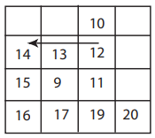

# algorithms
- [introduction](#introduction)
  - [peak finding](#peak-finding)

## links  <!-- omit from toc -->
- [quick sort](https://www.youtube.com/watch?v=XE4VP_8Y0BU)

## todo  <!-- omit from toc -->
- [introduction to algorithms (MIT 2011)](https://ocw.mit.edu/courses/6-006-introduction-to-algorithms-fall-2011/)
- [leetcode 150](https://medium.com/@jjmayank98/list/dsa-c5baf3c57a8d)
- [divide & conquer algorithm](https://en.wikipedia.org/wiki/Divide-and-conquer_algorithm)

## introduction
- efficient procedures for solving problems on large inputs (like human genome)

### peak finding
- **1D peak:** position whose value is greater-than or equal-to (`>=`) its neighboring left and right array elements
- **straightforward:** start from first element  
worst case `O(n)` complexity (if last element peak)
  ```cpp
  for (int i = 1; i < input.size() - 1; ++i)
  {
      uint32_t centre = input.at(i);
      uint32_t left = input.at(i - 1);
      uint32_t right = input.at(i + 1);

      if ((centre >= left) && (centre >= right))
      {
          cout << left << " " << centre << " " << right << endl;
          break;
      }
  }
  ```
- **1D divide & conquer:** look at `n/2` position and then look at its left & right position, if left side position is higher then look at left half, ditto for right half, if neither then `n/2` is the peak  
worst case `O(log(n))` (base 2), if I can half something `t` (maximum time I can spend) times, I can go through only `2^t` array, them time for a `n` array is `2^t = n -> t = log(n)`
  ```cpp
  uint32_t findPeak(std::vector<uint32_t> input)
  {
      uint32_t half_size = input.size() / 2;
      if (input.at(half_size - 1) > input.at(half_size))
      {
          std::vector<uint32_t> new_input{input.begin(),
                                          input.begin() + half_size};
          findPeak(new_input);
      }
      else if (input.at(half_size + 1) > input.at(half_size))
      {
          std::vector<uint32_t> new_input{input.begin() + half_size, input.end()};
          findPeak(new_input);
      }
      else
      {
          cout << input.at(half_size - 1) << " " << input.at(half_size) << " "
              << input.at(half_size + 1) << " " << endl;
      }

      return 0;
  }
  ```
- **2D peak:** position whose value is greater-than or equal-to (`>=`) its neighboring matrix elements on all 4 sides
- **greedy ascent:** start at the first element and similar to straightforward keep checking in a  default pattern (like left -> right -> up -> down) until you find a higher element to decide which direction to move until the peak is found  
worst case is `O(n*m)`, in case of a square matrix `O(n^2)`  

  ```cpp
  //todo:aarunkum
  ```
- **2D divide & conquer:**
  - pick the middle column `j = m/2`, find the 1D peak at `(i, j)` then use `(i, j)` as a start to find a 1D peak in row `i`  
  worst case `O(log(m) * log(n))`  
  but 2D peak may not exist on row `i`, so this algorithm is efficient but incorrect  
  
  - pick the middle column `j = m/2`, find the global max in `j` column at `(i, j)` then compare `(i, j)` to its left & right elements (similar to 1D divide & conquer), pick which column is higher than `(i, j)`, if neither higher then `(i,j)` is the peak  
  here new problem is solved with half the number of columns  
  worst case `O(n * log(m))`, `log(m)` for 1D peak search of `m` column elements & `n` for maximum search of `n` row elements

[recitation 1](https://www.youtube.com/watch?v=P7frcB_-g4w&list=PLUl4u3cNGP61Oq3tWYp6V_F-5jb5L2iHb&index=26)

[lecture 2](https://www.youtube.com/watch?v=Zc54gFhdpLA&list=PLUl4u3cNGP61Oq3tWYp6V_F-5jb5L2iHb&index=2)