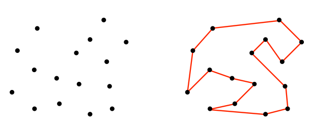
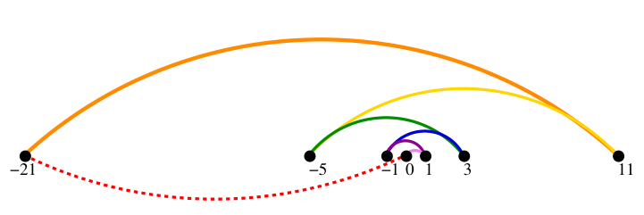
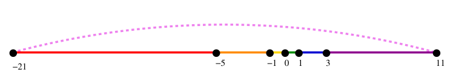
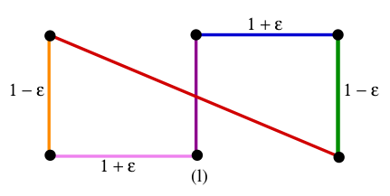
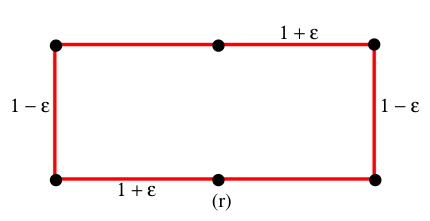

# table of contents  <!-- omit from toc -->
- [introduction](#introduction)

# links  <!-- omit from toc -->
- [[lectures] analysis of algorithms](https://www3.cs.stonybrook.edu/~skiena/373/videos/)
- [big O notation](https://adrianmejia.com/how-to-find-time-complexity-of-an-algorithm-code-big-o-notation/)

# todo  <!-- omit from toc -->
- document distance sorted vector add notes
- go through document distance variations
- [quick sort](https://www.youtube.com/watch?v=XE4VP_8Y0BU)
- [leetcode 75](https://leetcode.com/studyplan/leetcode-75/)
- [connected component labelling](https://en.wikipedia.org/wiki/Connected-component_labeling)

# introduction
- **algorithms:** is a finite sequence of well-defined instructions that can be used to solve a computational problem  
a faster (& correct) algorithm running on a slower computer will always win for sufficiently large instances  
can be expressed in english, pseudo-code or programming languages
- **example: robot tour optimization:** for a robot arm equipped with a soldering iron we must construct an ordering of the contact points such that the robot arm is able to complete the soldering job within minimal time (travel distance)  
  
brute-force solution would be to start at some point `p0` and then walks to its nearest neighbor `p1` first and then repeats from `p1` until all points are done  
  
another idea can be to connect the closest pair of points which connection will not cause a cycle or a three-way branch (each point should have one joint coming in & one going out) until all points are in one tour  
this will solve earlier problem where consecutive points are closest to each other  
  
but this will not be optimum for below points where sides differ by a small `ε`  
here first vertical point pairs (`1 - ε` apart) will be connected, then the two `1 + ε` pairs then the diagonal  
  
best one would be to try all possible orderings of the points and then select the one which minimizes the total length  
but `n!` permutations are computationally intensive, so no efficient correct algorithm exists for the traveling salesman problems (NP complete) like these  

- **counterexample:** is the best way to disprove the correctness of an algorithm by thinking about all small examples, examples with ties in the decision criteria and examples with extremes of big & small  
failure to find a counterexample does not mean that the algorithm is correct
- **asymptotic complexity:** is used for (worst-case) estimation of computational complexity of algorithms  
example: for `f(n) = n^2 + 3n` as `n` grows `n^2` grows at a much faster rate than `3n` rendering it insignificant for large values of `n`, so `f(n)` is said to be asymptotically equivalent to `n^2`  
  
  ```
  // sequential = statement1 + statement2
  statement1;
  statement2;

  // conditional = max(condition1, condition2)
  if (flag)
      condition1;
  else
      condition2;

  // linear loop = iterations * (statement1 + statement 2)
  for (int i = 0; i < iterations; i++)
  {
      statement1;
      statement2;
  }

  // nested loop = iterations_i * (statement1 + j * statement2);
  for (int i = 0; i < iterations_i; i++)
  {
      statement1;
      for (int j = 0; j < iterations_j; j++)
      {
          statement2;
      }
  }

  // logarithmic loop = log2(iterations) * (statement1 + statement2)
  for (int i = iterations; i >= 1; i /= 2)
  {
      statement1;
      statement2;
  }
  ```
- **divide & conquer algorithm:** is a algorithm design paradigm that recursively breaks down a problem into sub-problems of the same or related type until they become simple enough to be solved directly  
