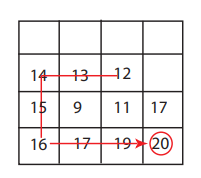
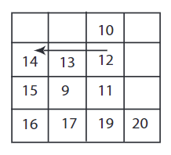
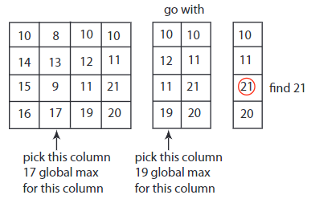

# algorithms & data structures
- [algorithmic thinking](#algorithmic-thinking)

## links  <!-- omit from toc -->
- [[lectures] introduction to algorithms](https://ocw.mit.edu/courses/6-006-introduction-to-algorithms-fall-2011/)
- [quick sort](https://www.youtube.com/watch?v=XE4VP_8Y0BU)

## todo  <!-- omit from toc -->
- [divide & conquer algorithm](https://en.wikipedia.org/wiki/Divide-and-conquer_algorithm)
- [leetcode 75](https://leetcode.com/studyplan/leetcode-75/)

## algorithmic thinking
- efficient procedures for solving problems on large inputs (like human genome)
- **asymptotic complexity:** is used for estimation of computational complexity of algorithms  
example: for `f(n) = n^2 + 3n` as `n` grows `n^2` grows at a much faster rate than `3n` (rendering it insignificant for large `n`), so `f(n)` is said to be asymptotically equivalent to `n^2`
- **peak:** position whose value is greater-than or equal-to (`>=`) all its neighbors, example: in 1D check left & right
- **1D peak finding:** find a peak in an array of size `n`  
with `>=` a peak will always exist, with `>` only a peak might exist (if all elements same value then no peak)
  - **straightforward:** start from first element and walks across all elements  
  worst case `O(n)` complexity if last element is the peak
    ```cpp
    uint32_t findPeak1D(uint32_t* arr, size_t size)
    {
        if (arr[0] > arr[1])
            return arr[0];
        else if (arr[size - 1] > arr[size - 2])
            return arr[size - 1];

        for (int i = 1; i < size - 2; ++i)
        {
            if ((arr[i] >= arr[i - 1]) && (arr[i] >= arr[i + 1])) return arr[i];
        }

        return ERROR;
    }
    ```
  - **divide & conquer:** recursive algorithm where we look at `n/2` position and then look at its left to check if it is higher then look at left half for a peak, else check right position and go for right half, if neither then `n/2` is the peak  
  `O(log(n))` (base 2) complexity, if I can half something `t` (maximum time I can spend) times, I can go through only `2^t` array, then time required for a `n` array is `2^t = n ⟶ t = log(n)`  
  middle element comparison takes constant time (`O(1)`) so ignored for worst case complexity  
    ```cpp
    uint32_t findPeak1D(uint32_t* arr, size_t size)
    {
        size_t half_size = size / 2;
        size_t new_start = 0;
        size_t new_end = size;

        printArray1D(arr, size);

        if (size > 1)
        {
            if (arr[half_size - 1] > arr[half_size])
            {
                new_end = half_size;
            }
            else if (arr[half_size + 1] > arr[half_size])
            {
                new_start = half_size;
            }
            else
            {
                return arr[half_size];
            }
        }
        else
        {
            return ERROR;
        }

        return (findPeak1D(arr + new_start, new_end - new_start));
    }
    ```
- **2D peak finding:** find a peak/hill (higher than all 4 neighbors) in a matrix with `n` rows & `m` columns
  - **greedy ascent:** essentially picks the directions to follow, start at the middle position and similar to 1D divide & conquer keep checking in a  default pattern (like left ⟶ right ⟶ up ⟶ down) until you find a higher element to decide which direction to move until the peak is found  
  `O(n*m)` complexity, `O(n^2)` for a square matrix  
  
    ```cpp
    //todo:aarunkum
    ```
  - **2D divide & conquer:**
    - pick the middle column `j = m/2`, find the 1D peak at `(i, j)` then use `(i, j)` as a start to find a 1D peak in row `i`  
    `O(log(m) * log(n))` complexity, but 2D a peak may not exist on row `i` so this algorithm is efficient but incorrect  
    example: 12 is a column 1D peak and in that row 14 is the 1D peak but is not a 2D peak  
    
    - pick the middle column `j = m/2`, find the global max in column `j` at `(i, j)`, then similar to 1D divide & conquer compare `(i, j)` to its left element, if higher then solve the new problem with half the number of columns, else check right, if neither higher then `(i,j)` is the 2D peak (maximum so already compared vertically, and compared horizontally in previous step)  
    `O(n * log(m))` complexity, `log(m)` for 1D peak search and `n` for maximum value search  
    
      ```cpp
      //todo:aarunkum
      ```