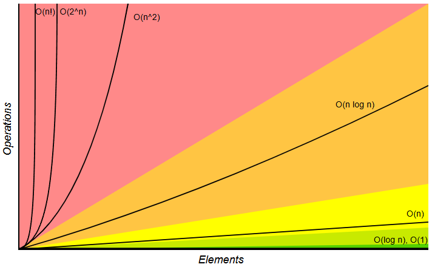

# algorithms
- [introduction](#introduction)

## todo <!-- omit from toc -->
- [cheatsheet](https://github.com/ljeng/cheat-sheet/blob/master)
- [big-O cheatsheet](https://www.bigocheatsheet.com/)
- [latency numbers](https://gist.github.com/jboner/2841832)

## links <!-- omit from toc -->
- [[lectures] intro to algorithms (MIT 2020)](https://www.youtube.com/playlist?list=PLUl4u3cNGP63EdVPNLG3ToM6LaEUuStEY)

## introduction
- **induction:**
  - technique to prove algorithm correctness and establish recurrence relations
  - involves two steps
    - base case: prove statement is true for smallest input
    - inductive step: if statement is true for some `k` then prove its true for `k+1` as well
- **asymptotic complexity:**
  - algorithm's worst-case computational & space complexity as input `n` scales
  - 
- **tail-call recursion:**
  - recursive call is the last operation in the function before returning
  - allows compiler to reuse current stack frame (so no stack overflow)
  - if recursive call needs current output, pass it as argument