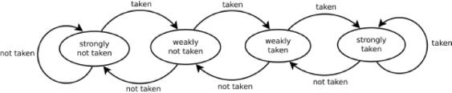
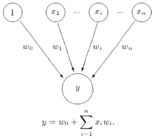
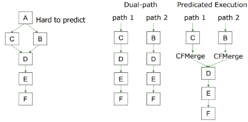
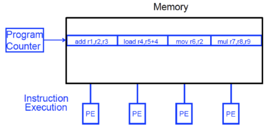

# computer architecture
- [introduction](#introduction)
- [combinational logic](#combinational-logic)
- [sequential logic](#sequential-logic)
- [timing \& verification](#timing--verification)
- [instruction set architecture](#instruction-set-architecture)
- [microarchitecture (μArch)](#microarchitecture-μarch)
- [microprogramming](#microprogramming)
- [pipelining](#pipelining)
- [reorder buffer](#reorder-buffer)
- [out-of-order execution](#out-of-order-execution)
- [superscalar execution](#superscalar-execution)
- [branch prediction](#branch-prediction)
- [very-long instruction word](#very-long-instruction-word)
- [fine-grained multithreading](#fine-grained-multithreading)
- [single instruction multiple data](#single-instruction-multiple-data)

## links  <!-- omit from toc -->
- [design of digital circuits (ETHZ 2018)](https://safari.ethz.ch/digitaltechnik/spring2018/doku.php?id=schedule)
- [Hamming code](https://harryli0088.github.io/hamming-code/)

## todo  <!-- omit from toc -->
- [ARM assembly](http://www.cburch.com/books/arm/)
- [modern microprocessors](https://www.lighterra.com/papers/modernmicroprocessors/)
- [future computing architectures](https://www.youtube.com/watch?v=kgiZlSOcGFM)
- [Hamming speech](https://www.youtube.com/watch?v=a1zDuOPkMSw)
- [Hamming code in software](https://www.youtube.com/watch?v=b3NxrZOu_CE)
- [Hamming code in hardware](https://www.youtube.com/watch?v=h0jloehRKas)
- perceptron branch predictor
- [computer architecture (ETHZ 2019)](https://safari.ethz.ch/architecture/fall2019/doku.php?id=schedule)

## introduction
- **computer architecture:** is the science & art of designing computing platforms  
  why art?: we don't know the future applications/users/market
- **abstraction:** higher level only needs to know about the interface to the lower level, not how the lower level is implemented  
  **levels of transformation:** improves productivity by creates abstractions, no need to worry about decisions made in underlying levels  
  ***breaking the abstraction layers and knowing what is underneath enables you to understand & solve problems***  
  
- **meltdown & spectre:** speculative execution is doing something before you know it is needed to improve performance, but it leaves traces of data that was not supposed to be accessed in processor's cache  
  a malicious program can inspect the contents of the cache to infer secret data
- **rowhammer:** repeatedly opening & closing a DRAM row (aggressor row) enough times within a refresh interval induces disturbance errors due to charge getting drained out in adjacent rows (victim row), happens due to electrical interference, malicious program can flip protection bit in page table entries to access some privileged location  
  *"it's like breaking into an apartment by repeatedly slamming a neighbor's door until vibrations open the door you were after"*  
  
- **memory performance attacks:** in a multi-core system DRAM controller to increase throughput services row-hit memory access first (then service older accesses) so programs with more requests and good memory spatial locality are preferred, malicious streaming (sequential memory access) program used for denial of service attacks  
  
- **DRAM refresh:** a DRAM cell consists of a capacitor & an access transistor, applying high voltage to wordline (row enable) allows us to read data (capacitor chargeas a bit) in the bitline, but capacitor charge leaks over time, memory controller needs to refresh each row periodically to restore charge, increases energy consumption & DRAM bank unavailable while refreshing, but only small % have low retention time (manufacturing process variation) so don't need to refresh every row frequently, once profiling (retention time of all DRAM rows) is done check (Bloom filters) bins to determine refresh rate of a row  
  
  - **Bloom filter:** memory efficient probabilistic data structure that compactly represents set membership, test set membership using hash functions (unique identifier generator), no false negatives & never overflows (but `num elements ∝ false positives rate`), three operations: insert, test & remove all elements, removing one particular element is not easy (can lead to removal of other elements)
- **Hamming code:** powers-of-2 bits are regular parity bits used to track the parity of the other bits whose position have a 1 in the same place, 0th message bit used as overall parity (including regular parity bits), can correct 1-bit errors (regular parity incorrect & overall parity incorrect) & detect 2-bit errors (regular parity incorrect & overall parity correct)  
  Hamming distance: number of locations at which two equal-length strings are different  
  
- **field programable gate array (FPGA):** is a reconfigurable substrate (functions, interconnections, I/O) that can be programmed for a specific use, faster than software & more flexible than hardware, programmed using hardware description language (HDL) like Verilog & VHDL  
  
- **Moore's law:** number of transistors on an integrated circuit will double every two years, is an observation and projection of historical trend

## combinational logic
- outputs are strictly dependent on combination of input values that are applied to circuit right now (memoryless)
- **truth table:** what would be the logical output of the circuit for each possible input  
  
- simple equations:
  - OR: (`+`)
  - AND: (`·`)
- **Boolean algebra:**
  - commutative: `A + B = B + A`, `A · B = B · A`
  - indentities: `A + 0 = A`, `A · 1 = A`
  - distributive: ` A + (B · C) = (A + B) · (A + C)`, `A · (B + C) = (A · B) + (A · C)`
  - complement: `A + ~A = 1`, `A · ~A = 0`
  - duality: replace `+` with `·` and `0` with `1`
- **DeMorgan's law:**
  ```cpp
  ~(X + Y) == ~X · ~Y
  ~(X · Y) == ~X + ~Y
  ```
- **complement:** inverse of a variable  
  `~A, ~B, ~C`  
  **literal:** variable or its complement  
  `A, ~A, B, ~B, C, ~C `  
  **implicant:** product of literals  
  `(A · B · ~C), (~A · C)`  
  **minterm:** product that includes all input's literals  
  `(A · B · ~C), (~A · ~B · C)`  
  **maxterm:** sum that includes all input's literals  
  `(A + B + ~C), (~A + ~B + C)`
- many alternative Boolean expresssions (logic gate realization) may have the same truth table (function)  
  **canonical form:** standard form for a Boolean expression, example: sum of products form  
  **minimal form:** most simplified representation of a function, example: using Karnaugh maps  
  original boolean expression may not be optimal, so reduce it to a equivalent expression with fewer terms to reduce number of gates/inputs and hence the implementation cost
- **sum of products (SOP) form:** sum of all input variable combinations (minterms) that result in a `1` output, leads to two-level logic (AND of minterm literals ORed)
- **multiplexer:** route one of `2^n` inputs to a single output using `n` select/control lines  
  **demultiplexer:** route single input to one of `2^n` outputs using  `n` select lines
- **programmable logic array (PLA):** an array of AND gates followed by OR gates, used to implement combinational logic circuits by connecting output of an AND gate to input of an OR gate if the corresponsing minterm is included in SOP, used in FPGAs  
  
- example: 1-bit addition (full adder):  
  
- **Gray code:** only one bit changes  
  `00` ⟷ `01` ⟷ `11` ⟷ `10` ⟷ `00`
- **uniting theorem:** eliminate input in minterm that can change without changing the output
- **Karnaugh maps:** method of representing the truth table that helps visualize adjacencies to minimise the Boolean expression, numbering scheme along the axis is Gray code, physical adjacency is logical adjacency  
find rectangular groups of power-of-2 number of adjacent `1`s and then eliminate varying inputs from the minterm, can also wrap around corners & edges (imagine K-map as a sphere), `X` (dont care) can be used as either `1`/`0` for simpler equation  
  

## sequential logic
- outputs are determined by previous & current values of inputs (has memory)  
  
- **R-S latch:** two NAND gates with outputs feeding into each other's input (cross-coupled), data is stored at `Q`
  - idle: `S` & `R`set to `1` so output determined by data stored (`Q` or `~Q`)
  - set: drive `S` to `0` (keeping `R==1`) to change `Q` to `1`
  - reset: drive `R` to `0` (keeping `S==1`) to change `~Q` to `1`
  - invalid: if both `R` & `S` are `0` then both `Q` & `~Q` are `1`, this is not possible  
  
- **gated D latch:** to guarantee correct operation of R-S latch add two more NAND gates  
  `Q` takes the value of `D` when `write_enable` set to `1`  
  
- **register:** structure that holds more than one bit and can be read from & written to  
  **memory:** is comprised of locations that can be written to or read from  
  **address:** unique value to index each location in memory  
  **addressability:** the number of bits of information stored in each location  
  **address space:** full set of unique locations in memory
- **state:** of a system is a snapshot of all relevant elements of the system at the moment of the snapshot  
  **clock:** is a general mechanism that triggers transition from one state to another in a sequential circuit, synchronizes state changes across sequential circuit elements  
  combinational logic evaluates for the length of the clock cycle, so clock cycle should be chosen to accomodate maximum combinational circuit delay
- **finite state machines (FSM):** discrete-time model of a stateful system, each state represents a snapshot of the system at a given time, pictorially shows all possible states and how system transitions from one state to another  
  at the beginning of the clock cycle, next state is latched into the state register  
  
- FSM constituents:
  - sequential circuits: for state registers, store current state and load next state at clock edge
  - combinational circuits: for next state & output logic, determine the next state and generate the output
- state register implementation:
  - need to store data at the beginning of every clock cycle
  - data must be available during the entire clock cycle  
  
- why not latch: is we simply wire a clock to `WE` of a latch, when the clock is low `Q` will not take `D`'s value, when the clock is high the latch will propagate `D` to `Q`  
  
- **D flip flop:** `D` is observable at `Q` only at the beginning of next clock cycle and `Q` is available for the full clock cycle  
  clock low ⟶ master sends `D` (`Q` unchanged) ⟶ clock high ⟶ slave latches `D` in `Q`  
  so at rising/positive edge of clock `Q` get assigned `D`  
  
- **FSM types:**
  - **Moore:** output depends only on current state
  - **Mealy:** output depends on the current state and the inputs  
  
- example: snail looking for `1101` pattern:  
  
- **FSM state encoding:**
  - **fully encoded:** minimize number of flip flops but not necessarily output & next state logic, example: `00`, `01`, `10`, `11`
  - **1-hot encoded:** maximize flipflops and minimize next state logic, use `num_states` bits to represent states, example: `0001`, `0010`, `0100`, `1000`
  - **output encoded:** minimize output logic, output can be deduced from state encoding, only works for Moore machines, example: `001` (red), `010` (yellow), `100` (green), `110`(red & yellow)

## timing & verification
- **functional specification:** describes relationship between inputs & outputs  
  **timing specification:** describes delay between inputs changinf and  outputs responding
- **combinational circuit delay:** circuit outputs change some time after the inputs change due to capacitance & resistance in a circuit and finite speed of light  
  
- **contamination delay:** minimum delay  
  **propagation delay:** maximum delay  
  **cross hatching:** output could be changing (centre part)  
  **critical path:** path with longest propagation delay  
  
- **glitch:** one input transition causes multiple output transitions, visible on K-maps since it shows reults of a change in a single input  
  resolve the glitch by adding the consensus term (`~A · C`) to ensure no transition  
  
- **sequential circuit timing:** `D` & `Q` in a D flip flop have their own timing requirement
  - input: `D` must be stable when sampled at rising clock edge  
      
    **metastability:** flip flop output is stuck somewhere between `1` & `0` if `D` is changing, output eventually settles non-deterministically  
    
  - output: Q changes between the contamination & propagation delay clock-to-q  
    
- **clock skew:** time difference between two clock edges, because clock does not reach all parts of the chip at the same time  
    
  requires intelligent clock network across a chip, so clock arrives at all locations at roughly the same time  
    

## instruction set architecture
- **instruction:** most basic unit of computer processing
- **instruction set architecture (ISA):** is the interface between what software commands and what the hardware carries out, specifies memory organization, register set & instruction set (opcodes, data types & addressing modes)  
  *"if instructions are the words in the language of a computer, ISA is the vocabulary"*
- **von Neumann model:** program stored in memory (unified instruction & data memory), processor fetches then processes instruction sequentially one at a time, easier to debug since you know which instruction will execute  
  pipelining, SIMD, OoO execution, seperate data & instruction cacahe are not consistent with von Neumann model  
  **data flow model:** instruction fetched and executed only when its operands are ready, inherently more parallel, no instruction pointer required
- example: factorial with data flow model:  
  
- **register:** memory is big but slow, so registers ensure fast access to operands, typically one register contains one word
- special purpose registers:
  - **stack pointer (`SP`):** address of top of the stack
  - **link register (`LR`):** return address
  - **instruction register (`IR`):** current instruction
  - **program counter (`PC`):** address of next instruction to execute, also known as instruction pointer, incremented by `1` in word addressable memory and by word length in byte addressable memory
  - **program status register (`PSR`):** zero (`Z`), negative (`N`), carry (`C`), overflow (`V`)
  - **memory address register (`MAR`):** address to read/write  
    **memory data/buffer register (`MDR`/`MBR`):** data from read or to write  
    read data: load `MAR` with the address, then data will be placed in `MDR`  
    write data: load `MAR` with the address and `MDR` with data, then activate write enable signal
- **opcode:** what instruction does, three types:
  - operate: execute instructions in the ALU
  - data movement: read from or write to memory
  - control flow: change the sequence of execution
- **opcode encoding:** defines how instuctions are encoded as binary values in the machine code  
  
- opcodes:
  ```cpp
  ; // mnemonic dest, src1, src2
  ; // most can modify PSR flags by postfixing S
  AND regd, rega, argb  ; // regd ⟵ rega & argb
  EOR regd, rega, argb  ; // regd ⟵ rega ^ argb
  SUB regd, rega, argb  ; // regd ⟵ rega - argb
  RSB regd, rega, argb  ; // regd ⟵ argb - rega, REVERSE SUB
  ADD regd, rega, argb  ; // regd ⟵ rega + argb
  ADC regd, rega, argb  ; // regd ⟵ rega + argb + C (carry in PSR)
  SBC regd, rega, argb  ; // regd ⟵ rega - argb - !C
  RSC regd, rega, argb  ; // regd ⟵ argb - rega - !C
  TST rega, argb        ; // set flags for rega & argb, result discarded, TEST
  TEQ rega, argb        ; // set flags for rega ^ argb, result discarded, TEST_EQUIVALENCE
  CMP rega, argb        ; // set flags for rega - argb, COMPARE
  CMN rega, argb        ; // set flags for rega + argb, COMPARE_NEGATIVE
  ORR regd, rega, argb  ; // regd ⟵ rega | argb
  MOV regd, arg         ; // regd ⟵ arg
  BIC regd, rega, argb  ; // regd ⟵ rega & ~argb, BIT_CLEAR
  MVN regd, arg         ; // regd ⟵ ~argb, MOV_NOT
  B target_addr         ; // BRANCH
  LDR regd, [rega]      ; // regd ⟵ *rega, LDRB for 8bit
  STR regd, [rega]      ; // regd ⟶ *rega, STRB for 8bit
  ```
- condition flags:
  ```
  EQ          equal                         Z
  NE          not equal                     !Z
  MI          minus/negative                N
  PL          plus/positive or zero         !N
  VS          overflow set                  V
  VC          overflow clear                !V
  GE          signed greater than or equal  N == V
  LT          signed less than              N != V
  GT          signed greater than           !Z && (N == V)
  LE          signed greater than or equal  Z || (N != V)
  AL/omitted  always                        true
  ```
- **addressing modes:** way in which the operand of an instruction is specified
  - immediate offset: `[Rn, #±imm]`, offset to address in `Rn`
  - register: `[Rn]`, address in `Rn`, same as `[Rn, #0]`
  - scaled register offset: `[Rn, ±Rm, shift]`, address is sum of `Rn` value & shifted `Rm` value
  - register offset: `[Rn, ±Rm]`, address is sum of `Rn` & `Rm` values, same as `[Rn, ±Rm, LSL #0]`
  - immediate pre-indexed: `[Rn, #±imm]!`, same as immediate offset but `Rn` set to address
  - scaled register pre-indexed: `[Rn, ±Rm, shift]!`, same as scaled register offset mode but `Rn` set to address
  - register pre-indexed: `[Rn, ±Rm]!`, same as register offset mode but `Rn`set to address
  - immediate post-indexed: `[Rn], #±imm`, same as register then offset added to `Rn`
  - scaled register post-indexed: `[Rn], ±Rm, shift`, same as register then shifted `±Rm` value added to `Rn`
  - register post-indexed: `[Rn], ±Rm`, same as register then `±Rm` added to `Rn`, same as `[Rn], ±Rm, LSL #0`
- **shift flags:** used with addressing modes
  - logical shift left (`LSL`): `a << b`
  - logical shift right (`LSR`): `a >> b`
  - arithematic shift right (`ASR`): `a >> b` with sign extension, `ASL == LSL`
  - rotate right (`ROR`): `a >> b` with wrap around
  
- example: loop C to assembly:
  ```cpp
  // C ⟶ Assembly
  // C
  int total;
  int i;

  total = 0;
  for (i = 10; i > 0; i--)
  {
      total += i;
  }

  // ARM Assembly
          MOV  R0, #0
          MOV  R1, #10
  again   ADD  R0, R0, R1
          SUBS R1, R1, #1  ;
          BNE  again       ; // check Z flag
  halt    B    halt        ; // infinite loop
          END
  ```
- example: strcpy in assembly:
  ```cpp
  // ARM Assembly strcpy()
  strcpy  LDRB R2, [R1], #1  ; // R1 is source
          STRB R2, [R0], #1  ; // R0 is destination
          TST R2, R2         ; // repeat if R2 is nonzero
          BNE strcpy
          END
  ```
- **instruction cycle:** sequence of steps that an instruction goes through to be executed
  - fetch: obtain instruction from memory and load it into the `IR`
  - decode: identifies the instruction to be processed
  - evaluate address: computes the address of memory location of operands
  - fetch operands: obtains the source operands, in latest processors fetch is done in parallel to decode
  - execute: executes the instruction
  - store result: write to the designated destination, once done cycle starts again for a new instruction

## microarchitecture (μArch)
- underlying implementation of ISA, μArch keeps changing with constant ISA interface to ensure backwards compatibility, example: `add` instruction vs adder implementation
- control driven (von Neumann) vs data driven (data flow) execution tradeoff can be made at μArch level, μArch can execute instructions in any order as long as it obeys the semantics specified by the ISA when making instruction results visible to software
- **instruction processing:** assuming von Neumann model, processing an instruction (all 6 stages) should transform architectural state (memory, registers & program counter) according to ISA specification  
  ISA defines abstractly what `AS'` should be given an instruction and `AS`, from ISA point of view there are no intermediate states between `AS` & `AS'` during instruction execution  
  μArch implements how `AS` is transformed to `AS'`, but can have multiple programmer-invisible states to optimize the speed of instruction execution, so we have two choices
    - **single-cycle machines:** each instruction takes single clock cycle, no intermediate or programmer-invisible states, only combinational logic used to implement instruction execution, clock cycle time determined by slowest instruction  
      `AS` ⟶ `AS'`  
      
    - **multi-cycle machines:** each instruction takes as many clock cycles as it needs, multiple state updates during instruction's execution, architectureal state updates only at the end of an instructions execution, needs extra registers to store intermediate results, clock cycle time determined by slowest stage  
      `AS`⟶ `AS+MS1` ⟶ `AS+MS2` ⟶ `AS+MS3` ⟶ `AS'`  
      
- instruction processing needs two components:
  - **datapath:** hardware elements that deal with and transform data signals
    - functional unit operating on data
    - storage units (like registers)
    - hardware structures (like wires & muxes) that enable flow of data into functional units & registers
  - **control logic:** hardware elements that determine the signals that specify what datapath elements should do to the data  
  in multi cycle machines, control signals needed in the next cycle can be generated in
the current cycle
- performance basics: execution time of
  - instruction: `cycles-per-instruction × clock-cycle-time`
  - program: `num-instructions × average-cycles-per-instruction × clock-cycle-time`, also known as iron law of performance
- for a single cycle machine, how long each instruction takes is determined by how long slowest instruction takes to execute, even though many instructions don't need that long to execute (average-CPI always 1)
- **μArch design principles:**
  - critical design path: find & decrease the maximum combinational logic delay, break a path in to multiple cycles if it takes too long
  - common case design: spend time & resources on where it matters most, similar to Amdahl's law
  - balanced design: balance instruction/data flow through hardware components to eliminate bottlenecks

## microprogramming
- for a multi cycle μArch, instruction processing cycle is divided into states  
  sequences from state to state to process an instruction  
  the behaviour of the entire processor is specified fully by a FSM
- **microinstruction:** control signal assocuated with the current state  
  **microsequencing:** determining the next state and the microinstruction for the next state  
  **control store:** stores control signals (microinstructions) for every possible sate (entire FSM)  
  **microsequencer:** determines which set of control signals will be used in the next clock cycle (next state)
- example: MIPS LC-3b control & datapath: 26 bits passed to data path, 9 bits go back to microsequencer to fetch microinstruction (control signals) for next cycle in parallel  
    
  
- advantages of microprogrammed control:
  - allows a simple design to do powerful computation by controlling the datapath (using a sequencer)
  - enables easy extensibility of the ISA  
    can support a new instruction by changing the microcode  
    can support complex instructions (string copy) as a sequence of simple microinstructions
  - enables update of machine behavoir  
    a buggy implementation of an instruction can be fixed by changing the microcode in the field

## pipelining
- with multi-cycle design some hardware resources are idle during different phases of instruction processing cycle so pipeline the execution ("assembly line processing") of multiple instructions for better hardware utilization and instruction throughput  
  throughput increases as number of stages increase  
  
- example: multi-stage vs pipelining: fetch ⟶ decode ⟶ execute ⟶ writeback  
  
- **ideal pipeline:** increase throughput with little increase in cost
  - same operation is repeated on large number of different instructions
  - no dependencies between instructions
  - processing can be evenly divided into uniform-latency suboperations (that do not share resources)
- **practical pipeline:**
  - different instructions dont all need the same stages, example: adder during load/store operation
  - need to detect and resolve inter-instruction dependencies to ensure the pipeline provides correct results, can lead to stalls (pipeline stops moving)
  - some pipe stages are too fast but are forced to take the same clock cycle time
- issues in pipeline design:
  - balancing work in pipeline stages
  - keeping the pipeline correct, moving & full in the presence of events that disrupt pipeline flow like dependencies, resource contention & long latency operations
  - handling exceptions & interrupts
- **dependencies:** dictate ordering requirements between instructions
- **structural dependency:** happens when instructions in two pipeline stages need the same resource, solutions are:
  - eliminated the cause of contention, duplicate resources (seperate instruction & data caches) or increase its throughput (multiple ports for memory structures)
  - detect resource contention and stall one of the contending stages
- **data dependency:** current instruction needs previous output  
  
  - flow (read after write): always needs to be obeyed because they constitute true depedence on previous output value
  - output (write after write) exists due to limited number of architectural registers, dependency on a name only (not on value)
  - anti (write after read): cause same as output dependency
- **stall:** make the dependent instruction wait until its source data value is available  
  bubble: `NOP`s inserted in the stage after the stalled once
- handling anti & output data dependencies: always write to destination in one stage and in program order only
- detecting data dependencies: between instructions in a pipelined processor to guarantee correct execution
  -  scoreboarding: each register in register file has a associated valid bit, instruction writing to register resets the bit, instruction in decode stage will check if all source & destination registes are valid
  - combinational dependency check logic: special logic that checks if any instruction in later stages is supposed to write to any source register of the instruction that is being decoded
- resolving data dependencies:
  - stall: till dependent value is updated in register file (hardware based interlocking)
  - compile-time detection & elimination: insert `NOP`s (bubble) at compile time (software based interlocking)
  - data forwarding/bypassing: forward the result value as soon as the value is available from a later stage in the pipeline, brings a pipeline closer to data flow execution principles  
    
  sufficient to resolve raw data dependency (cannot resolve dependency with load)  
  
- **control dependency:** data depedence on the instruction pointer, special case of data dependency on `PC` register, next instruction known only once branch is evaluated
- resolving control dependencies:
  - stall: till branch resolved
  - delayed branching: execute instruction that is independent of branch taken or not
  - prediction: try to guess which way a branch will go before it is definitively known
    - predict-not-taken: fetch next sequential instruction fetched, if branch is taken then instructions must be flushed  
      
    - predict-taken: fetch branched instruction, backward branches (loop) are usually taken
    - dynamic prediction: assumes next branch will be similar to previous branches
  - loop unrolling: during compilation will reduce number of branches
- **scheduling:** order in which instructions are executed in pipeline
  - static: software based instruction scheduling, compiler orders the instruction then hardware executes them in that order, can get runtime information through profiling
  - dynamic: hardware based instruction scheduling, hardware can execute instruction out of the compiler-specified order, has extra runtime information like variable length operation latency, memory address, branch history
- **multi-cycle execution:** not all instructions take same amount of time for execution, so have multiple different functional units that take different number of cycles, can let previous independent instruction start execution on a different functional unit before a long-latency instruction finishes execution  
    
  but architectural states are not updated in a sequential manner (sequential semantics of ISA not preserved), example: first instruction throws exception but second instruction is already executed and has modified the architectural state  
  
- **exception:** cause is internal to the running thread, handle when detected, example: divide by 0  
  **interrupt:** cause is external to the running thread, handle when convenient (except for very high priority ones like power failure), example: mouse input when executable is running
- retire/commit: finish execution and update architectural state
- **precise exception/interrupt:** architectural state should be consistent (precise) when the exception/interrupt is ready to be handled, aids software debugging by ensuring clean slate beween two instruction, von Neumann ISA specifies this  
  precise: all previous instructions should be completely retired and no later instruction should be retired
- handling exceptions in pipelining: when the oldest instruction ready-to-be-retired is detected to have caused an exception, control logic:
  - ensures architectural state is precise
  - flush younger instruction in the pipeline to process the exception handler
  - saves `PC` & registers (as specified by ISA)
  - redirects the fetch engine to appropriate exception handling routine
- example: ensuring precise exceptions in pipelining: make each operation take the same amount of time, worst-case instruction latency determines all instructions' latency  
  

## reorder buffer
- complete instruction out-of-order but reorder them before making results visible to architectural state, helpful for precise exceptions & rollback on mispredictions  
    
  - when instruction is decoded it reserved the next-sequential entry in the ROB
  - when instruction completes, it writes result into ROB entry
  - when instruction oldest in the ROB and it has completed without exceptions, its results moved into register file or memory
- ROB entry: should contain everything to:  
  
  - correctly reorder instructions back into the program order
  - update architectural state with instruction's results
  - handle an exception/interrupt precisely
  - also needs valid bits to keep track of readiness of the results and find out if the instruction has completed execution
- in case of data dependency, input dependency value can be in the register file, reorder buffer or bypass path  
  register file (random access memory) is already indexed with register ID, which is the address of an entry  
  ROB buffer (content addressable memory) has to be searched with register ID, which is part of the content of an entry  
  
- simplifying ROB access: to get rid of content-addressable memory we can instead use indirection
  - access register file (register alias table) first and check if the register file is valid, if register invalid it stores the ID of the reorder buffer entry that contains (or will contain) the value of the register
  - access reorder buffer next
- dispatch: sending instruction to functional unit
- **register renaming:** mapping of register to ROB entry, register file maps the register to a ROB entry if there is an in-flight instruction writing to that register  
  link instruction dependencies: whenever an instruction at a particular ROB entry finishes execution it can broadcast its result to every instruction waiting for that ROB entry, name (ROB entry) is used to communicate the data value  
  eliminates the output & anti dependencies (only exist due to lack of register IDs) between instructions and automatically recognizes true dependences  
- example: in-order pipeline with reorder buffer:  
  in-order dispatch/execution, out-of-order execution and in-order retirement  
    
    - decode (D): access register file or ROB, allocate entry in ROB, check if instruction can execute, if so dispatch instruction
    - execute (E): instructions can complete out-of-order
    - completion (R): write result to reorder buffer
    - retirement (W): check for exceptions

[CONTINUE](https://www.youtube.com/watch?v=0E4QTDZ2OBA&list=PL5Q2soXY2Zi_QedyPWtRmFUJ2F8DdYP7l&index=16)

## out-of-order execution
- move dependent instructions out of the way of independent ones, fetch & dispatch those instructions only when its inputs are ready (similar to dataflow), also known as dynamic scheduling


**reservation stations:** rest areas for dependent instruction or waiting for hardware (adder, multiplier)

**register alias table:** table of ISA registers with corresponding "tag" or "value"

**latency tolerance:** allows independent instruction to execute and complete in presence of long-latency operation (like memory access)

**frontend register file:** for register renaming  
**architectural register file:** for maintaining precise state

**OoO execution (tomasulo's algorithm):**
1. **find operand dependencies:** set `tag` as operand for dependencies (register renaming), else use `value` directly
2. **scheduling:** buffer instruction to reservation stations, each functional unit (adder/multiplier) has its own reservation station
3. **execute when ready:** wait for data/resource dependencies to resolve
4. **dispatch instruction if source values ready:** output "tag" broadcasted when value produced, each instruction compare their source "tags" to broadcasted ones, instruction "wakes up" when source values ready
5. **reorder output:** instruction updates output value in register alias table (frontend register file), instruction added to reorder buffer, architectural register file updated when instruction retires on becoming oldest instruction


**centralized physical register file:** data values stored in physical registers that reservation stations & register alias table will access, instead of maintaining multiple data copies, alias for physical register added in register alias table, eliminates data broadcast but tag broadcast still needed

**instruction window:** all decoded but not yet retired instruction, OoO dynamically builds dataflow graph of this

**register vs memory:**
1. register known statically vs memory determined dynamically
2. small size vs large
3. register state not visible to other threads vs shared

**memory dependency handling:** memory addr is not known till load/store executes (addr computation needs to finish), determining dependency/independency needs to be handled after load/store partial execution

**memory disambiguation (unknown address) problem:** when load/store has addr ready, there maybe older load/store with undetermined addr (don't know if older instruction will write same memory addr)

**how to detect load-store dependency:** load dependency status is not known till all previous store addr are computed
1. wait until all previous stores committed
2. check whether load address matches with previous store addr stored in store queue (SQ)

**when to schedule load:**
1. **conservative:** stall load until all previous stores have addr computed, no need for recovery, but delays independent loads unnecessarily
2. **aggressive:** assume load is independent of unknown-addr stores & schedule it, simple & more probable case, but recovery on misprediction
3. **intelligent:** predict if load is dependent on unknown-addr store, more accurate, but still recovery

**store-to-load forwarding:** cannot update memory out of program order, load queue & store queue used, after store execution, addr & data written to SQ (acts as store reorder buffer), later when load calculates its addr
1. searches SQ with addr, for multi-word load - dependency on multiple SQ entries
2. access memory address
3. receive value from youngest older store

**pure data flow:** availability of data determines order of execution, a data flow node fires when sources are ready, too much parallelism (not enough execution units in hardware) and no precise state semantics

## superscalar execution

**superscalar execution:** per cycle multiple instr processed (fetch, decode execute & retire), `N`-wide superscalar means `N` instr per cycle (needs `N` data paths)

**dependency checking:** HW perfoms dependency check between concurrently-fetched instr, vertical axis dependency check (OoO horizontal), example: expected `IPC == 2` but actual `IPC == 1.2`


## branch prediction

**control dependency:** if current instruction fetched is control-flow instruction then how to determine next fetch PC


**control dependencies handling:** critical to keep pipeline full with correct sequence of dynamic instructions
1. **stall:** the pipeline until next fetch instruction known
2. **branch prediction:** guess next fetch instruction
3. **branch delay slot:** employ delayed branching
4. **fine-grained multithreading:** do something else
5. **predicated execution:** eliminate control-flow instructions
6. **multipath execution:** fetch from both possible paths, need to know the addresses of both possible paths

**branch problem:** next fetch address after a control-flow instruction is not determined after `N` cycles (branch resolution latency) in a pipelined processor, for `W` wide pipeline branch prediction leads to `N × W` wasted instruction slots


branch misprediction penalty: number of instructions flushed in case of misprediction

**for better IPC:**
1. reduce branch misprediction penalty(branch resolution latency): resolve branch condition & target address early
2. increase branch probability: branch prediction

**simplest branch prediction:** always predict the next sequential instruction is the next instruction to be execution (`nextPC = PC + 4`), to maximize the chance compiler will lay out the control flow graph such that likely next instruction is on the not-taken path of a branch (`if` instead of `else`), most branches are loops so usually branch not-taken

**branch prediction:** predict the next fetch address (to be used in the next cycle), target address remains same for a conditional direct branch across dynamic instances so store the target address (in branch target buffer/address-cache (BTB)) from a previous instance and access it with the PC
1. **whether fetched instruction is a branch:** if BTB provides a target address for a PC then it must be a branch
2. **conditional branch direction:** prediction schemes used
3. **branch target address (if taken):** BTB stores target address computed last time branch was executed

**branch direction prediction schemes:**
1. **compile time (static):** but cannot adapt to dynamic changes in branch behavior, this can be mitigated by a dynamic compiler (just in time (JIT) compiler) like java
   1. **always not-taken:** simple to implement, no need for BTB, no direction prediction, low accuracy, for better accuracy compiler can layout code such that the likely path is the not-taken path
   2. **always taken:** no direction prediction, better accuracy, backward branch (target address lower than branch PC) like loops are usually taken
   3. **backward taken forward not-taken (BTFN):** for backward branch predict taken and for forward branches not-taken
   4. **profile based:** compiler determines like direction for each branch using a profile run, encodes that direction as a hint bit in the branch instruction format, per branch prediction, accurate only if profile is representative
   5. **program analysis based:** use heuristics (loosely based rules) based on program analysis to determine statically-predicted direction, example: negative integers used as error values so predict `BLZ` as not-taken, example: predict a branch guarding a loop execution as taken, heuristic should be representative
   6. **programmer based:** progammer provides the statically-predicted direction using pragmas, programmer may know their program better than other analysis techniques
2. **run time (dynamic):** predict branches based on dynamic information collected at runtime
   1. **one-bit last time predictor:** indicated which direction branch went last time it executed, misprediction when branch changes behaviour, always mispredicts the last & first iteration for loop branches (`N` iterations `accuracy = (N-2)/N`), changes prediction too quickly
   2. **two-bit counter based predictor:** add hysteresis to one-bit predictor so that prediction does not change on a single different outcome, use two bits to track history of predictions, can have 2 states each for taken & not-taken, needs 2 incorrect guesses to change prediction scheme
   3. **global branch history predictor:** recently executed branch outcomes in the execution path are correlated with outcome of the next branch, make a prediction based on the outcome of the branch the last time the same global branch history was encountered, uses two level of history - global history register (GHR) to store direction of last `N` branches and pattern history table (PHT)) to store direction the branch took the last time same history was seen, GHR used as index in PHT, PHT made of two-bit predictors
      1. **gshare predictor:** GHR XORed with branch PC to create PHT index, more context information, better utilization of PHT
   4. **local branch history predictor:** make the prediction based on the outcome of the branch last time same local branch history was encountered, same as global branch history but for same branch
   5. **hybrid branch predictor:** use more than one type of predictor and select best prediction, better accuracy, reduced warmup time (farter-warmup predictor used until the slower-warmup predictor warms up), example: tournament predictor
   6. **perceptron branch predictor:** perceptron is simple binary classifier (modelled on biological neuron) that learns how each element affects the output, perceptron contains sets of weights, each weight corresponds to a bit in GHR, how much each bit is correlated with direction of the branch, positive correlation large positive weight, negative correlation large negative weight
   7. **history length based predictor:** different branches require different history lengths for better prediction accuracy, have multiple PHTs indexed with GHRs of different history lengths and intelligently allocate PHT entries to different branches

**example: two-bit predictor:**



**example: global branch history predictor:**


**example: gshare predictor:**


**example: tournament predictor:**


**example: perceptron predictor:**




**example: history length based predictor:**


**pragmas:** keywords that enable a programmer to convey hints to lower levels of the transformation hierarchy, example: `if (likely(x)) { ... }`, example: `#pragma omp parallel` to direct openmp that loop can be parallelized

**branch confidence estimation:** estimate if the prediction is likely to be correct, useful in deciding how to speculate (example: whether to stop fetching on this path)

**delayed branching:** delay the execution of a branch, `N` instructions (delay slots) that come after the brnach are always executed regardless of branch direction, branch must be independent of the delay slot instructions, compiler finds delay slot instructions, `NOP` added if delay slot not found

**delayed branching with squashing:** if the branch is not-taken then the delay slot instruction is not executed (instruction squashed), keeps the pipeline full with useful instructions

**predicate combining:** combine predicate operations to feed a single branch instruction instead of having one brancg for each, complex predicates (like `if ((a == b) && (c < d) && (a > 5000))`) are usually converted into multiple branches, single branch checks checks the value of the combined predicate

**predicated execution:** compiler converts control dependency to data dependency, each instruction has predicate bit set based on predicate computation, instruction is effectively a `NOP` if its predicate is false, example: `if (a == 5) { b = 4; } else { b = 3 }` converted to `CMPEQ condition, a, 5; CMOV condition, b, 4; CMOV !condition, b, 3`, eliminates branches and enables straight line code, avoids misprediction cost but useless work (some instructions fetched/executed but discarded)


**multipath execution:** execute both paths after a conditional branch, improves performance is misprediction cost greater than useless work, for multiple branches paths followed will become exponential, duplicate work if paths merge (same instructions after branch)



**handling other branch types:**
1. **call:** easy to predict, always taken and single target address, calls marked in BTB and target predicted by BTB
2. **return:** can be called from many points in code (indirect branches), usually return matches a call so use a stack to predict return address (retun address stack), push return (next instruction) address to stack when call fetched, pop stack asnd use the address as its predicted target when return fetched
3. **indirect:** register-indirect branches have multiple targets, two ideas - predict the last resolved target as the next fetch address and use history based target prediction

**branch prediction latency:** need to generate next fetch address for the next cycle, more complex predictors are more accurate but slower

## very-long instruction word

**very-long instruction word (VLIW):** compiler finds independent instructions and statically schedules (packs/bundles) them into a single VLIW instruction to be fetched & executed concurrently, no need for hardware dependency checking between concurrently-fetched instructions (like in superscalar execution), all instructions in a bundle are executed in lockstep, if any operation in the VLIW instruction stalls then all operations stall, if independent instructions not found then `NOP`s inserted, recompilation required when execution width (`N`) or instruction latencies or functional units change



**reduced instruction set computer (RISC):** compiler does the hardwork to translate high-level language code to simpler instructions, VLIW philosophy similar to RISC but compiler does the hardwork to find instruction level parallelism

**explicitly parallel instruction computing (EPIC):** intel's implementation of VLIW, not fully VLIW but based in VLIW principles, instruction bundles can have dependent instructions, a few bits in the instruction format specify explicitly which instructions in the bundle are dependent on which other ones

## fine-grained multithreading

**fine-grained multithreading:** hardware has multiple thread contexts (PC & registers), each cycle fetch engine fetches from a different thread, used to handle data & control dependencies, no instruction fetched from same thread till the fetched branch/instruction is resolved, branch/instruction resolution latency overlapped with execution of other threads' instructions, reduced single thread performance since one instruction fetched every `N` cycles from the same thread, does not overlap latency if not enough threads to cover the whole pipeline


## single instruction multiple data

**flynn's taxonomy of computers:**
1. **single instruction single data (SISD):** single instruction operates on single data element, example: single core processor
2. **single instruction multiple data (SIMD):** single instruction operates on multiple data elements, example: array & vector processor
3. **multiple instruction single data (MISD):** multiple instructions operates on single data element, example: systolic array processor
4. **multiple instruction multiple data (MISD):** multiple instructions operates on multiple data elements, multiple instruction streams, example: multi-core processor

**data parallelism:** concurrency arises from performing the same operation on different pieces of data, form of instruction level parallelism where instruction happens to be same across data

**contrast to data flow:** concurrency arises from executing different operations in parallel  
**contrast to thread parallelism:** cocurrency arises from executing different threads of control in parallel

**time-space duality:** single instruction operates on multiple data elements in time or in space
1. **array processor:** instruction operates on multiple data elements at the same time using different spaces
2. **vector processor:** instruction operates on multiple data elements in consecutive time steps using the same space, functional units are pipelined


**VLIW vs array processor:** multiple independent operations packed together by compiler vs single operation on multiple different data elements, irregular vs regular parallelism

**regular parallelism:** tasks are similar and have predictable dependencies  
**irregular parallelism:** the tasks are dissimilar in a way that creates unpredictable dependencies

**vector:** one-dimensional array of numbers
**stride:** distance in memory between two elements of a vector

**vector processor:** is one whose instructions operate on vectors rather than scalar (single data) values, requirements are
1. **vector data registers:** to load/store vectors, each holds `N` number of `M`-bit values
2. **vector length register (VLEN):** to operate on vectors of different lengths
3. **vector stride register (VSTR):** elements of a vector might be stored apart from each other in memory, can be used to access non-consecutive elements, example: with `VSTR == 8` access `A` ⟶ `A+8` ⟶ `A+16` ⟶ `A+24`
4. **vector mask register (VMASK):** indicates which elements of vector to operate on, set bu vector test instructions

**vector instructions allow deeper pipelines:**
1. no intra-vector dependencies
2. no control flow within a vector
3. known stride allows easy address calculation for all elements, enables prefetching into registers/cache/memory

**vector functional units:** use deep pipeline to execute element operations, control of deep pipeline is simple because elements in vector are independent

