# computer architecture
- [introduction](#introduction)
- [combinational logic](#combinational-logic)
- [sequential logic](#sequential-logic)
- [timing \& verification](#timing--verification)
- [instruction set architecture](#instruction-set-architecture)
- [microarchitecture](#microarchitecture)
  - [microprogramming](#microprogramming)
- [pipelining](#pipelining)
- [reorder buffer](#reorder-buffer)
- [out-of-order execution](#out-of-order-execution)
- [dataflow](#dataflow)
- [superscalar execution](#superscalar-execution)
- [branch prediction](#branch-prediction)
- [very-long instruction word](#very-long-instruction-word)
- [fine-grained multithreading](#fine-grained-multithreading)
- [single instruction multiple data](#single-instruction-multiple-data)
- [graphics processing units](#graphics-processing-units)
  - [programming](#programming)
  - [performance considerations](#performance-considerations)
- [systolic arrays](#systolic-arrays)
- [decoupled access execute](#decoupled-access-execute)
- [memory organization](#memory-organization)

## links  <!-- omit from toc -->
- [design of digital circuits (ETHZ 2018)](https://safari.ethz.ch/digitaltechnik/spring2018/doku.php?id=schedule)
- [Hamming code](https://harryli0088.github.io/hamming-code/)

## todo  <!-- omit from toc -->
- [ARM assembly](http://www.cburch.com/books/arm/)
- [modern microprocessors](https://www.lighterra.com/papers/modernmicroprocessors/)
- [future computing architectures](https://www.youtube.com/watch?v=kgiZlSOcGFM)
- [Hamming speech](https://www.youtube.com/watch?v=a1zDuOPkMSw)
- [Hamming code in software](https://www.youtube.com/watch?v=b3NxrZOu_CE)
- [Hamming code in hardware](https://www.youtube.com/watch?v=h0jloehRKas)
- Intel itanium
- [systolic arrays](https://safari.ethz.ch/digitaltechnik/spring2018/lib/exe/fetch.php?media=1982-kung-why-systolic-architecture.pdf)
- [computer architecture (ETHZ 2019)](https://safari.ethz.ch/architecture/fall2019/doku.php?id=schedule)

## introduction
- **computer architecture:** is the science & art of designing computing platforms  
**why art?:** we don't know the future applications/users/market
- **abstraction:** higher level only needs to know about the interface to the lower level, not how the lower level is implemented  
**levels of transformation:** improves productivity by creates abstractions, no need to worry about decisions made in underlying levels  
***breaking the abstraction layers and knowing what is underneath enables you to understand & solve problems***  
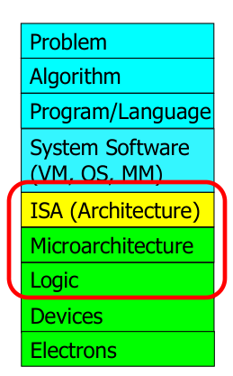
- **meltdown & spectre:** speculative execution is doing something before you know it is needed to improve performance, but it leaves traces of data that was not supposed to be accessed in processor's cache  
a malicious program can inspect the contents of the cache to infer secret data
- **rowhammer:** repeatedly opening & closing a DRAM row (aggressor row) enough times within a refresh interval induces disturbance errors due to charge getting drained out in adjacent rows (victim row), happens due to electrical interference, malicious program can flip protection bit in page table entries to access some privileged location  
*"it's like breaking into an apartment by repeatedly slamming a neighbor's door until vibrations open the door you were after"*  
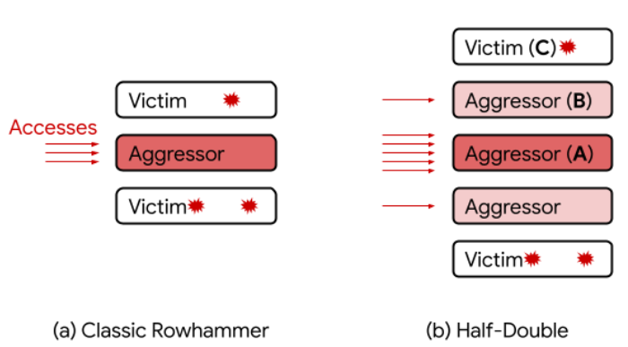
- **memory performance attacks:** in a multi-core system DRAM controller to increase throughput services row-hit memory access first (then service older accesses) so programs with more requests and good memory spatial locality are preferred, malicious streaming (sequential memory access) program used for denial of service attacks  
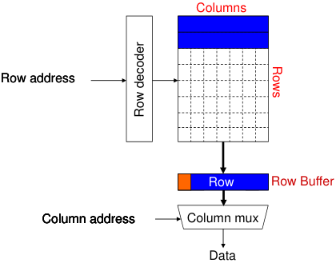
- **DRAM refresh:** a DRAM cell consists of a capacitor & an access transistor, applying high voltage to wordline (row enable) allows us to read data (capacitor charge as a bit) in the bitline, but capacitor charge leaks over time, memory controller needs to refresh each row periodically to restore charge, increases energy consumption & DRAM bank unavailable while refreshing, but only small % have low retention time (manufacturing process variation) so don't need to refresh every row frequently, once profiling (retention time of all DRAM rows) is done check (Bloom filters) bins to determine refresh rate of a row  
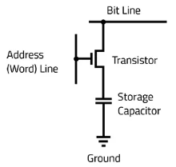
  - **Bloom filter:** memory efficient probabilistic data structure that compactly represents set membership, test set membership using hash functions (unique identifier generator), no false negatives & never overflows (but `num elements ∝ false positives rate`), three supported operations: insert, test & remove all elements, removing one particular element is not easy (can lead to removal of other elements)
- **Hamming code:** powers-of-2 bits are regular parity bits used to track the parity of the other bits whose position have a 1 in the same place, 0th message bit used as overall parity (including regular parity bits), can correct 1-bit errors (regular parity incorrect & overall parity incorrect) & detect 2-bit errors (regular parity incorrect & overall parity correct)  
**Hamming distance:** number of locations at which two equal-length strings are different  
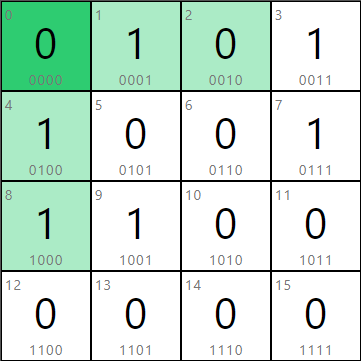
- **field programable gate array (FPGA):** is a reconfigurable substrate (functions, interconnections, I/O) that can be programmed for a specific use, faster than software & more flexible than hardware, programmed using hardware description language (HDL) like Verilog & VHDL  
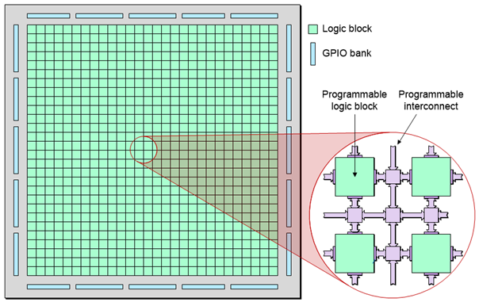
- **Moore's law:** number of transistors on an integrated circuit will double every two years, is an observation and projection of historical trend

## combinational logic
- **combinational logic:** outputs are strictly dependent on combination of input values that are applied to circuit right now (memoryless)
- **truth table:** what would be the logical output of the circuit for each possible input  
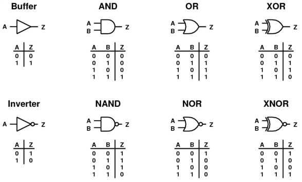
- **simple equations:**
  - **OR:** (`+`)
  - **AND:** (`.`)
- **Boolean algebra:**
  - **commutative:** `A + B = B + A`, `A . B = B . A`
  - **identities:** `A + 0 = A`, `A . 1 = A`
  - **distributive:** ` A + (B . C) = (A + B) . (A + C)`, `A . (B + C) = (A . B) + (A . C)`
  - **complement:** `A + ~A = 1`, `A . ~A = 0`
  - **duality:** replace `+` with `.` and `0` with `1`
- **DeMorgan's law:**
  ```cpp
  ~(X + Y) == ~X . ~Y
  ~(X . Y) == ~X + ~Y
  ```
- **complement:** inverse of a variable  
`~A, ~B, ~C`  
**literal:** variable or its complement  
`A, ~A, B, ~B, C, ~C `  
**implicant:** product of literals  
`(A . B . ~C), (~A . C)`  
**minterm:** product that includes all input's literals  
`(A . B . ~C), (~A . ~B . C)`  
**maxterm:** sum that includes all input's literals  
`(A + B + ~C), (~A + ~B + C)`
- many alternative Boolean expressions (logic gate realization) may have the same truth table (function)  
**canonical form:** standard form for a Boolean expression, example: sum of products form  
**minimal form:** most simplified representation of a function, example: using Karnaugh maps  
original boolean expression may not be optimal, so reduce it to a equivalent expression with fewer terms to reduce number of gates/inputs and hence the implementation cost
- **sum of products (SOP) form:** sum of all input variable combinations (minterms) that result in a `1` output, leads to two-level logic (AND of minterm literals ORed)
- **multiplexer:** route one of `2^n` inputs to a single output using `n` select/control lines  
**demultiplexer:** route single input to one of `2^n` outputs using  `n` select lines
- **programmable logic array (PLA):** an array of AND gates followed by OR gates, used to implement combinational logic circuits by connecting output of an AND gate to input of an OR gate if the corresponding minterm is included in SOP, used in FPGAs  
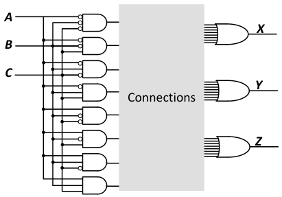
- **example: 1-bit addition (full adder):**  
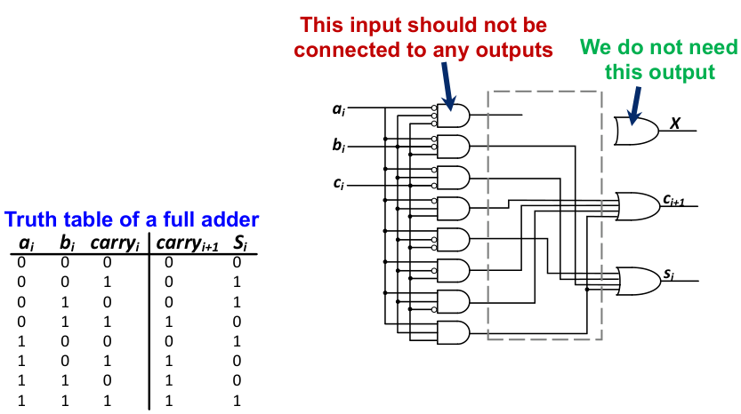
- **Gray code:** only one bit changes  
`00` ⟷ `01` ⟷ `11` ⟷ `10` ⟷ `00`
- **uniting theorem:** eliminate input in minterm that can change without changing the output
- **Karnaugh maps:** method of representing the truth table that helps visualize adjacencies to minimize the Boolean expression, numbering scheme along the axis is Gray code, physical adjacency is logical adjacency  
find rectangular groups of power-of-2 number of adjacent `1`s and then eliminate varying inputs from the minterm, can also wrap around corners & edges (imagine K-map as a sphere), `X` (don't care) can be used as either `1`/`0` for simpler equation  
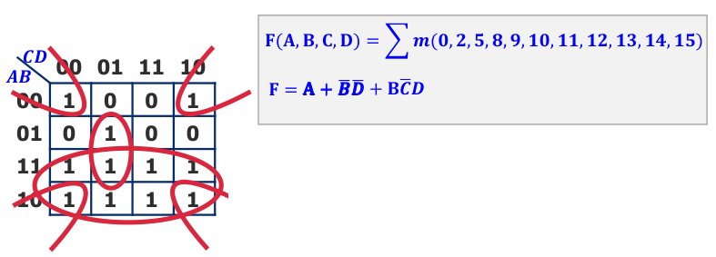

## sequential logic
- outputs are determined by previous & current values of inputs (has memory)  
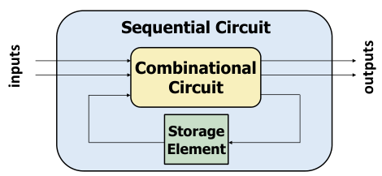
- **R-S latch:** two NAND gates with outputs feeding into each other's input (cross-coupled), data is stored at `Q`
  - **idle:** `S` & `R`set to `1` so output determined by data stored (`Q` or `~Q`)
  - **set:** drive `S` to `0` (keeping `R==1`) to change `Q` to `1`
  - **reset:** drive `R` to `0` (keeping `S==1`) to change `~Q` to `1`
  - **invalid:** if both `R` & `S` are `0` then both `Q` & `~Q` are `1`, this is not possible  
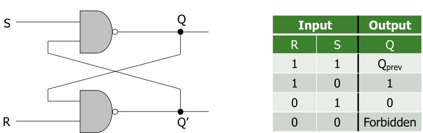
- **gated D latch:** to guarantee correct operation of R-S latch add two more NAND gates  
`Q` takes the value of `D` when `write_enable` set to `1`  
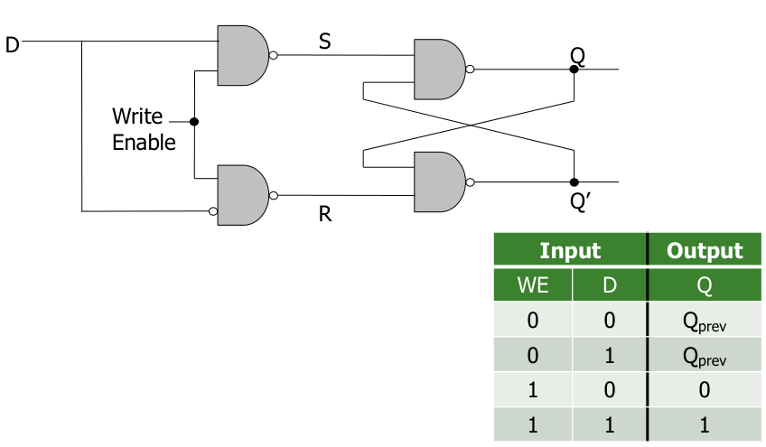
- **register:** structure that holds more than one bit and can be read from & written to  
**memory:** is comprised of locations that can be written to or read from  
**address:** unique value to index each location in memory  
**addressability:** the number of bits of information stored in each location  
**address space:** full set of unique locations in memory
- **state:** of a system is a snapshot of all relevant elements of the system at the moment of the snapshot  
**clock:** is a general mechanism that triggers transition from one state to another in a sequential circuit, synchronizes state changes across sequential circuit elements  
combinational logic evaluates for the length of the clock cycle, so clock cycle should be chosen to accommodate maximum combinational circuit delay
- **finite state machines (FSM):** discrete-time model of a stateful system, each state represents a snapshot of the system at a given time, pictorially shows all possible states and how system transitions from one state to another  
at the beginning of the clock cycle, next state is latched into the state register  
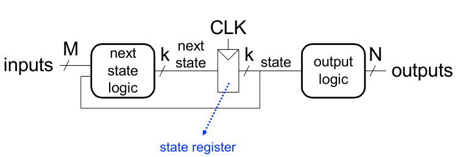
- **FSM constituents:**
  - **sequential circuits:** for state registers, store current state and load next state at clock edge
  - **combinational circuits:** for next state & output logic, determine the next state and generate the output
- **state register implementation:**
  - need to store data at the beginning of every clock cycle
  - data must be available during the entire clock cycle  
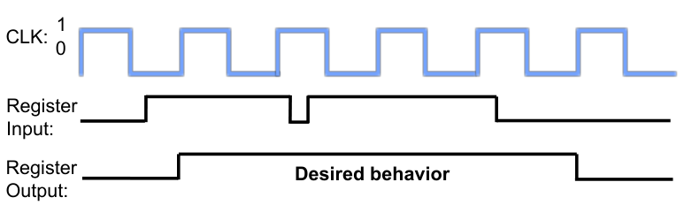
- **why not latch:** is we simply wire a clock to `WE` of a latch, when the clock is low `Q` will not take `D`'s value, when the clock is high the latch will propagate `D` to `Q`  
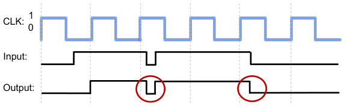
- **D flip flop:** `D` is observable at `Q` only at the beginning of next clock cycle and `Q` is available for the full clock cycle  
clock low ⟶ master sends `D` (`Q` unchanged) ⟶ clock high ⟶ slave latches `D` in `Q`  
so at rising/positive edge of clock `Q` get assigned `D`  
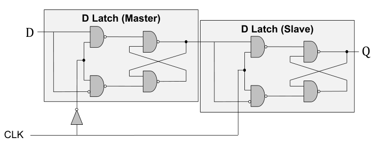
- **FSM types:**
  - **Moore:** output depends only on current state
  - **Mealy:** output depends on the current state and the inputs  
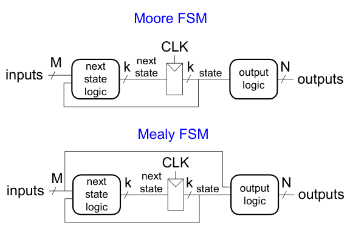
- **example: snail looking for `1101` pattern:**  
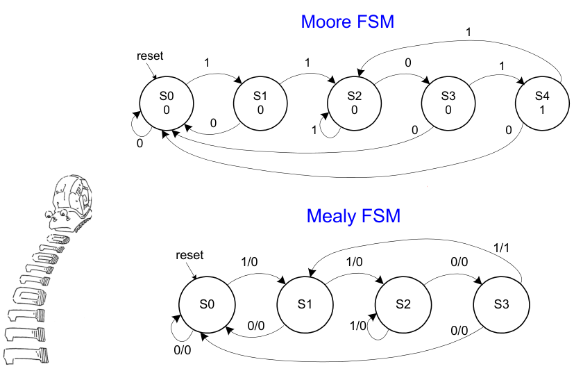
- **FSM state encoding:**
  - **fully encoded:** minimize number of flip flops but not necessarily output & next state logic, example: `00`, `01`, `10`, `11`
  - **1-hot encoded:** maximize flipflops and minimize next state logic, use `num_states` bits to represent states, example: `0001`, `0010`, `0100`, `1000`
  - **output encoded:** minimize output logic, output can be deduced from state encoding, only works for Moore machines, example: `001` (red), `010` (yellow), `100` (green), `110`(red & yellow)

## timing & verification
- **functional specification:** describes relationship between inputs & outputs  
**timing specification:** describes delay between inputs changing and  outputs responding
- **combinational circuit delay:** circuit outputs change some time after the inputs change due to capacitance & resistance in a circuit and finite speed of light  
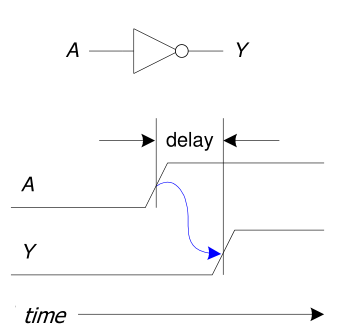
- **contamination delay:** minimum delay  
**propagation delay:** maximum delay  
**cross hatching:** output could be changing (centre part)  
**critical path:** path with longest propagation delay  
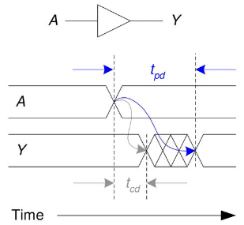
- **glitch:** one input transition causes multiple output transitions, visible on K-maps since it shows results of a change in a single input  
resolve the glitch by adding the consensus term (`~A . C`) to ensure no transition  
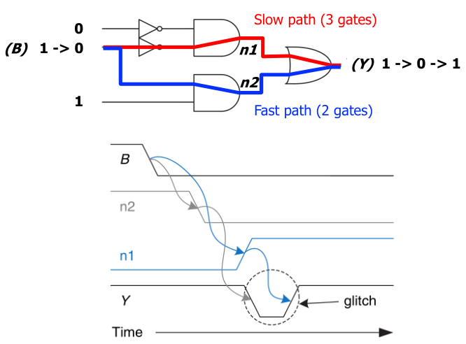
- **sequential circuit timing:** `D` & `Q` in a D flip flop have their own timing requirement
  - **input:** `D` must be stable when sampled at rising clock edge  
  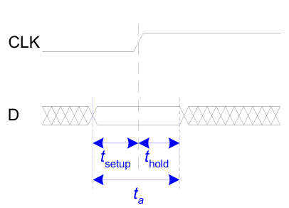  
  **metastability:** flip flop output is stuck somewhere between `1` & `0` if `D` is changing, output eventually settles non-deterministically  
  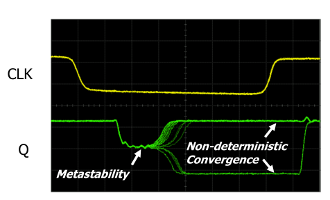
  - **output:** Q changes between the contamination & propagation delay clock-to-q  
  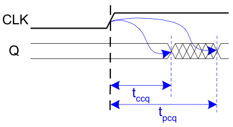
- **clock skew:** time difference between two clock edges, because clock does not reach all parts of the chip at the same time  
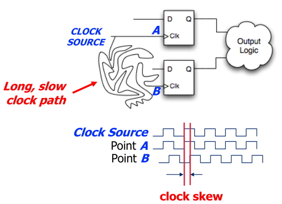  
requires intelligent clock network across a chip, so clock arrives at all locations at roughly the same time  
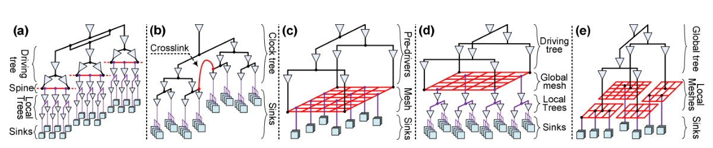  

## instruction set architecture
- **instruction:** most basic unit of computer processing
- **instruction set architecture (ISA):** is the interface between what software commands and what the hardware carries out, specifies memory organization, register set & instruction set (opcodes, data types & addressing modes)  
*"if instructions are the words in the language of a computer, ISA is the vocabulary"*
- **von Neumann model:** program stored in memory (unified instruction & data memory), processor fetches then processes instruction sequentially one at a time, easier to debug since you know which instruction will execute  
pipelining, SIMD, OoO execution, separate data & instruction cache are not consistent with von Neumann model  
**data flow model:** instruction fetched and executed only when its operands are ready, inherently more parallel, no instruction pointer required
- **example: factorial with data flow model:**  
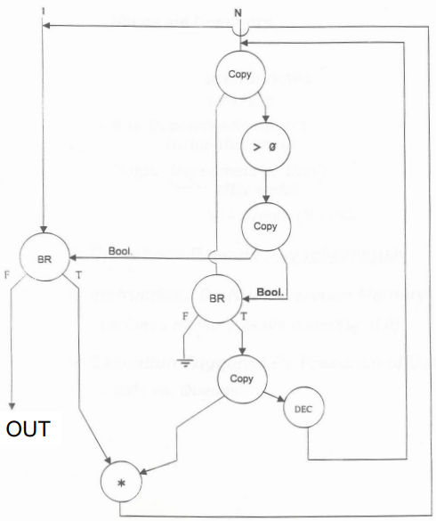
- **register:** memory is big but slow, so registers ensure fast access to operands, typically one register contains one word
- **special purpose registers:**
  - **stack pointer (`SP`):** address of top of the stack
  - **link register (`LR`):** return address
  - **instruction register (`IR`):** current instruction
  - **program counter (`PC`):** address of next instruction to execute, also known as instruction pointer, incremented by `1` in word addressable memory and by word length in byte addressable memory
  - **program status register (`PSR`):** zero (`Z`), negative (`N`), carry (`C`), overflow (`V`)
  - **memory address register (`MAR`):** address to read/write  
  **memory data/buffer register (`MDR`/`MBR`):** data from read or to write  
  **read data:** load `MAR` with the address, then data will be placed in `MDR`  
  **write data:** load `MAR` with the address and `MDR` with data, then activate write enable signal
- **opcode:** what instruction does, three types:
  - **operate:** execute instructions in the ALU
  - **data movement:** read from or write to memory
  - **control flow:** change the sequence of execution
- **opcode encoding:** defines how instructions are encoded as binary values in the machine code  
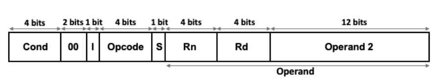
- **example: ARM opcodes:**
  ```cpp
  ; // mnemonic dest, src1, src2
  ; // most can modify PSR flags by postfixing S
  AND regd, rega, argb  ; // regd ⟵ rega & argb
  EOR regd, rega, argb  ; // regd ⟵ rega ^ argb
  SUB regd, rega, argb  ; // regd ⟵ rega - argb
  RSB regd, rega, argb  ; // regd ⟵ argb - rega, REVERSE SUB
  ADD regd, rega, argb  ; // regd ⟵ rega + argb
  ADC regd, rega, argb  ; // regd ⟵ rega + argb + C (carry in PSR)
  SBC regd, rega, argb  ; // regd ⟵ rega - argb - !C
  RSC regd, rega, argb  ; // regd ⟵ argb - rega - !C
  TST rega, argb        ; // set flags for rega & argb, result discarded, TEST
  TEQ rega, argb        ; // set flags for rega ^ argb, result discarded, TEST_EQUIVALENCE
  CMP rega, argb        ; // set flags for rega - argb, COMPARE
  CMN rega, argb        ; // set flags for rega + argb, COMPARE_NEGATIVE
  ORR regd, rega, argb  ; // regd ⟵ rega | argb
  MOV regd, arg         ; // regd ⟵ arg
  BIC regd, rega, argb  ; // regd ⟵ rega & ~argb, BIT_CLEAR
  MVN regd, arg         ; // regd ⟵ ~argb, MOV_NOT
  B target_addr         ; // BRANCH
  LDR regd, [rega]      ; // regd ⟵ *rega, LDRB for 8bit
  STR regd, [rega]      ; // regd ⟶ *rega, STRB for 8bit
  ```
- **example: ARM condition flags:**
  ```
  EQ          equal                         Z
  NE          not equal                     !Z
  MI          minus/negative                N
  PL          plus/positive or zero         !N
  VS          overflow set                  V
  VC          overflow clear                !V
  GE          signed greater than or equal  N == V
  LT          signed less than              N != V
  GT          signed greater than           !Z && (N == V)
  LE          signed greater than or equal  Z || (N != V)
  AL/omitted  always                        true
  ```
- **addressing modes:** way in which the operand of an instruction is specified
  - **immediate offset:** `[Rn, #±imm]`, offset to address in `Rn`
  - **register:** `[Rn]`, address in `Rn`, same as `[Rn, #0]`
  - **scaled register offset:** `[Rn, ±Rm, shift]`, address is sum of `Rn` value & shifted `Rm` value
  - **register offset:** `[Rn, ±Rm]`, address is sum of `Rn` & `Rm` values, same as `[Rn, ±Rm, LSL #0]`
  - **immediate pre-indexed:** `[Rn, #±imm]!`, same as immediate offset but `Rn` set to address
  - **scaled register pre-indexed:** `[Rn, ±Rm, shift]!`, same as scaled register offset mode but `Rn` set to address
  - **register pre-indexed:** `[Rn, ±Rm]!`, same as register offset mode but `Rn`set to address
  - **immediate post-indexed:** `[Rn], #±imm`, same as register then offset added to `Rn`
  - **scaled register post-indexed:** `[Rn], ±Rm, shift`, same as register then shifted `±Rm` value added to `Rn`
  - **register post-indexed:** `[Rn], ±Rm`, same as register then `±Rm` added to `Rn`, same as `[Rn], ±Rm, LSL #0`
- **shift flags:** used with addressing modes
  - **logical shift left (`LSL`):** `a << b`
  - **logical shift right (`LSR`):** `a >> b`
  - **arithmetic shift right (`ASR`):** `a >> b` with sign extension, `ASL == LSL`
  - **rotate right (`ROR`):** `a >> b` with wrap around
  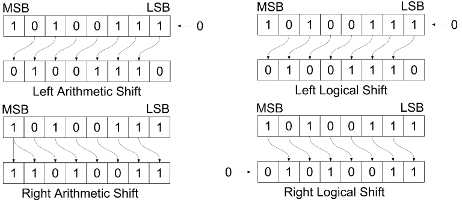
- **example: loop C to assembly:**
  ```cpp
  // C ⟶ Assembly
  // C
  int total;
  int i;

  total = 0;
  for (i = 10; i > 0; i--)
  {
      total += i;
  }

  // ARM Assembly
          MOV  R0, #0
          MOV  R1, #10
  again   ADD  R0, R0, R1
          SUBS R1, R1, #1  ;
          BNE  again       ; // check Z flag
  halt    B    halt        ; // infinite loop
          END
  ```
- **example: strcpy in assembly:**
  ```cpp
  // ARM Assembly strcpy()
  strcpy  LDRB R2, [R1], #1  ; // R1 is source
          STRB R2, [R0], #1  ; // R0 is destination
          TST R2, R2         ; // repeat if R2 is nonzero
          BNE strcpy
          END
  ```
- **instruction cycle:** sequence of steps that an instruction goes through to be executed
  - **fetch:** obtain instruction from memory and load it into the `IR`
  - **decode:** identifies the instruction to be processed
  - **evaluate address:** computes the address of memory location of operands
  - **fetch operands:** obtains the source operands, in latest processors fetch is done in parallel to decode
  - **execute:** executes the instruction
  - **store result:** write to the designated destination, once done cycle starts again for a new instruction

## microarchitecture
- **microarchitecture (μArch):** underlying implementation of ISA, μArch keeps changing with constant ISA interface to ensure backwards compatibility, example: `add` instruction vs adder implementation
- control driven (von Neumann) vs data driven (data flow) execution tradeoff can be made at μArch level, μArch can execute instructions in any order as long as it obeys the semantics specified by the ISA when making instruction results visible to software
- **instruction processing:** assuming von Neumann model, processing an instruction (all 6 stages) should transform architectural state (memory, registers & program counter) according to ISA specification  
ISA defines abstractly what `AS'` should be given an instruction and `AS`, from ISA point of view there are no intermediate states between `AS` & `AS'` during instruction execution  
μArch implements how `AS` is transformed to `AS'`, but can have multiple programmer-invisible states to optimize the speed of instruction execution, so we have two choices
    - **single-cycle machines:** each instruction takes single clock cycle, no intermediate or programmer-invisible states, only combinational logic used to implement instruction execution, clock cycle time determined by slowest instruction  
    `AS` ⟶ `AS'`  
    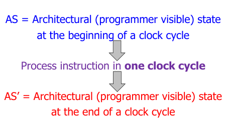
    - **multi-cycle machines:** each instruction takes as many clock cycles as it needs, multiple state updates during instruction's execution, architectural state updates only at the end of an instructions execution, needs extra registers to store intermediate results, clock cycle time determined by slowest stage  
    `AS`⟶ `AS+MS1` ⟶ `AS+MS2` ⟶ `AS+MS3` ⟶ `AS'`  
    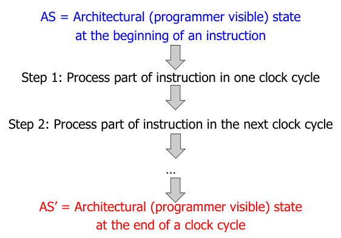
- **instruction processing needs two components:**
  - **datapath:** hardware elements that deal with and transform data signals
    - functional unit operating on data
    - storage units (like registers)
    - hardware structures (like wires & muxes) that enable flow of data into functional units & registers
  - **control logic:** hardware elements that determine the signals that specify what datapath elements should do to the data  
in multi cycle machines, control signals needed in the next cycle can be generated in
the current cycle
- **performance basics:** execution time of
  - **instruction:** `cycles-per-instruction x clock-cycle-time`
  - **program:** `num-instructions x average-cycles-per-instruction x clock-cycle-time`, also known as iron law of performance
- for a single cycle machine, how long each instruction takes is determined by how long slowest instruction takes to execute, even though many instructions don't need that long to execute (average-CPI always 1)
- **μArch design principles:**
  - **critical design path:** find & decrease the maximum combinational logic delay, break a path in to multiple cycles if it takes too long
  - **common case design:** spend time & resources on where it matters most, similar to Amdahl's law
  - **balanced design:** balance instruction/data flow through hardware components to eliminate bottlenecks

### microprogramming
- **microprogramming:** for a multi cycle μArch, instruction processing cycle is divided into states  
sequences from state to state to process an instruction  
the behavior of the entire processor is specified fully by a FSM
- **microinstruction:** control signal associated with the current state  
**microsequencing:** determining the next state and the microinstruction for the next state  
**control store:** stores control signals (microinstructions) for every possible sate (entire FSM)  
**microsequencer:** determines which set of control signals will be used in the next clock cycle (next state)
- **example: MIPS LC-3b control & datapath:** 26 bits passed to data path, 9 bits go back to microsequencer to fetch microinstruction (control signals) for next cycle in parallel  
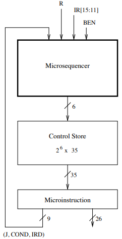  
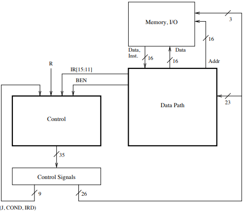
- **advantages of microprogrammed control:**
  - allows a simple design to do powerful computation by controlling the datapath (using a sequencer)
  - enables easy extensibility of the ISA  
  can support a new instruction by changing the microcode  
  can support complex instructions (string copy) as a sequence of simple microinstructions
  - enables update of machine behavior  
  a buggy implementation of an instruction can be fixed by changing the microcode in the field

## pipelining
- **pipelining:** with multi-cycle design some hardware resources are idle during different phases of instruction processing cycle so pipeline the execution ("assembly line processing") of multiple instructions for better hardware utilization and instruction throughput  
throughput increases as number of stages increase  
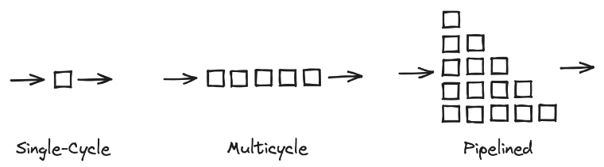
- **example: multi-stage vs pipelining:** fetch ⟶ decode ⟶ execute ⟶ writeback  
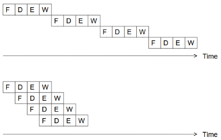
- **ideal pipeline:** increase throughput with little increase in cost
  - same operation is repeated on large number of different instructions
  - no dependencies between instructions
  - processing can be evenly divided into uniform-latency sub-operations (that do not share resources)
- **practical pipeline:**
  - different instructions don't all need the same stages, example: adder during load/store operation
  - need to detect and resolve inter-instruction dependencies to ensure the pipeline provides correct results, can lead to stalls (pipeline stops moving)
  - some pipe stages are too fast but are forced to take the same clock cycle time
- **issues in pipeline design:**
  - balancing work in pipeline stages
  - keeping the pipeline correct, moving & full in the presence of events that disrupt pipeline flow like dependencies, resource contention & long latency operations
  - handling exceptions & interrupts
- **dependencies:** dictate ordering requirements between instructions
- **structural dependency:** happens when instructions in two pipeline stages need the same resource, solutions are:
  - eliminated the cause of contention, duplicate resources (separate instruction & data caches) or increase its throughput (multiple ports for memory structures)
  - detect resource contention and stall one of the contending stages
- **data dependency:** current instruction needs previous output  
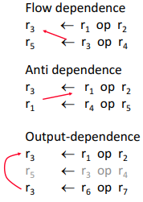
  - **flow (read after write):** always needs to be obeyed because they constitute true dependency on previous output value
  - **output (write after write):** exists due to limited number of architectural registers, dependency on a name only (not on value)
  - **anti (write after read):** cause same as output dependency
- **stall:** make the dependent instruction wait until its source data value is available  
**bubble:** `NOP`s inserted in the stage after the stalled once
- **handling anti & output data dependencies:** always write to destination in one stage and in program order only
- **detecting data dependencies:** between instructions in a pipelined processor to guarantee correct execution
  - **scoreboarding:** each register in register file has a associated valid bit, instruction writing to register resets the bit, instruction in decode stage will check if all source & destination register are valid
  - **combinational dependency check logic:** special logic that checks if any instruction in later stages is supposed to write to any source register of the instruction that is being decoded
- **resolving data dependencies:**
  - **stall:** till dependent value is updated in register file (hardware based interlocking)
  - **compile-time detection & elimination:** insert `NOP`s (bubble) at compile time (software based interlocking)
  - **data forwarding/bypassing:** forward the result value as soon as the value is available from a later stage in the pipeline, brings a pipeline closer to data flow execution principles  
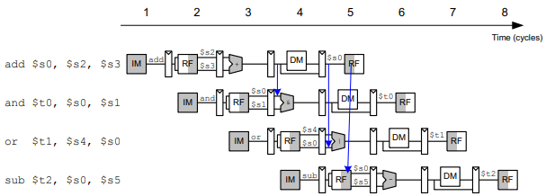  
sufficient to resolve raw data dependency (cannot resolve dependency with load)  
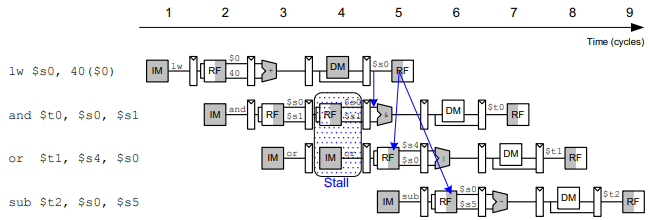
- **control dependency:** data dependency on the instruction pointer, special case of data dependency on `PC` register, next instruction known only once branch is evaluated
- **resolving control dependencies:**
  - **stall:** till branch resolved
  - **delayed branching:** execute instruction that is independent of branch taken or not
  - **prediction:** try to guess which way a branch will go before it is definitively known
    - **predict-not-taken:** fetch next sequential instruction fetched, if branch is taken then instructions must be flushed  
    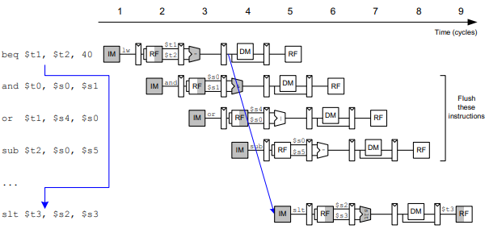
    - **predict-taken:** fetch branched instruction, backward branches (loop) are usually taken
    - **dynamic prediction:** assumes next branch will be similar to previous branches
  - **loop unrolling:** during compilation will reduce number of branches
- **scheduling:** order in which instructions are executed in pipeline
  - **static:** software based instruction scheduling, compiler orders the instruction then hardware executes them in that order, can get runtime information through profiling
  - **dynamic:** hardware based instruction scheduling, hardware can execute instruction out of the compiler-specified order, has extra runtime information like variable length operation latency, memory address, branch history
- **multi-cycle execution:** not all instructions take same amount of time for execution, so have multiple different functional units that take different number of cycles, can let previous independent instruction start execution on a different functional unit before a long-latency instruction finishes execution  
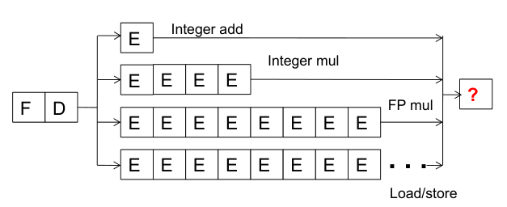  
but architectural states are not updated in a sequential manner (sequential semantics of ISA not preserved), example: first instruction throws exception but second instruction is already executed and has modified the architectural state  
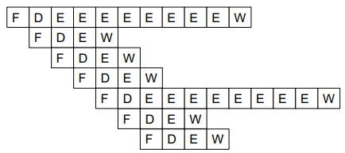
- **exception:** cause is internal to the running thread, handle when detected, example: divide by 0  
**interrupt:** cause is external to the running thread, handle when convenient (except for very high priority ones like power failure), example: mouse input when executable is running
- **retire/commit:** finish execution and update architectural state
- **precise exception/interrupt:** architectural state should be consistent (precise) when the exception/interrupt is ready to be handled, aids software debugging by ensuring clean slate between two instruction, von Neumann ISA specifies this  
**precise:** all previous instructions should be completely retired and no later instruction should be retired
- **handling exceptions in pipelining:** when the oldest instruction ready-to-be-retired is detected to have caused an exception, control logic:
  - ensures architectural state is precise
  - flush younger instruction in the pipeline to process the exception handler
  - saves `PC` & registers (as specified by ISA)
  - redirects the fetch engine to appropriate exception handling routine
- **example: ensuring precise exceptions in pipelining:** make each operation take the same amount of time, worst-case instruction latency determines all instructions' latency  
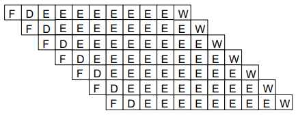

## reorder buffer
- complete instruction execution out-of-order but reorder them before making results visible to architectural state, helpful for precise exceptions & rollback on mispredictions  
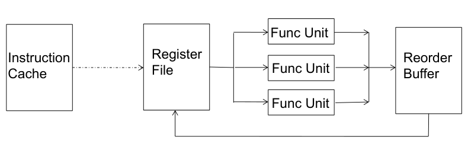  
- when instruction is decoded it reserved the next-sequential entry in the ROB
  - when instruction completes, it writes result into ROB entry
  - when instruction oldest in the ROB and it has completed without exceptions, its results moved into register file or memory
- **ROB entry:** should contain everything to:  
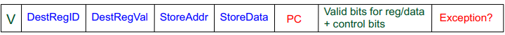
  - correctly reorder instructions back into the program order
  - update architectural state with instruction's results
  - handle an exception/interrupt precisely
  - also needs valid bits to keep track of readiness of the results and find out if the instruction has completed execution
- in case of data dependency, input dependency value can be in the register file, reorder buffer or bypass path  
register file (random access memory) is already indexed with register ID, which is the address of an entry  
ROB buffer (content addressable memory) has to be searched with register ID, which is part of the content of an entry  
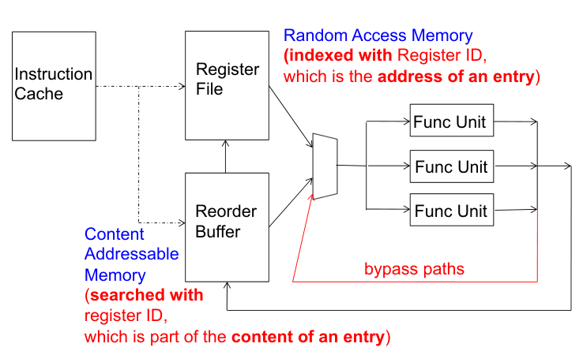
- **simplifying ROB access:** to get rid of content-addressable memory we can instead use indirection
  - access register file first and check if the register file is valid, if register invalid it stores the ID of the reorder buffer entry that contains (or will contain) the value of the register
  - access reorder buffer next
- **dispatch:** act of sending an instruction to a functional unit
- **register renaming:** mapping of register to ROB entry, register file maps the register to a ROB entry if there is an in-flight instruction writing to that register  
**link instruction dependencies:** whenever an instruction at a particular ROB entry finishes execution it can broadcast its result to every instruction waiting for that ROB entry, name (ROB entry) is used to communicate the data value  
ROB is not constrained by ISA interface (unlike register file), so it can be huge and can have many instructions writing to the same architectural register
- **example: in-order pipeline with reorder buffer:**  
in-order dispatch/execution, out-of-order execution and in-order retirement  
in-order dispatch eliminates stalls due to false dependencies, but a true dependency will stall dispatch of younger instruction  
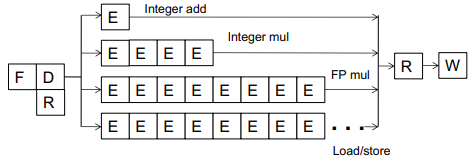  
  - **decode (D):** access register file or ROB, allocate entry in ROB, check if instruction can execute, if so dispatch instruction
    - **execute (E):** instructions can complete out-of-order
    - **completion (R):** write result to reorder buffer
    - **retirement (W):** check for exceptions

## out-of-order execution
- **out-of-order (OoO) execution:** move the dependent instructions out of the way of independent ones into resting areas, ensure that true data dependency does not stall the processor, also known as dynamic scheduling  
monitor the source values of each instruction in resting area, dispatch/fire the instruction when all source values are available  
instructions dispatched in dataflow (not control flow) order
- **reservation stations:** rest areas for dependent instructions or instructions waiting for hardware (adder, multiplier)
- **example: in-order vs out-of-order execution:** assume `IMUL` takes 4 cycles and `ADD` takes 1  
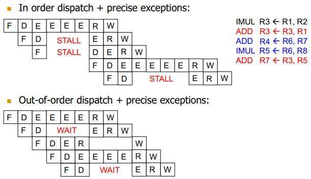
- **enabling OoO execution:**
  - need to link consumer of a value to the producer  
  associate a tag with each data value (register renaming)  
  eliminates false dependencies
  - need to buffer instructions until they are ready to execute  
  insert instruction into reservation stations after renaming  
  enables the pipeline to move for independent operations
  - instructions need to keep track of readiness of source values  
  broadcast the tag when the value is produced, instructions compare their source tags to the broadcast tag  
  enables communication of readiness of produced value between instructions
  - when all source values of an instruction are ready, need to dispatch the instruction to its functional unit  
  instruction wakes up if all sources are ready, if multiple instructions are awake, select one per functional unit  
  enables out-of-order dispatch
- **frontend register alias table:** an instruction updates this when it completes execution, if valid bit set data value used, if valid bit reset tag used, used for renaming
- **architectural/backend register alias table:** an instruction updates this when it retires, always updated in program order, used for maintaining precise state  
on an exception: flush pipeline, copy architectural RAT into frontend RAT
- **OoO execution:** Tomasulo's algorithm with precise exceptions  
two humps are reservation station (scheduling window) and reordering (instruction/active window)  
**instruction window:** all decoded but not yet retired instruction  
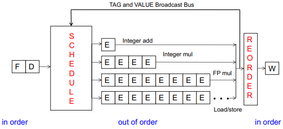
  - **find operand dependencies:** set tag (register renaming) if there is any dependency, else use data value directly
  - **scheduling:** buffer instruction (with tag and/or data values) to reservation station, each functional unit has its own reservation station
  - **execute when ready:** wait for data/resource dependencies to resolve
  - **dispatch instruction if source values ready:** output tag is broadcasted when value is produced, each instruction compare their source tags to broadcasted one, instruction wakes up when source values ready
  - **reorder output:** instruction updates output value in frontend RAT, then instruction added to reorder buffer, when instruction retires on becoming oldest instruction backend RAT will be updated
- **example: dataflow graph from frontend RAT:**  
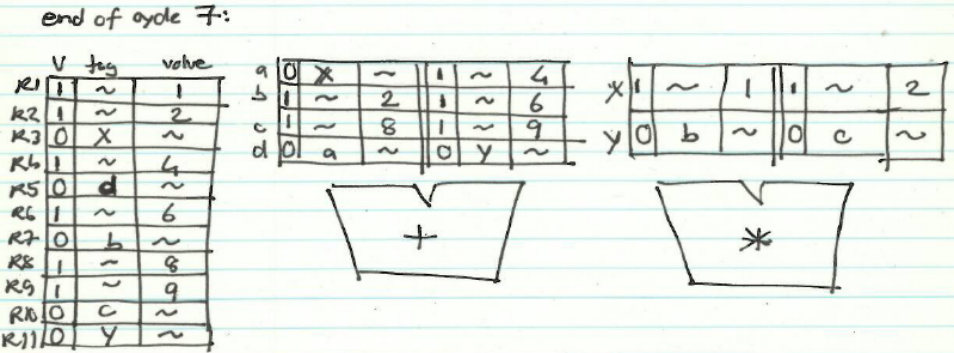  

- **centralized physical register file:** data values stored at a common place (physical registers) that reservation station, frontend & backend RAT will use indirection to, eliminates the need to maintain multiple copies of data values, no need for data broadcast now but tag broadcast still needed
- **example: Pentium 4 microarchitecture:** OoO execution with centralized physical register file  

- **latency tolerance:** OoO execution tolerates the latency of multi-cycle operations by executing independent operations concurrently
- **register vs memory:**
  - register dependencies known statically vs memory dependencies determined dynamically
  - register state is small vs memory state is huge
  - register state is not visible to other threads/processors vs shared
- **memory dependency handling:** memory address is not known until a load/store executes (address computation)
  - renaming memory addresses is difficult (huge memory state)
  - determining dependency/independency of load/store need to be handled after their partial execution
  - when a load/store has its address ready, there may be older load/store with undetermined address in the machine
- **memory disambiguation (unknown address) problem:** when a younger load can have its address ready before an store's address is known
- **handling of store-load dependency:** a load's dependency status is not known until all previous store addresses are available
  - wait until all previous stores committed, no need to check for address match
  - keep a list of pending stores in a store buffer and check whether load address matches a previous store address
- **when to schedule load:**
  - **conservative:** stall the load until all previous stores have computed their addresses (or even retired), no need for recovery but delays independent loads unnecessarily
  - **aggressive:** assume load is independent of unknown-address stores and schedule the load right away, simple and can be common case but recovery/re-execution of load & dependents on misprediction
  - **intelligent:** predict (memory dependency prediction) if the load is dependent on any unknown-address store, more accurate since load store dependencies over time but still recovery on misprediction
- **store-to-load forwarding logic:** cannot update memory out of program order so need to buffer all store & load instructions in instruction window  
modern processors use a load queue & a store queue for checking whether a load is dependent on a store and for forwarding data to load if it is dependent on a store  
address & data are written to SQ (acts as store reorder buffer) after store execution  
later when load computes its address, it searches SQ with its address (dependency on multiple SQ entries for multi-word load), access memory with its address & receive value from closest/youngest older store either from ROB or memory  
similarly store searches LQ (for closest/oldest younger load) after it computes its address

## dataflow
- **dataflow (at ISA level):** availability of data determines order of execution, a data flow node fires when its sources are ready, programs represented as data flow graphs (of nodes)  
very good at exploiting parallelism but not enough execution units in hardware and no precise state semantics

## superscalar execution
- **superscalar execution:** fetch, decode, execute & retire multiple instructions per cycle, needs multiple copies of hardware resources  
`N` wide superscalar means `N` instructions per cycle  
superscalar & out-of-order execution are orthogonal concepts, can have all 4 combinations of processors: [in-order, out-of-order] x [scalar, superscalar]
- **dependency checking:** dependencies make it tricky to issue multiple instructions at once, hardware performs the dependence checking between concurrently-fetched instructions, superscalar has vertical axis (within a pipeline stage) dependency check as well, OoO has only horizontal check (across pipeline stages)
- **example: 2-wide superscalar execution:**  
  


## branch prediction
- 
- **control dependencies handling:** critical to keep pipeline full with correct sequence of dynamic instructions
  - **stall:** the pipeline until we know the next fetch instruction
  - **branch prediction:** guess the next fetch address
  - **branch delay slot:** employ delayed branching
  - **fine-grained multithreading:** do something else
  - **predicated execution:** eliminate control-flow instructions
  - **multipath execution:** fetch from both possible paths, need to know the addresses of both possible paths
- **branch problem:** control flow instructions are frequent and next fetch address after a control-flow instruction is not determined after `N` cycles (branch resolution latency) in a pipelined processor, if we are fetching `W` instructions per cycle then branch prediction leads to `N x W` wasted instruction slots  

- **branch misprediction penalty:** number of instructions flushed in case of misprediction  

- **simplest branch prediction:** always predict the next sequential instruction is the next instruction to be execution (`nextPC = PC + 4`), maximize the chances that the next sequential instruction is the next instruction to be executed, softwares (based on profiling) lays out the control flow graph such that likely next instruction is on the not-taken path of a branch, most branches are usually loops so branch not-taken
  ```cpp
  if (error)
  {
      // PC: less likely code
  }
  else
  {
      // PC + 4: most likely code
  }
  ```
- **for better instruction-per-cycle:**
  - **reduce branch misprediction penalty (branch resolution latency):** resolve branch condition and calculate target address in earlier stages
  - **increase branch probability:** better branch prediction
- **branch prediction:** predict the next fetch address (to be used in the next cycle)  
target address remains the same for a conditional direct branch across dynamic instances, so store the target address in branch target buffer in a previous instance and access it with the `PC`, we need three things to be predicted at fetch stage:
  - **whether fetched instruction is a branch:** if BTB provides a target address for the `PC` then it must be a branch
  - **conditional branch direction:** branch prediction schemes used
  - **branch target address (if taken):** BTB remembers target address computed last time branch was executed
- **example: branch prediction:** use target address if present in BTB (hit) and branch is taken else use `PC + instruction_size`, global branch history `XOR`ed (hashed) with `PC` to get better prediction accuracy  

- **compile time (static) prediction schemes:** predict branches at compile time, cannot adapt to dynamic changes in branch behavior, this can be mitigated (but not at a fine granularity) by a dynamic compiler (like java just in time compiler) but has extra overheads
  - **always not-taken:** simple to implement, no need for BTB, no direction prediction, low accuracy, for better accuracy compiler can layout code such that the likely path is the not-taken path
  - **always taken:** no direction prediction, better accuracy, backward branch (target address lower than branch `PC`) like loops are usually taken
  - **backward taken forward not-taken:** for backward branch predict taken, others not-taken
  - **profile based:** compiler determines likely direction for each branch using a profile run, encodes that direction as a hint bit in the branch instruction format, has a per branch prediction, accuracy depends on the representativeness of profile input set
  - **program analysis based:** use heuristics (loosely based rules) based on program analysis to determine statically-predicted direction, heuristics should be representative  
  example: negative integers used as error values in many programs so predict `BLZ` as not-taken  
  example: pointer or floating-point comparisons as not-equal  
  example: predict a branch guarding a loop execution as taken  
    ```cpp
    if (x == TRUE)
    {
        while ()
        {
        }
    }
    ```
  - **programmer based:** programmer provides the statically-predicted direction using pragmas, programmer may know their program better than other analysis techniques  
**pragma:** keywords that enable a programmer to convey hints to lower levels of the transformation hierarchy  
example: `#pragma omp parallel` to direct OpenMP that loop can be parallelized
- **run time (dynamic) prediction schemes:** predict branches based on dynamic information collected at runtime
  - **one-bit last time predictor:** indicated which direction branch went last time it executed, single bit per branch, misprediction when branch changes behavior, always mispredicts the last & first iteration for loop branches, changes prediction too quickly  
  example: 0% accuracy if branch direction changes every time
  - **two-bit counter based predictor:** add hysteresis to one-bit predictor so that prediction does not change on a single different outcome, use two bits per branch to track history of predictions using saturating arithmetic counter, 2 states each for taken & not-taken, needs 2 incorrect guesses to change prediction scheme  

  - **global branch history predictor:** a branch outcome can be correlated with other recent branch outcomes (global branch correlation), make a prediction based on the outcome of the branch the last time the same global branch history was encountered, uses two level of history:  
**global history register (GHR):** keep track of the  taken/no-taken history of last `N` branches in a register, gets updated by the time we move to the next branch  
**pattern history table (PHT):** use GHR to index into a table that recorded the outcome that was seen for each GHR value in the recent past  

    - **gshare predictor:** GHR `XOR`ed (hashed) with branch `PC` to get PHT index, more context information and better utilization of PHT (better distribution)  
  
  - **local branch history predictor:** a branch outcome can be correlated with past outcomes of the same branch (not just last 1 or 2 times), similar to global branch history but on a per-branch basis  
  
  - **hybrid branch predictor:** use more than one type of predictor and select the best prediction, better accuracy since different predictors are better for different branches, reduced warmup time (faster-warmup predictor used until the slower-warmup predictor warms up)  
  example: tournament predictor  
  
  - **loop branch detector & predictor:** loop iteration count detector/predictor, works well for loops with small number of iterations (where iteration count is predictable)  
  
  - **perceptron branch predictor:** use a perceptron to learn the correlations between branch history register bits and branch outcome  
  **perceptron:** simple binary classifier modelled on biological neuron that learns the linear function of how each input affects the output using a set of weights  
    
  in branch prediction input is branch history register bits and output is branch direction (correlation of each bit with branch direction)  
  positive correlation will have positive weight, negative correlation large negative weight  
  working: express GHR bits as +1 (taken) & -1 (not taken), take dot product of GHR & weights, predict taken if output is greater than 0  
  
  - **history length based predictor:** different branches require different history lengths for better prediction accuracy, so have multiple PHTs indexed with GHRs with different history lengths and intelligently allocate PHT entries to different branches  

- **branch confidence estimation:** estimate if the prediction is likely to be correct, useful in deciding how to speculate (like which predictor to choose or whether to keep fetching on this path)
- **delayed branching:** delay the execution of a branch, `N` instructions (delay slots) that come after the branch are always executed regardless of branch direction, branch must be independent of the delay slot instructions, easier to find instructions for unconditional branches, compiler finds delay slot instructions (`NOP` added if delay slot not found), keeps the pipeline full with useful instructions but not easy to fill the delay slots  

  - **with squashing:** if the branch is not-taken then the delay slot instruction is not executed (instruction squashed)  
  
  - f**illing delay slots:** reordering independent instructions does not change program semantics  
  
- **predicate combining:** combine predicate operations to feed a single branch instruction instead of having one branch for each, complex predicates are usually converted into multiple branches  
example: instead of checking each predicate with a branch, a single branch checks the value of the combined predicate
  ```cpp
  if if ((a == b) && (c < d) && (a > 5000)) { ... }
  ```
- **predicated execution:** compiler converts control dependency to data dependency  
each instruction has predicate bit set based on predicate computation, only instructions with predicates true are committed (others are turned into `NOP`s), enables straight line code by eliminating branches, useful for hard-to-predict branches, avoids misprediction cost (no flushing) so high performance and energy efficient, avoids misprediction cost but some instructions fetched/executed but discarded (backward branches like loops)  
example: convert tertiary operator using conditional move (`CMOV`)
  ```cpp
  r1 = (condition == true) ? r1 : r2

  CMOV cond, r1, r2
  ```  
  example: branches to `CMOV`s
  ```cpp
  if (a == 5) { b = 4; } else { b = 3 }
  
  CMPEQ condition, a, 5
  CMOV condition, b, 4
  CMOV !condition, b, 3
  ```  
  
- **example: predicated execution in Intel Itanium:** each instruction can be separately predicated, has 64 one-bit predicate registers, each instruction carries predicate field (6-bit), instruction is effectively a `NOP` if its predicate is false  

- **multipath execution:** execute both paths (if you know the addresses) after a conditional branch, use for hard-to-predict branches if prediction confidence is low, improves performance is misprediction cost greater than useless work, for multiple nested branches paths followed will become exponential, duplicate work if paths merge (same instructions after branch)  

- **handling other branch types:**
  - **call:** easy to predict, always taken and single target address, call marked in BTB and target predicted by BTB
  - **return:** can be called from many points in code (indirect branches), usually a return matches a call so use a stack to predict return addresses (return address stack)  
when fetching a call: push the return address (next instruction) to stack  
when fetching return: pop the stack and use the address as its predicted target
  - **indirect:** register-indirect branches have multiple targets, two ideas: predict the last resolved target as the next fetch address or use history based target prediction (similar to gshare predictor)  
    
  
- **branch prediction latency:** prediction is latency critical, need to generate next fetch address for the next cycle, more complex predictors are more accurate but slower  


## very-long instruction word
- **very-long instruction word (VLIW):** software (compiler) finds independent instructions (insert `NOP`s if not found) and statically schedules (packs/bundles) them into a single VLIW instruction, hardware fetches & executes the instructions in the bundle concurrently  
unlike SIMD, instructions can be logically unrelated (like `mov` & `add` together)  
unlike superscalar execution, no need for dependency checking between concurrently-fetched instructions in the VLIW model  
recompilation required when execution width (`N`) or instruction latencies or functional units change (unlike superscalar execution)  

- **lockstep (all or none) execution:** if any operation in a VLIW instruction (bundle) stalls then all operations stall  
in a truly VLIW machine, the compiler handles all dependency-related stalls and hardware does not perform dependency checking  
so no instruction can progress until the longest-latency instruction in the bundle completes
- **reduced instruction set computer (RISC):** compiler does the hardwork to translate high-level language code to simpler instructions, hardware does little translation/decoding  
VLIW philosophy similar to RISC (simple instructions and hardware), compiler does the hardwork to find instruction level parallelism, hardware stays as simple & streamlined as possible
- **example: Intel IA-64:** explicitly parallel instruction computing (EPIC) was not fully VLIW but based on VLIW principles  
instruction bundles can have dependent instructions, a few bits in the instruction format specify explicitly which instructions in the bundle are dependent on which other ones  
useful because it is not easy to find independent instructions

## fine-grained multithreading
- hardware has multiple thread contexts, switch to another thread every cycle such that no two instructions from a thread are in the pipeline concurrently  
tolerates the control and data dependency latencies by overlapping the latency with useful work from other threads  
improves pipeline utilization by taking advantage of multiple threads  
reduced single thread performance since one instruction (from the same thread) fetched every `N` cycles  
needs extra logic for keeping thread contexts and does not overlap latency if not enough threads to cover the whole pipeline  
  


## single instruction multiple data
- ***to program a vector machine, the compiler or hand coder must make the data structures in the code fit nearly exactly the regular structure built in to the hardware. that's hard to do in first place, and just as hard to change. one tweak, and the low-level code has to be rewritten by a very smart and dedicated programmer who knows the hardware and often the subtleties of the application area***
- **Flynn's taxonomy of computers:**
  - **SISD:** single instruction operates on single data element, example: single core processor
  - **SIMD:** single instruction operates on multiple data elements, example: array & vector processor
  - **MISD:** multiple instructions operates on single data element, example: systolic array processor, streaming processor
  - **MIMD:** multiple instructions operates on multiple data elements (multiple instruction streams), example: multi-core processor
- **data parallelism:** concurrency arises from performing the same operation on different pieces of data, it is a form of instruction level parallelism where instruction happens to be the same across data  
**contrast with data flow:** concurrency arises from executing different operations in parallel in a data driven manner  
**contrast with thread parallelism:** concurrency arises from executing threads of control in parallel
- **time-space duality:** single instruction operates on multiple data elements in time or in space  

  - **array processor:** instruction operates on multiple data elements at the same time using different spaces (functional units), example: 4 adders operates on 4 different input pairs concurrently
  - **vector processor:** instruction operates on multiple data elements in consecutive time steps using the same space, pipelined functional units (each stage operates on a different data element)
- **regular parallelism:** tasks are similar and have predictable dependencies, example: array processor  
**irregular parallelism:** the tasks are dissimilar in a way that creates unpredictable dependencies, example: VLIW
- **vector:** one-dimensional array of numbers  
**stride:** distance in memory between two consecutive elements of a vector
- **vector processor:** is one whose instructions operate on vectors rather than scalar (single data) values, requirements are
  - **vector data registers:** to load/store vectors, each register holds `N` number of `M`-bit values
  - **vector length register (`VLEN`):** to operate on vectors of different lengths, maximum can be `N`
  - **vector stride register (`VSTR`):** elements of a vector might be stored apart from each other in memory, can be used to access non-consecutive elements  
example: set `VSTR = 8` to access `A` ⟶ `A+8` ⟶ `A+16` ⟶ `A+24`
  - **vector mask register (`VMASK`):** indicates which elements of vector to operate on, set by vector test instructions
- **vector instructions allow deeper pipelines:**
  - no intra-vector dependencies
  - no control flow within a vector
  - known stride allows easy address calculation for all elements, enables prefetching into registers/cache/memory
- **vector functional units:** use a deep pipeline to execute element operations (fast clock cycle), control of deep pipeline is simple because elements in vector are independent  

- ***if you were plowing a field, which would you rather use: two strong oxen or 1024 chickens?***  
scalar operations limit vector machine performance, here oxe is scalar processing and chicken is vector processing
- **loading/storing vectors from/to memory:** requires loading/storing multiple elements,  elements can be loaded in consecutive cycles if we can start the load of one element per cycle  
if memory access takes more than 1 cycle: bank the memory and interleave the elements across banks  
**memory banking:** memory is divided into banks that can be accessed independently, banks share address & data buses (to minimize cost)  
can start and in parallel complete one bank access per cycle, can sustain `N` parallel accesses if all `N` go to different banks  

- **vector memory system:**  
  
we know `next address = previous address + stride`  
we can sustain 1 element/cycle throughput if all three conditions are satisfied:
  - stride is 1
  - consecutive elements are interleaved across banks  
  if consecutive elements are from the same bank then second element access can be started only after first element access is completed (bank latency)
  - number of banks is greater than or equal to bank latency  
  starting from `0 + bank_latency` cycle we can get 1 element/cycle, ensures there are enough banks to overlap enough memory operations to cover memory latency
- **example: scalar code element wise average:**  
number of dynamic operations: `6 x 50 + 4 = 304` operations  
execution time on in-order processor with 1 bank (load cannot be pipelined): `40 x 50 + 4 = 2004` cycles  
execution time on in-order processor with 16 bank (> 11 (bank latency), first two loads can be pipelined): `30 x 50 + 4 = 1504` cycles
  ```cpp
  // C
  for (i = 0; i < 50; i++)
  {
      C[i] = (A[i] + B[i]) / 2;
  }

  // scalar ASM
  MOVI R0 = 50          //; 1
  MOVA R1 = A           //; 1
  MOVA R2 = B           //; 1
  MOVA R3 = C           //; 1
  X: LD R4 = MEM[R1++]  //; 11 auto increment addressing
  LD R5 = MEM[R2++]     //; 11
  ADD R6 = R4 + R5      //; 4
  SHFR R7 = R6 >> 1     //; 1
  ST MEM[R3++] = R7     //; 11
  DECBNZ R0, X          //; 2 decrement and branch if NZ
  ```
- **vectorizable loops:** a loop is vectorizable if each iteration is independent of any other
- **vector chaining:** data forwarding from one vector functional unit to another  

- **example: vector code element wise average:**  
number of dynamic operations: `7` operations  
execution time with 16 banks with 1 memory port each (1 memory access at a time) but no chaining (so entire vector register needs to be ready before any element of it can be used as part of another operation):`285` cycles  
  
execution time with 16 bank with 1 memory port each with chaining :`182` cycles  
  
execution time with 16 bank with 2 load ports and 1 store port each (2 load + 1 store at once) with chaining:`79` cycles  

  ```cpp
  // vector ASM
  MOVI VLEN = 50        //; 1
  MOVI VSTR = 1         //; 1
  VLD V0 = A            //; 11 + VLEN - 1
  VLD V1 = B            //; 11 + VLEN – 1
  VADD V2 = V0 + V1     //; 4 + VLEN - 1
  VSHFR V3 = V2 >> 1    //; 1 + VLEN - 1
  VST C = V3            //; 11 + VLEN – 1
  ```
- **vector stripmining:** if number of data elements is larger than `VLEN` then break loops so that each iteration operates on `VLEN` elements in a vector register  
example: for 527 elements and 64-element registers, 8 iterations where `VLEN == 64`, last iteration where `VLEN == 15`
- **scatter/gather operations:** use indirection to combine/pack elements into vector registers if vector data is not stored in a strided fashion in memory, example: `A[i] = B[i] + C[D[i]]`  
vector load/store use an index vector which is added to the base register to generate the addresses  
**sparse vector:** vector having a relatively small number of non-zero elements, used to implement gather/scatter operations  
gather is for loading data and scatter is for storing data  

  ```cpp
  // C
  for (i = 0; i < N; i++)
  {
      A[i] = B[i] + C[D[i]]
  }

  //vector ASM
  LV vD, rD          //; load indices in D vector
  LVI vC, rC, vD     //; load indirect from rC base
  LV vB, rB          //; load B vector
  ADDV.D vA, vB, vC  //; do addition
  SV vA, rA          //; store result
  ```
- **masked operations:** if some operations should not be executed on a vector based on a dynamically determined condition  
`VMASK` register is a bit mask determining which data element should not be acted upon  
this is predicated execution, execution predicated on mask bit
  ```cpp
  // C
  for (i = 0; i < N; i++)
  {
      if (A[i] != 0)
      {
          B[i] = A[i] * B[i];
      }
  }

  // vector ASM
  VLD V0 = A
  VLD V1 = B
  VMASK = (V0 != 0)
  VMUL V1 = V0 * V1
  VST B = V1
  ```
- **masked vector instructions implementations:**
  - **simple:** execute all N operations, turn off result writeback according to mask  

  - **density-time:** scan mask vector and only execute elements with non-zero masks  

- **storage of a matrix:**  

  - **row major:** consecutive elements in a row are laid out consecutively in memory
  - **column major:** consecutive elements in a column are laid out consecutively in memory
- **stride with banking:** we can sustain 1 element/cycle throughput as long as they are co-primes (no common factors except 1) and there are enough banks to cover bank access latency
- **example: matrix multiply:** considering two matrices (`4 x 6`, `6 x 10`) stored in row major format  
when loading A0 memory accesses stride will be 1, but will be 10 for B0, different strides can  lead to bank conflicts (if not co-primes)  
better data layout can help minimize bank conflicts, example: transpose matrix B to get stride 1  

- modern SIMD processors exploit data parallelism in both time & space  

- **vector unit structure:**  

- **vector instruction level parallelism:** overlap execution of multiple vector instructions  
example: machine has 32 elements per vector register and 8 lanes (so need 4 cycles to complete loading entire register), completes 24 operations/cycle when using all three functional codes  

- **automatic code vectorization:** compile-time reordering of operation sequencing, requires extensive loop dependence analysis  


## graphics processing units
- GPU instruction pipeline operates like a SIMD pipeline, but the programming is done using threads (not SIMD instructions)
- **programming model:** refers to how the programmer expresses the code, example: sequential (von Neumann), data parallel (SIMD), multi-threaded (MIMD)  
**execution model:** refers to how the hardware executes the code underneath, example: OoO execution, vector processor, array processor  
execution model can be very different from the programming model, example: von Neumann model implemented by OoO processor
- **loop unrolling:** replicate loop body multiple times within an iteration, increase speed (by reducing/eliminating loop control logic) at the potential expense of its binary size (space–time tradeoff)  
it is often counterproductive on modern processors as the increased code size can cause more cache misses
- **example: exploit parallelism:**
  ```cpp
  for (i = 0; i < N; i++)
  {
      C[i] = A[i] + B[i];
  }
  ```
  - **sequential (SISD):** code implemented as-is, can be executed on a pipelined processor, OoO execution processor or superscalar/VLIW processor  
  in OoO processor different iterations are present in the instruction window and can execute in parallel in multiple functional units (loop dynamically unrolled by hardware)
  - **data parallel (SIMD):** programmer/compiler generates a SIMD instruction to execute the same instruction from all iterations across different data  
  can be executed on a vector or array processor
  - **multi-threaded (MIMD):** programmer/compiler generates a thread to execute each iteration, each thread does the same thing but on different data  
  can be executed on a MIMD machine  
  
- **single program multiple data (SPMD):** programming model where each processing element executes the same procedure on different data elements, procedures can synchronize at certain points in program using barriers, each program can execute a different control-flow path at runtime, run on MIMD hardware  
**single instruction multiple thread (SIMT):** execution model to run SPMD programs, Nvidia terminology
- GPUs is a SIMD engine underneath, except it is programmed using threads (SPMD programmingmodel) not SIMD instructions  
each thread executes the same code but operates on a different piece of data, each thread has its own context, so can be treated/restarted/executed independently  
**warp (wavefront):** dynamic grouping of threads that execute same instruction (same `PC`) on different data elements, warp is essentially a SIMD operation formed by hardware, warp is Nvidia terminology & wavefront AMD  
analogous to threads that run lengthwise in a woven fabric  
warps can be interleaved on the same pipeline (FGMT of warps)  

- **example: SPMD on SIMT machine:**  

- **SIMD vs SIMT:** single sequential instruction stream of SIMD instructions vs multiple instruction streams of scalar operations
- **SIMT advantages:**
  - **can treat each thread separately:** can execute each thread independently on any type of scalar pipeline (MIMD processing)
  - **can group threads into warps flexibly:** can group threads that are supposed to truly execute the same instruction, dynamically obtain & maximize benefits of SIMD processing
- **GPU high level view:** each scalar pipeline corresponds to one vector lane of an array processor  

- **latency hiding via warp-level FGMT:** one instruction per thread in pipeline at a time (no interlocking)  
interleave warp execution to hide latencies, FGMT enables long latency tolerance (like cache miss data load)  

- **SIMD execution unit structure:**  

- **warp instruction level parallelism:** in modern GPU's for a given warp we cannot issue next instruction until previous load is done (no forwarding), so next instruction issue for a different warp  

- **example: vector add GPU programming:**
  ```cpp
  // C
  for (ii = 0; ii < 100000; ++ii)
  {
      C[ii] = A[ii] + B[ii];
  }

  // CUDA
  __global__ void KernelFunction(…)
  {
      int tid = blockDim.x * blockIdx.x + threadIdx.x;
      int varA = aa[tid];
      int varB = bb[tid];
      C[tid] = varA + varB;
  }
  ```
- traditional SIMD contains a single thread, warp-based SIMD consists of multiple scalar threads executing in a SIMD manner
- **SIMD utilization:** fraction of SIMD lanes executing a useful
operation
- **control flow problem:** each thread can execute different control flow paths but they have a common PC  
  
**branch divergence:** when threads inside warps branch to different execution paths  
resolved using masked execution (similar to masked vector operations)  
  
executing both paths for all warps reduces SIMD utilization, instead we can find individual threads that are at the same PC and group them together into a single warp dynamically, this reduces divergence and improves utilization
- **dynamic warp formation/merging:** dynamically merge threads executing the same instruction after branch divergence  
form new warps from warps that are waiting, enough threads branching to each path enables the creation of full new warps  
  

- **example: dynamic warp formation:**  


### programming
- easier programming of SIMD processors with SPMD programming model  
GPUs have democratized high performance computing, since many workloads like matrices or image processing exhibit inherent parallelism  
but new programming model and algorithms need to be re-implemented & rethought  
and still some bottlenecks like CPU-GPU data transfer (PCIe) and DRAM memory bandwidth (GDDR5) exist
- CPU has few OoO cores, GPU has many in-order FGMT cores  

- **GPU computing:** computation is offloaded to the GPU, has three steps:  

  - CPU-GPU data transfer
  - GPU kernel execution
  - GPU-CPU data transfer
- **traditional program structure:** sequential (or modestly parallel) sections on CPU, massively parallel sections on GPU  

- **CUDA/OpenCL programming model:** global/coarse-grain synchronization between kernels (bulk synchronous programming)  
host (CPU) allocates memory, copies data and launches kernels  
device (GPU) executes kernels over grids (NDRange), blocks (work group) & threads (work item), within a block synchronization and shared memory available
- **transparent scalability:** hardware is free to schedule thread blocks, each block can execute in any order relative to other blocks  

- **example: Nvidia Tesla architecture:** group/warp of 8 threads share instruction stream, upto 32 warps are interleaved in a FGMT manner, upto 1024 thread contexts can be stored (in the registers)  
streaming multi processors (SM) or compute units (CU) are SIMD pipelines  
streaming processor (SP) or CUDA cores are vector lanes  
30 SMs x 8 SPs  

- **example: Nvidia Fermi architecture:** specialized load store units  
16 SMs x 32 SPs  

- **memory hierarchy:**  

- **traditional CUDA program structure:**
  - define kernel `__global__ void kernel(...)`  
  local variables go to local memory or registers, shared memory using `__shared__`  
  intra-block synchronization using `__syncthreads()`
  - allocate memory on device using `cudaMalloc((void**)&d_in, num_bytes)`
  - transfer data from host to device using `cudaMemcpy(d_in, h_in, num_bytes, cudaMemcpyHostToDevice)`
  - execution configuration setup `num_blocks` & `num_threads`
  - kernel call `kernel<<<num_blocks, num_threads>>>(args)`
  - transfer results from device to host using `cudaMemcpy(h_in, d_in, num_bytes, cudaMemcpyDeviceToHost)`
  - deallocate memory `cudaFree(d_in)`
  - use explicit synchronization `cudaDeviceSynchronize()` to make sure execution is done, useful for profiling
- **images layout in memory:** images are 2D data structures but in a row-major memory layout will be accessed as `image[j][i] = image[j x width + i]`  
  

- **indexing and memory access:** assuming one GPU thread per pixel, grid of block of threads
  - **1D:**  
  
  - **2D:**  
  

### performance considerations
- **latency hiding:** FGMT can hide long latency operations like memory accesses  
  
**occupancy:** ratio of active warps to maximum possible number of warps, calculated using:
  - number of threads per block (defined by programmer)
  - registers per thread (known at compile time)
  - shared memory per block (defined by programmer)
- **memory coalescing:** concurrent threads access nearby memory locations when accessing global memory, peak memory bandwidth utilization occurs when all threads in a warp access one cache line  

- **example: uncoalesced memory access:**  

- **example: coalesced memory access:**  

- **AoS vs SoA:** GPUs prefer structure-of-arrays because each thread in a warp will access same cache line  
CPUs prefer array-of-structures because for a particular thread all the required data will be on the same cache line  

- **data reuse (tiling):** same memory locations accessed by neighboring threads, so to take advantage of data reuse we divide the input into tiles that can be loaded into shared memory  
example: for `3x3` kernel, 1 output pixel needs 9 pixels, but can output 4 pixels by keeping 16 pixels in shared memory  
use `__syncthreads()` after each thread in a warp is done loading data into the shared memory  


- **shared memory:** is an banked memory, each bank can service one address per cycle  
typically 32 banks in Nvidia GPUs, successive 32bit words are assigned to successive banks, `bank = address % 32`
- **shared memory bank conflicts:** only possible within a warp  
  
  
assume stride is equal to number of banks, here padding (unused cells) can help with reducing bank conflicts  

- **example: reducing divergences:** even-odd threads
  ```cpp
  // intra warp divergence
  compute(threadIdx.x);
  if (threadIdx.x % 2 == 0)
  {
      do_this(threadIdx.x);
  }
  else
  {
      do_that(threadIdx.x);
  }
  ```  
  
  ```cpp
  // divergence free execution
  // all if (or else) threads belong to the same warp
  compute(threadIdx.x);
  if (threadIdx.x < 32)
  {
      do_this(threadIdx.x * 2);
  }
  else
  {
      do_that((threadIdx.x % 32) * 2 + 1);
  }
  ```  
  
- **example: increasing SIMD utilization:** vector reduction
  ```cpp
  // low SIMD utilization
  __shared__ float partialSum[];

  unsigned int t = threadIdx.x;

  for (int stride = 1; stride < blockDim.x; stride *= 2)
  {
      __syncthreads();

      if (t % (2 * stride) == 0)  // issue
          partialSum[t] += partialSum[t + stride];
  }
  ```  
  
  ```cpp
  // high SIMD utilization
  // all active threads belong to the same warp
  __shared__ float partialSum[];

  unsigned int t = threadIdx.x;

  for (int stride = blockDim.x; stride > 1; stride >> 1)
  {
      __syncthreads();

      if (t < stride)  // fix
          partialSum[t] += partialSum[t + stride];
  }
  ```  
  
- **atomic operations:** are needed when threads might update the same memory locations at the same time  
**conflict degree:** number of threads in a warp that update the same memory position  

- **example: histogram calculation:** histograms count the number of data instances in disjoint categories, but frequent conflicts in natural images  
  
**privatization:** per-block sub-histograms in shared memory to reduce atomic shared memory latency adding up  

- **stream (command queue):** sequence of operations that are performed in order  
CPU-GPU data transfer ⟶ kernel execution ⟶ GPU-CPU data transfer
- **asynchronous data transfer:** between CPU & GPU, computation divided into `nStreams`  
  
applications with independent computation of different data instances (like video processing) can benefit by overlapping communication & computation  


## systolic arrays
- **systolic array:** replace a single processing element (PE) with a regular array of PEs and carefully orchestrate flow of data between the PEs such that they collectively transform a piece of input data before outputting it to memory, maximizes computation done on a single piece of data element brought from memory, balance computation and memory bandwidth  
  
array structure can be non-linear and multi-dimensional, PE connections can be multidirectional
- **example: CNN:** machine learning has hundreds of convolutional layers  
  
convolve input with weights (determined based on training on many images)
  
**systolic computation for convolution:** here weights `wi` stay the same and `xi`s & `yi`s move systolically in opposite directions
one needs to carefully orchestrate when data elements are input to the array (interleaved by one cycle) and when output is buffered (every cycle)  
  

- **systolic array features:**
  - **principled:** efficiently makes use of limited memory bandwidth by using each data item multiple times, balances computation to I/O bandwidth availability
  - **specialized:** computation needs to fit PE functions and organization, not generic for arbitrary operations
- **programmable systolic arrays:** each PE in systolic array can store multiple weights (selected on the fly), eases implementation of usecases like adaptive filtering
- **pipelined programs:** loop iterations are divided into code segments which are executed on different cores, used in file compression nowadays:  
allocate buffers -> read input file -> compress -> write output file --> deallocate  
  
- **example: tensor processing unit:** systolic data flow of the matrix multiply unit, software has the illusion that each 256B input is read at once and they instantly update one location of each of 256 output accumulator RAMs, multiply-accumulate operation moves through the matrix as a diagonal wave  


## decoupled access execute
- **decoupled access execute:** decouple operand access and execution via two separate instruction streams that communicate via ISA-visible queues  
was proposed because Tomasulo's algorithm is too complex  
  
compiler generates two instruction streams (A & E)  
branch instruction requires synchronization between A & E
execute stream can run ahead of the access stream and vice versa, example: if A is waiting for memory E can perform useful work, or if A hits in cache it supplies data to lagging E  
limited out-of-order execution without tagging, renaming, etc complexity
- **example: DAE code:** compile Livermore loops (parallel computers benchmark) into CRAY-1 and DAE  

- **example: Astronautics ZS-1:** single stream steered into A & E(/X) queues, each queue/pipeline in-order  

- **example: DAE in Intel Pentium 4:**  


## memory organization
- physical memory size is much smaller than what the programmer assumes (infinite), system software along with hardware cooperatively ensure that this assumption holds by mapping virtual memory address to physical memory  
life is easier for the programmer, but more complex system software and hardware architecture (programmer-architect tradeoff)
- a larger level of storage is needed to manage a small amount of physical memory (RAM) automatically, so physical memory has a backing store as disk
- **memory storage types:**
  - **latches (flip flops):** very fast & parallel access, very expensive (one bit costs tens of transistors)
  - **static RAM:** relatively fast but one data word access at a time, expensive (6 transistors)
  - **dynamic RAM:** slower and one data word at a time, cheap (1 transistor & 1 capacitor), reading destroys content, needs special process for manufacturing (due to capacitor)
  - **other technologies (flash memory, hard disk, tape):** much slower to access but non-volatile and very cheap (no transistors directly involved)

[continue](https://youtu.be/rvBdJ1ZLo2M?list=PL5Q2soXY2Zi_QedyPWtRmFUJ2F8DdYP7l&t=903)