- [introduction](#introduction)
- [histogram](#histogram)
- [resizing](#resizing)
- [filtering](#filtering)
- [feature matching](#feature-matching)
  - [harris corner detection](#harris-corner-detection)
  - [histogram of gradients](#histogram-of-gradients)
  - [scale-invariant feature transform](#scale-invariant-feature-transform)
- [image transforms](#image-transforms)
  - [affine](#affine)
  - [homography](#homography)
  - [random sample consensus](#random-sample-consensus)

# links  <!-- omit from toc -->
- [[playlist] ancient secrets of CV](https://pjreddie.com/courses/computer-vision/)
- [[playlist] first principles of computer vision](https://fpcv.cs.columbia.edu/)
- [binomial as gaussian approximation](https://bartwronski.com/2021/10/31/practical-gaussian-filter-binomial-filter-and-small-sigma-gaussians/)
- [canny demo](https://bigwww.epfl.ch/demo/ip/demos/edgeDetector/)
- [eigen](https://medium.com/@avneesh.khanna/eigenvectors-eigenvalues-an-intuitive-visual-explanation-f2ddc0b88bf5)

# introduction
- **computer vision:** enable computers to analyse & understand images
  - **low level:** manipulate pixel values  
    example: resizing, grayscale, edges, color segmentation
  - **mid level:** connecting images to other things  
    example: panorama stitching (image ⟷ image), multi-view stereo (image ⟷ world), optical flow (image ⟷ time)
  - **high level:** interpreting meaning/content of images  
    example: image classification, object detection, semantic segmentation
- **pixel coordinates:** `(col, row, ch)` stored at `col + (row * width) + (ch * width * height)`  
  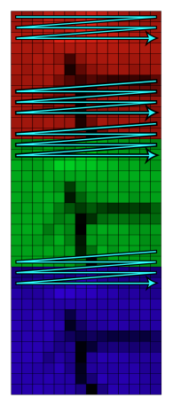
- **HSV:** hue (which color), saturation (how much color) & value (how bright)  
  makes recognizing colors much easier since hue remains same under varying lighting conditions  
  white if saturation zero (no color), black if value zero (zero brightness)  
  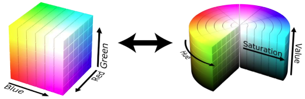  
  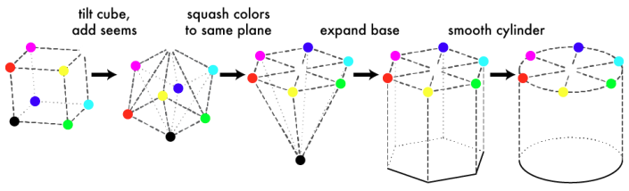
- **binary image:** obtained from grayscale image by thresholding (like histogram valley)  
  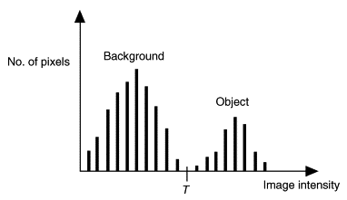

# histogram
- **histogram:** pixel intensities distribution
- **histogram equalization:** stretching its histogram to cover the full range of possible pixel values  
  improve image contrast to increase visual distinction between features  
  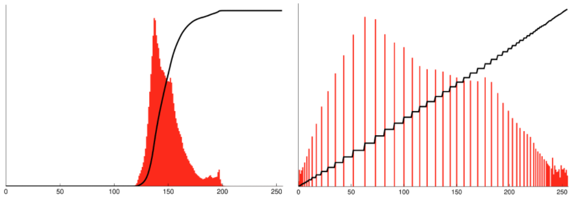
  - calculate histogram
  - compute cumulative distribution function (`<=` pixel frequencies cumulative sum)
  - normalize CDF array elements (between 0 & 1) by dividing by total num pixels
  - map pixel values by multiplying its corresponding CDF value with max possible pixel value (255)

# resizing
- **interpolation:** estimate values at unknown locations using known data  
  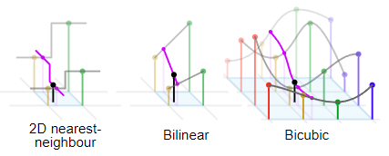
  - **nearest-neighbor:** pixel value of nearest neighbor
  - **bilinear:** weighted average of four nearest neigbhors  
    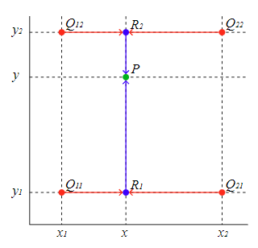  
    visually equal to sum of products of each corner & diagonally opposite partial area
    ```
    R1 = (x2 - x) * Q11 + (x - x1) * Q21
    R2 = (x2 - x) * Q12 + (x - x1) * Q22

    P = (y2 - y) * R1 + (y - y1) * R2
      = (y2 - y) * (x2 - x) * Q11 + (y2 - y) * (x - x1) * Q21 + (y - y1) * (x2 - x) * Q12 + (y - y1) * (x - x1) * Q22
      = Q11 * area(P, Q22) + Q21 * area(P, Q12) + Q12 * area(P, Q21) + Q22 * area(P, Q11)
    ```
- to map new image coordinates with original image coordinates
  ```
  width_scale = new_width / original_width
  height_scale = new_height / original_height

  original_x = new_x / width_scale
  original_y = new_y / height_scale
  ```

# filtering
- **convolution:** applying a kernel/filter to image  
  kernel slides over the image, multiplying pixels and summing the products  
  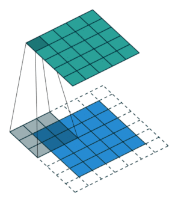
- mathematically convolution involves kernel flip  
  what is usually called convolution is correlation  
  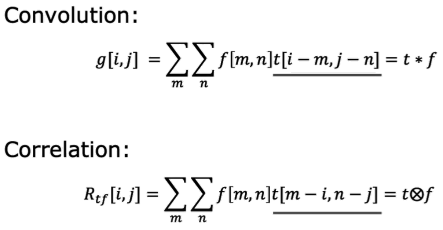
- **separable kernel:** seperate 2D kernel into vertical & horizonal 1D kernels  
  `k^2` ⟶ `2k` multiplications, `k^2 - 1` ⟶ `2(k - 1)` additions  
  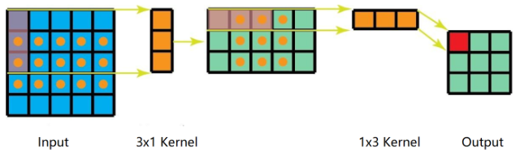
- **averaging (low pass) filters:** smooth out by replacing with average value of neighbor
  - **box/mean:** simple average
  - **gaussian:** weighted average with closer pixels weighted more (spatial weights)  
    smoother transitions so better edge preservation  
    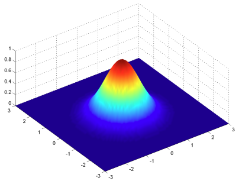
  - **binomial:** good & fast approximation to gaussian using pascal's triangle  
    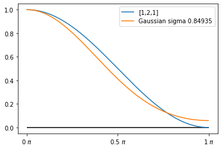  
    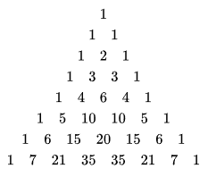
    ```
              [1]   [1 2 1]
    [1 2 1] * [2] = [2 4 2]
              [1]   [1 2 1]
    ```
- **edge (high pass) filters:** emphasize edges (rapid change in pixel intensities)  
  most semantic & shape info can be deduced from edges  
  smooth first to remove noise then derivative
  - **first derivative:**  
    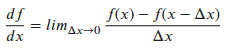  
    for pixels `∆x = 1` so filter is `[0 -1 1]` approxed to `[-1 0 1]`  
    need to run vertically & horizontally  
    edge pixels (local extrema) give very high ± response
    - **prewitt:** box * derivative
      ```
                 [1]   [-1 0 1]
      [-1 0 1] * [1] = [-1 0 1]   ⟶ horizontal
                 [1]   [-1 0 1]
      ```
    - **sobel:** gaussian * derivative  
      basically first derivative of gaussian  
      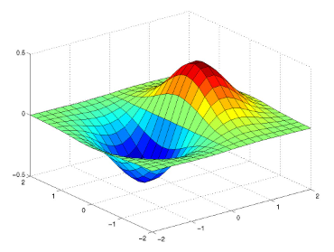
      ```
                 [1]   [-1 0 1]
      [-1 0 1] * [2] = [-2 0 2]
                 [1]   [-1 0 1]
      ```
  - **laplacian:** sum of second derivative wrt x & y  
    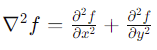  
    approximation of second derivative in one dimension  
    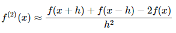  
    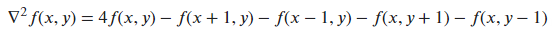  
    single pass but loses direction info  
    edge pixels (local maxima) give zero response
    ```
    [ 0 -1  0]
    [-1  4 -1]
    [ 0 -1  0]
    ```
    enhanced filter to include diagonal edges
    ```
    [-1 -4 -1]
    [-4 20 -4]
    [-1 -4 -1]
    ```
    laplacian of gaussian (LoG) to reduce noise  
    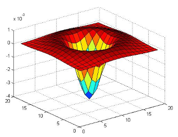  
    difference of gaussian (DoG) ia a good approximation to LoG  
    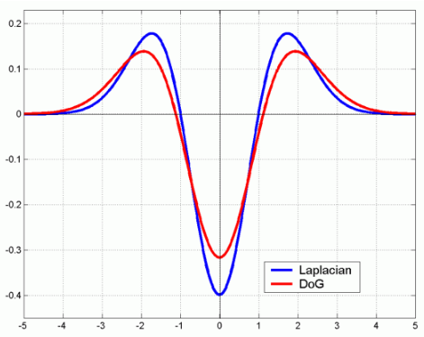  
    basically substracting two gaussian filters (band-pass filter) with different `σ`  
    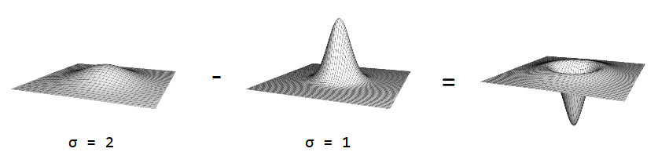
- **canny:** precise localization to single pixel, noise reduction by producing strong edges only, edge continuty even when gaps present
  - use sobel filter to smooth image and get gradient magnitude & direction
  - non-maximum suppression perpendicular to edge  
    thins down edge to single pixel
  - (hysteresis) thresholding edges into strong (`R > T`), weak (`> t` and `< T`), no edge (`< t`)
  - connect together strong edges, weak edges connected iff neighbor to strong
- **sharpen:** add edges to image (impulse/identity filter)
  ```
  [0 0 0]   [ 0 -1  0]   [ 0 -1  0]
  [0 1 0] + [-1  4 -1] = [-1  5 -1]
  [0 0 0]   [ 0 -1  0]   [ 0 -1  0]
  ```
- **non-linear filter:** cannot be implemented using convolution
  - **median:** to remove extreme outliers (like salt-pepper noise)
  - **bilateral:** gaussian blurs across edges so also add tonal weights (besides spatial)  
    pixel values similar to center pixel value weighted more  
    constantly changing filter that preserves edges while smoothing flat regions  
    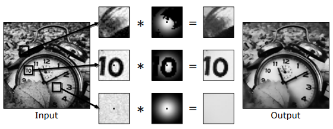

[continue]

- hough transform:

# feature matching
- **features:** unique highly descriptive region  
  useful for matching, recognition & detection
  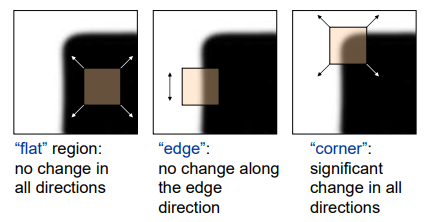  
  gradient distributions  
  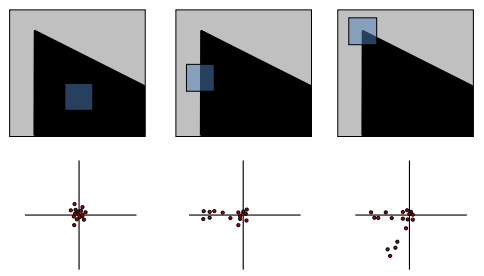
- **template matching:** finding parts of image that match template image  
  like searching for specific picture within larger one
  - **sum squared diff:** minimize `Σ(I(x + i, y + j) - T(x, y))^2`  
    slide template across image and sum squared differences between their pixel values
  - **normalized cross correlation:** 
    ```
    SSD = Σ(I(x + i, y + j) - T(x, y))^2  ⟵ minimize
        = Σ (I(x + i, y + j))^2 +  (T(x, y))^2 - 2 * I(x + i, y + j) * T(x, y)
    
    if SSD needs to be minimized, then negative last term need to bemaximized
    Σ I(x + i, y + j) * T(x, y)   ⟵ cross-correlation (maximize)
    ```
    but cross-correlation value high if (non-matching) image has high pixel intensities  
    so normalize it to make it insensitive to changes in brightness  
    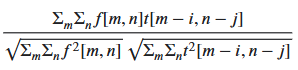
- **auto correlation:** `Σ(I(x,y) - I(x + i, y + j))^2`  
  measure similarity of image with its shifted version (self-difference) to get unique patch
- **orientation normalization:** align features by rotating image patch (used for descriptor) from dominant orientation (from histogram of pixel orientations) to (fixed) standard orientation

## harris corner detection
- **eigen vectors:** vector that when multiplied by matrix only changes in magnitude not direction (linear transformation)  
  **eigen value:** factor by which eigenvector scaled when multiplied by matrix
- **determinant:** scalar value from square matrix elements  
  **trace:** sum of principal diagonal elements
  ```
  A = [a b]
      [c d]
  
  det(A)   = (a * d) - (b * c)
  trace(A) = a + d
  ```
- **structure (or covariance) matrix:** approximate self-difference using (gaussian) weighted sum of nearby gradient info (`Ix` & `Iy` edge intensities)  
  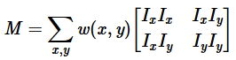
- eigen values (`λ1` & `λ2`) of structure matrix gives nearby gradient's distribution  
  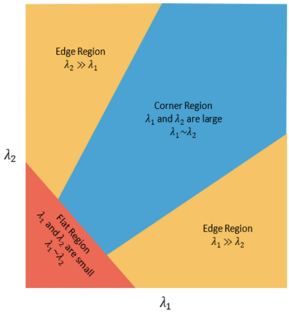
- **corner response function:** instead of calculating eigen values for every point, estimate them using  
  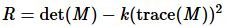  
  where `det(M) = λ1 * λ2` & `trace(M) = λ1 + λ2`
    - **flat region:** `|R| ≈ 0` if `λ1 ≈ λ2 ≈ 0`
    - **edge:** `R < 0` if `λ1 << λ2` or vice-versa
    - **corner:** `R >> 0` if `λ1 ≈ λ2 >> 0`

## histogram of gradients
- **histogram of gradients:** feature descriptor that captures distribution of edge orientations within a local region of an image  
  brightness-invariant since edges used instead of pixel intensities
  - compute gradient magnitude & orientation for each pixel
  - divide image into cells (8x8 pixels)
  - put pixels in bins (eight 45°) according to orientation  
    each pixel's contribution in histogram using its gradient magnitude  
    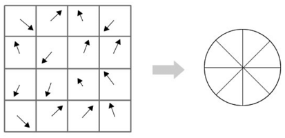
  - small individual cells sensitive to lighting  
    so group them into blocks (4x4 cells) and normalize their gradient (divide by root of sum of squares)
  - feature descriptor made up of array of cell histograms

## scale-invariant feature transform
- **scale-invariant feature transform:** detect & describe distinctive local features that remain stable under significant changes in scale  
  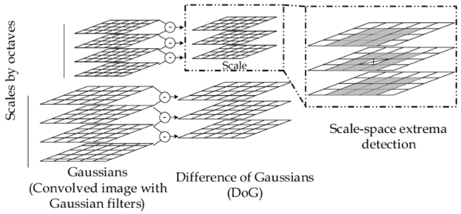
  - apply gaussian for different scales (`σ`) for multiple sets of octaves (downscaled image)
  - apply DoG to pairs of consecutive scales
  - keypoints are local extrema in both local & scale  
    so higher than eight neighbor and overlapping nine in above & below scales
  - rule out keypoints with weak corner response function
  - orientation normalization for keypoints

# image transforms
- once matching features between two images found, need to figure out transform between them  
  `p' = M * p` to map a given point `p` using transform `M` to new coordinate system
- 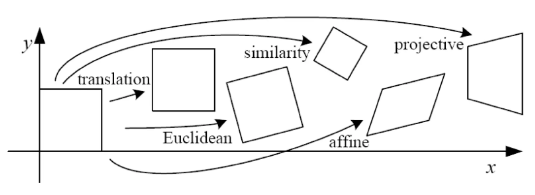

## affine
- **affine transfomations:** preserves parallel lines (& ratios of their lengths)
  - **scaling:**
    ```
    [x'] = [Sx 0 ] * [x]
    [y']   [ 0 Sy]   [y]

    p'   = [S]     * p
    ```
  - **translation:** can only add multiples of `x`/`y` but no way to add constant values  
    so augment vector `[x, y]` ⟶ `[x, y, 1]`, `p` ⟶ `p̄`
    ```
    [x'] = [1 0 Tx] * [x]
    [y']   [0 1 Ty]   [y]
                      [1]
    
    p'   = [I T]    * p̄   ⟵ I: identity matrix
    ```
  - **euclidean:** rotation + translation
    ```
    [x'] = [cos(θ) -sin(θ) Tx] * [x]
    [y']   [sin(θ)  cos(θ) Ty]   [y]
                                 [1]
    
    p'   = [R T]               * p̄
    ```
  - **similarity:** rotation + scaling + translation
    ```
    p'   = [S*R T]             * p̄
    ```
  - **shear:** displace each point in fixed direction by amount proportional to its from a given line
    ```
    [x'] = [1 h] * [x]
    [y']   [0 1]   [y]
    
    p'   = [R T] * p
    ```
- for combination just multiply them first (similar to kernels) then map  
  but all of them `2 x 3` matrix, so add extra `[0, 0, 1]` bottom row
  ```
  [x']   [a00 a01 a02]   [x]
  [y'] = [a10 a11 a12] * [y]
  [1 ]   [  0   0   1]   [1]
  ```
- (transform) matrix calculated by solving linear equations  
  for each match we get two equations
  ```
  x' = a00 * x + a01 * y + a02
  y' = a10 * x + a11 * y + a12
  ```
  for 6 unknowns (`a00` to `a12`) we need 3 matched points

## homography
- **homography/projective/perspective transformations:** map points from one image plane to another and preserves straight lines  
  to describe geometric relationship between two images of same scene (world plane) taken from different viewpoints  
  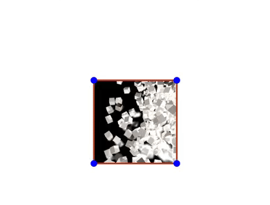
- either images from same camera at different angle  
  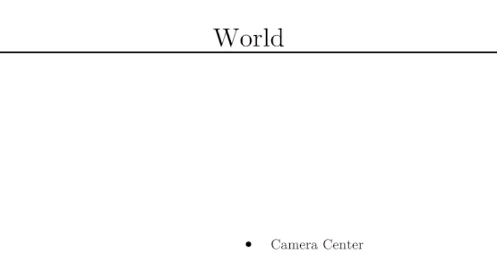  
  or same plane from different locations  
  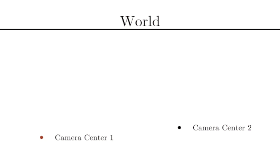
- **homography coordinates:** uses three coordinates to represent points in space  
  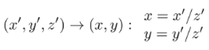  
  when `z' == 1` homography maps nicely to cartesian
- **homography matrix:** augment point to include third coordinate
  ```
      [x̃]
  p̃ = [ỹ]
      [w̃]

  [x̃'] = [h00 h01 h02]   [x̃]
  [ỹ']   [h10 h11 h12] * [ỹ]
  [w̃']   [h20 h21 h22]   [w̃]
  ```
  bottom row now not limited to `[0, 0, 1]`  
  to get actual final coordinates `x' = x̃' / w̃'`, 2D coordinate if `w̃ == 1`
- (transform) matrix calculated by solving linear equations  
  third coordinate scales transformed coordinates  
  so assume third coordinate as 1 (then `x = x̃`) and `h33` as 1
  ```
  [x'] = [h00 h01 h02]   [x]
  [y']   [h10 h11 h12] * [y]
  [1 ]   [h20 h21   1]   [1]
  ```
  we need 4 matched points for 8 unknowns (`h00` to `h21`)
  ```
  x' = (h00 * x + h01 * y + h02) / (h20 * x + h21 * y + 1)
  x' = (h10 * x + h11 * y + h12) / (h20 * x + h21 * y + 1)
  ```
- `h33 != 1` is rarein real world  
  even if it is wrong for matched feature pair, RANSAC will ignore that pair

## random sample consensus
- **random sample consensus (RANSAC):** estimating transform matrix in presence of outliers by randomly selecting minimal set of data points (4 matches for homography)  
  data points that fit well (within threshold) are considered inliers and matrix is refined using these inliers  
  process repeated multiple times and matrix with largest num inliers selected as final estimate
- **example: RANSAC line fitting:** green line is best fit yet  
  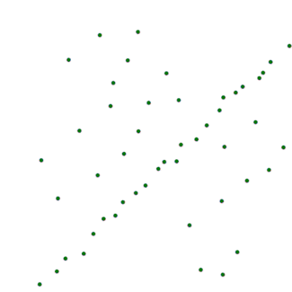
- to optimize iterations stop after "good-enough" inliers cutoff for best model is hit