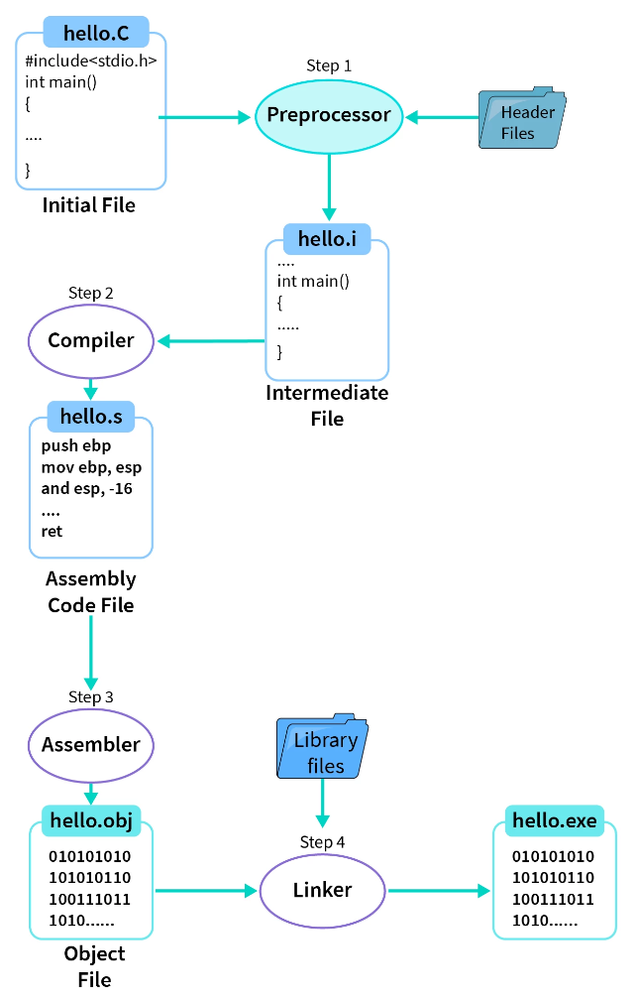
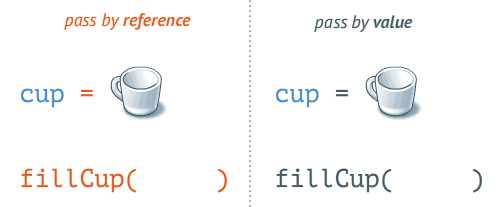
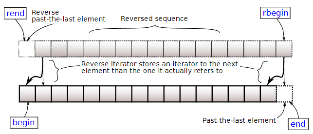
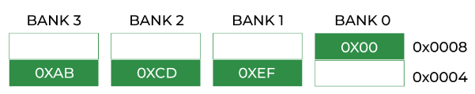
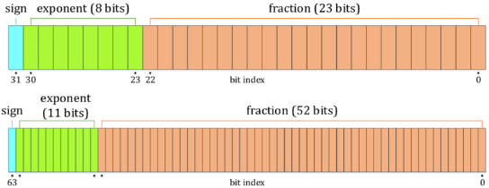
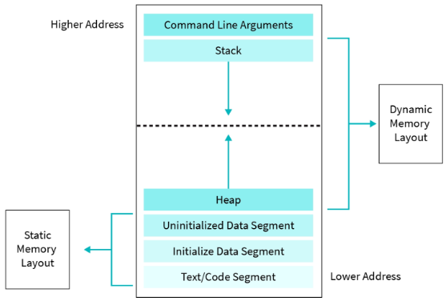
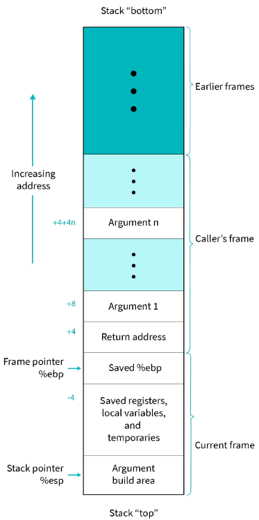

# C++
- [introduction](#introduction)
- [containers](#containers)
  - [sequence](#sequence)
  - [associative](#associative)
  - [unordered associative](#unordered-associative)
  - [container adaptors](#container-adaptors)
- [object oriented programming](#object-oriented-programming)
  - [encapsulation](#encapsulation)
  - [inheritance](#inheritance)
  - [polymorphism](#polymorphism)
- [file \& string stream](#file--string-stream)
- [memory](#memory)
- [pointers](#pointers)
- [templates](#templates)
- [error handling](#error-handling)
- [misc](#misc)
  - [cpp core guidelines](#cpp-core-guidelines)
  - [standard template library](#standard-template-library)

## links  <!-- omit from toc -->
- [[lectures] modern C++](https://www.ipb.uni-bonn.de/teaching/modern-cpp/)
- [compiler explorer](https://godbolt.org/)
- [spiral rule](https://riptutorial.com/c/example/18833/using-the-right-left-or-spiral-rule-to-decipher-c-declaration)
- [bit manipulation](https://www.hackerearth.com/practice/basic-programming/bit-manipulation/basics-of-bit-manipulation/tutorial/)
- [why avoid `goto`](https://smartbear.com/blog/goto-still-has-a-place-in-modern-programming-no-re/)
- [`++i` vs `i++`](https://stackoverflow.com/questions/24901/is-there-a-performance-difference-between-i-and-i-in-c)

## todo  <!-- omit from toc -->
- [cpp core guidelines](http://isocpp.github.io/CppCoreGuidelines/CppCoreGuidelines#main)
- [lost art of struct packing](http://www.catb.org/esr/structure-packing/)
- [memory order](https://en.cppreference.com/w/c/atomic/memory_order)
- [mix C & C++](https://isocpp.org/wiki/faq/mixing-c-and-cpp#:~:text=Just%20declare%20the%20C%20function,int)
- [structure packing](http://www.catb.org/esr/structure-packing/)
- [efficient c++](https://embeddedgurus.com/stack-overflow/category/efficient-cc/)
- template uses
- STL
- OOPs concepts
- [MSVC init memory](https://stackoverflow.com/questions/127386/what-are-the-debug-memory-fill-patterns-in-visual-studio-c-and-windows)
- atomics & memory ordering
- [templates FAQ](https://isocpp.org/wiki/faq/templates)
- why static initialized to 0
- double pointer access
- stack canary
- [copy-and-swap idiom](https://stackoverflow.com/questions/3279543/what-is-the-copy-and-swap-idiom) ([video](https://www.youtube.com/watch?v=7LxepUEcXA4))
- friend functions

## todo list  <!-- omit from toc -->
- Basics and Fundamentals:
  - Syntax and language features
  - Variables, data types, and type conversions
  - Control flow (if-else, loops, switch statements)
  - Functions and parameter passing
- Object-Oriented Programming (OOP):
  - Classes and objects
  - Inheritance, polymorphism, and encapsulation
  - Constructors and destructors
  - Overloading and overriding
- Standard Template Library (STL):
  - Containers (vectors, lists, sets, maps, etc.)
  - Iterators and algorithms (sorting, searching, etc.)
  - Smart pointers (unique_ptr, shared_ptr)
  - Exception handling
- Memory Management:
  - Stack vs. heap memory
  - Dynamic memory allocation (new, delete)
  - Memory leaks and resource management
  - RAII (Resource Acquisition Is Initialization)
- Operator Overloading:
  - Unary and binary operators
  - Assignment operators
  - Stream insertion and extraction operators
  - Comparison operators
- Templates and Generic Programming:
  - Function templates
  - Class templates
  - Template specialization
  - Template metaprogramming
- Advanced Concepts:
  - Lambdas and functional programming
  - Multithreading and concurrency
  - File I/O and streams
  - Exception safety and error handling

## introduction
- *within C++ there is a much smaller & cleaner language struggling to get out*
- **standard I/O channels:** are preconnected input & output communication channels between a computer program and its environment when it begins execution  
one input channel: standard input `cin` and two output channels: standard output (`cout`) & standard error (`cerr`)  
`stdin`, `stdout` & `stderr` streams are identified by the file descriptors 0, 1 & 2 in linux
  ```cpp
  // C++
  std::cout << "out log" << std::endl;  // endl: endline

  // C
  fprintf(stderr, "error log");
  ```
- **command line arguments:** to pass arguments define `main()` to receive number of arguments (`int argc`) & list of arguments (`char const *argv[]`)
  ```cpp
  // ./exe_main command line arguments

  int main(int argc, char const *argv[])
  {
      // argc == 4
      // argv[] == {"exe_main", "command", "line", "arguments"}
  }
  ```
- **compilation process:** transforms a human-readable code into a machine-readable format  

  - **preprocessor:** all statements beginning with `#` are processed  
  tasks include comments removal, file inclusion, macros expansion & conditional expansion
  - **compiler:** converts pre-processed intermediate file (`*.i`) into an assembly file (`*.s`) having low-level assembly instructions
  - **assembler:** converts assembly code into machine-readable object (binary/hex) code (`*.o`)
  - **linker:** combines the object files with other necessary libraries & modules (object files) to create an executable file (`*.exe/*.out`)  
  ensures that necessary functions & variables referenced from different modules are correctly connected
- **example: GCC compiler flags:** MSVC flags are similar but instead of `-` uses `/`
  ```sh
  -std=c++11        # set C++ standard
  -Wall             # all warnings
  -Wextra           # extra warnings
  -Werror           # treat warnings as errors
  -O<n>             # optimize for speed
  -Os               # optimize for size
  -Og               # optimize for debuggability
  -ftree-vectorize  # auto vectorization
  -g<n>             # keep debugging symbols
  -pg               # extra profile information (used for gprof)
  -l                # library name
  -L                # library search path
  -I                # include search path
  -D<flag>=<value>  # add preprocessor flag (with value if required)
  -fPIC             # position independent code (suitable for inclusion in shared libs)
                    # example: jumps will be relative instead of absolute
  -c                # compile but don't link
  -save-temps       # save intermediate source files
  ```
- **preprocessor:**
  ```cpp
  #pragma once    // include file only once

  __DATE__        // May 16 2022
  __TIME__        // 09:42:38
  __FILE__        // C:\workspace\code\src\main.cpp
  __LINE__        // 23

  #error message  // preproc error
  ```
  continuation (`\`), stringize (`#`) & token pasting (`##`) operators
  ```cpp
  #define macroFunc(a, b) printf("val"#a " : %d, val"#b " : %d\n", \
                                val##a, val##b)

  int main(void)
  {
      int val1 = 40;
      int val2 = 30;
      macroFunc(2, 1);  // val2 : 30, val1 : 40
      return 0;
  }
  ```
- **variable shadowing:** a variable declared in some specific scope takes precedence over a variable with the same name declared in an outer scope
- **`auto`:** is a placeholder type that will be replaced later by the compiler  
for a variable placeholder replaced typically by deduction from an initializer
  ```cpp
  auto var = 13;     // int
  auto var = 13.0f;  // float
  auto var = 13.0;   // double

  auto a = 0, b = 3.14;  // error: inconsistent types for a and b
  ```
- **`++i` vs `i++`:** post-increment could be slower since a copy of the old value copy needs to be saved for later use  
but modern compilers will optimize it if `i` is a basic data type (like `int`)  
if `i` is  a class then temp will involve calling a copy constructor which can be expensive
- **bitwise operators:** variants of AND (`&&`), OR (`||`) & NOT (`!`)
  ```
  A      = 0011 1100
  B      = 0000 1101
  -----------------
  A & B  = 0000 1100  AND
  A | B  = 0011 1101  OR
  A ^ B  = 0011 0001  XOR
  ~A     = 1100 0011  NOT
  A << 2 = 1111 0000  RSH
  A >> 2 = 0000 1111  LSH
  ```
- **example: XOR number swap:**
  ```cpp
  x = x ^ y;  // x == x ^ y
  y = x ^ y;  // y == (x ^ y) ^ y ⟶ (y ^ y) ^ x ⟶ 0 ^ x ⟶ x
  x = x ^ y;  // x == (x ^ y) ^ x ⟶ (x ^ x) ^ y ⟶ 0 ^ y ⟶ y
  ```
- **example: bit manipulation:**
  ```cpp
  #define setBit(num, idx)   (num |= (0x1 << idx))
  #define clearBit(num, idx) (num &= ~(0x1 << idx))
  #define flipBit(num, idx)  (num ^= (0x1 << idx))
  ```
- **example: check power of 2:** power-of-2 will have only one bit set and if one is subtracted all lower bits will be set then bitwise AND of these two should result in zero
  ```cpp
  // first part to check if number is zero
  return (x && !(x & (x - 1)));
  ```
- **example: count number of ones:** `n & (n-1)` will remove least significant 1 per iteration
  ```cpp
  while (n)  // run till n equals 0
  {
      n = n & (n - 1);
      count++;          
  }

  // n = 1010
  // 1010 & 1001 ⟶ 1000  second place 1 removed
  // 1000 & 0001 ⟶ 0     fourth place 1 removed
  ```
- use `for` when number of iterations are known else use `while` loop, it easy to form an infinite loop with `while`
- **ranged for loop:** more readable `for` loop for iterating over standard containers (using iterators internally)  
avoids mistakes with indices since container iterator used
  ```cpp
  std::vector<int> vec{0, 1, 5};

  // for (const type& value : container)
  for (const int& n : vec)  // for (int n : vec) if you want to modify
  {
      std::cout << n << " ";  // 0 1 5
  }
  ```
- **`break`:** exit enclosing loop  
**`continue`:** skip to next loop iteration
  ```cpp
  do
  {
      ...
      break;  // break without returning
      ...
  } while (0)
  ...
  return 0;
  ```
- **`goto`:** don't use it unless you want to break out of some complex code without returning because you need to run some cleanup code  
a good rule-of-thumb is to only jump forward & to the end of a block
  ```cpp
  int foo()
  {
      for (int i = 0; i < 100; i++)
      {
          for (int j = 0; j < 100; j++)
          {
              if (i * j > 1000)
              {
                  goto done;  // break out of both loops
              }
          }
      }

  done:
      cleanup();

      return 0;
  }
  ```
- **function overloading:** two or more functions can have the same name but with different parameters  
picked at compile-time based on arguments (return type plays no role)
  ```cpp
  void printSum(int a, int b);
  void printSum(double a, double b);
  ```
- **name mangling:** encoding of function/variable names so linker can separate common names due to overloading/namespaces  
  use `extern "C" { .... }` in C++ when declaring a function that was implemented/compiled in C (name mangling not done)
- **function argument passing:** use pass-by-reference (pointer or reference) to prevent copying of large objects, use `const` reference in function declaration to prevent modification as well  

- **default argument:** is a value provided in a function declaration (after mandatory arguments) that is automatically assigned by the compiler if the calling function doesn’t provide a value
  ```cpp
  int printSum(int a, int b, int c = 0, int d = 0);
  ```
- **`namespace`:** is a declarative region that provides a scope to the identifiers inside it, used to organize code into logical groups and to prevent name collisions, all identifiers at namespace scope are visible to one another without qualification  
don't add `using namespace std;` or `using std::cout;` in headers  
example: if client code has his own `cout` implementation this can lead to wrong function during overload (especially if arguments match)
- **library:** is a collection of pre-compiled code that can be re-used by programs
  - **static:** is linked directly into the final executable, fast but takes lot of space (`*.a` archive)
    ```sh
    ar rcs lib.a module1.o module2.o
    # rcs: replace, create, sort
    # c: create library
    # r: replace old files within library (if already exists)
    # s: create sorted index of library
    ```
  - **dynamic:** is linked but exists as a separate file that will be loaded at run-time, slower but can be copied (`*.so` shared object)
    ```sh
    gcc -c -fPIC main.c -o main.o
    gcc -shared main.o -o libmain.so
    ```

## containers
- **`iterator`:** used to point at the memory addresses of STL containers (similar to a pointer) which allows quick & efficient navigation through any STL container (even unordered ones)  

  ```cpp
  T::iterator itr = container.begin();

  T val = *itr;  // current element
  ++itr;         // increment iterator, now points to next element
  ```  

### sequence
- **sequence containers:** data structures that can be accessed sequentially (`O(n)`)
- **`string`:** sequences of characters, better than C-style arrays (which is faster) because this has dynamic size & useful member functions
  ```cpp
  #include <string>
  std::string str;                      // std::string str("hello world");

  +                                     // concatenate operator
  int pos          = str.find(substr);  // find substring pos
  bool is_empty    = str.empty();       // check empty
  int size         = str.size();        // size (doesn't include string end NULL character)
  const char *data = str.data();        // underlying NULL terminated C array, same as c_str()
  char c           = str.at(i);         // access with bounds checking, without check [i]
  str.clear();                          // clear string
  str.push_back(val);                   // add val char at the end, pop_back()
  str.reserve(size);                    // reserve size to prevent frequent memory-allocs
                                        // optional second arg for initializing new elements
  str.shrink_to_fit();                  // dealloc unused memory
  ```
- **`vector`:** dynamic contiguous (so cache-friendly) array
  ```cpp
  #include <vector>
  std::vector<T> vec;                   // std::vector<int> vec{1, 2, 3, 4};

  // empty, size, data, at(i), clear, push_back, reserve, shrink_to_fit
  ```
- **`array`:** static contiguous array
  ```cpp
  #include <array>
  std::array<T, size> arr;              // std::array<int, 4> arr{1, 2, 3, 4};

  arr.fill(value)                       // assign value to all elements
  // empty, size, data, at(i), clear
  ```
- **`deque`:** double-ended queue, basically a two-sided vector with non contiguous mem  
usually implemented as variable size array of fixed size arrays, this makes growing faster than a vector (which requires allocation & copying)
  ```cpp
  #include <deque>
  std::deque<T> dq;                     // std::deque<int> dq{1, 2, 3, 4};

  dq.push_front(val)                    // add element at beginning, popfront()
  // empty, size, at(i), clear, push_back, shrink_to_fit
  // size not provided
  ```

### associative
- **associative containers:** sorted data structures that can be quickly searched (`O(logn)`)
- **`pair`:** provides a way to store two heterogeneous objects as a single unit
  ```cpp
  #include <utility>
  std::pair<T1, T2> pr;                 // std::pair<int, string> pr(1, "hello");

  pr       = make_pair(val1, val2);     // create pair
  pr.first = val3;                      // modify first element, second
  ```
- **set:** collection of unique keys which is always sorted
  ```cpp
  #include <set>
  std::set<T> st;                       // std::set<T> st{1, 2, 3, 4};

  <posItr, bool> = st.insert(val);      // insert value if not exists
  posItr         = st.find(key);        // find element, (posItr == st.end()) if not present
  if (mp.count(key) > 0)                // number of matching keys (0/1 for set & map)
  // empty, size, clear
  ```
- **`map`:** collection of key-value pairs which is sorted by unique keys  
anything with a defined less-than operator (`<`) can be used as key
  ```cpp
  #include <map>
  std::map<keyT, valT> mp{{1, "hello"}, {2, "world"}};

  mp[key] = val;                        // assign (insert if not present)
  // empty, size, at(key), clear, insert(pair), find, count
  ```
- **`multiset` & `multimap`:** are same as set & map but keys are not unique (duplicates allowed), so `count(key)` can greater than 1  
  defined in same headers as set & map

### unordered associative
- **unordered associative containers:** unsorted  but hashed data structures that can be quickly searched (average `O(1)` but worst case `O(n)`)  
worst case if hash function is producing collision for every insertion into container
- **`unordered_set`, `unordered_map`, `unordered_multiset` & `unordered_multimap`:** same as ordered associate containers with headers: `#include <unordered_set>` & `#include <unordered_map>`

### container adaptors
- **container adaptors:** provide a different interface for sequential containers
- **`stack`:** deque wrapper with functionality of a LIFO data structure by forcing push/pop on one side only
  ```cpp
  #include <stack>
  std::stack<T> stk;                    // new dequeue created
  std::stack<T> stk(dq);                // copy existing deque data (copy constructor)

  T t = stk.top();                      // peek top
  stk.push(val);                        // add value to top of stack, pop()
                                        // pop() doesn't return value so store top() first
  // empty, size
  ```
- **`queue`:** deque wrapper with functionality of a FIFO data structure by forcing push one side and pop on other
  ```cpp
  #include <queue>
  std::queue<T> que;                    // new dequeue created
  std::queue<T> que(dq);                // copy existing deque data (copy constructor)

  T t = que.front();                    // first element, back()
  stk.push(val);                        // add value at the end, pop()
                                        // pop() doesn't return value so store front() first
  // empty, size
  ```
- **`priority_queue`:** vector wrapper which provides `O(1)` (top element) lookup at the expense of `O(logn)` insertion/extraction by taking more effort into how to insert new elements in the underlying vector  
stack & queue based on queue since growing is faster, priority queue uses vector because insertion into sorted vector (data shifts) is faster with contiguous memory (same cache line)
  ```cpp
  #include <queue>
  std::priority_queue<T> pq();          // new vector created & uses less<T> by default
  std::priority_queue<T> pq(compare, vec);  // copy existing vector data (copy constructor)
                                        // for compare function: std::less<T> (largest at top) or std::greater<T>

  // empty, size, top, push, pop
  // push will insert into sorted array
  ```

## object oriented programming
- - **object oriented programming:** bind together the data and the functions that operate on them so that no other part of the code can access this data except that function

### encapsulation
- **encapsulation:** binding together the data and the functions that manipulate them  
- **`class`:** is a user-defined data type which holds its own data & function members which can be accessed by creating an instance of that class (object), class is like a blueprint for an object  
use `this` as pointer to current object in class member functions  
pass arguments to parametrized constructor to help initialize the object, if constructor/destructor not defined explicitly then default ones (with no arguments) will be generated  
avoid setters instead set data in constructor
  ```cpp
  class someClass
  {
    public:
      someClass() {}   // constructor, atleast one, called upon object creation
      ~someClass() {}  // destructor, exactly one, called upon object destruction

      someClass(int a, int b) : num_a_(a), num_b_(b) {}  // member initializer list
      bool operator<(const someClass &other) {}          // operator overload (no space after operator keyword)
      someFunc() const {}                                // const correctness
      someFunc() {}                                      // function overload because const missing
                                                         // but const object reference will call const one
      static void someStaticFunc() {}                    // static member function
      static int some_num;                               // static member variable
      static int getNumA(){};                            // getter/accessor (setter/mutator)

    private:  // default access specifier
      int num_a_ = 0;
      int num_b_ = 0;

      friend class anotherClass;                // friend class
  };
  ```
- **class access specifiers/modifiers:** defines how the members (variables & functions/methods) of a class can be accessed
  - **`public`:** accessible outside the class
  - **`private`:** inaccessible outside the class
  - **`protected`:** inaccessible outside the class but can be accessed in inherited classes
- **why private default:** *it's better to be properly encapsulated and only open up the things that are needed, as opposed to having everything open by default and having to close it*  
keep data members hidden (private), user should be able to modify data only through provided public interfaces (functions)
- **resource acquisition is initialization (RAII):** resource acquisition (allocation) is done by the constructor while resource release (deallocation) is done by the destructor, holding a resource should be class-invariant and tied to object lifetime  
also known as scope-bound resource management
- **member initializer list:** to initialize members that cannot be set in body (like `const`) or to call non-default constructor for object members  
const members will be created by the time we reach the scope of the constructor(`{`)
  ```cpp
  class A
  {
    public:
      A() { x = 0; }
      A(int x_) { x = x_; }
      int x;
  };

  class B
  {
    public:
      B() { a.x = 3; }  // A() called first (initialization) then x set (assignment), easier to call a(3) directly
                        // what if default constructor allocated memory or opened files that you don't need
    private:
      A a;
  };
  ```
- **operator overloading:** provides the operator with a special meaning for a data type (like class), compile-time polymorphism (similar to function overloading)  
example: overload `+` operator in string class so that we can concatenate two strings by just using `+`  
example: overload arithmetic operators for complex numbers  
example: implement `<` operator to sort user defined aggregate types using `std::sort`
- **const correctness:** prevent const objects from getting mutated  
a const member function cannot modify the object (else compiler error), declare getters as const functions  
also helps compiler generate more efficient code since it knows the full intent and use of the variable/function
- **`static` variable:** exists once per class (not per object) and shared across all (base & derived class) objects, data allocated in class not in instances  
**`static` function:** doesn't need an object to call, pass object if you need to access private members  
both are only declared in class declaration so must be explicitly defined outside the class (in source file) using the scope resolution operator (`::`)  
example: count number of objects of a class
  ```cpp
  // header file declaration
  class someClass
  {
    public:
      someClass() { this->numInstances++; }
      static int numInstances;
      static void printInstances(void);
  };

  // source file definition
  int someClass::numInstances = 0;

  void someClass::printInstances(void)
  {
      std::cout << someClass::numInstances << std::endl;
  }

  // source file usage
  int main()
  {
      someClass a;
      someClass::printInstances();  // 1

      someClass b;
      someClass::printInstances();  // 2

      return 0;
  }
  ```
- **`friend` class:** can access private and protected members of other classes in which it is declared as a friend  
used when you don't want to expose getter/setters to everyone but just to a single class permitting the encapsulation to be wider than own class (private members) or derived class (protected members)  
  ```cpp
  class classB;  // forward declaration 

  class classA
  {
      friend class classB;  // error without forward declaration (classB undefined)

    private:
      int foo_;
  };

  class classB
  {
      int add(classA &a, classB &b) { return a.foo_ + b.bla_; }  // access classA private member

    private:
      int bla_;
  };
  ```
- **`struct`:** is a `class` where members are `public` by default (default `private` in class), use it as a simple data container  
**padding:** adds some empty bytes of memory to aligns members to natural (processor word size) address boundaries  
example: for accessing an entire word in a single cycle 32 bit processor's memory will be split into 4 banks  
if a struct has three `char`s followed by an `int` then without padding `int` would be split into two rows of the banks and processor needs 2 cycles to read it  
  
padding of larger structs also eliminates false sharing by putting each structure on its own cache line  
**packing:** prevent padding (`#pragma pack`), used when CPUs of different architecture need to access the same structure in memory or binary dump  
**bitfields:** specify the size (in bits) of the structure/union members, pointer is not possible since member sizes are (typically) smaller than granularity allowed by pointers (byte addressable)  
used to map hardware registers exposed to memory bit-by-bit
  ```cpp
  typedef struct
  {
      uint8_t a : 4;
      uint8_t b : 4;
  } two_nibbles;

  two_nibbles temp;
  temp.a = 5;
  temp.b = 17;
  printf("%u %u %u\n", sizeof(temp), temp.a, temp.b);    // 1 5 1 (b overflowed)
  ```
- **uniform initialization:** allows usage of a consistent syntax to initialize variables/objects ranging from primitive (built-in) types to aggregates (made up of primitives) by using `{}` to enclose initializer values  
doesn't allow narrowing as well `int i{1.2};` (throws error/warning) so can be used in member initializer list for argument type checking
  ```cpp
  int i;                  // uninitialized built-in type
  int j = 10;             // initialized built-in type
  int k(10);              // initialized built-in type
  int a[] = {1, 2, 3, 4}  // aggregate initialization
  someClass x1;           // default constructor
  someClass x2(1);        // parameterized constructor
  someClass x3 = 3;       // parameterized constructor with single argument
  someClass x4 = x3;      // copy constructor

  // uniform initialization
  int i{};             // initialized built-in type, equals to int i{0};
  int j{10};           // initialized built-in type
  int a[]{1, 2, 3, 4}  // aggregate initialization
  someClass x1{};      // default constructor
  someClass x2{1};     // parameterized constructor;
  someClass x4{x3};    // copy-constructor
  ```
  **braced initialization:** it isn't always necessary to define a constructor for a simple class/struct so objects can be initialized using uniform initialization
  ```cpp
  struct classA
  {
      int station_id;
      time_t time_set;
      double current_temp;
  };

  time_t time_to_set;
  classA cla{45978, time(&time_to_set), 28.9};  // member initialization in order of declaration
                                                // an empty brace initializer does value initialization = {0,0,0}
  ```
- **move semantics:** every expression is a lvalue (occupies memory so can be written on left of `=`) or a rvalue (everything else, explicitly defined using `&&`)  
rvalues denote temporary objects which are destroyed at the next semicolon  
**`std::move`:** converts lvalue to rvalue by moving resources (transferring ownership) from one object to another (instead of copying them) so don't access an already moved variable (undefined by cpp standard)
  ```cpp
    int a;                      // a lvalue
    int &a_ref = a;             // a_ref lvalue
    a          = 2 + 2;         // 2 + 2 rvalue
    int b      = a + 2;         // a + 2 rvalue
    int &&c    = std::move(a);  // c rvalue
  ```
  for primitive types move is implemented as a copy, for aggregates performance will be better than copying but worse than passing by reference  
  for a vector move is just equivalent to assigning some internal pointers
  ```cpp
  std::vector<std::string> vec;
  std::string str = "hello";      // temp variable
  vec.push_back(str);             // copy
  vec.push_back(std::move(str));  // move

  std::cout << str << std::endl;  // undefined, prints empty string in MSVC
  ```
- **copy constructor & assignment operator:** constructor called automatically when the object is copied and assignment operator when the object is assigned a new value from a lvalue  
assignment operator return reference to changed object
  ```cpp
  myClass(myClass &other) {}             // copy constructor
  myClass &operator=(myClass &other) {}  // copy assignment operator

  myClass a;      // default constructor
  myClass b(a);   // copy constructor
  myClass c = a;  // copy constructor
  a         = b;  // copy assignment operator
  ```
  **move constructor & assignment operator:** constructor called automatically when the object is moved and assignment operator when the object is assigned a new value from a rvalue  
  both are used to take ownership of another object's resources
  ```cpp
  myClass(myClass &&other) {}             // move constructor
  myClass &operator=(myClass &&other) {}  // move assignment operator

  myClass a;                 // default constructor
  myClass b(std::move(a));   // move constructor
  myClass c = std::move(b);  // move constructor
  a         = std::move(b);  // move assign operator
  ```
- **rule of all or nothing:** try to define none of the six special functions (destructor + constructor + copy/move constr/assignment op), if you must define one of them then define all  
if none defined then compiler generated `default` functions will be used (they may use shallow copy)
  ```cpp
  class myClass
  {
    public:
      myClass()                         = default;
      ~myClass()                        = default;
      myClass(myClass &&var)            = default;
      myClass(const myClass &var)       = default;
      myClass &operator=(myClass &&var) = default;
      myClass &operator=(myClass &var)  = default;
  };
  ```
- **`delete`:** to disable the usage of a class member function (mentioned in class declaration itself), calling such functions lead to compilation error
  ```cpp
  class someClass
  {
    public:
      int someFunc(int num) {}
      int someFunc(double num) = delete;  // without this, someFunc accepts double by converting it to int
  };
  ```
  example: disable copy constructors when only ones instance of the class must be guaranteed  
  example: if a class has a constant data member then compiler marks copy/move constructor/assignment operator as deleted

### inheritance
- **inheritance:** is the capability of a class (child) to inherit/derive data & functions from other classes (parent)  
six special functions & private members are not inherited from base/parent class
  ```cpp
  class rectangleClass
  {
    public:
      rectangleClass(int w, int h) : width_(w), height_(h) {}

    protected:
      int width_;
      int height_;
  };

  class squareClass : public rectangleClass  // default private
  {
    public:
      squareClass(int size) : rectangleClass(size, size) {}
  };
  ```
- **inheritance modes:**
  - **`public`:** both (base public & protected members) maintain their access specifier
  - **`protected`:** both will be protected in derived class
  - **`private`:** both will be private in derived class
- **composition:** combining simpler objects to make more complex ones  
inheritance is `is a` relationship, example: square is a rectangle  
composition is `has a` relationship, example: car has a wheel (& other objects)

### polymorphism
- **function overriding:** if a function (not data) is `virtual` in base class then it can be overridden in derived class  
same function prototype in both base & derived classes, so compiler needs to check which function needs to be called in a virtual table (costs extra cycles)  
basically base class member function shadowing
  ```cpp
  class baseClass
  {
  public:
      void print1()
      {
          std::cout << "print1 baseClass" << std::endl;
          this->print2();
      }

      virtual void print2() { std::cout << "print2 baseClass" << std::endl; }
  };

  class derivedClass : public baseClass
  {
  public:
      void print2() override { std::cout << "print2 derivedClass" << std::endl; }
      // c11:     void print2() override {}
      // older:   virtual void print2() {}
  };

  int main()
  {
      derivedClass b;
      b.print1();    // print1 baseClass
      b.print2();    // print2 derivedClass
                     // but without virtual: print2 baseClass
      return 0;
  }
  ```
  **pure virtual function:** base class (with no function implementation) can force all derived classes to override a function by making it pure virtual
  ```cpp
  virtual myFunc() = 0;
  ```
  **abstract class:** class that has at-least one pure virtual function, cannot create object of this class  
  **interface:** special abstract class with only pure virtual functions & no data members
- **overloading vs overriding:** overloading is picking from all function with same name but different arguments at compile-time  
overriding is picking from functions with the same name & arguments in different class of same class hierarchy at run-time
- **polymorphism:** ability to present same interface for differing underlying implementations, inherited classes may have different functionality but share a common interface
  - **compile-time:** function & operator overloading
  - **run-time:** function overriding, used for generic class references
    ```cpp
    derivedClass1 a;
    derivedClass2 b;
    baseClass& c = a;    // can be generic reference for derivedClass1 or derivedClass2
    ```

## file & string stream
- **fstream:** read/write file
  ```cpp
  #include <fstream>
  std::fstream file(string& filename, Mode std::ios_base::mode);
  ```
  ```cpp
  // modes
  in        // for reading
  out       // for writing
  binary    // in binary mode
  app       // append output
  ate       // seek to EOF when opened
  trunc     // overwrite existing file
  ```
  **`ifstream`:** file stream with default mode `in`  
**`ofstream`:** file stream with default mode `out`
- **example: read line by line:**
  ```cpp
  while (getline(ifstream, string))
  {
      // process line
  }
  ```
- **example: write binary data:**
  ```cpp
  std::ofstream output_file("output.bin", ios_base::out | ios_base::binary);
  output_file.write(reinterpret_cast<char*>(data), sizeof(data));
  ```
- **example: read regular columns:** every line should have same number of columns
  ```cpp
  // 1   one     0.1
  // 2   two     0.2
  // 3   three   0.3

  int a;
  string b;
  float c;

  std::ifstream input_file("input_data.txt", ios_base::in);

  while (input_file >> a >> b >> c)    // read values
  {
      std::cout << a << b << c << std::endl;    // print values in same order
  }
  ```
- **sstream:** allows a string to be treated like a stream
  ```cpp
  #include <sstream>

  // create string
  std::stringstream out_sstream;
  out_sstream << "pi " << 3.14;
  std::string str_out = out_sstream.str();
  std::cout << str_out << std::endl;    // pi 3.14

  // reset sstream string
  out_sstream.str("");

  // parse string
  std::stringstream in_sstream(str_out);
  std::string str;
  float val;
  in_sstream >> str >> val;    // str: "pi" & val: 3.14
  ```

## memory
- **type qualifiers:**
  - **const:** object/variable is not modifiable, compiler guards it from any changes  
  initialize variables with const if you don't expect them to be modified (like in ranged for loop)
  - **volatile:** value might be changed by something beyond the program (so not cached)  
  use `const volatile` for read-only status register
  - **restrict:** optimization hint to compiler that during its lifetime no other pointer will be used to access the same memory  
  not part of C++ standard but most compilers support it
  - **atomic:** read-modify-write operators guaranteed in single instruction, free from data races
    ```cpp
    #include <iostream>
    #include <sstream>
    #ifdef __STDC_NO_ATOMICS__
        #error no atomics
    #endif

    _Atomic const int *p1;     // pointer to atomic const int
    const atomic_int *p2;      // same
    const _Atomic(int) *p3;    // same
    ```
- **storage class specifier:**
  - **auto:** default
  - **register:** hint to compiler to place it in processor's register
  - **static:** local static variable keeps its value between invocations, global static variable/function local to translation unit (but prefer)
  - **extern:** used for external linkages, only mention specifier for declaration & keep it in a header, cross checking takes place between translation units
    ```cpp
    // header.h
    extern int g_val;
    extern int increment(void);

    // source1.c
    #include "header.h"
    int g_val = 77;
    int increment(void) { return (++g_val); }

    // source2.c
    #include "header.h"
    printf("%d\n", g_val);          // 77
    printf("%d\n", increment());    // 78
    ```
  - **mutable:** C++ only, to allow a particular data member of const object to be modified, example: mutexes
- **1s complement:** invert all bits  
**2s complement:** add 1 to 1s complement
  ```cpp
  00011001    //  25
  11100110    //     (1s complement)
  11100111    // -25 (2s complement)
  ```
- **integer representation:** negative numbers stored as 2s complement  
**signed:** `-2^(n-1)` to `2^(n-1) - 1`  
**unsigned:** `0` to `2^(n) - 1`  
**integer promotion:** `signed` promoted to `unsigned` when mixed
  ```cpp
  unsigned int a = 6;
  int b = -20;
  (a + b > 6) ? printf(">6") : printf("<=6");    // >6
  ```
  **sign extension:** preserving sign while increasing number of bits of a binary number
  ```cpp
  1001 0110              //  8 bit (-106)
  1111 1111 1001 0110    // 16 bit (-106)
  ```
  both `128` & `-128` have same 8-bit 2s complement (`10000000`), so `-128` assumed since all bit-patterns with MSB (sign bit) set are negative
- **float representation (IEEE 754):** single precision `1 + 8 + 23`, double precision `1 + 1 + 53`  

  ```cpp
  263.3                             // floating number
  100000111.0100110011...           // binary
  1.000001110100110011... x 2^8     // scientific notation, true_exponent = 8
                                    // 1 is invisible leading bit
  sign = 0
  exp = 8 + 127 = 10000111          // exponent = true_exponent + bias
                                    // bias = 2^(exp_bits-1)-1
  mant = 00000111010011001100110    // bits after leading bit

  0 10000111 00000111010011001100110
  ```
- **endianness:** order in which a sequence of bytes is stored in computer memory
  ```cpp
  value:          0x12345678
  big endian:     12, 34, 56, 78  // big end (most significant byte) data first (smallest address)
  little endian:  78, 56, 34, 12  // little end (least significant byte) data first (smallest address)
  ```
  **find endianness of system:**
  ```cpp
  int n = 1;
  if (*(char *)&n == 1)  // check most significant byte set
  {
      std::cout << "little endian" << std::endl;
  }
  ```
  **swap endianness:**
  ```cpp
  uint32_t num = 9;
  uint32_t b0, b1, b2, b3;
  uint32_t res;

  b0 = (num & 0x000000ff) << 24u;
  b1 = (num & 0x0000ff00) << 8u;
  b2 = (num & 0x00ff0000) >> 8u;
  b3 = (num & 0xff000000) >> 24u;

  res = b0 | b1 | b2 | b3;
  ```
- **memory layout:** each of the six different segments stores different parts of code and have their own read & write permissions  

  - **text:** read only instructions  
  `.rodata` read only const global data
  - **data:** initialized `global` & `static` variables (but `static` functions will be in text section)
  - **bss (b​lock started by symbol):** uninitialized `global` & `static` variables, only size mentioned in executable, allocated after program load and initialized with 0 after allocation
  - **heap:** dynamically allocated during runtime, `std::bad_alloc` error if out of heap  
  **memory leak:** heap not dealloced or address lost (pointer reassigned)  
  **dangling pointer:** pointing to dealloced memory  
  **wild pointer:** pointing to random address
    ```cpp
    float* f_ptr = new float[num];    // allocate array
    delete[] f_ptr;                   // delete array
    ```
  - **stack:** simple last-in-first-out (LIFO) structure that stores local variables, function arguments & inheritance virtual function table  
  **stack pointer:** keeps track of top of the stack  
  **stack overflow:** program attempts to use more memory than is available on stack, usually due to deep/infinite recursion leading to stack shortage  
  **stack frame:** function data (return addr, args, local vars) pushed onto stack  
  example: on ARM first 4 args stored `r0` to `r3`  
  `ebp` (frame pointer) is used to backup `esp` (stack pointer), while `esp` is being modified by the current function  
  
- **segmentation fault:** occurs when a program attempts to access a memory location it does not have permission to access or access differently than it is supposed to (like write to read-only location)
- **shallow copying:** just copy pointer not the underlying data (used in default copy constructor/assignment operator)  
can lead to dangling pointer when object shallow copied  
**deep copying:** create new pointers and copy data into it

## pointers
- **reference:** is an alias (alternative name) for an existing variable declared using `&`  
whatever happens to a reference happens to variable & vice-versa, yields performance gain as references avoid copying data
- **pointer vs reference:**
  - own memory vs alias
  - no init required vs init in declaration
  - can reassign vs cannot
  - can be NULL vs cannot
  - indirection (levels of pointers) vs single level
  - can apply arithmetic operations vs cannot
  - can store in vector/array vs cannot
- **arrow operator:** `obj->myFunc()` is same as `(*obj).myFunc()`
- **pointer polymorphism:** used for strategy pattern
  ```cpp
  derivedClass a;
  baseClass *b = &a;
  ```
- **const pointers:**
  ```cpp
  // read right to left
  const int *         // pointer to int that is const
  int *const          // const pointer to int
  const int *const    // const pointer to int that is const
  ```
- **smart pointer:** wrapper class over a raw pointer that owns heap memory and manages its lifetime, when the object is destroyed it frees the memory as well
  ```cpp
  #include <memory>
  sPtr.get();    // get raw pointer
  ```
  - **unique:** can be moved but cannot be copied, memory always owned by single unique pointer
    ```cpp
    auto uPtr = std::unique_ptr<myType>(new myType);          // default constructor
    auto uPtr = std::unique_ptr<myType>(new myType(args));    // custom constructor
    auto uPtr = std::make_unique<myType>(args);               // C++14
    ```
  - **shared:** `std::shared_ptr`, can be copied, `usage_count` incremented/decremented when copied/destructed, memory freed when `usage_count == 0`
    ```cpp
    auto sPtr = std::shared_ptr<myType>(new myType);          // default constructor
    auto sPtr = std::shared_ptr<myType>(new myType(args));    // custom constructor
    auto sPtr = std::make_shared<myType>(args);               // C++11
    sPtr.use_count();                                         // return usage_count
    sPtr.reset(ptr);                                          // decrease usage_count
    ```
    ```cpp
    class A
    {
    public:
        A(int a) { std ::cout << "alive" << std::endl; }
        ~A() { std ::cout << "dead" << std::endl; }
    };

    int main()
    {
        // equivalent to std::shared_ptr<A>(new A(10));
        auto a_ptr = std ::make_shared<A>(10);              // alive
        std ::cout << a_ptr.use_count() << std ::endl;      // 1
        {
            auto b_ptr = a_ptr;                             // alive
            std ::cout << a_ptr.use_count() << std ::endl;  // 2
        }
        std ::cout << "main scope\n";
        std ::cout << a_ptr.use_count() << std ::endl;      // 1

        return 0;                                           // dead
    }
    ```
- **example: smart pointer with local variable:** both stack & smart pointer will try to dealloc that memory leading to error
  ```cpp
      int a = 0;
      auto a_ptr = std ::unique_ptr<int>(&a);
      return 0;    // *** Error in `file ': free (): invalid pointer: 0 x00007fff30a9a7bc ***
  ```
- **example: smart pointer polymorphism:** good way of using smart pointer
  ```cpp
  std::vector<unique_ptr<baseClass>> vec;

  // first method: "new derivedClass" passed to constructor of unique_ptr
  vec.push_back(new derivedClass);

  // second method: need to move (default is copy)
  auto var = unique_ptr<derivedClass>(new derivedClass);
  vec.push_back(std::move(var));

  return 0;    // both dealloced
  ```
- **type casting:** converting expression of given type into another type
  - **implicit:** change types without changing the value, happens automatically, lower data type converted to higher type
    ```cpp
    short a = 1024;
    int b = 5;
    b = a;    // implicit conversion
    ```
  - **explicit:** force type conversion, two types
    ```cpp
    float a = 1.2;
    int b = (int)a + 1;    // C-like notation explicit conversion
    int c = int(a) + 1;    // functional C-like explicit conversion
    ```
    ```cpp
    unsigned char u = (unsigned char)(-9);    // same bit pattern (2s complement), 247
    ```
- **type casting operators:**
  ```cpp
    // newType new_var = static_cast<newType>(var);
    static_cast         // compile-time implicit conversion
    const_cast          // remove const from const ref of non-const variable
    reinterpret_cast    // reinterpret bytes of one type as another type
    dynamic_cast        // runtime conversion of derivedClass pointer to baseClass pointer, nullptr if failed
    ```
- **function pointer:** stores the address of a function
  ```cpp
  int foo(int);       // function
  int *foo(int);      // function returning int*
  int (*foo)(int);    // function pointer, by changing precedence using ()
  ```
  ```cpp
  int foo(int arg)
  {
      printf("foo %d\n", arg);

      return arg;
  }

  int main()
  {
      int (*func_ptr)(int);
      func_ptr = &foo;
      int ret = (*func_ptr)(10);    // foo 10

      // OR
      func_ptr = foo;
      int ret = func_ptr(20);       // foo 20

      printf("ret %d\n", ret);      // ret 20

      return 0;
  }
  ```
- **spiral/right-left rule:**
  ```
  read these symbols as:
  *          pointer of                      - always on left side
  []         array of                        - always on right side
  ()         function returning/expecting    - always on right side

  step1: find the identifier, this is the starting point
  step2: look at symbols on the right of identifier, continue until you run out of symbols or hit `)`
  step3: look at the symbols to the left of identifier, continue until you run out of symbols ot hit `(`
  step4: repeat step 2 & 3 still complete declaration is formed
  ```
  ```cpp
  int *p[];

  int *p[];            // step1
      ^                // p is

  int *p[];            // step2, cant move right
        ^^             // p is array of

  int *p[];            // step3
      ^                // p is array of pointer to

  int *p[];            // step3
  ^^^                  // p is array of pointer to int
  ```
  ```cpp
  int *(*func())();

  int *(*func())();    // step1
         ^^^^          // func is

  int *(*func())();    // step2, cant move right
             ^^        // func is function returning

  int *(*func())();    // step3, cant move left
        ^              // func is function returning pointer to

  int *(*func())();    // step2, cant move right
                ^^     // func is function returning pointer to function returning

  int *(*func())();    // step3
      ^                // func is function returning pointer to function returning pointer to

  int *(*func())();    // step3
  ^^^                  // func is function returning pointer to function returning pointer to int
  ```
  ```cpp
  int (*(*foo)(char*,double))[9][20];

  // without arguments or array sizes
  int (*(*foo)())[][];

  // foo is pointer to function expecting (char*, double) and 
  // returning pointer to 2D array (size 9X20) of int
  ```
  ```cpp
  int i;             // an int
  int *p;            // an int pointer (ptr to an int)
  int a[];           // an array of ints
  int f();           // a function returning an int
  int **pp;          // a pointer to an int pointer (ptr to a ptr to an int)
  int (*pa)[];       // a pointer to an array of ints
  int (*pf)();       // a pointer to a function returning an int
  int *ap[];         // an array of int pointers (array of ptrs to ints)
  int aa[][];        // an array of arrays of ints
  int *fp();         // a function returning an int pointer
  int ***ppp;        // a pointer to a pointer to an int pointer
  int (**ppa)[];     // a pointer to a pointer to an array of ints
  int (**ppf)();     // a pointer to a pointer to a function returning an int
  int *(*pap)[];     // a pointer to an array of int pointers
  int (*paa)[][];    // a pointer to an array of arrays of ints
  int *(*pfp)();     // a pointer to a function returning an int pointer
  int **app[];       // an array of pointers to int pointers
  int (*apa[])[];    // an array of pointers to arrays of ints
  int (*apf[])();    // an array of pointers to functions returning an int
  int *aap[][];      // an array of arrays of int pointers
  int aaa[][][];     // an array of arrays of arrays of int
  int **fpp();       // a function returning a pointer to an int pointer
  int (*fpa())[];    // a function returning a pointer to an array of ints
  int (*fpf())();    // a function returning a pointer to a function returning an int
  ```

## templates
- **generic programming:** separate algorithms from data type
- **templates:** compile-time type-independent/generic algorithms (`<T>` macro expanded), no definition till expansion is done (else linker error)  
**template function:** can use any type that is copy constructable, assignable & defined by the time template compiled (custom classes)
  ```cpp
  template <typename T>    // can use typename or class keyword
  T func1(const T &arg1)
  {
  }

  func(10);       // type inferred by compiler
  func<int>();    // explicit type (in case data type cannot be determined by compiler)
  ```
  **template class:** used for meta programming (programs that modify programs), compiler generates objects based on types we passed
  ```cpp
  template <typename T>
  class myClass
  {
  public:
      myClass(const T &var) : var_(var){};

  private:
      T var_;
  }

  myClass<int> my_object(10);
  ```
- **specialization:** different template function/class implementation for a specific type
  ```cpp
  template <typename T>    // generic
  T func()
  {
  }

  template <>              // specialized
  int func()
  {
  }

  func<int>();             // specialized
  func<double>();          // generic
  ```
- **where to keep template:** a template is a pattern that the compiler uses to generate a family of classes or functions, so for the compiler to generate the code it must see both the template definition (not just declaration) and the specific types/whatever used to fill-in the template, so keep declaration & definition in a header & include it

## error handling
- **exception:** thrown when there is an error, constructor of exception receives a string error message, use `what()` to get exception string
  - `logic_error`
  - `invalid_argument`
  - `domain_error`: not defined for certain domain
  - `length_error`: exceeds max size
  - `out_of_range`: access out of bounds
  - `runtime_error`
  - `range_error`: requested operation doesn't make mathematical sense in the domain considered, example: `sqrqt(negative_number)` in real domain
  - `overflow_error`/`underflow_error`: result exceeds capacity of underlying type
- `try` ⟶ `throw` ⟶ `catch`
  ```cpp
  #include <stdexcept>

  void someFunc(void)
  {
      if (badEvent)
      {
          string msg = "error string";
          throw runtime_error(msg);
      }
  }

  try
  {
      x = someFunc(a, b, c);  // throws exception
  }
  catch (runtime_error &exp)
  {
      cerr << "runtime error: " << exp.what() << endl;
  }
  catch (logic_error &exp)
  {
      cerr << "logic error: " << exp.what() << endl;
  }
  catch (exception &exp)  // generic
  {
      cerr << "some exception: " << exp.what() << endl;
  }
  catch (...)  // catch everything
  {
      cerr << "unknown exception" << endl;
  }
  ```

## misc
- **using:** create type aliases, `using newType = oldType;`, similar to `typedef`, creates local alias if used within function scope
  ```cpp
  using image3f = image<float, 3>;
  using vector3d = double[3];  // not possible using `typedef`
  ```
- **why typedef over macro:**
  ```cpp
  #define type1 struct s *
  typedef struct s *type2;

  type1 a, b;  // "a" pointer-to struct but "b" just struct
  type2 c, d;  // both "c" & "d" pointer
  ```
- **maximum munch rule:** compiler bites off biggest legal chunk
  ```cpp
  c = a+++b;  // a++ + b
  ```
- **format specifiers:**
  ```cpp
  %c  // char
  %s  // string
  %i  // int
  %u  // uint
  %o  // unsigned octal
  %x  // unsigned hex
  %e  // exponent notation
  %f  // float
  %g  // selects shorter of %f & %e, no trailing 0s
  %p  // pointer
  ```
- **data type constants**
  ```cpp
  0x  // hex
  0   // oct
  U   // uint
  L   // long int, UL
  LL  // long long int, ULL
  F   // float
  ```
- **enum:** assign names to integral constants, by default starts with 0
  - **unscoped:** can implicitly convert
  - **scoped:** implicit conversion leads to error, use `static_cast` if required
  ```cpp
  enum uFoo  // unscoped
  {
      a,
      b,
      c = 1,
      d = b + c
  };

  enum class sFoo  // scoped
  {
      a,
      b,
      c = 1,
      d = b + c
  };

  int enumValue = uFoo::a;  // implicit conversion
  int enumValue = sFoo::a;  // error
  ```
- **union:** different variables of different types in same memory location  
use when member variables are used in either-or but never both fashion
  ```cpp
  union unn
  {
      int i;
      char c;
  };
  ```
- **typedef struct:**
  ```cpp
  typedef struct S_
  {
      int x;
  } S;

  // same as
  struct S_
  {
      int x;
  };
  typedef struct S_ S;
  ```
- **nested struct/union:**
  ```cpp
  typedef struct image
  {
      struct coordinate
      {
          int x;
          int y;
      };
      struct coordinate pos;
  } image;
  ```
- **lambdas:** function declared without name
  ```cpp
  auto plus_one = [](const int value) { return value + 1; };
  ```
- **functor** class that acts like a function, done by overloading `operator ()`
  ```cpp
  struct plusOne
  {
      int operator()(const int value) const { return value + 1; }
  };

  int main()
  {
      plusOne plus_one;
      assert(plus_one(2) == 3);

      return 0;
  }
  ```

### cpp core guidelines
- **basics:**
  ```cpp
  int some_random_var;  // snake case
  int some-random-var;  // kebab case
  int someRandomVar;    // camel case
  int SomeRandomVar;    // pascal case
  ```
- **naming:**
  ```cpp
  // snake_case: variables
  int some_var;
  // CAPITALIZED_SNAKE_CASE: constants & macros
  const int SOME_CONSTANT_VAR = 10;
  // camelCase: functions & classes
  int someFunction(void);
  ```

### standard template library
- STL
  ```cpp
  #include <algorithm>
  flag = std::all_of(startItr, endItr, boolFunc);      // all_of, any_of, none_of
  std::for_each(startItr, endItr, func);               // for_each
  itr = std::find(startItr, endItr, val_or_boolFunc);  // find
  std::fill(startItr, endItr, value);                  // fill
  std::generate(startItr, endItr, func);               // generate
  std::replace(startItr, endItr, old_val, new_val);    // replace
  std::rotate(startItr, new_startItr, endItr);         // rotate
  std::sort(startItr, endItr, operator);               // default std::less<T>, greater<>
  std::reverse(startItr, endItr);                      // reverse
  float sum = std::accumulate(startItr, endItr, initValue, operation); // default: std::plus<T>, (minus, multiplies, divides, modulus)

  #include <stdio.h>
  FILE *fp;
  fp = fopen("filename", "mode");  // r, rb, w, wb, a, ab
  fprintf(fp, char *....);
  fwrite(ptr, size, num_mem, fp);  // fread
  fclose(fp);
  getchar();

  #include <stdlib.h>
  ptr = malloc(size);  // malloc(0) valid pointer, implementation defined
  ptr = calloc(num_mem, size);
  ptr = realloc(ptr, newSize);
  free(ptr);
  abs(val);
  atoi(str);           // string to int
  assert(expr);        // assert if expr false

  #include <string.h>
  size = strlen(string);  // size excluding NULL (\0)
  memcpy(dst, src, size);
  memset(ptr, val, size);

  #include <math.h>
  ceil(num);
  floor(num);
  fabs(num);
  pow(num, power);
  sqrt(num);

  #include <unistd.h>
  sleep(numSeconds);  // usleep(numUSeconds)

  #include <time.h>
  clock_t t;
  t = clock();
  ...
  t = clock() - t;
  double time_taken = ((double)t) / CLOCKS_PER_SEC;
  ```