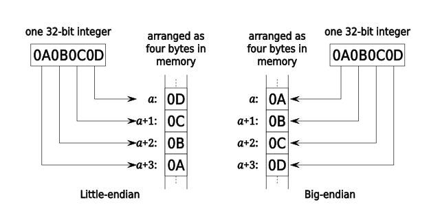
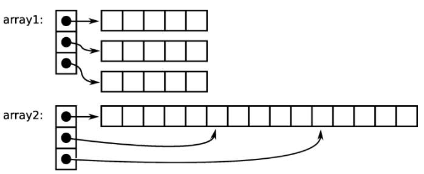
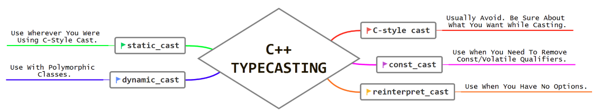

- [introduction](#introduction)
- [encapsulation](#encapsulation)
- [inheritance](#inheritance)
- [polymorphism](#polymorphism)
- [streams](#streams)
- [memory](#memory)
- [pointers](#pointers)
- [smart pointers](#smart-pointers)
- [templates](#templates)
- [exceptions](#exceptions)
- [misc](#misc)
- [STL containers](#stl-containers)
- [STL functions](#stl-functions)

# links  <!-- omit from toc -->
- [[playlist] modern C++](https://www.ipb.uni-bonn.de/teaching/modern-cpp/)
- [compiler explorer](https://godbolt.org/)
- [spiral rule](https://riptutorial.com/c/example/18833/using-the-right-left-or-spiral-rule-to-decipher-c-declaration)
- [bit manipulation](https://www.hackerearth.com/practice/basic-programming/bit-manipulation/basics-of-bit-manipulation/tutorial/)
- [why avoid `goto`](https://smartbear.com/blog/goto-still-has-a-place-in-modern-programming-no-re/)
- [`++i` vs `i++`](https://stackoverflow.com/questions/24901/is-there-a-performance-difference-between-i-and-i-in-c)
- [why `emplace_back`](https://stackoverflow.com/questions/43596430/push-back-vs-emplace-back-to-a-stdvectorstdstring)
- [`std::move` for primitives](https://stackoverflow.com/questions/27888873/copy-vs-stdmove-for-ints)
- [`std::move` without assignment](https://stackoverflow.com/questions/62642804/what-happens-when-stdmove-is-called-without-assignment)
- [why `virtual` (early vs late binding)](https://stackoverflow.com/questions/2391679/why-do-we-need-virtual-functions-in-c)
- [why `override`](https://stackoverflow.com/questions/18198314/what-is-the-override-keyword-in-c-used-for)
- [mixing `signed` & `unsigned`](https://stackoverflow.com/questions/19446888/adding-signed-and-unsigned-int)
- [IEEE754 conversion](https://www.youtube.com/watch?v=8afbTaA-gOQ&pp=ygUIaWVlZSA3NTQ%3D)
- [storage specifiers, linkage, storage duration](https://en.cppreference.com/w/cpp/language/storage_duration)
- [2D pointer](https://c-faq.com/aryptr/dynmuldimary.html)
- [designated initializer](https://gcc.gnu.org/onlinedocs/gcc/Designated-Inits.html)
- [copy-and-swap idiom](https://stackoverflow.com/questions/3279543/what-is-the-copy-and-swap-idiom) ([video](https://www.youtube.com/watch?v=7LxepUEcXA4))
- [stack unwinding](https://stackoverflow.com/questions/2331316/what-is-stack-unwinding)

# introduction
- *within C++ there is a much smaller & cleaner language struggling to get out*
- **standard I/O channels:** pre-connected I/O communication channels  
  one input (`cin`) & two output channels (`cout` & `cerr`)  
  are usually assigned numerical file descriptors: 0 `stdin`, 1 `stdout` & 2 `stderr`
  ```cpp
  // C++
  std::cout << "out log" << std::endl;  // endl: endline

  // C
  fprintf(stderr, "error log");
  ```
- **command line arguments:**
  ```cpp
  // ./exe_main command line arguments

  int main(int argc, char const *argv[])
  {
      // argc == 4
      // argv[] == {"exe_main", "command", "line", "arguments"}
  }
  ```
- **compilation process:** transform human-readable code to machine-readable format  
  
  - **preprocessor:** process all `#` statements  
    like comments removal, file inclusion, macros expansion & conditional expansion
  - **compiler:** pre-processed intermediate code (`.i`) to assembly code (`.s`)
  - **assembler:** assembly code to machine-readable object (binary) code (`.o`)
  - **linker:** combine object files with other necessary libs & modules (object files) to create executable file (`.exe`/`.out`)  
    ensures that all necessary (referenced) functions & variables from different modules are correctly connected
  - **example: GCC compiler flags:** MSVC flags use `/` instead of `-`
    ```sh
    -std=c++11        # set C++ standard
    -Wall             # all warnings
    -Wextra           # extra warnings
    -Werror           # treat warnings as errors
    -O<n>             # optimize for speed
    -Os               # optimize for size
    -Og               # optimize for debuggability
    -ftree-vectorize  # auto vectorization
    -g<n>             # keep debugging symbols
    -pg               # extra profile information (used for gprof)
    -l                # library name
    -L                # library search path
    -I                # include search path
    -D<flag>=<value>  # add preprocessor flag (with value if required)
    -fPIC             # position independent code (suitable for inclusion in shared libs)
                      # example: jumps will be relative instead of absolute
    -c                # compile but don't link
    -save-temps       # save intermediate source files
    ```
- **preprocessor:** continuation (`\`), stringize (`#`) & token pasting (`##`) operators
  ```cpp
  #error message  // preproc error
  #pragma once    // include file only once

  __DATE__        // May 16 2022
  __TIME__        // 09:42:38
  __FILE__        // C:\workspace\code\src\main.cpp
  __LINE__        // 23

  #define macroFunc(a, b) printf("val"#a " : %d, val"#b " : %d\n", \
                                val##a, val##b)

  int main(void)
  {
      int val1 = 40;
      int val2 = 30;
      macroFunc(2, 1);  // "val2 : 30, val1 : 40"
      return 0;
  }
  ```
  - **variadic macros:** `__VA_ARGS__` replaced by tokens after last named-argument
    ```cpp
    // append new line to format string then place arguments
    #define LOG(str, ...) printf(str "\n", __VA_ARGS__);  // "str" last named-argument
    ```
- **declaration:** identifier & its type, compiler needs this to accept references to it  
  **definition:** identifier implementation, linker needs this to link identifier references
  ```cpp
  // declaration
  extern int bar;
  extern int gap(int, int);
  double foo(int, double);
  class pop;

  // definition
  int bar;
  int gap(int a, int b) { return a * b; }
  double foo(int i, double d) { return i + d; }
  class pop
  {
  };
  ```
- **variable shadowing:** variable in specific scope takes precedence over same-name variable in outer scope
- **auto:** directs compiler to use initialization expression to deduce its type
  - makes code more robust (like function return type changed)
  - guarantees no implicit/narrowing conversion and no uninitialized variables
  - only good option for hard-to-spell types (like lambdas)
  ```cpp
  auto var = 13;     // int
  auto var = 13.0f;  // float
  auto var = 13.0;   // double

  auto a = 0, b = 3.14;  // error: "inconsistent types for a and b"
  ```
  to make type deduce `auto var = init;`  
  to make type stick `auto var = type{ init };`
- **reference:** alias for existing variable declared using `&` to avoid copying data  
  similar to a pointer but cannot be modified after initialization
- **++i vs i++:** `i++` increments `i` but returns original value so needs to be stored for later use  
  optimized by compilers for primitive data types  
  for aggregate type stored temp will involve calling copy ctor which can be expensive
- **bitwise operators:** variants of AND (`&&`), OR (`||`) & NOT (`!`)
  ```
  A      = 0011 1100
  B      = 0000 1101
  -------------------
  A & B  = 0000 1100    AND
  A | B  = 0011 1101    OR
  A ^ B  = 0011 0001    XOR
  ~A     = 1100 0011    NOT
  A << 2 = 1111 0000    RSH
  A >> 2 = 0000 1111    LSH
  ```
  - **example: XOR number swap:**
    ```cpp
    x = x ^ y;  // x == x ^ y
    y = x ^ y;  // y == (x ^ y) ^ y ⟶ (y ^ y) ^ x ⟶ 0 ^ x ⟶ x
    x = x ^ y;  // x == (x ^ y) ^ x ⟶ (x ^ x) ^ y ⟶ 0 ^ y ⟶ y
    ```
  - **example: bit manipulation:**
    ```cpp
    #define setBit(num, idx)   (num |= (1 << idx))
    #define clearBit(num, idx) (num &= ~(1 << idx))
    #define flipBit(num, idx)  (num ^= (1 << idx))
    ```
  - **example: check power of 2:** bitwise-AND of `2^n` (`n+1`th bit set) and `2^n - 1` (`n` lower bits set) zero
    ```cpp
    // first part to check if number is zero
    return (x && !(x & (x - 1)));
    ```
  - **example: count set bits:** `n & (n-1)` will reset least-significant set-bit per iteration
    ```cpp
    while (n)  // run till n equals 0
    {
        n = n & (n - 1);
        count++;          
    }

    // n = 1010
    // 1010 & 1001 ⟶ 1000  2nd bit reset
    // 1000 & 0001 ⟶ 0     4th bit reset
    ```
- for  `||` & `&&` guaranteed to be left-to-right  
  example: with `(left && right)` evaluate left operand first, if false then avoid evaluating right operand
- **ternary (three parts) operator:** if-else statements in shortest way possible
  ```cpp
  var = (predicate) ? (consequent) : (alternative);
  ```
- **comma operator:** left expression evaluated first then right, value of right expression returned  
  example: `for (; x < y; ++x, --y)` loop with converging x & y  
  example: `while (read_string(s), s.len() > 5)` read string and enter loop if length greater than five
- use `for` when num iterations known else use `while` (easy to form infinite loop)
- **ranged for loop:** more readable `for` loop for iterating over standard containers using their iterators (so avoids mistakes with indices)
  ```cpp
  std::vector<int> vec{0, 1, 5};

  for (const int& n : vec)  // "int n" if you want to modify it
  {
      std::cout << n << " ";  // "0 1 5"
  }
  ```
- **break:** exit enclosing loop  
  **continue:** skip to next loop iteration
  ```cpp
  do
  {
      ...
      break;  // break without returning
      ...
  } while (0)
  ...
  return 0;
  ```
- **goto:** good rule-of-thumb is to only jump forward and always to end of block  
  example: break out of some complex code (multiple nested loops) without returning to run cleanup code
  ```cpp
  int foo()
  {
      for (int x = 0; x < width; x++)
          for (int y = 0; y < height; y++)
              if (error)
                  goto cleanup;  // break out of both loops

  cleanup:
      cleanup_foo();

      return 0;
  }
  ```
- **function overloading:** functions having same name but with different argument list  
  compiler determines which function to use based on arguments (return type plays no role)
  ```cpp
  void printSum(int a, int b);
  void printSum(double a, double b);
  void printSum(double a, double b, double c);
  ```
- **name mangling:** identifiers are encoded so that linker can separate common names due to overloading and namespaces  
  `extern "C" { .... }` makes function name in C++ have C linkage so client C code can use it (no name mangling in C)
  ```cpp
  // individual declaration
  extern "C" void foo(int);

  // block declaration
  extern "C"
  {
      void g(char);
      int i;
  }
  ```
- pass-by-reference (pointer/reference) to prevent copying of large objects  
  use `const` reference in function declaration to prevent modification as well  
  
- **default argument:** in function declaration (after mandatory arguments) is automatically assigned by the compiler if the calling function doesn't provide a value
  ```cpp
  int printSum(int a, int b, int c = 0, int d = 0);
  ```
- **namespace:** declarative region that provides a scope to identifiers inside it  
  all identifiers at namespace scope are visible to one another without qualification  
  used to organize code into logical groups and to prevent name collisions  
  don't add `using namespace std;` or `using std::cout;` in headers  
  example: wrong `cout` overloaded if client code has own implementation
- **library:** collection of pre-compiled code that can be reused by programs
  - **static:** linked directly into the final executable  
    fast but takes lot of space since always a part of final binary (`.a` archive)
    ```sh
    ar rcs lib.a module1.o module2.o
    # rcs: replace, create, sort
    # c: create library
    # r: replace old files within library (if already exists)
    # s: create sorted index of library
    ```
  - **dynamic:** exists as a separate file that will be loaded run-time at first call  
    slower but can be copied and shared by multiple executables (`.so` shared object)  
    ability to change the library functions without having to re-link to the executable
    ```sh
    gcc -c -fPIC main.c -o main.o
    gcc -shared main.o -o libmain.so
    ```

# encapsulation
- **object oriented programming:** programming model that organizes software design around data rather than functions  
  programs are made out of objects (containing data & functions) that interact with one another
- **encapsulation:** bind together data and the functions that operate on them so no other part of code can access this data except that function  
- **class:** user-defined data type holding data & function members  
  class is like a blueprint for all objects (class instances) of a type  
  `this` is pointer to current object for use in member functions  
  pass arguments to parametrized ctor to help initialize the objects and avoid setters instead set data in ctor
  ```cpp
  class someClass
  {
    public:
      someClass() {}   // constructor (ctor), atleast one, called upon object creation
      ~someClass() {}  // destructor (dtor), exactly one, called upon object destruction

      someClass(int a, int b) : num_a_(a), num_b_(b) {}  // member initializer list
      bool operator<(const someClass &other) {}          // operator overload (no space after operator keyword)
      someFunc() const {}                                // const correctness, const object reference calls this
      someFunc() {}                                      // function overload because const missing
      static void someStaticFunc() {}                    // static member function
      static int some_num;                               // static member variable
      static int getNumA(){};                            // getter/accessor (setter/mutator)

    private:  // default access specifier
      int num_a_ = 0;
      int num_b_ = 0;

      friend class anotherClass;  // friend class
  };
  ```
- **class access specifiers/modifiers:** defines how the class member variables/functions can be accessed  
  keep data members private, user should modify data only through provided public functions
  - **public:** accessible outside the class
  - **private:** inaccessible outside the class
  - **protected:** inaccessible outside the class but can be accessed in `protected` inherited classes
- *better to be properly encapsulated and only open up the things that are needed, as opposed to having everything open by default and having to close it*  
  hence `private` default access modifier
- **resource acquisition is initialization (RAII):** resource acquisition/allocation handled in ctor while resource release/deallocation in dtor  
  ties resources to object lifetime/scope, so aka scope-bound resource management  
  resources like memory, file handles, mutex locks, threads  
  ```cpp
  class someClass
  {
    public:
      someClass() { data_ = new someOtherClass; }
      ~someClass()
      {
          delete data_;
          data_ = nullptr;
      }
      // default copy ctor will just shallow copy the pointer
      // so implement all special functions (rule of all or nothing)

    private:
      someOtherClass data_;
  };
  ```
- **member initializer list:** initialize members that cannot be set in ctor body like `const` since they will be created by the time we reach the ctor scope (`{`) and call non-default ctor for object members
- **operator overloading:** allows user-defined types a similar level of syntactic support as primitive types  
  example: overload `+` in string class for easier string concatenation  
  example: implement `<` operator for sorting user-defined aggregate types using `std::sort`
- **const correctness:** `const` objects to prevent them from getting modified  
  `const` functions to prevent enclosing object getting modified (compiler error if modified), example: getters as const functions  
  more efficient code generated by compiler since the full intent & use of the variable/function is known
- **static variable:** exists once per class and shared across all objects (base & derived)  
  **static function:** doesn't need an object to call  
  both only declared in class declaration and must be explicitly defined in source file using scope resolution operator (`::`)  
  example: count number of objects of a class
  ```cpp
  // header file declaration
  class someClass
  {
    public:
      someClass() { someClass::numInstances++; }
      ~someClass() { someClass::numInstances--; }
      static int numInstances;
      static void printInstances(void);
  };

  // source file definition
  int someClass::numInstances = 0;
  void someClass::printInstances(void)
  {
      std::cout << someClass::numInstances << std::endl;
  }

  // source file usage
  int main()
  {
      someClass a;
      someClass::printInstances();  // "1"
      {
          someClass b;
          someClass::printInstances();  // "2"
      }
      someClass::printInstances();  // "1"

      return 0;
  }
  ```
- **friend:** grant member-level access to functions (or another class) that aren't members of the class
  can access private & protected class members in which declared as a friend  
  permits encapsulation to be wider than own class (private members) or derived class (protected members)  
  ```cpp
  // forward declaration
  class classB;
  class classA;

  class classA
  {
      // friend class
      friend class classB;  // needs forward declaration

      // friend function
      friend int sum(classA &a, classB &b);

    private:
      int foo_;
  };

  class classB
  {
      // access classA private member
      int add(classA &a, classB &b) { return a.foo_ + b.bla_; }

      friend int sum(classA &a, classB &b);

    private:
      int bla_;
  };

  // access classA & classB private members
  int sum(classA &a, classB &b)
  {
      return a.foo_ + b.bla_;
  }
  ```
- **struct:** `class` with members `public` by default (normal class default `private`), used as a simple data container
  - **padding:** empty bytes added to align members to natural (processor word size) address boundaries  
    example: 32bit processor's memory split into 4 banks so an entire word accessed per cycle  
    but if struct has three `char`s followed by `int` then without padding processor needs two cycles to read `int`  
      
    padding of larger structs also eliminates false sharing by putting each structure on its own cache line
  - **packing:** prevent padding (`#pragma pack`) when different processors need to access same structure in memory or binary dump
  - **bitfields:** member sizes specified in bits, used to map hardware registers  
    pointer not possible since member sizes are (typically) smaller than granularity allowed by pointers (byte addressable)
    ```cpp
    typedef struct
    {
        uint8_t a : 4;
        uint8_t b : 4;
    } two_nibbles;

    two_nibbles temp;
    temp.a = 5;
    temp.b = 17;
    printf("%u %u %u\n", sizeof(temp), temp.a, temp.b);  // "1 5 1" since "b" overflowed
    ```
- **uniform (braced) initialization:** consistent syntax to initialize variables/objects ranging by using `{}` to enclose initializer values  
doesn't allow narrowing so used in member initializer list for argument type checking
  ```cpp
  int i;                  // uninitialized built-in type
  int j = 10;             // initialized built-in type
  int k(10);              // initialized built-in type
  int a[] = {1, 2, 3, 4}  // aggregate initialization
  someClass x1;           // default ctor
  someClass x2(1);        // parameterized ctor
  someClass x3 = 3;       // parameterized ctor with single argument
  someClass x4 = x3;      // copy ctor

  // uniform initialization
  int i{};             // initialized built-in type, equals to int i{0};
  int j{10};           // initialized built-in type
  int a[]{1, 2, 3, 4}  // aggregate initialization
  someClass x1{};      // default ctor
  someClass x2{1};     // parameterized ctor
  someClass x4{x3};    // copy-ctor
  ```
- **braced initialization:** objects initialized using uniform initialization for relatively simple types
  ```cpp
  struct classA
  {
      int station_id;
      time_t time_set;
      double current_temp;
  };

  time_t time_to_set;
  // member initialization in order of declaration
  // an empty brace initializer does value initialization = {0,0,0}
  classA cla{45978, time(&time_to_set), 28.9};
  ```
- **designated initializer:** initialize struct/union or array using a designator (field name or array index) in C  
  ```cpp
  // struct
  typedef struct
  {
      int x;
      int y;
  } loo;

  loo var = {.x= 1, .y = 2};  // ≡ "loo var = {1, 2};"

  // array
  int boo[4] = {[0] = 1, [2] = 10};  // ≡ "int boo[4] = {1, 0, 10, 0}"

  // array range
  int foo[] = {[0 ... 2] = 1, [4 ... 6] = 2};  // ≡ "int foo[7] = {1, 1, 1, 0, 2, 2, 2}"

  // combined with ordinary initialization
  // initializer element without a designator applies to the next consecutive element
  int goo[5] = { [1] = 1, 2, [4] = 3 };  // ≡ "int goo[5] = {0, 1, 2, 0, 3}"
  ```
  example: quick LUT to check if given char is whitespace
  ```cpp
  bool whitespace[256] = {[' '] = 1, ['\t'] = 1, ['\h'] = 1, ['\f'] = 1, ['\n'] = 1, ['\r'] = 1};
  ```
- **move semantics:** lvalue (`&`) ref occupies memory so can be written on left of `=` (except const ref)  
  rvalue (`&&`) is everything else, so doesn't persist beyond single expression
  ```cpp
    int a;                      // a lvalue
    int &a_ref = a;             // a_ref lvalue
    a          = 2 + 2;         // 2 + 2 rvalue
    int b      = a + 2;         // a + 2 rvalue
    int &&c    = std::move(a);  // c rvalue
  ```
  `std::move` transfers resource ownership (instead of copying) of lvalue  
  move for primitives implemented as copy but for aggregates equivalent to assigning some internal pointers (copying < move < pass by ref)  
  moved-from object in valid but unspecified state
  ```cpp
  std::vector<std::string> vec;
  std::string str = "hello";
  vec.push_back(str);             // copy semantics
  vec.push_back(std::move(str));  // move semantics ("str" no longer needed)
  vec.push_back(getData());       // move semantics ("getData()" output temp object moved)

  std::cout << str << std::endl;  // undefined
  ```
  internally `std::move` is just a cast (`static_cast<T &&>`), actual transfer done by move assign op
  ```
  std::string s = "moving";
  std::move(s);  // result unused so object not actually moved
  ```
  - **example: string swap using move:**
    ```
    void swap(string &a, string &b)
    {
        string temp = std::move(a);
        a           = std::move(b);
        b           = std::move(temp);
    }
    ```
- **copy/move ctor & assignment operator:** ctor called automatically when object initialized (constructed) using another object ref  
  assign op when existing object assigned another object ref  
  copy semantics if other object type is lvalue ref, else move
  ```cpp
  // copy definition
  myClass(myClass &other) {}             // copy ctor
  myClass &operator=(myClass &other) {}  // copy assign op

  myClass(myClass &&other) {}             // move ctor
  myClass &operator=(myClass &&other) {}  // move assign op

  // use
  myClass a;                 // default ctor
  myClass b(a);              // copy ctor
  myClass c = a;             // copy ctor
  c         = b;             // copy assign op
  myClass d(std::move(a));   // move ctor
  myClass e = std::move(b);  // move ctor
  e         = std::move(c);  // move assign op
  ```
  - **example: string move ctor:**
    ```cpp
    string(string &&s) : len(s.len), data(s.data)  // copy length & data pointer
    {
        // clear source values
        s.data = nullptr;
        s.len  = 0;
    }
    ```
- **rule of all or nothing:** unless acquiring resources in ctor, avoid manually defining any of the five special functions: dtor, copy ctor/assign op, move ctor/assign op  
  if you must define one of them then define all  
  first three required for correctness and next two for performance
  - **dtor:** free acquired resource
  - **copy ctor:** copy resource  
    `default` functions shallow copy (same pointer shared by two objects) which can lead to double free error
  - **copy assign op:** free left (to `=`) resource to prevent mem leak and copy right one
  - **move ctor:** transfer ownership of resource  
    compiler doesn't autogenerate move semantics functions if any of first three defined, then costly copy semantics used
  - **move assign op:** free left resource and transfer right one
  ```cpp
  class Vec
  {
    private:
      uint8_t *data_;
      size_t size_;

    public:
      // ctor
      Vec(size_t size = 0)
          : data_(new uint8_t[size]),
            size_(size)
      {
      }

      // dtor
      ~Vec()
      {
          delete[] data_;
      }

      // copy ctor
      Vec(const Vec &other)
          : data_(new uint8_t[other.size_]),
            size_(other.size_)
      {
          std::copy(other.data_, other.data_ + other.size_, data_);  // similar to memcpy
      }

      // copy assign op
      Vec &operator=(const Vec &other)
      {
          if (this != &other)  // assign same object "a = a"
          {
              delete[] data_;
              data_ = new uint8_t[other.size_];
              size_ = other.size_;
              std::copy(other.data_, other.data_ + other.size_, data_);
          }

          return *this;
      }

      // move ctor
      Vec(Vec &&other) noexcept
          : data_(other.data_),
            size_(other.size_)
      {
          other.data_ = nullptr;
          other.size_ = 0;
      }

      // move assign op
      Vec &operator=(Vec &&other) noexcept
      {
          if (this != &other)
          {
              delete[] data_;
              data_       = other.data_;
              size_       = other.size_;
              other.data_ = nullptr;
              other.size_ = 0;
          }

          return *this;
      }
  };
  ```
- **copy-and-swap:** creating temporary copy (using copy ctor), modifying the copy then swapping original object with the copy, temporary copy (with old data) destructed by function scope end  
  avoids code duplication and provides strong exception guarantee since allocation done before any changes done to original object
- **delete:** disable usage of a class member function  
  calling that function leads to compilation error  
  if class has constant member then compiler marks copy/move ctor/assign op as deleted

# inheritance
- **inheritance:** create new classes (derived classes) based on existing classes (base classes)  
  derived classes inherit data/functions from their base classes  
  private members, special functions & ctor not inherited
  ```cpp
  class rectangleClass
  {
    public:
      rectangleClass(int w, int h)
          : width_(w),
            height_(h) 
      {
      }

    protected:
      int width_;
      int height_;
  };

  class squareClass
      : public rectangleClass  // default private inheritance
  {
    public:
      squareClass(int size)
          : rectangleClass(size, size)
      {
      }
  };
  ```
- **inheritance modes:**
  - **public:** base public & protected members both maintain their access specifier
  - **protected:** both will be protected in derived class
  - **private:** both will be private in derived class
- **composition:** complex objects implemented using simpler ones  
  inheritance is `is a` relationship (square is a rectangle)  
  composition is `has a` relationship (car has a wheel)
- shallow hierarchies make it easier to track where a member is inherited from  
  instead use composition to hide data that is not required in derived class  
  example: include another class object as a member instead of polluting your class by inheriting data/functions

# polymorphism
- **function overriding:** if a base class function is `virtual` then it can be overridden in derived class  
  extra runtime overhead to get correct function implementation from virtual table  
  aka base class member function shadowing
  ```cpp
  class baseClass
  {
    public:
      void print1()
      {
          std::cout << "print1 baseClass" << std::endl;
          this->print2();
      }

      virtual void print2() { std::cout << "print2 baseClass" << std::endl; }
  };

  class derivedClass
      : public baseClass
  {
    public:
      void print2() override { std::cout << "print2 derivedClass" << std::endl; }
      // pre-cpp11:   "virtual void print2() {}"
  };

  int main()
  {
      derivedClass b;
      b.print1();  // "print1 baseClass"
      b.print2();  // "print2 derivedClass"
                   // but without virtual: "print2 baseClass"
      return 0;
  }
  ```
- **override:** explicitly indicate that particular function is overriding a virtual base class function  
  compile-time check to prevent overloading
  ```cpp
  class base
  {
    public:
      virtual int foo(float x) = 0;
  };

  class derived
      : public base
  {
    public:
      int foo(float x) override {}  // okay
  };

  class derived2
      : public base
  {
    public:
      int foo(int x) override {}  // error: "does not override a base class member"
  };
  ```
- **overloading vs overriding:** compile-time picking from all functions with same name but different args  
  run-time picking from all functions with same name & args in different classes of same class hierarchy
- **early binding:** function implementation decided compile-time based on type of callee pointer  
  **late binding:** function implementation decided run-time based on type callee pointer was originally constructed  
  ```cpp
  class baseClass
  {
    public:
      void func1() { std::cout << "baseClass::func1" << std::endl; }
      virtual void func2() { std::cout << "baseClass::func2" << std::endl; }
  };

  class derivedClass : public baseClass
  {
    public:
      // adding override would result in an error, since no virtual base func1()
      void func1() { std::cout << "derivedClass::func1" << std::endl; }
      void func2() override { std::cout << "derivedClass::func2" << std::endl; }
  };

  int main()
  {
      // constructed as derivedClass but stored as baseClass
      baseClass *basePtr = new derivedClass();

      basePtr->func1();  // early binding "baseClass::func1"
      basePtr->func2();  // late binding "derivedClass::func2"

      return 0;
  }
  ```
- **polymorphism:** different type objects treated as if they were of same type  
  enables flexible & reusable code
  - **compile-time:** function/operator overloading (early binding)
  - **run-time:** function overriding (late binding)  
    ```cpp
    derivedClass a;
    derivedClass b;
    baseClass *c = &a;  // can be generic reference for derivedClass1 or derivedClass2
    ```
- **pure virtual function:** in base class to force all derived classes to implement it
  ```cpp
  virtual myFunc() = 0;
  ```
  **abstract class:** class with at-least one pure virtual function, object cannot be created  
  **interface:** abstract class with only pure virtual functions (no data members)
- **example: pointer polymorphism:** preferred over reference since pointer can be reassigned
  ```cpp
  std::vector<abstractShapeType *> shapes;
  squareType square;
  triangleType triangle;

  shapes.push_back(square);
  shapes.push_back(triangle);

  for (const auto *shape : shapes)
  {
      shape->print();  // executes respective derivedClass implementation
  }
  ```
- **example: smart pointer polymorphism:**
  ```cpp
  std::vector<std::unique_ptr<abstractShape>> shapes;

  // method1: "new derivedClass" passed to ctor of unique_ptr
  shapes.emplace_back(new squareClass);

  // method2: need to move since unique_ptr cannot be copied
  auto var = std::unique_ptr<triangleClass>(new triangleClass);
  shapes.push_back(std::move(var));

  for (const auto &shape : shapes)
  {
      shape->print();  // respective derivedClass implementation
  }
  ```

# streams
- **stream:** interface for sending/receiving data to/from anything
- **fstream:** file as a stream  
  `ifstream` is fstream with default mode `in` (`ofstream` with `out`)
  ```cpp
  #include <fstream>
  std::fstream file(string &filename, Mode std::ios_base::mode);

  // modes
  in      // read
  out     // write
  binary  // binary mode
  app     // append output
  ate     // seek to EOF when opened
  trunc   // overwrite existing file
  ```
  - **example: read line by line:**
    ```cpp
    std::ifstream input("input.txt");  // default mode used

    if (input.is_open())  // check if opening failed
    {
        std::string line;
        while (std::getline(input, line))
        {
            // process line
        }
    }
    ```
  - **example: write binary data:**
    ```cpp
    std::ofstream output_file("output.bin", std::ios_base::out | std::ios_base::binary);  // default mode overridden
    output_file.write(reinterpret_cast<char *>(data), sizeof(data));
    ```
  - **example: read regular columns:** every line should have same number of columns
    ```cpp
    // input_data.txt
    // 1   one     0.1
    // 2   two     0.2
    // 3   three   0.3

    int a;
    std::string b;
    float c;

    std::ifstream input_file("input_data.txt");

    while (input_file >> a >> b >> c)  // read values
    {
        std::cout << a << b << c << std::endl;  // print values in same order
    }
    ```
- **sstream:** string as a stream  
  combine different types into a string or vice-versa
  ```cpp
  #include <sstream>

  // combine
  std::stringstream out_sstream;
  out_sstream << "pi " << 3.14;  // combine
  std::string str_out = out_sstream.str();
  std::cout << str_out << std::endl;  // "pi 3.14"

  out_sstream.str("");  // reset sstream string

  // parse
  std::stringstream in_sstream(str_out);
  std::string str;
  float val;
  in_sstream >> str >> val;  // parse 
                             // str: "pi", val: 3.14
  ```

# memory
- **integer representation:** negative signed int stored as 2s complement  
  alternatively using msb as sign leads to negative zero (`1000`)  
  **2s complement:** invert all bits (1s complement) and add one
  ```cpp
  00011001  //  25
  11100110  //     (1s complement)
  11100111  // -25 (2s complement)
  ```
  negative number if most-significant bit set  
  `128` & `-128` have same 8bit 2s complement (`10000000`) but since MSB set assume `-128`
  - **sign extension:** preserving original signed value by replicating MSB to fill additional bits 
    ```cpp
              0000 1010  // uint8_t   (10)
              1111 0110  // uint8_t  (-10)
    1111 1111 1111 1111  // uint16_t (-10)
    ```
  - **integer promotion:** implicit conversion of smaller types (lower rank) to `signed int` if it can represent all values of the original type else converted to `unsigned int`  
    natural (word) size operations efficient and prevents intermediate value overflows  
    ```cpp
    uint8_t val = 0x80;
    printf("%x \n", val);        // "80"

    // incorrect
    uint64_t result1 = val << 24;  // "(int)val" has MSB set
    printf("%llx \n", result1);    // "ffffffff80000000" from sign extension

    // fixed
    uint64_t result2 = (uint64_t)val << 24;
    printf("%llx \n", result2);  // "80000000"
    ```
    same rank signed converted to unsigned when mixed
    ```cpp
    uint32_t a = 6;
    int32_t b  = -20;
    (a + b > 6) ? printf(">6\n") : printf("<=6\n");           // ">6"
    ((int32_t)a + b > 6) ? printf(">6\n") : printf("<=6\n");  // "<=6"
    ```
- **float representation (IEEE 754):**  
  
  ```cpp
  263.3                           // float
  100000111.0100110011...         // binary
  1.000001110100110011... * 2^8   // scientific notation, true_exponent = 8
                                  // 1 is invisible leading bit
  sign = 0
  exp = 8 + 127 = 10000111        // exponent = true_exponent + bias
                                  // bias = 2 ^ (exp_bits - 1) - 1
  frac = 00000111010011001100110  // bits after leading bit

  0 10000111 00000111010011001100110
  ```
- **type qualifiers:**
  - **const:** cannot be modified after initialization  
    compilation error if modification attempted
  - **volatile:** may be modified by something external to the program at any time, so must be re-read from memory every time (not cached)  
    `const volatile` for read-only status registers
  - **restrict:** compiler hint that during a pointer's lifetime no other pointer will access the same memory  
    not part of C++ but most compilers support it
  - **_Atomic:** guaranteed read-modify-write operation in single instruction  
    used in reentrant functions (like mutex lock/unlock) & multithreaded programming
    ```cpp
    #include <stdatomic.h>

    _Atomic int a;
    ```
  - **mutable:** permits modification of class member (like mutexes) even if containing object is const  
    specifies that member doesn't affect externally-visible state (like cons) of the class  
    C++ treats as storage-class-specifier but it doesn't affect storage class or linkage
    ```cpp
    mutable std::mutex m;
    ```
- **linkage:** specifies visibility of an identifier (variable/function name)
  - **no linkage:** only in current scope
  - **internal linkage:** current translation unit
  - **external linkage:** whole program
- **storage duration:** variable's lifetime
  - **automatic:** enclosing code block
  - **static:** whole program duration
  - **thread:** thread duration
  - **dynamic:** upon request
- **storage class specifier:**
  - **auto:** variable declared in block scope or in function parameter lists
  - **register:** compiler hint to place object in processor register
  - **static:** for global static (file scope): static duration + internal linkage  
    local static (block scope): static duration + no linkage
  - **extern:** identifier assumed to be available somewhere else (external linkage), so resolving deferred to the linker  
    extern declaration in header file, include header when defining the variable & when referencing it
    ```cpp
    // header.h
    extern int g_val;
    extern int increment(void);

    // definition
    // source1.c
    #include "header.h"
    int g_val = 77;
    int increment(void) { return (++g_val); }

    // referenced
    // source2.c
    #include "header.h"
    printf("%d\n", g_val);        // "77"
    printf("%d\n", increment());  // "78"
    ```
  - **thread_local:** variable has thread storage duration  
    can be combined with static/extern to specify internal/external linkage  
    static implied when thread_local applied to block scope variable
- **endianness:** order in which bytes within a word are stored  
  big-endian stores most significant byte (big end) data first  
  
  - **check endianness:**
    ```cpp
    int n = 1;
    if (*(char *)&n == 1)  // check most significant byte
    {
        std::cout << "little endian" << std::endl;
    }
    ```
  - **swap endianness:**
    ```cpp
    uint32_t input = 0x12345678;
    uint32_t b0, b1, b2, b3;
    uint32_t output;

    b0 = (input & 0x000000ff) << 24;
    b1 = (input & 0x0000ff00) << 8;
    b2 = (input & 0x00ff0000) >> 8;
    b3 = (input & 0xff000000) >> 24;

    output = b0 | b1 | b2 | b3;

    printf("0x%x", output);  // "0x78563412"
    ```
- **memory layout:** C program memory organization  
  
  - **text:** executable instructions, read-only to prevent modification
  - **data:** global, static & const variables  
    initialized segment with `.rodata` sub-section for consts  
    uninitialized segment (b​lock started by symbol) with only size mentioned in executable, allocated & zero-initialized at program load
  - **heap:** dynamically allocated memory
    ```cpp
    type *ptr = (type *)malloc(size);        // memory allocation
    type *ptr = (type *)calloc(size);        // contiguous allocation, zero-initialization
    type *ptr = (type *)realloc(ptr, size);  // re-allocation
    free(ptr);
    ```
    ```cpp
    type *ptr = new type;       // declare variable & allocate for one element
    delete ptr;                 // delete variable
    type *ptr = new type[num];  // allocate array
    delete[] ptr;               // delete array
    ```
    use `new (std::nothrow)` to get nullptr instead of `std::bad_alloc` exception if out of heap
  - **stack:** local variables & function calls (arguments & return addr)  
    function stack frame pushed onto stack when function called and is popped when function returns  
    `ebp` (base pointer) used to backup `esp` (stack pointer tracking top of stack), before it is modified by the current function  
    
- **memory leak:** heap not dealloced or address lost (pointer reassigned)  
  **dangling pointer:** to dealloced memory  
  **wild pointer:** (uninitialized) pointer to random address  
  **segmentation fault:** program attempts to access memory location it doesn't have permission to (nullptr) or access differently than it is supposed to (write to a read-only location)  
  **stack overflow:** program attempts to use more memory than is available on stack  
  usually deep/infinite recursion leading to stack shortage
- **shallow copying:** create new object but share same data with original object  
  **deep copying:** copies all data including nested objects

# pointers
- **pointer:** stores memory address of an identifier (variable/function)  
  raw pointer should never own memory else it is responsible for its cleanup  
  `nullptr` implicitly converts to any pointer type (but never integral type)
- 
  | **pointer**                      | **reference**       |
  | -------------------------------- | ------------------- |
  | own memory                       | alias               |
  | no init required                 | init in declaration |
  | can reassign or NULL             | cannot              |
  | indirection (levels of pointers) | single level        |
  | can apply arithmetic operations  | cannot              |
  | can store in vector/array        | cannot              |
- **function pointer:**
  ```cpp
  int foo(int);     // function
  int *foo(int);    // function returning int*
  int (*foo)(int);  // function pointer, by forcing precedence using ()
  ```
  ```cpp
  int foo(int arg)
  {
      printf("foo %d\n", arg);
      return arg;
  }

  int (*func_ptr)(int) = &foo;
  int ret              = func_ptr(10);  // "foo 10"
  ```
- **spiral/right-left rule:**
  ```
  *     pointer of
  []    array of
  ()    function returning/expecting

  step1: find the identifier
  step2: look right of identifier until you hit `)` or the end
  step3: now look left until `(` or end
  step4: repeat step 2 & 3
  ```
  ```cpp
  int *(*foo())();


  int *(*foo())();  // step1: foo is
         ^^^^
  int *(*foo())();  // step2: function returning
             ^^
  int *(*foo())();  // step3: pointer to
        ^
  int *(*foo())();  // step2: function returning
                ^^
  int *(*foo())();  // step3: pointer to
      ^
  int *(*foo())();  // step3: int
  ^^^
  ```
  ```cpp
  int (*(*foo)(char*,double))[9][20];

  // without arguments or array sizes
  int (*(*foo)())[][];

  // foo is pointer to function expecting (char*, double) and 
  // returning pointer to 2D array (9x20) of int
  ```
- **example: 2D array (matrix) as double pointer:**
  
  ```cpp
  // allocate pointer array (double pointer)
  uint8_t **array = (uint8_t **)malloc(num_rows * sizeof(uint8_t *));

  // method1: non-contiguous
  for (size_t i = 0; i < num_rows; i++)
  {
      array[i] = (uint8_t *)malloc(num_cols * sizeof(uint8_t));
  }

  // method2: contiguous
  array[0] = (uint8_t *)malloc(num_rows * num_cols * sizeof(int));
  for (int i = 1; i < num_rows; i++)
  {
      array[i] = array[0] + i * num_cols;
  }
  ```

# smart pointers
- **smart pointer:** wrapper over (heap) memory owning raw pointer to manage its lifetime (RAII)  
  pass smart pointer only to manipulate its properties (refcount/lifetime, underlying raw pointer)  
  else pass objects to functions using pointer/reference
  ```cpp
  #include <memory>
  smartPointerType<type> sPtr(new type());  // declaration

  sPtr.get();           // get raw pointer
  sPtr.reset(new_ptr);  // stops using currently-used pointer (freed if not required)
                        // and starts managing new_ptr now instead
  ```
  use `unique_ptr` by default, if multiple objects must share ownership then use `shared_ptr`
  - **unique_ptr:** guarantees that given object owned by only one `unique_ptr`  
    can be moved but not copied/shared (copy ctor deleted)
    ```cpp
    auto uPtr = std::unique_ptr<myType>(new myType());      // default ctor
    auto uPtr = std::unique_ptr<myType>(new myType(args));  // custom ctor
    auto uPtr = std::make_unique<myType>(args);             // cleaner (type mentioned once)
    ```
  - **shared_ptr:** multiple `shared_ptr` share ownership of same object  
    dealloced only when all pointers holding that object go out of scope (using refcount `usage_count`)  
    `reset(new_ptr)` replaces managed object (decrement refcount) with new object  
    ```cpp
    auto sPtr = std::shared_ptr<myType>(new myType());      // default ctor
    auto sPtr = std::shared_ptr<myType>(new myType(args));  // custom ctor
    auto sPtr = std::make_shared<myType>(args);             // cleaner

    sPtr.use_count();  // return usage_count
    ```
  - **weak_ptr:** similar to `shared_ptr` but doesn't affect refcount  
    used to pass `shared_ptr` to users who can then S check if object already deleted using `expired()`
- **example: shared pointer refcount:**
  ```cpp
  class someClass
  {
    public:
      someClass() { std ::cout << "alive" << std::endl; }
      ~someClass() { std ::cout << "dead" << std::endl; }
  };

  int main()
  {
      auto a = std::make_shared<someClass>();     // alive
      std ::cout << a.use_count() << std ::endl;  // 1
      {
          auto b = a;
          std ::cout << b.use_count() << std ::endl;  // 2
      }
      std ::cout << a.use_count() << std ::endl;  // 1

      auto c = std::weak_ptr<someClass>(a);
      std ::cout << a.use_count() << std ::endl;  // 1

      return 0;
  }  // dead
  ```
- **example: smart pointer with local variable:** both stack & smart pointer will try to dealloc leading to error
  ```cpp
  int main()
  {
      int a      = 0;
      auto a_ptr = std ::unique_ptr<int>(&a);
      return 0;
  }  // error: "invalid pointer" or "double free or corruption"
  ```
- **cast operator:** easily recognizable/searchable notations for different tasks that eliminate unintended errors  
  
  - **static_cast:** compile-time exlicit type conversion
  - **dynamic_cast:** runtime conversion between polymorphic types (base ⟷ derived)  
    returns `nullptr` if conversion failed (not inheritance heirarchy)  
  - **reinterpret_cast:** reinterpret the bits of value as different type
  - **const_cast:** add/remove const qualifier from a variable  
    example: remove const from const reference of non-const variable
    ```cpp
    int i            = 3;         // non-const variable
    const int &i_ref = i;         // const ref
    std::cout << i << std::endl;  // 3

    int &k = const_cast<int &>(i_ref);
    k      = 4;
    std::cout << i << std::endl;  // 4
    ```
    example: prevent code duplication
    ```cpp
    const std::string &shorterString(const std::string &s1, const std::string &s2)
    {
        return s1.size() <= s2.size() ? s1 : s2;
    }

    std::string &shorterString(std::string &s1, std::string &s2)
    {
        // add const to args
        const std::string &r = shorterString(const_cast<const std::string &>(s1),
                                             const_cast<const std::string &>(s2));

        // discard const
        return const_cast<std::string &>(r);
    }
    ```

# templates
- **don't repeat yourself (DRY):** avoid duplicate code by creating reusable components (functions/classes)  
  **generic programming:** reusable code that can work with different data types  
  reduce redundancy ((separate algorithms from data type)) and improve code maintainability
- **template:** compiler generates concrete functions/classes based on supplied argument type (`<T>` expanded)  
  compiler must see both template definition (not just declaration) and specific types used to generate code
  ```cpp
  // template function
  template <typename T>
  T foo(const T &arg1)
  {
  }

  foo(10);     // type inferred by compiler
  foo<int>();  // explicit type passed
  ```
  ```cpp
  // template class
  template <typename T>
  class someClass
  {
    public:
      someClass(const T &data) : data_(data){};
      void set(T value) { data = value; }
      void get() { return data; }

    private:
      T data_;
  };

  someClass<int> my_object(10);
  ```
- **example: sizeof() implementation:**
  ```cpp
  template <typename T>
  size_t sizeOf()
  {
      T *a        = nullptr;
      size_t size = (uint8_t *)(a + 1) - (uint8_t *)(a);
      return size;
  }

  std::cout << "int: " << sizeOf<int>() << std::endl;              // "int: 4"
  std::cout << "someClass: " << sizeOf<someClass>() << std::endl;  // "someClass: 16"
  ```
- **specialization:** special different implementation for specific types
  ```cpp
  template <typename T>  // generic
  T foo()
  {
      std::cout << "generic" << std::endl;
  }

  template <>  // specialized
  int foo()
  {
      std::cout << "specialized int" << std::endl;
  }

  foo<int>();     // "specialized int"
  foo<double>();  // "generic"
  ```

# exceptions
- **exception:** consistent interface to handle errors  
  can be caught at any point (`try - catch`) or even thrown further (`throw`)  
  `what()` to get error message string passed to exception  
  various error types like `logic_error` & `runtime_error` inherit from `std::exception`
- **example: `try` ⟶ `throw` ⟶ `catch`:**
  ```cpp
  #include <stdexcept>

  void someFunc(void)
  {
      uint8_t *ptr = nullptr;

      if (nullptr == ptr)
      {
          std::string msg = "null pointer";
          throw std::runtime_error(msg);  // throw
      }
  }

  int main(void)
  {
      try
      {
          someFunc();  // throws exception
      }
      catch (std::runtime_error &exp)
      {
          std::cerr << "runtime error: " << exp.what() << std::endl;  // "runtime error: null pointer"
      }
      catch (std::logic_error &exp)
      {
          std::cerr << "logic error: " << exp.what() << std::endl;
      }
      catch (std::exception &exp)  // generic
      {
          std::cerr << "exception: " << exp.what() << std::endl;
      }
      catch (...)  // catch everything
      {
          std::cerr << "unknown exception" << std::endl;
      }
  }
  ```
- **stack unwinding:** undoing function calls (and destroying already constructed local objects) from the call stack when exception is thrown


# misc
- **format specifier:**
  ```cpp
  %c  // char
  %s  // string
  %d  // int
  %u  // uint
  %o  // unsigned octal
  %x  // unsigned hex, %llx 64 bit
  %f  // float, %lf double
  %e  // float exponent notation
  %g  // shorter of %f & %e (no trailing zeroes)
  %p  // pointer
  ```
  C99 added fixed-length integer format specifiers, replace `PRI` with `SCN` for `scanf()`
  ```cpp
  #include <inttypes.h>

  PRId8  // signed
  PRIi8  // unsigned
  PRIx8  // unsigned hex
  ```
- **constant integer literals:**
  ```cpp
  // prefix
  0b  // binary
  0x  // hex
  0   // oct

  // suffix
  U   // unsigned int
  L   // long int (UL)
  LL  // long long int (ULL)
  F   // float
  ```
  ```cpp
  uint32_t a = 0b10, b = 0x10, c = 052;
  LOG("a:%" PRIi32 " b:%" PRIi32 " c:%" PRIi32, a, b, c);  // "a:2 b:16 c:42"
  ```
- **enum:** user defined named integer constants
  - **unscoped:** can implicitly convert to primitives
  - **scoped:** add `class` to create scope (enum name qualifier required)  
    implicit conversion leads to error, if required use `static_cast`
  ```cpp
  enum uFoo  // unscoped
  {
      a,         // 0 (default start)
      b,         // 1
      c = 1,     // 1
      d = b + c  // 2
  };

  enum class sFoo  // scoped
  {
      a,
      b,
      c = 1,
      d = b + c
  };

  int enumValue = a;        // implicit conversion
  int enumValue = sFoo::a;  // error for conversion
  ```
- **type alias:** similar to `typedef` but compatible with aggregates (like templates & arrays)  
  local alias created if declared within function scope
  ```cpp
  using image3f  = image<float, 3>;  // template
  using vector3d = double[3];        // array
  ```
  some things only possible with typedef over macro
  ```cpp
  #define type1 int *
  typedef int *type2;

  type1 a, b;  // "a" pointer but "b" just int
  type2 c, d;  // both "c" & "d" pointer
  ```
- **typedef struct:**
  ```cpp
  typedef struct someStruct_  // "someStruct_" not necessary
  {
      int x;
  } someStruct;

  // same as
  struct someStruct_
  {
      int x;
  };
  typedef struct someStruct_ someStruct;
  ```
- **nested struct:** don't repeat nameless (aka anonymous) struct/union member names
  ```cpp
  typedef struct
  {
      union
      {
          struct  // nameless struct
          {
              uint8_t nibble1 : 4;
              uint8_t nibble2 : 4;
          };

          struct
          {
              uint8_t bit0 : 1;
              uint8_t bit1 : 1;
              uint8_t bit2 : 1;
              uint8_t bit3 : 1;
              uint8_t bit4 : 1;
              uint8_t bit5 : 1;
              uint8_t bit6 : 1;
              uint8_t bit7 : 1;
          };

          uint8_t value;
      };
  } byte;
  ```
- **functor (function object)** class that can be called like a function by overloading `operator ()`  
  **lambdas:** anonymous function object that can be defined inline
  ```cpp
  struct  // functor
  {
      bool operator()(int a, int b) const { return a < b; }
  } lessFunc;

  std::sort(vec.begin(), vec.end(), lessFunc);                            // using functor
  std::sort(vec.begin(), vec.end(), [](int a, int b) { return a > b; });  // using lambdas
  ```

# STL containers
- **iterator:** pointer generalization for navigating & manipulating  different data structs
  
  ```cpp
  T::iterator itr = container.begin();  // vector<double>::iterator itr;

  T val = *itr;  // current element
  ++itr;         // increment iterator, now points to next element
  ```

## sequence
- **sequence containers:** sequential access
- **string:** dynamic size character sequence
  ```cpp
  #include <string>
  std::string str;                      // std::string str("hello world");

  new_str = str                         // copy assign, "= move(str)" move assign
  +                                     // concatenate operator
  int pos          = str.find(substr);  // find substring pos
  bool is_empty    = str.empty();       // check empty
  int size         = str.size();        // size (doesn't include string end NULL character)
  const char *data = str.data();        // underlying NULL terminated C array, same as c_str()
  char c           = str.at(i);         // access with bounds checking, without check [i]
  str.clear();                          // clear string
  str.erase(itr);                       // remove element (character)
  str.push_back(val);                   // add val char at the end, pop_back(), alternate to `emplace_back`
  str.reserve(size);                    // reserve size to prevent frequent memory-allocs
                                        // optional second arg for initializing new elements
  str.shrink_to_fit();                  // dealloc unused memory
  ```
- **vector:** dynamic contiguous (cache-friendly) array  
  ```cpp
  #include <vector>
  std::vector<T> vec;                   // std::vector<int> vec{1, 2, 3, 4};

  std::vector<T> vec(size);             // std::vector<int> vec(4); ≡ {0, 0, 0, 0}
                                        // std::vector<int> vec(4, 1); ≡ {1, 1, 1, 1}

  new_val_itr = insert(itr, val);       // insert element, emplace()
  // =, empty, size, data, at(i), clear, erase, push_back, reserve, shrink_to_fit
  ```
- **array:** static (fixed-size) contiguous array
  ```cpp
  #include <array>
  std::array<T, size> arr;              // std::array<int, 4> arr{1, 2, 3, 4};

  arr.fill(value)                       // assign value to all elements
  // =, empty, size, data, at(i), clear
  ```
- **deque:** non-contiguous two-sided vector (double-ended queue)  
  usually implemented as variable size array of fixed size arrays
  ```cpp
  #include <deque>
  std::deque<T> dq;                     // std::deque<int> dq{1, 2, 3, 4};

  dq.push_front(val)                    // add element at beginning, popfront()
  // =, empty, size, at(i), clear, insert, erase, push_back, shrink_to_fit
  // size not provided
  ```
- **forward_list:** singly-linked list (traversal direction always forward)
  ```cpp
  #include <forward_list>
  std::forward_list<T> fl;              // std::forward_list<int> fl{1, 2, 3, 4};

  new_val_itr = insert_after(itr, val); // emplace_after(), erase_after()
  fl.sort();                            // sort elements
  fl.unique();                          // remove consecutive duplicate elements (==)
                                        // can pass binary predicate lambda instead
  fl.merge(another_fl);                 // merge two sorted lists
  fl.reverse();                         // reverse order of elements
  // =, empty, clear, push_front
  // no size since not θ(1)
  ```
- **list:** doubly-linked list (both direction traversal)
  ```cpp
  #include <list>
  std::list<T> lst;                     // std::list<int> lst = {1, 2, 3, 4};

  // =, empty, size, clear, insert, erase, push_back, sort, unique, merge, reverse
  ```
- `push_back` constructs temporary object then copy/move it  
  `emplace_back` constructs object in place with ctor arguments  
  more performant for types with inefficient move ctor

## associative
- **associative containers:** sorted data structs
- **pair:** store two heterogeneous objects as a single unit
  ```cpp
  #include <utility>
  std::pair<T1, T2> pr;                 // std::pair<int, string> pr(1, "hello");

  pr       = make_pair(val1, val2);     // create pair
  pr.first = val3;                      // modify first element, second
  ```
- **tuple:** generalization of `pair`
  ```cpp
  #include <tuple>
  std::tuple<T1, T2, T3, ...> tp;        // std::tuple<int, string, float> pr(1, "hello", 2.5);

  tp       = make_tuple(val1, ...);     // create tuple
  T1 val1  = get<i>(tp);                // extract ith element
  T2 val2  = get<T2>(tp);               // extract element based on type, compile-time error if multiple members of that type
  ```
  `std::tie` to pack or unpack tuple
  ```cpp
  // pack (instead of make_tuple)
  std::tuple<int, int, int> tp = std::tie(first, second, third);

  // unpack (instead of multiple get<i>)
  std::tie(first, second, third) = tp;
  ```
- **set:** sorted unique keys
  ```cpp
  #include <set>
  std::set<T> st;                       // std::set<T> st{1, 2, 3, 4};

  <posItr, bool> = st.insert(val);      // insert value if not exists
  posItr         = st.find(key);        // find element, (posItr == st.end()) if not present
  if (mp.count(key) > 0)                // number of matching keys (0/1 for set & map)
  // empty, size, clear
  ```
- **map:** key-value pairs sorted by unique keys (with `<` operator)
  ```cpp
  #include <map>
  std::map<keyT, valT> mp;              // std::map<int, string> mp{{1, "hello"}, {2, "world"}};

  mp[key] = val;                        // assign (insert if not present)
  // empty, size, at(key), clear, insert(pair), find, count
  ```
- **multiset & multimap:** set & map with duplicate keys allowed (`count(key)` can greater than 1)

## unordered associative
- **unordered associative containers:** hashed (unsorted) data structs  
  worst case if same hash value for every element
- **unordered_set, unordered_map, unordered_multiset & unordered_multimap:** `#include <unordered_set>` & `<unordered_map>`

## container adaptors
- **container adaptors:** different interface for sequential containers
- **stack:** deque wrapper with only push/pop on one side (LIFO)
  ```cpp
  #include <stack>
  std::stack<T> stk;                    // new dequeue created
  std::stack<T> stk(dq);                // copy existing deque data (copy ctor)

  T t = stk.top();                      // peek top
  stk.push(val);                        // add value to top of stack, pop()
                                        // pop() doesn't return value so store top() first
  // empty, size
  ```
- **queue:** deque wrapper with only push on one side & pop on other size (FIFO)
  ```cpp
  #include <queue>
  std::queue<T> que;                    // new dequeue created
  std::queue<T> que(dq);                // copy existing deque data (copy ctor)

  T t = que.front();                    // first element, back()
  stk.push(val);                        // add value at the end, pop()
                                        // pop() doesn't return value so store front() first
  // empty, size
  ```
- **priority_queue:** vector wrapper with const-time top element lookup with sorted insertion/extraction  
  stack & queue use deque since growing is faster  
  priority queue use vector because insertion into sorted vector is faster with contiguous memory
  ```cpp
  #include <queue>
  std::priority_queue<T> pq();          // new vector created & uses less<T> by default
  std::priority_queue<T> pq(compare, vec);  // copy existing vector data (copy ctor)
                                        // for compare function: std::less<T> (largest at top) or std::greater<T>

  // empty, size, top, push, pop
  // push will insert into sorted array
  ```
 # STL functions

[continue]

- standard template library
  ```cpp
  #include <algorithm>
  flag = std::all_of(startItr, endItr, boolFunc);      // all_of, any_of, none_of
  std::for_each(startItr, endItr, func);               // for_each
  itr = std::find(startItr, endItr, val_or_boolFunc);  // find
  std::fill(startItr, endItr, value);                  // fill
  std::generate(startItr, endItr, func);               // generate
  std::replace(startItr, endItr, old_val, new_val);    // replace
  std::rotate(startItr, new_startItr, endItr);         // rotate
  std::sort(startItr, endItr, operator);               // default std::less<T>, greater<>
  std::reverse(startItr, endItr);                      // reverse
  float sum = std::accumulate(startItr, endItr, initValue, operation); // default: std::plus<T>, (minus, multiplies, divides, modulus)

  #include <stdio.h>
  FILE *fp;
  fp = fopen("filename", "mode");  // r, rb, w, wb, a, ab
  fprintf(fp, char *....);
  fwrite(ptr, size, num_mem, fp);  // fread
  fclose(fp);
  getchar();

  #include <stdlib.h>
  ptr = malloc(size);  // malloc(0) valid pointer, implementation defined
  ptr = calloc(num_mem, size);
  ptr = realloc(ptr, newSize);
  free(ptr);
  abs(val);
  atoi(str);           // string to int
  assert(expr);        // assert if expr false

  #include <string.h>
  size = strlen(string);  // size excluding NULL (\0)
  memcpy(dst, src, size);
  memset(ptr, val, size);

  #include <math.h>
  ceil(num);
  floor(num);
  fabs(num);
  pow(num, power);
  sqrt(num);

  #include <unistd.h>
  sleep(numSeconds);  // usleep(numUSeconds)

  #include <time.h>
  clock_t t;
  t = clock();
  ...
  t = clock() - t;
  double time_taken = ((double)t) / CLOCKS_PER_SEC;
  ```