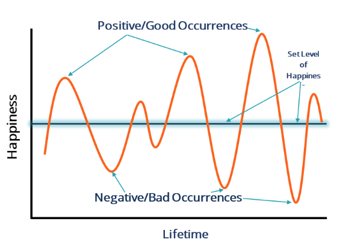
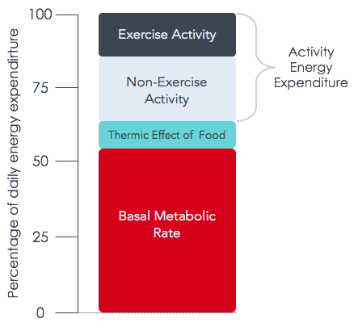
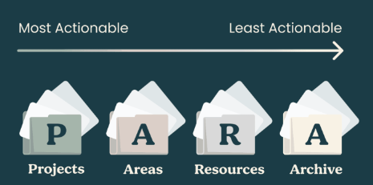
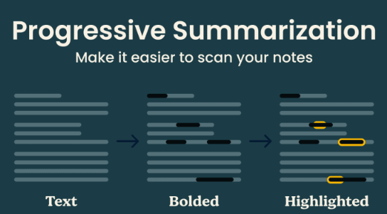
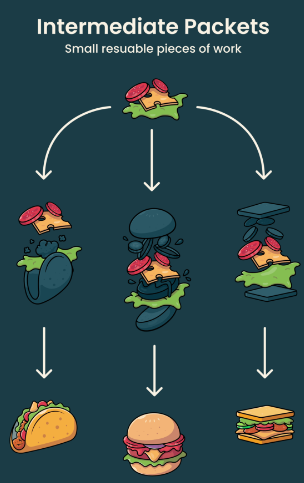
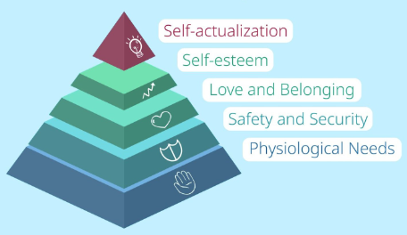

# life
- [why save money](#why-save-money)
- [why wake up early](#why-wake-up-early)
- [why sell RSUs on vest](#why-sell-rsus-on-vest)
- [why not track every rupee](#why-not-track-every-rupee)
- [why stay back in India](#why-stay-back-in-india)
- [exercising for weight loss](#exercising-for-weight-loss)
- [second brain](#second-brain)
- [Maslow’s hierarchy](#maslows-hierarchy)
- [quotes](#quotes)

## [why save money](https://www.reddit.com/r/personalfinanceindia/comments/1ax2xrp/is_saving_money_really_worth_it/#:~:text=You'll%20learn%20to%20be,didn't%20save%20or%20invest)
- **financial freedom:** it would be relieving to know you don't have to work and could walk away from your job if you wanted  
- **future:** is an unknown territory with rise in inflation, AI taking over jobs etc so it’s best to save for the future while also enjoying the present  
think about you being old & needing money being unable to work to earn, at that time only the savings/wealth will be of use
- **[hedonic treadmill](https://www.reddit.com/r/Stoicism/comments/7ruan9/hedonic_treadmill/):** once you have met your basic needs, you can accumulate all the riches you can yet you will remain stuck at your natural usual state of happiness because the riches you gain will simply raise your expectations and leave you no better off than you were before  

## [why wake up early](https://www.reddit.com/r/getdisciplined/comments/5fw8ho/advice_waking_up_early_will_change_your_life/)
- waking up at at 0600 is going to provide you with so much more time than the rest of the world  
our energy runs much like a battery, at the very beginning of the day it is full so make use of that full energy
- some type of movement in your morning routine is going to allow your body to truly wake up allowing the feel good endorphins to flood your system and will also help boost your metabolism for the day

## [why sell RSUs on vest](https://www.reddit.com/r/personalfinance/comments/1ahq6t2/comment/kopijtv)
- RSUs are basically the company giving you cash but in stock form, so if you had cash and would buy your company stock then hold on the RSUs else you should sell and diversify that money into an index fund  
you don't want to see the stock falling due to mismanagement in the future and you also losing your job at the same time  
also your unvested stocks and potential salary increases already give you a lot of exposure to your company's growth

## [why not track every rupee](https://www.reddit.com/r/PersonalFinanceCanada/comments/17jmyhv/comment/k72jgx3)
- tracking spending is a waste of time once you’ve already got your impulses under control, it might be good to review your spending once a year but on an ongoing basis would be a huge time suck for not much value  
more energy should be spent on making money and keeping yourself healthy & happy, you are on track as long as you hit your savings goal

## [why stay back in India](https://www.reddit.com/r/developersIndia/comments/18oyg3t/comment/kekhbt7)
- europe needs skilled immigrants to fund their ponzi scheme of social welfare through taxes  
free healthcare sounds cool until when you need anything beyond a cold, waiting times for any surgery/check up can run from anywhere between several weeks to few months, whereas here you can just walk in on same day and get appointment and schedule surgeries in few days
- not having to worry about housing and having rock solid family support is a huge advantage  
robust startup revolution here has made QOL truly luxurious, you can do everything sitting at home without moving an inch
- total compensation is damn good in india now, almost all the tech companies have big teams/decent work here now

## [exercising for weight loss](https://www.reddit.com/r/loseit/wiki/index/?rdt=42852#wiki_exercising_for_weight_loss)
- exercise is not equal to diet because we can control most of our energy intake but only about 10%-20% of our energy expenditure through exercise, studies repeatedly show that exercise has little effect on weight, but diet does  
exercise does have a rightful role in physical ability/capacity, psychological benefits & general health and deserves its high place in anyone's health plan, but if the goal is weight loss focus should be on the diet  

- avoiding weights because you don't want to become "huge" is like avoiding going for a jog in the park because you're afraid of winning the Boston marathon

## [second brain](https://fortelabs.com/blog/basboverview/)
- *our brains are for having ideas, not storing them*
- **second brain:** an external, integrated digital repository for the things you learn and the resources from which they come
- **CODE:** process of creating a second brain  

  - **capture:** the ideas & insights that are worth saving and keep them in a single centralized place
  - **organize:** notes into a simpler and flexible organization method, example: PARA method
  - **distill:** add value to a note every time you touch it by making it just a little easier to make use of next time, example: progressive summarization
  - **express:** by creating tangible results in the real world, shift as much of our effort as possible from consuming information to creating new things, example: intermediate packets
- **PARA:** all the information in your life can be categorized into only four categories:

  - **projects:** short term efforts with a certain goal in mind
  - **areas:** long term responsibilities you want to manage over time
  - **resources:** topics or interests that may be useful in future
  - **archive:** inactive items from the other three categories
- **progressive summarization:** is a technique that relies on summarizing a note in multiple stages over time  
to communicate anything you have to compress it, but in doing so you lose a lot of the context that made it valuable in the first place  

- **intermediate packets:** are smaller reusable units of work  

## [Maslow’s hierarchy](https://www.simplypsychology.org/maslow.html)
- **Maslow’s hierarchy of needs:** is a classification system intended to reflect the universal needs of society as its base then proceeding to more acquired emotions  
key idea is that lower-level needs must be satisfied before higher-level needs can become motivators  

  - **physiological needs:** biological requirements for human survival (like air, food, drink, shelter, clothing, warmth, sex, sleep, etc)
  - **safety & security:**  people want to experience order, predictability & control in their lives
  - **love & belonging:** refers to a human emotional need for interpersonal relationships, affiliating, connectedness & being part of a group
  - **self-esteem:** includes self-worth, accomplishment & respect
  - **self-actualization:** refers to the realization of a person’s potential, self-fulfillment, seeking personal growth & peak experiences

## quotes
- *if you crush a cockroach you're a hero, if you crush a beautiful butterfly you're a villain, morals have aesthetic criteria* (Friedrich Nietzsche)
- *just because you can afford it doesn't mean you should buy it* (Suze Orman)
- *AI can only replace you if your work is already done and readily accessible over the internet, AI cannot replace novelty*