- [](#)
- [maths for CS](#maths-for-cs)
- [introduction](#introduction)
- [induction](#induction)
- [number theory](#number-theory)

# links  <!-- omit from toc -->
- [[playlist] maths for CS](https://ocw.mit.edu/courses/6-042j-mathematics-for-computer-science-fall-2010/)
- [[playlist] essence of calculus](https://www.3blue1brown.com/topics/calculus)

# calculus
- **integral:**  approximate continuous quantities as sums of small discrete values  
  like dividing area under curve into very narrow rectangles  
  lot of hard problem can be broken down & approximated as sum of many small quantities
- **example: circle area:** slice circle into concentric rings of `dr` width  
  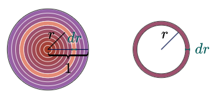  
  circle area will be sum of concentric ring areas  
  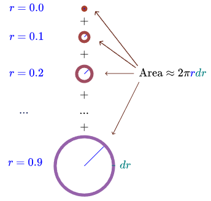  
  straightened ring area `≈ 2π * r * dr`  
  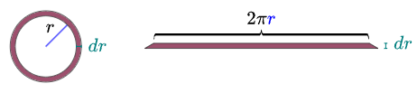  
  straightened rings placed next to each other form area under `2π * r`
  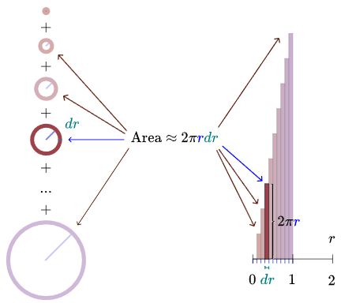  
  approximation improves as `dr ⟶ 0`  
  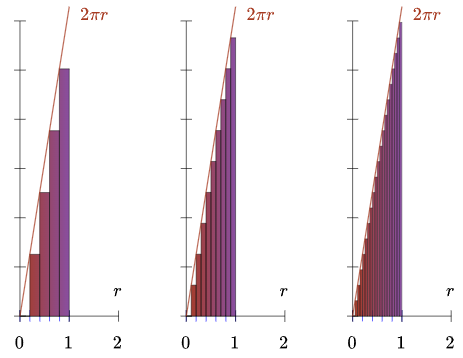  
  circle area equal to triangle area under `2π * r`  
  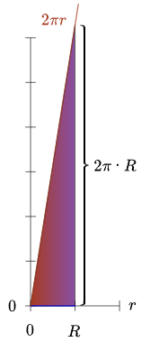
  ```
  area = 1/2 * base * height
       = 1/2 * R * 2π * R
       = π * R^2
  ```

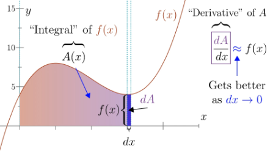


# maths for CS
## introduction
- **proof:** is a method for ascertaining tht truth, what constitutes a proof differs among fields (like experimentation & observation for physics)  
**mathematical proof:** is verification of a proposition by a chain of logical deductions from a base set of axioms  
**proposition:** is a statement that is either true or false  
**predicate:** proposition whose truth depends on value of a variable
- **example: `∀ n ∈ N` `(n^2 + n + 41)` is a prime number:**
  ```
  predicate:              (n^2 + n + 41) is a prime number
  universe of discourse:  N (natural numbers)
  quantifier:             ∀
  ```
  to see if the proposition is true we need to make sure that the predicate is true for all N  
  through trial & error, this predicate is true for first forty numbers (`[0, 39)`), but it fails for 40 & 41
- **implies:** `p ⇒ q` is said to be true if `p` is false or `q` is true  
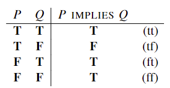  
example: `pigs fly ⇒ I am king` is true because pigs cannot fly so it doesn't even matter if I am a king  
example: `∀ n ∈ Z` `n >= 2 ⇒ n^2 >= 4`: true since can only false if `n^2 < 4` for `n >= 2` which is not possible
- **if-and-only-if (iff):** `p ⇔ q` asserts that `p` & `q` are logically equivalent, basically a two way implication `p ⇒q && q ⇒ p` (that is either both are true or both are false)  
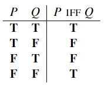  
example: `∀ n ∈ Z` `n >= 2 ⇔ n^2 >= 4`: false, since negative numbers (-3 onwards) are smaller than 2 but square larger than 4
- **axiom:** is a proposition that is assumed to be true, example: if `a == b` & `b == c` then `a == c`  
a set of axioms can be consistent and complete, but cannot be both (consistency is a must but there will be some true facts that you can never prove)
  - **consistent:** if no proposition can can be proved to be both true & false
  - **complete:** if it can be used to prove every proposition is either true & false
- **proof by contradiction:** establishes the truth of a statement by assuming it's false and showing that this leads to a contradiction
- **example: `√2` is irrational:** by contradiction assume `√2` is rational then `√2 = a / b`  where fraction in in lowest terms  
simplifying it `2 = a^2 / b^2` ⟶ `a^2 = 2 * b^2`, so `a^2` is even which implies `a` is even `2 | a` ( 2 divides `a`)  
`2 | a` ⟶ `4 | a^2` ⟶ `4 | 2 * b^2` ⟶ `2 | b^2` then b is even  
so now we have a contradiction that if both `a` & `b` are even then `a / b` is not in lowest terms

## induction
- **induction:** let `P(n)` be a predicate, then if `P(0)` is true and `∀ n ∈ N` `P(n) ⇒ P(n + 1)` is true then `∀ n ∈ N` `P(n)` is true  
that is if `P(0)` is true then `P(0) ⇒ P(1)`, `P(1) ⇒ P(2)` and so on, so `P(0)`, `P(1)` ... `P(n)` is true  
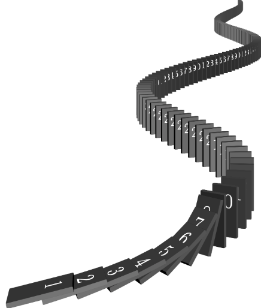  
usual three steps are:
  - identify predicate
  - do base case by proving `P(b)` is true
  - inductive step by proving `∀ n >= b` `P(n) ⇒ P(n + 1)`
  - conclude `∀ n >= b` `P(n)`
- **example: `∀ n >= 0` `(1 + 2 + 3 + 4 .. + n) = (n * (n + 1)) / 2`:** if `n = 1` then sum is 1, if `n <= 1` then sum is 0 (no numbers)  
base case `P(0) = (0 * (0 + 1)) / 2 = 0` is true  
inductive step is to show that for `n >= 0` `P(n) ⇒ P(n + 1)` is true, so for purpose of induction assume `P(n)` is true to show `P(n + 1)` is also true  
`1 + 2 + 3 + 4 .. + n + n+1` ⟶ `((n * (n + 1)) / 2) + n+1` ⟶ `(n * (n + 1) + 2 * (n+1)) / 2` ⟶ `((n + 1) * (n + 2)) / 2 = P(n + 1)`
- **example: `∀ n ∈ N` `3 | (n^3 - n)`:** base case `P(0) = (0^3 + 0) = 0` (`3 | 0`) is true  
for induction assume `P(n)` `3 | (n^3 - n)` is true and need to prove `P(n + 1)` is true  
`(n + 1)^3 - (n + 1)` ⟶ `n^3 + 3n^2 + 3n + 1 - n - 1` ⟶ `n^3 + 3n^2 + 2n` ⟶ `(n^3 - n) + 3n^2 + 3n`  
where `3 | 3n^2`, `3 | 3n` & `3 | (n^3 - n)` (by assumption) ⟶ `3 | (n + 1)^3 - (n + 1)`
- **example: all horses are the same color (false proof):** predicate is that in any set of `n` horses the horses are all the same color  
base case is `P(1)` is true since just one horse  
for induction assume `P(n)` is true to show `P(n + 1)` is true  
then `H1, H2 ... Hn` are the same color and `H2, H3 ... Hn+1` are the same color, since both are set of `n` horses so `P(n)` can be applied  
since `color(H1) = color(H2 ... Hn) = color(Hn+1)`, it implies all horses are same color `P(n + 1)`  
but for `P(1)` we have `color(H1) = color() = color(H2)` where center statement has no horses (empty set) which breaks the equation, so the missing link is `P(1) ⇒ P(2)`  
and we can only prove `∀ n >= 2` `P(n) ⇒ P(n + 1)`, which means if you see any pair (for `n = 2`) of horses and they are the same color then all horses are the same color
- **example: `∀ n ∈ N` ∃ way to L-tile a `2^n` * `2^n` region with a centre square missing (for Bill):** base class is just one tile which is for Bill so true  
for `n = 2` we can simply do  
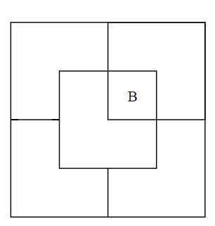  
for induction assume `P(n)` is true to show `P(n + 1)` is true, but we don't know how to bridge the gap between `P(n)` & `P(n + 1)` with just this assumption  
so fallback for a stronger induction hypothesis which implies your original one: for every location of Bill in a `2^n` * `2^n` region there exists a tiling of the remainder  
base case is still true, now for induction step divide `2^(n + 1)` * `2^(n + 1)` into four quadrants (of side `2^n`) where one quadrant contains Bill and place a temporary Bill in each of the three central squares lying outside this quadrant  
now we can tile each of the quadrant using induction assumption and then keep the final tile over the temporary Bills  
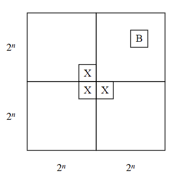
- **stronger induction:** strengthening the induction hypothesis is often a good move when an induction proof won’t go through, this helps by making `P(n)` more powerful which then help prove a harder induction step
- **example: eight puzzle:** prove that there is no sequence of legal moves (slide a number into adjacent blank square) to invert `G` & `H` keeping other positions unchanged  
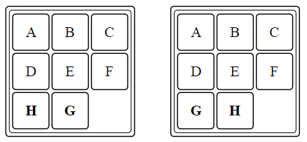  
a row move (`i` ⟶ `i±1`) doesn't change the order of the items, since no other tile moves so relative order (character sequence) is maintained  
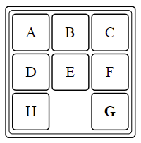  
a column move changes the relative order of precisely two pair of tiles, since we move a tile from `i` ⟶ `i±3`  
example: `E` used to be before `F` & `H` but is now after them  
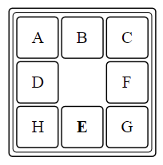  
pair of letters L1 and L2 is an inversion (inverted pair) if L1 precedes L2 in the alphabet but L1 appears after L2 in the puzzle order, example: below image has three inversions (F, D), (F, E), (G, E)  
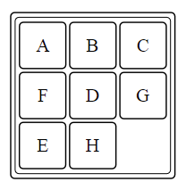  
so during a move the number of inversions can either increase/decrease by 2 (column move) or remain the same (row move), so the parity (odd/even) always remains the same  
our original start state has one inversion and expected output has zero inversions, so every state reachable will always result in odd parity so we can never reach expected output having even parity  
base case: `n = 0` no moves so odd parity is unchanged  
for induction assume `P(n)` is true to show `P(n + 1)` is true  
first `n` moves will result in odd parity, one extra move `n + 1` will also not change the parity so `P(n) ⇒ P(n + 1)`
- **invariant:** is a property that is preserved through a series of operations or steps, we typically use induction to prove that a proposition is an invariant by showing that if the proposition is true at the beginning and after `n` steps, then it will also be true after step `n + 1`
- **strong induction:** let `P(n)` be a predicate, then if `P(0)` is true and `∀ n ∈ N` `P(0) && P(1) ... P(n) ⇒ P(n + 1)` is true then `∀ n ∈ N` `P(n)` is true  
only change from the ordinary induction is that strong induction allows you to assume more stuff (`P(0)`, `P(1)` ... `P(n)` are true) in the inductive step of your proof when going to prove `P(n + 1)`  
anything proved by strong induction can be proved by ordinary induction as well, but extra assumptions can make the job easier
- **example: unstacking game:** you begin with a stack of `n` boxes, with every move you can divide one stack into two non-empty stacks and the game ends when you have `n` stacks each containing a single box  
you earn points for each move so if you divide `a + b` into `a` & `b` stacks you get `a * b` points, overall score is the sum of the points that you can earn for each move  
prove that all strategies for this game will produce the same score `S(n)`  
base case `n = 1` so `S(1) = 0`  
for strong induction assume `P(1)` ... `P(n)` are true  
if `n + 1` blocks are split into `k` & `n + 1 - k`, `S(n + 1) = k * (n + 1 - k) + P(k) + P(n + 1 - k)`  
since know that `S(1) = 0`, `S(2) = 1` ... `S(8) = 28`, we can make a stronger induction hypothesis by guessing `S(n) = (n * (n - 1)) / 2`  
`k * (n + 1 - k) + P(k) + P(n + 1 - k)` ⟶ `k * (n + 1 - k) + (k * (k - 1)) / 2 + ((n + 1 - k) * (n - k)) / 2` ⟶ `((n + 1) * n) / 2` which is `S(n + 1)`

## number theory
- **example: die hard jugs:** assume you have two jugs of 3gallons & 5gallons capacity, how do you fill one of them to be exactly 4gallons  
state of the system can be described using pair of numbers representing the amount of water is two jugs `(x, y)` (with max `(a, b)`gallons)  
`(0, 0)` ⟶ fill  `(0, 5)` ⟶ b to a `(3, 2)` ⟶ empty a `(0, 2)` ⟶ b to a `(2, 0)` ⟶ fill b `(2, 5)` ⟶ b to a `(3, 4)`  
but this is not possible with 6gallons & 3gallons since any combination is always multiple of 3  
transitions we can have are:
  ```
  // emptying
  (x, y) ⟶ (0, y)
  (x, y) ⟶ (x, 0)

  // filling from fountain
  (x, y) ⟶ (a, y)
  (x, y) ⟶ (x, b)

  // pouring
  (x, y) ⟶ (0, x + y)                         ,x + y <= b
  (x, y) ⟶ (x + y, 0)                         ,x + y <= a
  (x, y) ⟶ (x - (b - y), b) = (x + y - b, b)  ,x + y >= b
  (x, y) ⟶ (a, y - (a - x)) = (a, x + y - a)  ,x + y >= a
  ```
  so we need to prove that if `(m | a) && (m | b)` then for state `(x, y)` after `n` transitions `(m | x) && (m | y)`  
  base case is `(0 , 0)` and every number divides `0`, so `P(0)` true  
  for induction assume `P(n)` with state `(x, y)` is true, that is `(m | x) && (m | y)`  
  after another transition `P(n + 1)`, each of the jugs are possibly: `0`, `a`, `b`, `x`, `y`, `x + y`,`x + y - a`, `x + y - b`  
  from proposition `m` already divides `a` & `b` and from assumption divides `x` & `y`  
  so `m` divides any output of `P(n + 1)` which is a linear combination of `a`, `b`, `x` & `y`  
  so `m` is the GCD of `a` & `b` and will divide any output combination  
  so for 33gallons & 55gallons jug we cannot get 4gallons since GCD for 33 & 55 is 11 which does not divide 4
  for this we need to prove the invariant: any linear combination `L = s * a + t * b` of `a` & `b` (`a <= b`)with `0 <= L <= b` can be reached where `L` is the amount of water in `b`  
  `s * a + t * b` ⟶ `(s + m * b) * a + (t - m * a) * b` where we can choose `m` such that `s + m * b` (`s'`) is positive, so now we have`L = s' * a + t' * b` `s' >= 0`  
  now to obtain `L`gallons repeat `s'` (hence `>=0`) times: fill `a` jug ⟶ pour this into `b` jug ⟶ empty `b` jug if it is full  ⟶ continue pouring until `a` jug is empty  
  for `(3, 5)`: loop1 `(0, 0)` ⟶ `(3, 0)` ⟶ `(0, 3)` ⟶ loop2 `(0, 3)` ⟶ `(3, 3)` ⟶ `(1, 0)` ⟶ `(0, 1)` ⟶ loop3 `(0, 1)` ⟶ `(3, 1)` ⟶ `(0, 4)`  
  so we filled the `a` jug `s'` times, suppose the `b` jug was emptied `u` times, let `r` be the remainder in `b` jug at the end  
  remainder is the total water poured in minus out: `r = s' * a - u * b` ⟶ `s' * a + t' * b - t' * b - u * b` ⟶ `L - (t' + u) * b`  
  we know `0 <= r <= b` & `0 <= L <= b`, so if `t' + u != 0` then `r < 0` or `r > b` which is not possible so `t' + u = 0` ⟶ `u = -t'`  
  comparing `r = s' * a - u * b` & `L = s * a + t * b` we can conclude `r = L`  
  that is the final remainder is a linear combination of `a` & `b` jugs
- **Euclid's algorithm:** for any `a` & `b` there exists a unique quotient `q` & remainder `r` such that `b = q * a + r` `0 <= r < a`  +
which can be used to define `gcd(a, b) = gcd(rem(b, a), a)` where `rem(b, a)` is basically a linear combination of `a` & `b` `b = q * a + r`  
example: `gcd(105, 224)` ⟶ `gcd(rem(224, 105), 105)` ⟶ `gcd(14, 105)` ⟶ `gcd(rem(115, 14), 14)` ⟶ `gcd(7, 14)` ⟶ `gcd(rem(14, 7), 7)` ⟶ `gcd(0, 7)` ⟶ `7`  
proof: `(m | a) && (m | b)` ⟶ `(m | b - q * a) && (m | a)` ⟶ `(m | rem(b, a)) && (m | a)`


[continue](https://youtu.be/NuY7szYSXSw?list=PLB7540DEDD482705B&t=4052)