# operating system
- [introduction](#introduction)
- [processes](#processes)
  - [process abstraction](#process-abstraction)
  - [process API](#process-api)
  - [process execution mechanism](#process-execution-mechanism)
  - [scheduling policies](#scheduling-policies)
  - [inter-process communication](#inter-process-communication)
- [memory](#memory)
  - [virtual memory](#virtual-memory)
  - [address translation](#address-translation)
  - [paging](#paging)
  - [demand paging](#demand-paging)
  - [memory allocation algorithms](#memory-allocation-algorithms)
- [concurrency](#concurrency)
  - [threads and concurrency](#threads-and-concurrency)
  - [locks](#locks)
  - [conditional variables](#conditional-variables)
  - [semaphores](#semaphores)
  - [concurrency bugs](#concurrency-bugs)
- [I/O and filesystems](#io-and-filesystems)
  - [communication with I/O devices](#communication-with-io-devices)
  - [files \& directories](#files--directories)
  - [file system implementation](#file-system-implementation)
  - [hard disk internals](#hard-disk-internals)
- [xv6](#xv6)

## links  <!-- omit from toc -->
- [[lectures] operating systems](https://www.cse.iitb.ac.in/~mythili/os/)

## todo  <!-- omit from toc -->
- [IPC extra](https://www.cse.iitb.ac.in/~mythili/os/notes/notes-ipc.txt)
- [semaphore extra](https://www.cse.iitb.ac.in/~mythili/os/references/LittleBookOfSemaphores.pdf)
- [programming groundup extra](https://www.cse.iitb.ac.in/~mythili/os/references/ProgrammingGroundUp.pdf)
- multi-threading programming using pthread & cpp threads
- IPC using cpp
- priority inversion
- [`brk` & `sbrk`](https://stackoverflow.com/questions/6988487/what-does-the-brk-system-call-do)
- `mmap` system class

## introduction
- **operating system:** is a middleware that sits between user programs & system hardware and manages hardware for the user programs:
  - **manage CPU:** provide process abstraction (create & manage), each process has illusion of having complete CPU (CPU virtualization), timeshares the CPU between processes, enables coordination between processes
  - **manage memory:** of the process (code, data, stack, heap), each process thinks it has dedicated memory space (code, data, stack, heap) for itself  
  abstracts out the details of the actual placement in memory, translates from virtual addresses to actual physical addresses
  - **manage devices:** OS has code (device driver) to manage hardware devices (like disk, network card) which talks the language of the devices, it issues instructions to devices (like fetch data from disk) and responds to device interrupts (key press), OS also manages the persistent data organized as a filesystem on disk
- **OS design goals:**
  - convenience, abstraction of hardware resources for user programs
  - efficient usage of CPU, memory, etc
  - isolation between multiple processes
- OS started out as a library (procedure call) and evolved to system call  
**procedure call:** jumps to a process defined elsewhere in the program  
**system call:** runs at a higher privilege level of CPU, sensitive operations (like hardware access) only allowed at a higher privilege level

## processes

### process abstraction
- **CPU scheduler:** pick one of the many active processes to execute on a CPU
  - **policy:** which process to run next
  - **mechanism:** how to context-switch between processes
- **process constituents:**
  - unique identifier (PID)
  - memory image: static (code & data) and dynamic (stack & heap)
  - CPU context: registers like program counter (PC), current operands, stack pointer (SP)
  - file descriptors: pointers to open files (including stdout & stdin) & devices
- **process creation:**
  - allocate memory and create memory image (load code & data from executable, create runtime stack & heap)
  - opens basic files (stdin, stdout, stderr)
  - initialize CPU registers (PC points to first instruction)
- **process states:**  
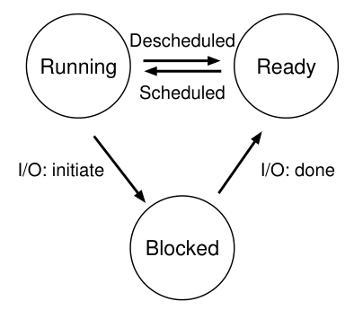
  - **running:** currently executing on CPU
  - **ready:** waiting to be scheduled
  - **blocked:** suspended, not ready to run, waiting for some event like read from disk (disk will issue an interrupt when data is ready)
  - **new:** being created, yet to run
  - **dead:** terminated
- example: process state with I/O:  
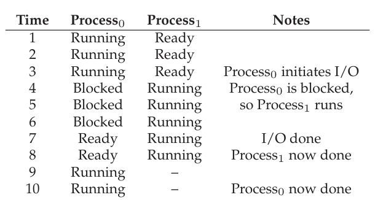
- **process control block:** OS maintains a data structure (linked list) of all active processes, information about each process is stored in a process control block (PCB)
  - process identifier
  - process state
  - pointer to related processes (parent, child)
  - CPU context (saved when the process is suspended)
  - pointers to memory locations
  - pointers to open files

### process API
- **application programming interface (API):** functions available to write user programs
- **process API:** set of system calls provided by OS, some blocking system calls (like disk read) can cause the process to be blocked and descheduled
- **portable operating system interface (POSIX) API:** standard set of system calls that compliant OS must implement, ensures program portability  
user programs need to worry about this since program language libraries will usually hide the details of invoking system calls, example: `printf` calls `write` system call to write to screen
- **process related system calls:** many variants of below exist with different arguments
  - **`fork()`:** create new child process, all processes created by forking from a parent, `init` process is ancestor of all processes
  - **`exec()`:** make process execute a given executable
  - **`exit()`:** terminate a process
  - **`wait()`:** causes parent to block until child terminates
- **fork working:**
  - new process is created by making a copy of parent's memory image
  - new process is added to OS process list and scheduled
  - parent & child resume execution from the same point just after fork (with different return values)
  - parent & child execute and modify the memory data independently
  ```cpp
  int main(int argc, char *argv[])
  {
      int ret = fork();    // ret is child process PID

      if (ret < 0)    // fork failed
      {
          printf("fork failed\n";)
      }
      else if (ret == 0)    // child process
      {
          printf("child process %d\n", getpid());
      }
      else    // parent process
      {
          printf("parent process %d of child %d\n", getpid(), ret);
      }
  }
  ```
- **child process handling:**
  - process termination scenarios are:
    - by calling `exit()` (automatically called when end of main reached)
    - OS terminates a misbehaving process
  - terminated process exist as a zombie
  - when a parent calls `wait()` the zombie child will be cleaned up (reaped), wait blocks in parent until the child terminates (non-blocking ways also exist)
  - if parent terminates before child then `init` process adopts orphans and reaps them
- **exec working:** after fork parent & child will same code which is not very useful, so a (child) process can run `exec()` to load another executable into its memory image and run a different program from its parent, variants of exec exist where arguments to new executable are passed
- **example: shell working:**
  - `init` process created after initialization of hardware
  - `init` process spawns a shell (like bash)
  - shell reads user command  ⟶  forks a child  ⟶  execs command executable  ⟶  waits for it to finish  ⟶  reads next command  
  common commands like `ls` are all executables that are exec'ed by the shell
  - shell can also manipulate child process  
  example: for `ls > log.txt` shell will: spawn a child ⟶ rewire stdout of child to file ⟶ call exec on the child

### process execution mechanism
- **function call working:**
  - translates to jump instruction
  - new stack frame pushed and `SP` updated, stack frame contains arguments, return value, etc
  - function instructions executed
  - stack frame popped
  - PC now holding return address
- **system call difference:**
  - CPU hardware has multiple privilege levels: user mode (user code) & kernel mode (OS calls), some instructions can execute only in kernel mode
  - kernel does not trust user stack, separate kernel stack used in kernel mode
  - kernel does not trust user provided addresses to jump to, interrupt descriptor table (IDT) has addresses of kernel functions to run for system calls and other events (set up at boot time)
- **system call working:**
  - special trap instruction is run when system call is made (hidden from user by libc), this will move CPU to higher privilege level, switch to kernel stack, save user context on kernel stack, look up IDT and jump to trap handler function in OS code
  - **trap usecases:**
    - **system call:** program needs OS service
    - **program fault:** program does something illegal, example: access memory it doesn't have access to
    - **interrupt:** external device needs attention of OS, example: network packet arrived on network card
  - before calling trap, a number stored in a CPU register to identify which IDT entry to use
  - when OS is done, it calls special return-from-trap instruction, this will restore user context on kernel stack, change CPU privilege from kernel mode to user mode, restore PC and jump to user code after trap
  - before returning to user mode, OS checks if it must switch to different process (context switch):  
  process has exited or must be terminated (program fault)  
  process made a blocking system call (waiting for disk data)  
  process has run for too long (CPU timesharing)
- **CPU scheduler mechanism types:**
  - **non-preemptive (cooperative):** switch only if process blocked or terminated
  - **preemptive (non-cooperative):** switch even when process is ready to continue, CPU generates periodic timer interrupt, after servicing this interrupt OS checks if current process has run for too long
- **CPU scheduler mechanism working:**
  - process A has moved from user to kernel mode, OS has decided it must switch from process A to B
  - save kernel context of A on kernel stack
  - switch SP to kernel stack of B
  - restore kernel context from B's kernel stack (stored when B was switched out)
  - now CPU running B in kernel mode, return-from-trap to switch to user mode of B
- **user context:** when going from user mode to kernel mode, saved on kernel stack by trap instruction  
**kernel context:** during context switch, saved on kernel stack by context switching code

### scheduling policies
- **CPU burst:** CPU time used by a process in a continuous stretch, counted as a fresh burst if a process comes back after a I/O wait
- **CPU scheduler policy goals:**
  - **maximize utilization:** fraction of time CPU is used
  - **minimize average turnaround time:** time from process arrival to completion
  - **minimize average response time:** time from process arrival to first scheduling
  - **fairness:** all processes must be treated equally
  - **minimize overhead:** run process long enough to reduce cost of context switch (~1ms)
- **CPU scheduler policies:** on context switch based on CPU burst which process to run next
  - **first come first serve (FCFS):** process job in the order they are received  
  **convoy effect:** stuck behind long process so high turnaround time
  - **shortest job first (SJF):** process job with shorted execution time, is non-preemptive so can stil get stuck if shorter jobs arrive when long process executing
  - **shortest remaining time first (SRTF):** preemptive version of SJF (preempts running job), process job closest to completion, also known as shortest time to completion first (STFC)
  - **round robin (RR):** each job processed for a fixed time slice, preemptive, slice big enough to reduce context switch cost, good for response time & fairness, bad for turnaround time
  - **multi level feedback queue (MLFQ):** used in linux, many queues in order of priority, process from highest priority queue, within same priority any algorithm like RR, priority of process reduces with its age

### inter-process communication
- **inter-process communication (IPC):** mechanisms to share information between processes, processes do not share any memory with each other
  - **shared memory:** both processes can read/write same region of memory via `int shmget(key,size, shmflg)` system call to communicate, by providing same key two processes can get same segment of memory
  - **signals:** can be sent to a process by OS or another process, some signals have fixed meaning (`ctrl + C` send `SIGINT` signal), every process has a default code to execute for each signal (signal handler) like exit on terminate signal, some signal handlers can be overriden to do other things
  - **sockets:** can be used for two processes on same machine (Unix sockets) or different machine (TCP/UDP sockets) to communicate, two processes open sockets and connect them to each other, messages written into one socket can be read from another, OS transfers data across socket buffers
  - **pipes:** one-way communication (half-duplex), pipe system call returns two handles (file descriptors), data written in write handle can be read through read handle, pipe data buffered in OS buffers between read & write  
  **regular pipes:** both file descriptor are in same process, parent & child share file descriptor after fork, parent uses one end and child uses other end  
  **named pipes:** two endpoints in different processes
  - **message queue:** mailbox abstraction, process can open a mailbox at a specified location, processes can send/receive messages from mailbox, OS buffers messages between send & receive
- **blocking vs non-blocking communication:** some IPC actions like reading from empty socket/pipe/message queue or writing to full socket/pipe/message queue can block, system calls to read/write have versions that return error code instead of blocking

## memory

### virtual memory
- earlier memory had only code of one running process (and OS code), but now multiple active processes timeshare CPU so memory of many processes must be in memory (non-contiguous too)  
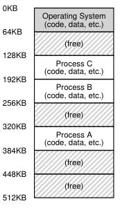
- **virtual address space:** every process assumes it has access to large contiguous space of memory from address 0 to MAX, to hide complexity of multiple processes non-contiguously sharing memory, contains program code, heap & stack (heap & stack grow runtime), is setup during process creation  
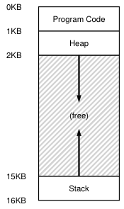
- **address translation:** CPU issues load/store to virtual addresses (VA) but memory hardware accesses physical addresses (PA), OS allocates memory and tracks location of processes, translation (VA to PA) done by memory management unit (MMU) hardware using necessary information from OS
- **paging:** OS divides virtual address space into fixed size pages and physical memory into frames, to allocate memory a page is mapped to free physical frame, page table stores mapping from virtual page number to physical frame number for a process
- **memory virtualization goals:**
  - **transparency:** user programs should not be aware of the messy details
  - **efficiency:** minimize overhead & wastage in terms of memory space & access time
  - **isolation & protection:** user process should not be able to access anything outside its address space
- **memory allocation system calls:**
  - `malloc()` implemented by libc, to grow the heap `brk()`/`sbrk()` system calls used
  - program can use `mmap()` to allocate page sized memory, gets anonymous page from OS
- **OS address space:** OS is not a separate process with its own address space, instead OS code is part of the address space of every process, process sees OS as part of its code, page table maps OS addresses to OS code

### address translation
- **address translation in simplified OS:** places entire memory image in one chunk, OS tells MMU the base (starting address) & bound (total size of process) values (needs privileged mode), MMU calculates PA from VA, MMU also checks if address is beyond bound, generates faults and traps to OS if access illegal (VA is out of bound), OS updates translation information upon context switch
  ```
  PA = VA + base
  assert (PA < VA + base + bound)
  ```
- **role of OS in translation:**
  - maintains free list of memory
  - allocate space to process during creation and clean up when done
  - maintains information of where space is allocated to each process (in PCB)
  - sets address translation information in hardware and updates this on context switch
  - handles traps due to illegal memory access
- **segmentation:** generalized base & bounds, each segment of memory image placed separately, multiple base & bound values stored in MMU, good for sparse address space, but variable sized allocation leads to external fragmentation due to small holes in memory left between segments  
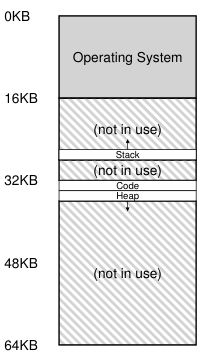
- **internal fragmentation:** unused part of memory block assigned to a process cannot be used by other processes, can be solved using dynamic partitioning to allocate space to process  
**external fragmentation:** total memory space is enough to satisfy a request or to reside a process in it but it is not contiguous so it cannot be used  
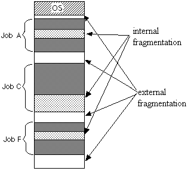

### paging
- **paging:** allocate memory in fixed size chunks called pages, avoids external fragmentation, but since minimum allocation is page-sized it has internal fragmentation due to partially filled pages
- **example: paging:** 64B address space in 128B physical memory with 16B page size  
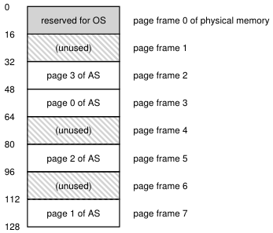
- **page table:** per process data structure to help VA-PA translation, array stores mappings from virtual page number (VPN) to physical frame number (PFN), part of OS memory (in PCB), MMU has access to page table and uses it for address translation, OS updates page table upon context switch
- **page table entry (PTE):** simplest page table is linear page table, array of page table entries (one per virtual page), VPN is index in the array, each PTE contains PFN and few other bits like 
  - **valid bit:** is this page used by process?
  - **protection bits:** read/write permissions
  - **present bit:** is this page in main memory?
  - **dirty bit:** has this page been modified?
  - **accessed bit:** has this page been recently accessed?
- **address translation in hardware:** most significant bits of VA give the VPN, page table maps VPN to PFN, PA is obtained from PFN and offset within a page, MMU stores physical address of start of page table then walks the page table to get relevant PTE, MMU just translates VPN to PFN and add the same offset  
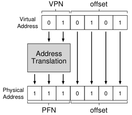
- **paging overhead:** when CPU requests data/code at a virtual address, MMU must translate VA to PA (by reading page table entry) adding overhead to memory access
- **translation lookaside buffer (TLB):** to reduce overhead a cache of recent VA-PA mappings is maintained, for address translation MMU first looks up TLB, if TLB miss then MMU performs additional memory accesses to walk page table, TLB misses are expensive due to multiple memory accesses (locality of reference (defined below) improves hit rate), TLB entries may become invalid on context switch and change of page tables
- **page tables in memory:** with 32 bit VA, 4KB pages we have `2^32/2^12 = 2^20` entries, if PTE is 4 bytes then each page table is 4MB, one page table per process, to reduce size of page tables:
  - larger pages, so fewer entries, but leads to fragmentation
  - page table is itself split into smaller chunks
- **multilevel page tables:** page table is spread over many pages, page directory (outer page table) tracks the PFNs of the page table pages, depending on how large the page table is we may need more than 2 levels also (64bit arch may need 7 levels), in case of TLB miss multiple accesses to memory required to access all levels of page tables so very expensive  
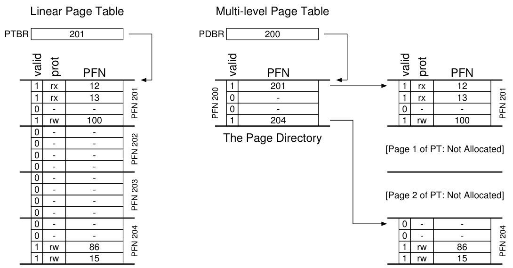  
for address translation first few bits of VA to identify outer page table entry, next few bits to index next level of PTEs  
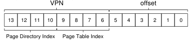

### demand paging
- **demand paging:** main memory not always enough to store all the pages of all active processes, OS uses a part of disk (swap space) to store pages that are not in active use  
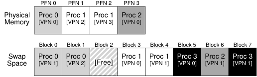
- **page fault:** if page not in main memory (present bit unset) during VA-PA translation MMU raises trap to OS, MMU cannot access the disk
- **page fault handling:** moves CPU to kernel mode, OS fetches disk address of page and issues read to disk, disk fetch is slow so OS context switches to another process, once disk read completes OS updates page table of process and marks process as ready, when process scheduled again OS restarts the instruction that caused page fault
- **memory access process:**
  - CPU issues load to a VA, checks CPU cache first, goes to main memory in case of cache miss
  - MMU looks up TLB for VA, if TLB hit obtains PA, fetches memory location and returns to CPU (via CPU caches)
  - if TLB miss MMU accesses memory, walks page table and obtains PTE:  
  if present bit set in PTE, accesses memory  
  if not present but valid, raises page fault, OS handles page fault and restarts the CPU load instruction  
  if invalid page access, trap to OS for illegal access
- **page replacement policies:** when servicing page fault if OS finds no free page then OS must swap out an existing page and then swap in faulting page, to prevent this much work OS proactively swap out pages to keep list of free pages handy
  - **optimal:** replace page not needed for longest time in future, just theoretical, cannot calculate when page is needed (look into future)
  - **first in first out (FIFO):** replace page that was brought into memory earliest, but that may be a popular page
    - **Belady's anomaly:** increasing number of page frames results in an increase in number of page faults for FIFO page replacement algorithm
  - **least recently/frequently used (LRU/LFU):** replace the page that was least recently (or frequently) used in the past, works well due to locality of references, OS periodically looks at accessed bit in PTE (set by MMU) to estimate pages that are active/inactive
- **cold (compulsory) miss:** miss when the first access to a page happens
- **locality of references:** tendency of computer program to access instructions whose address are near one another
  - **temporal:** same location will be referenced again in the near future
  - **spatial:** nearby memory locations will be referenced in the near future

### memory allocation algorithms
- **variable sized allocation:** given a memory block how to allocate it to satisfy various memory allocation requests, must be solved by C library for user `malloc`s and kernel for its internal data structures
  - **headers:** every allocated chunk has a header containing size of allocated region (size is later used by `free`), may contain magic number for additional integrity checking  
  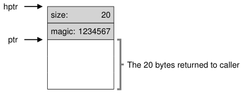
  - **free list:** free space managed as a linked list, pointer to the next free chunk is embedded within current free chunk, library/kernel tracks the head of the list (next NULL at tail), allocation happens from the head, must split & coalesce free chunks to satisfy variable sized requests (external fragmentation)  
  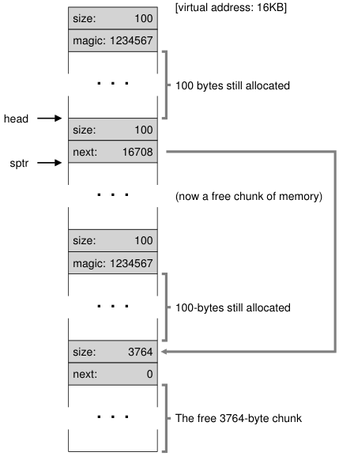
- **free list external fragmentation:**
  - **splitting:** on an allocation request allocator will find a free chunk of memory that can satisfy the request and split it into two, first chunk returned to caller and second chunk will remain on the free list
  - **coalescing:** on a free request allocator will check if free chunk of memory being returned sits next to another free chunk, if yes then merge them into a single larger free chunk  
  example: non-coalesced free list: suppose three allocations of 100 bytes are deallocated in the order: last, first, middle  
  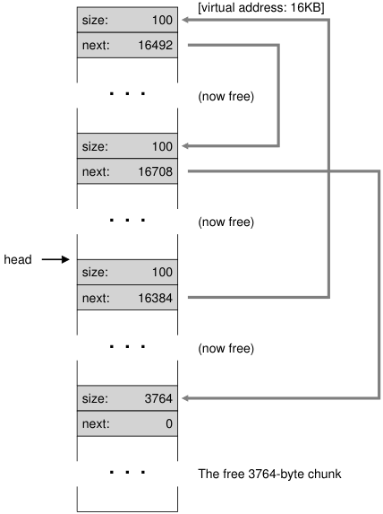
- **buddy allocation:** allocate memory in size of power-of-2, used by kernel for easy coalescing, two free adjacent/buddy chunks can be merged to form a bigger power-of-2 chunk  
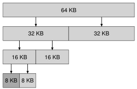
- **variable size allocation strategies:**
  - **first fit:** allocate first free chunk that is sufficient
  - **best fit:** allocate free chunk that is closest in size
  - **worst fit:** allocate free chunk that is farthest in size, remaining chunk is bigger & more usable
- **fixed size allocations:** memory allocation algorithms are much simpler with fixed size allocations, no issue with small holes left behind by fragmentation
  - **page-sized allocations:** has free list of pages, pointer to next page stored in the free page itself
  - **slab allocator:** used by kernel for small allocations like PCB, object caches for each type (size) of objects, within each cache only fixed size allocation, each cache made up of one or more pages/slabs with multiple fixed size objects  
  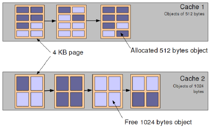

## concurrency

### threads and concurrency
- **thread:** is like another copy of a process that executes independently, all threads share the same address space (code & heap), each thread has separate PC and stack for independent function calls  
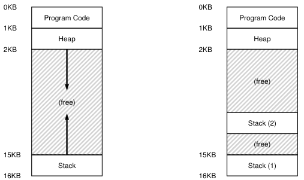
- **process vs thread:**
  - **parent forks a child:** parent & child do not share any memory, needs IPC mechanisms to communicate, extra copies of code & data in memory
  - **parent executes two threads:** two threads share parts of address space, global variables can be used for communication, smaller memory footprint
- **concurrency:** running multiple threads/processes at same time by interleaving their execution (even on single CPU core)  
**parallelism:** running multiple threads/processes in parallel over different CPU cores
- **why threads:** with parallelism a single process can effectively utilize multiple CPU cores, even without parallelism concurrency of threads ensures effective use of CPU when one of the threads blocked
- **scheduling threads:** OS schedules threads that are ready to run independently (much like processes), context of a thread (PC, registers) is saved into/restored from thread control block (TCB), every PCB has one or more linked TCBs
- **kernel threads:** threads that are scheduled independently by kernel, example: linux pthreads  
**user-level threads:** provided by some libraries, library multiplexes large number of user threads over a smaller number of kernel threads, low overhead for switching (expensive context switch not required), but all user threads cannot run in parallel
- **example: thread creation:**
  ```cpp
  #include <assert.h>
  #include <pthread.h>
  #include <stdio.h>

  void *mythread(void *arg)
  {
      printf("%s\n", (char *)arg);
      return NULL;
  }

  int main(int argc, char *argv[])
  {
      pthread_t p1, p2;
      int rc;

      printf("main: begin\n");
      rc = pthread_create(&p1, NULL, mythread, "A");
      assert(rc == 0);
      rc = pthread_create(&p2, NULL, mythread, "B");
      assert(rc == 0);

      // join waits for the threads to finish
      rc = pthread_join(p1, NULL);
      assert(rc == 0);
      rc = pthread_join(p2, NULL);
      assert(rc == 0);
      printf("main: end\n");

      return 0;
  }
  ```
- **race condition:** concurrent execution can lead to different results, when two or more threads can access shared data and try to change it at the same time
  ```cpp
  counter = counter + 1;

  // in assembly
  // 100 mov    0x8049a1c, %eax
  // 104 add    $0x1, %eax       <-- wrong value read by other thread if
  // interrupted after this 108 mov    %eax, 0x8049a1c
  ```
- **critical section:** portion of code that can lead to race conditions
- **mutual exclusion:** only one thread should be executing critical section at any time
- **atomicity:** critical section should execute like one uninterruptible instruction

### locks
- **lock:** is just a variable that is either available (no thread holds the lock) or acquired (one thread holds the lock, other threads waiting), makes sure only one thread is executing critical section
- **why locks:** all threads accessing a critical section share a lock, one thread succeeds in locking (owner of the lock), other threads that try to lock cannot proceed further until lock is released by the owner
- **goals of lock implementation:**
  - mutual exclusion
  - fairness: all threads should eventually get the lock, no thread should starve
  - low overhead: acquiring, releasing & waiting for lock should not consume too many resources
- **is disabling interrupts enough:** this technique is used to implement locks on single processor systems inside the OS, disabling interrupt is a privileged instruction and malicious programs can misuse it (like run forever), will not work on multiprocessor systems since another thread on another core can enter critical section
- **example: lock implementation using flag variable:** spin on a flag variable until it is unset, then set it to acquire lock, reset flag variable once done, race condition has moved to lock acquisition code, if thread context switched after spin wait but before setting flag, then both threads acquire the lock
  ```cpp
  typedef struct _lock_t(int flag;) lock_t;

  void init(lock_t *mutex)
  {
      // 0 ⟶ lock is available, 1 ⟶ held
      mutex->flag = 0;
  }

  void lock(lock_t *mutex)
  {
      while (mutex->flag == 1)  // test the flag
          ;                     // spin wait
      mutex->flag = 1;          // now set it
  }

  void unlock(lock_t *mutex) { mutex->flag = 0; }
  ```
- **hardware atomic instructions:** very hard to ensure atomicity only in software, modern architectures provide hardware atomic instructions
  - **test-and-set:** update a variable and return old value all in single hardware instruction
    ```cpp
    int test_and_set(int *old_ptr, int new)
    {
        int old = *old_ptr;  // fetch old value at old_ptr
        *old_ptr = new;      // store new into old_ptr
        return old;          // return the old value
    }
    ```
  - **compare-and-swap:** update a variable only if equal to expected and return actual value all in single hardware instruction
    ```cpp
    int compare_and_swap(int *ptr, int expected, int new)
    {
        int actual = *ptr;
        if (actual == expected) *ptr = new;
        return actual;
    }
    ```
- **spinlock:** spin until lock is acquired
  ```cpp
  while (test_and_set(&lock->flag, 1) == 1)
  while (compare_and_swap(&lock->flag, 0, 1) == 1)
  ```
- **(sleeping) mutex:** a contending thread could simply give up the CPU and check back later instead of spinning for a lock, `yield` moves thread from running to ready state
  ```cpp
  void lock()
  {
      while (test_and_set(&lock->flag, 1) == 1)
          yield()  // give up the CPU
  }
  ```
- **spinlock vs mutex:** 
    - userspace: most lock implementations are (sleeping) mutex since CPU wasted by spinning contending threads
    - OS: uses spinlocks since OS is default software layer and has no other thread to yield to, OS must disable interrupts while lock is held since an interrupt handler could request same lock leading to deadlock, OS must never perform any blocking operation (go to sleep) with a locked spinlock
- **coarse-grained locking:** one big lock for all shared data, example: one lock for any change in entire linked-list  
**fine-grained locking:** separate locks for individual shared data, allows more parallelism, but multiple locks may be harder to manage, example: individual locks for each linked-list element

### conditional variables
- other than mutex, another common requirement in multi-threaded applications is waiting & signaling, can accomplish using busy-wait but inefficient, example: thread T1 wants to continue only after T2 has finished some task
- **conditional variables:** is a queue that a thread can put itself into when waiting on some condition, another thread that makes the condition true can signal the conditional variable to wake up a waiting thread
  - **signal:** wake up one thread
  - **broadcast:** wake up all waiting threads
- **example: parent waits for child:** mutex is there to protect the process of sleeping & waiting
  ```cpp
  int done = 0;
  pthread_mutex_t m = pthread_MUTEX_INITIALIZER;
  pthread_cond_t c = pthread_COND_INITIALIZER;

  void thr_exit()
  {
      pthread_mutex_lock(&m);
      done = 1;
      pthread_cond_signal(&c);
      pthread_mutex_unlock(&m);
  }

  void *child(void *arg)
  {
      printf("child\n");
      thr_exit();
      return NULL;
  }

  void thr_join()
  {
      // why check condition before calling wait?
      // in case child has already run & `done` is true then no one will wake parent thread

      // why while instead of if?
      // to avoid corner cases of parent thread being woken up
      // even when condition not true (due to issue in implementation)

      // why mutex lock?
      // possible race condition (missed wakeup), parent checks condition then interrupted
      // child sets to 0 and signals but no one sleeping yet
      // parent resumes now and goes to sleep forever
      // mutex lock must be held when calling wait & signal
      // wait function implementation releases the lock before putting thread to sleep

      pthread_mutex_lock(&m);
      while (done == 0)
          pthread_cond_wait(&c, &m);
      pthread_mutex_unlock(&m);
  }

  int main(int argc, char *argv[])
  {
      printf("parent: begin\n");
      pthread_t p;
      pthread_create(&p, NULL, child, NULL);
      thr_join();
      printf("parent: end\n");
      return 0;
  }
  ```
- **example: producer/consumer problem:** one or more producer threads and one or more consumer threads sharing a buffer of bounded size  
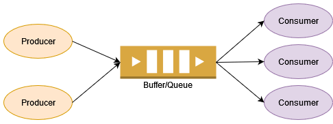
  ```cpp
  cond_t empty, fill;
  mutex_t mutex;

  void *producer(void *arg)
  {
      int i;
      for (i = 0; i < loops; i++)
      {
          pthread_mutex_lock(&mutex);
          while (count == MAX)
              pthread_cond_wait(&empty, &mutex);  // set 1
          put(i);
          pthread_cond_signal(&fill);             // set 2
          pthread_mutex_unlock(&mutex);
      }
  }

  void *consumer(void *arg)
  {
      int i;
      for (i = 0; i < loops; i++)
      {
          pthread_mutex_lock(&mutex);
          while (count == 0)
              pthread_cond_wait(&fill, &mutex);   // set 2
          int tmp = get();
          pthread_cond_signal(&empty);            // set 1
          pthread_mutex_unlock(&mutex);
          printf("%d\n", tmp);
      }
  }
  ```

### semaphores
- **semaphores:** is a variable with an underlying counter (not visible to user), two functions - up/post increments and down/wait decrements counter, calling thread blocked if resulting value negative, binary semaphore (init value 1) acts as a mutex
- **example: binary semaphore:**
  ```cpp
  semt_t m;
  sem_init(&m, 0, 1);

  sem_wait (&m);  // refcount 0, any other thread calling wait blocked
  // critical section
  sem_post(&m);
  ```
- **example: parent child with semaphore:**
  ```cpp
  sem_t s;

  void *child(void *arg)
  {
      printf("child\n");
      sem_post(&s);                           // signal here: child is done
      return NULL;
  }

  int main(int argc, char *argv[])
  {
      sem_init(&s, 0, 0);
      printf("parent: begin\n");
      pthread_t c;
      pthread_create(&c, NULL, child, NULL);
      sem_wait(&s);                           // blocked, wait here for child
      printf("parent: end\n");
      return 0;
  }
  ```
- **example: producer/consumer with semaphore:** need two semaphore for signaling full & empty and one binary semaphore to act as mutex for buffer
  ```cpp
  sem_t empty;
  sem_t full;
  sem_t mutex;

  void *producer(void *arg)
  {
      int i;
      for (i = 0; i < loops; i++)
      {
          // why mutex after sem_wait?
          // if mutex before wait, waiting thread sleeps with mutex
          // signaling thread cannot acquire lock and wake it up
          sem_wait(&empty);      // set 1
          sem_wait(&mutex);
          put(i);
          sem_post(&mutex);
          sem_post(&full);       // set 2
      }
  }

  void *consumer(void *arg)
  {
      int i;
      for (i = 0; i < loops; i++)
      {
          sem_wait(&full);       // set 2
          sem_wait(&mutex);
          int tmp = get();
          sem_post(&mutex);
          sem_post(&empty);      // set 1
          printf("%d\n", tmp);
      }
  }

  int main(int argc, char *argv[])
  {
      // ...
      sem_init(&empty, 0, MAX);  // MAX buffers are empty
      sem_init(&full, 0, 0);     // 0 buffers are full
      sem_init(&mutex, 0, 1);    // binary semaphore
      // ...
  }
  ```

### concurrency bugs
**concurrency bugs:** are non-deterministic and occur based on execution order of threads, very hard to debug
  - **non-deadlock bugs:** not blocking but incorrect results when threads execute
    - **atomicity bugs:** atomicity assumptions made by programmer are violated during execution of concurrent threads, fix: use locks for mutual exclusion
    - **order-violation bugs:** desired order of memory access is flipped during concurrent execution, fix: use conditional variables
  - **deadlocks:** threads cannot execute any further and wait for each other, all four of below conditions must hold for a deadlock to occur
    - **mutual exclusion:** a thread claims exclusive control of a resource
    - **hold-and-wait:** thread holds a resource and is waiting for another, to prevent acquire all locks at once by acquiring a master lock first
    - **no preemption:** thread cannot be made to give up its resource
    - **circular wait:** there exists a cycle in the resource dependency graph, to prevent always acquire locks in certain fixed order, total ordering (or partial ordering on related locks) must be followed
- **example: atomicity bug:** one threads reads & prints a shared data item while another concurrently modifies it
  ``` cpp
  // thread 1
  if (thd->proc_info)
  {
      // ...
      fputs(thd->proc_info, ...);
      // ...
  }

  // thread 2
  thd->proc_info = NULL;
  ```
- **example: order-violation bug:** thread1 assumes thread2 has already run
  ```cpp
  // thread 1
  void init()
  {
      // ... 
      m_thread = createthread(m_main, ...);
      // ...
  }

  // thread 2
  void m_main(...)
  {
      // ...
      m_state = m_thread->state;
      // ...
  }
  ```
- **example: deadlock:** thread1 holds lock1 and is waiting for lock2, thread2 holds lock2 and is waiting for lock1
  ```cpp
  // thread 1
  pthread_mutex_lock(l1);
  pthread_mutex_lock(l2);

  // thread 2
  pthread_mutex_lock(l2);
  pthread_mutex_lock(l1);
  ```
  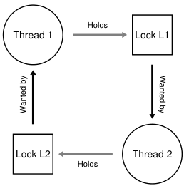
- **example: circular wait prevention:** total ordering:
  ```cpp
  // grab locks in high-to-low address order
  // code assumes m1 != m2
  if (m1 > m2)
  {
      pthread_mutex_lock(m1);
      pthread_mutex_lock(m2);
  }
  else
  {
      pthread_mutex_lock(m2);
      pthread_mutex_lock(m1);
  }
  ```
- **example: hold-and-wait prevention:** master lock:
  ```cpp
  pthread_mutex_lock(prevention);  // begin lock acquisition
  pthread_mutex_lock(l1);
  pthread_mutex_lock(l2);
  // ...
  pthread_mutex_unlock(prevention);  // end
  ```
- **other solutions to deadlocks:**
  - **deadlock avoidance:** if OS knew which process needs which locks then it can schedule the processes in a way that deadlock will not occur, impractical in real lift to assume OS having this knowledge
  - **detect and recover:** reboot system or kill deadlocked processes

## I/O and filesystems

### communication with I/O devices
- **port:** point of connection to the system, I/O devices connect to the CPU & memory via a bus to a port on the machine
- **simple device model:** block devices store a set of numbered blocks (disks), character devices produce/consume stream of bytes (keyboard), devices expose an interface of memory registers (like current status of device, command to execute, data to transfer), internals of device are usually hidden
- **OS registers read/write:**
  - **explicit I/O instructions:** privileged instructions used by OS to read & write to specific registers on device
  - **memory mapped I/O:** device makes registers appear like memory locations, OS simply reads/writes from memory (part of address space reserved for I/O devices), memory hardware routes accesses to these special memory addresses to devices
- **example: simple execution of I/O requests:** polling status to see if device ready, wastes CPU cycles, CPU explicitly copies data to/from device (programmed I/O)
  ```cpp
  while (STATUS == BUSY)
      ;                               // wait until device is not busy
  write data to DATA register;        // programmed I/O
  write command to COMMAND register;  // starts the device and executes the command
  while (STATUS == BUSY)
      ;                               // wait until device is done with your request
  ```
- **interrupt request (IRQ):** polling wastes CPU cycles, instead OS can put process to sleep and switch to another process, when I/O request completes device raises interrupt  
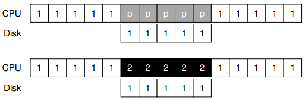
- **interrupt handler:** interrupt switches process to kernel mode, interrupt descriptor table (IDT) stores pointers to interrupt handlers (interrupt service routines (ISR)), IRQ number identifies the interrupt handler to run for a device, interrupt handler acts upon device notification and unblocks the process waiting for I/O (if any) then starts next I/O request (if any pending), handling interrupts imposes kernel mode transition overheads (polling may be faster than interrupts if device is fast)
- **direct memory access (DMA):** cpu cycles wasted in copying data to/from device, instead special piece of hardware (DMA engine) copies from main memory to device, CPU gives DMA engine the memory location, size & destination of data, in case of read interrupt raised after DMA completes, in case of write disk starts writing after DMA completes  
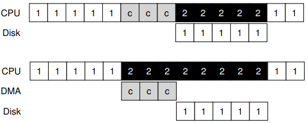
- **device driver:** part of OS code that talks to specific device, gives commands and handles interrupts, most OS code abstracts the device details, example: file system code is written on top of a generic block device  
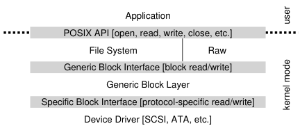

### files & directories
- **file:** linear array of bytes, stored persistently, identified with filename (human readable) and a OS level identifier index node (inode) number, inode number is unique within a filesystem
- **directory:** contains other subdirectories and files along with their inode numbers, stored like a file whose contents are filename-to-inode mappings
- **directory tree:** files & directories arranged in a tree starting with root (/)  
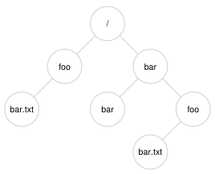
- **file operations:**
  - **create:** `open()` system call with flag to create, returns a numbers called file descriptor (fd)
  - **open:** existing files must be opened before they can be read/written, also uses `open()` system call and returns fd, all further operations on files uses the fd
  - **closing:** `close()` system call closes the file
  - **read/write:** `read()`/`write()` system calls, reading/writing happens sequentially by default (successive read/write calls fetch from current offset), `lseek()` system call lets you seek to random offset, writes are buffered in memory temporarily so `fsync()` system call flushes all writes to disk
  - other operations: rename file delete (unlink) file, get statistics of a file
- **directory operations:** directory can also be accessed like files, operations like create, open, read & close
- **example: `ls` program:** `ls` program opens and reads all directory entries
  ```cpp
  int main(int argc, char *argv[])
  {
      DIR *dp = opendir(".");
      assert(dp != NULL);
      struct dirent *d;
      while ((d = readdir(dp)) != NULL)
      {
          printf("%lu %s\n", (unsigned long)d->d_ino, d->d_name);
      }
      closedir(dp);
      return 0;
  }
  ```
- **hard link:** creates another file that points to the same inode number and hence same underlying data, even if one file deleted the file data can be accessed through the other links, inode maintains a link count, file data deleted only when no further links to it, you can only unlink, OS decides when to delete, linking created using `ln` command
  ```sh
  # same data
  $ echo hello > file
  $ cat file
  hello
  $ ln file file2  # command
  $ cat file 2
  hello

  # same inode number
  $ ls -i file file2
  67158084 file
  67158084 file2

  # link count
  $ rm file
  removed 'file'
  $ cat file2
  hello
  ```
- **soft/symbolic link:** is a file that simply stores a pointer to another filename, if main file is deleted then the link points to invalid entry (dangling reference)
  ```sh
  $ ls -al
  drwxr-x--- 2 remzi remzi 29 May 3 19:10 ./
  drwxr-x--- 27 remzi remzi 4096 May 3 15:14 ../
  -rw-r----- 1 remzi remzi 6 May 3 19:10 file
  lrwxrwxrwx 1 remzi remzi 4 May 3 19:10 file2 ⟶ file  # soft linking,
                                                        # note small size of soft link

  # same data
  $ echo hello > file
  $ ln -s file file2  # command
  $ cat file2
  hello

  # no link count
  $ rm file
  $ cat file2
  cat: file2: no such file or directory
  ```
- **mounting a file system:** mounting a file system connects the files to a specific point in the directory tree, several devices & file systems are mounted on a typical machine, using `mount` command
  ```sh
  $ mount -t ext3 /dev/sda1 /home/users
  $ ls /home/users/
  a b
  ```
- **memory mapping a file:** alternate way of accessing a file instead of using fd & read/write syscalls, `mmap()` allocates a page in virtual address space of a process, when file is mmaped file data copied into one or more pages in memory, can be accessed like any other memory location in program
  - **anonymous page:** used to store program data
  - **file-backed page:** contains data of file, filename provided as arg to `mmap()`

### file system implementation
- **file system:** an organization of files & directories on disk, OS has one or more file systems, disk exposes set of blocks (usually 512 bytes), file system organizes files onto blocks, two main aspects of file systems are
  - data structures to organize data & metadata on disk
  - implementation of system calls like open, read, write using data structures
- **simple file system organization:**  
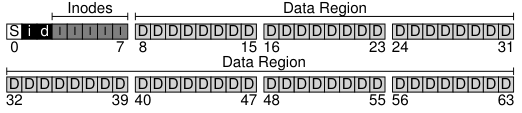
  - **data blocks:** file data stored in one or more blocks
  - **inode:** stores metadata about every file
  - **inode blocks:** each block has one or more inodes
  - **bitmaps:** indicate which inodes/data blocks are free, `i` & `d` in picture
  - **superblock:** holds master plan of all other blocks, example: which are inodes, which are data blocks, `S` in picture
- **inode table:** inodes usually stored in array, inode number of a file is index into this array, inode stores file metadata (like permissions, last accessed time) & pointers (disk block numbers) of file data  
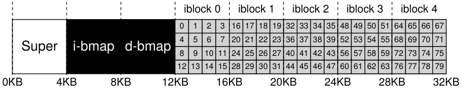
- **inode structure:** file data not stored contiguously on disk, so need to track multiple block numbers of file, inode tracks disk block numbers using
  - **direct pointers:** numbers of first few blocks are stored in inode itself, enough for small files
  - **indirect block:** for larger files inode stores number of indirect blocks which has block numbers of file data
  - similarly double & triple indirect blocks (multi-level index)
- **file allocation table (FAT):** alternate way to track file blocks, FAT stores next block pointer for each block, each disk block has one entry with number of next file block (or null if last block), pointer to first block stored in inode, similar to a linked list
- **directory structure:** directory stores records mapping filename to inode number, this mapping can be done using algorithms like linked list or hash table or binary search tree, directory is a special type of file and has inode & data blocks (which store the file records)
- **free space management:** to track free blocks
  - **bitmap:** store one bit per data block to indicate if free or not
  - **free list:** super block stores pointer to first free block which inturn stores address of next free block
- **opening a file:** to have the inode readily available (in memory) for future operations (read/write) on file
  - pathname of file is traversed starting from root, inode of root is known
  - recursively do: fetch inode of parent directory  ⟶  read its data blocks  ⟶  get inode number of each child  ⟶  fetch inode of child, repeat till end of path
  - if new file: new inode & data blocks will have to be allocated using bitmap and directory entry updated
- **open file table:** set of data structures to track open files
  - **global open file table:** one entry for every file opened (even sockets & pipes), entry points to in-memory copy of inode
  - **per-process open file table:** array of files opened by process, fd number is index into this array, per-process table entry points to global open file table entry, every process has three files open by default: std in, std out & std err (fd 0, 1 & 2), `open()` system call creates entries in both tables and returns fd number
- **reading/writing a file:**
  - access in-memory inode via fd
  - find location of data block at current read/write offset
  - fetch data from disk and perform operation
  - writes may need to allocate new blocks from disk using bitmap of free blocks
  - update time of access & other metadata in inode
- **virtual file system (VFS):** file systems differ in implementations of data structures, hence linux supports VFS abstraction, VFS looks a file systems as objects (files, directories, inodes, superblock) and operations on these objects (like lookup filename in directory), system call logic is written on VFS objects, to develop a new file system simply implement functions on VFS objects and provide pointers to these functions to kernel, syscall implementation does not have to change with file system implementation details
- **disk buffer cache:** results of recently fetched disk blocks are cached, file system issues block read/write requests via buffer cache, served from cache if cache hit, else block fetched to cache and returned to file system, unified page cache: free pages allocated to both processes and disk buffer cache from common pool, writes are applied to cache block either
  - **synchronously (write-through):** cache writes to disk immediately
  - **asynchronously (write-back):** cache stores dirty block in memory and writes back after delay
- **disk buffer benefits:**
  - improved performance due to reduced disk I/O
  - single copy of block in memory, so no inconsistency across processes

### hard disk internals
- **hard disk internals:** a set of 512 byte blocks (sectors) that can be read/written atomically, one or more platters connected by a spindle spin at ~10K rpm, each plater has a disk head & arm attached to it, a platter is divided into multiple tracks and each track into 512 byte sectors  
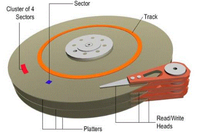
- **hard disk sector access:** seek to the correct track while waiting for disk to rotate, example: sector 30 to 11  
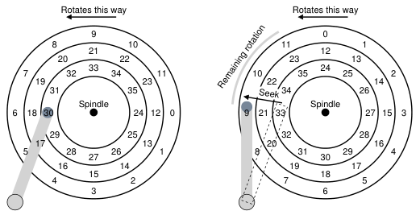
- **time taken for I/O operation:** given high seek & rotational latency usually rate of sequential access is much higher than random access
  - seek time to get to right track (few ms)
  - rotational latency for disk to spin to correct sector (few ms)
  - data transfer time to read sector (few tens μs)
- **disk scheduling:** requests to disk are not served in FIFO, they are reordered with other pending requests in order to read blocks in sequence as far as possible (to minimize seek time & rotational delay), OS does not know internal geometry of disk so scheduling done mostly by disk controller
  - **shortest seek time first (SSTF):** access block that we can seek to fastest, problem: some requests that are far from current position or head may never get served (starvation), example: from 30 go to 21 before 2  
  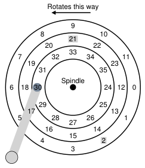
  - **elevator/SCAN algorithm:** disk head does one sweep over tracks and serves requests that fall on the path
    - **elevator/SCAN:** sweep outer to inner then inner to outer
    - **circular-SCAN:** sweep only one direction and circle back to start again, sweeping back & forth favors middle tracks more
    - **freeze-SCAN:** freeze queue while scanning to avoid starving far away requests
  - **shortest positioning time first (SPTF):** considers both seek time & rotational latency, example: better to serve 8 before 16 even though seek time is higher but 16 incurs a much higher rotational latency  
  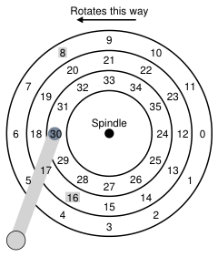
- **error detection/correction:** bits stored on disk with some error detection/correction bits, correct random bit flips or detect corruption of data, disk controller or OS can handle some errors (blacklisting certain sectors), if errors cannot be masked user perceives hard disk failures
- **redundant array of inexpensive disks (RAID):** provide high reliability & performance by replicating across multiple disks

## xv6
- **memory image of a process:** consists of:  

  - compiled code (cpu instructions)
  - global/static variables (memory allocated at compile time)
  - heap (dynamic memory allocation) that grows on demand
  - stack (temporary storage during function calls)
  - other things like shared libraries
- **x86 registers:** small space for data storage within CPU
  - **general purpose registers:** to store data during computation (`eax`, `ebx`, `evx`, `edx`, `esi`, `edi`)
  - **stack location pointers:** base of stack `ebp` and top of stack `esp`
  - **instruction pointer:** next instruction to execute `eip`
  - **control registers:** hold metadata of a process (like pointer to page table)