# performance
- [introduction](#introduction)
  - [example: matrix multiplication performance optimization](#example-matrix-multiplication-performance-optimization)
- [Bentley optimization rules](#bentley-optimization-rules)
  - [data structures](#data-structures)
  - [logic](#logic)
  - [loops](#loops)
  - [functions](#functions)

## links  <!-- omit from toc -->


## todo  <!-- omit from toc -->
- [performance engineering (MIT 2018)](https://ocw.mit.edu/courses/6-172-performance-engineering-of-software-systems-fall-2018/)
- SIMD - NEON & Hexagon DSP
  - intrinsic or assembly instructions
- [gpu programming (IITM 2022)](http://www.cse.iitm.ac.in/~rupesh/teaching/gpu/jan22/)
- [programming massively parallel processors (UIUC 2018)](https://www.youtube.com/playlist?list=PLRRuQYjFhpmvu5ODQoY2l7D0ADgWEcYAX)
- [compiler explorer](https://godbolt.org/)
- [an even easier introduction to CUDA](https://developer.nvidia.com/blog/even-easier-introduction-cuda/)
- [Amdahl's law paper](https://inst.eecs.berkeley.edu//~n252/paper/Amdahl.pdf)
- [Arrayfire](https://github.com/arrayfire/arrayfire)
- [Duff's device](https://en.wikipedia.org/wiki/Duff%27s_device)
- [NEON2SSE](https://github.com/intel/ARM_NEON_2_x86_SSE)
- [SIMD javidx9](https://www.youtube.com/watch?v=x9Scb5Mku1g)
- [SIMD perf tests](https://github.com/ARM-software/meabo)
- [x64 assembly programming & check other playlists](https://www.youtube.com/playlist?list=PLKK11Ligqitg9MOX3-0tFT1Rmh3uJp7kA)
- static sparse graph using CSR

## introduction
- ***the first rule of program optimization: don't do it  
second rule of program optimization: for experts only, don't do it yet***
- there are software properties that are more important that performance, like modularity, reliability, portability, maintainability, testability etc  
then **why performance:** performance is the currency of computing using which we often buy needed properties  
- Moore's law and scaling of clock frequency was the printing press for the currency of performance, but that came to an end in 2004 when clock speed plateaued  
to scale performance, processor manufacturers put many processing cores on the microprocessor chip  
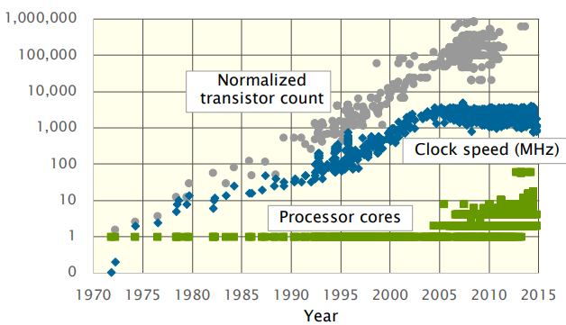  
performance is no longer free, now it looks like big multicore processors with complex cache hierarchies, wide vector units, GPUs, FPGAs, etc  
so now the software must be adapted to utilize this hardware efficiently
- **iron law of processor performance:** trade-off between complexity and the number of primitive instructions that processors use to perform calculation  
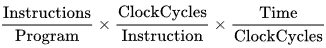
- **Amdahl's law:** overall performance improvement gained by optimizing a single part of a system is limited by the fraction of time that the improved part is actually used  
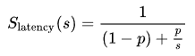  
`Slatency` theoretical speedup  
`s` speedup of optimized part  
`p` fraction of time

### example: matrix multiplication performance optimization
- execution of matrix multiplication of 4096 x 4096 floating-pointing point matrix in python takes 6 hours, in java takes 46 minutes (8.81x relative speedup), in C takes 19 minutes (2.07x relative speedup)  
python is interpreted, C is compiled directly to machine code and java is (in the middle) compiled to byte-code which is then interpreted by just-in-time (JIT) compiled to machine code
  ```cpp
  for (int i = 0; i < n; ++i)
      for (int j = 0; j < n; ++j)
          for (int k = 0; k < n; ++k)
              C[i][j] += A[i][k] * B[k][j];
  ```
- **interpreter:** reads, interprets & performs each program statement and updates the machine state  
interpreters are versatile (easily support high-level programming features) but at the cost of performance  
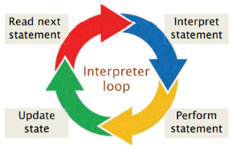
- **JIT compilation:** can recover some of the performance lost by interpretation, code is interpreted when it is first executed, whenever some piece of code executes sufficiently frequently it get compiled to machine code in real time, future executions will use the more efficient compiled version
- **loop order:** we can change the order of the loops in a program without affecting its correctness  
example: in the matrix multiplication program `i, k, j` gives a 6.5x speedup over `i, j, k`, this is because matrices are laid out in memory in row-major layout  
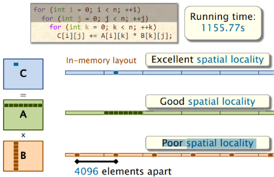  
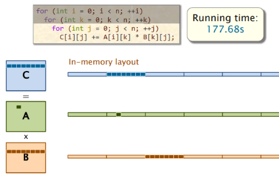  
we can measure the effect of different access patterns using cachegrind: `valgrind --tool=cachegrind ./mm.exe`
- **compiler optimization:** compilers provide a collection of optimization switches which we can specify, example: `-O2` gives a 3.2x speedup over `-O0`  
compilers also support optimization levels for special purposes such as for size `-Os` or for debugging `-Og`
- **multicore parallelism:** use all cores in the processor instead of just 1 we are running now  
example: use `cilk_for` loop to allow iterations of the easily parallelized loop to execute in parallel, this will give 12x speedup on 12 cores  
rule of thumb is to parallelize outer loops rather than inner loops due to scheduling overhead, parallelizing just `i` loop gives a 167x speedup in performance compared to when only `j` loop parallelized
  ```cpp
  cilk_for (int i = 0; i < n; ++i)
      for (int k = 0; k < n; ++k)
          for (int j = 0; j < n; ++j)
              C[i][j] += A[i][k] * B[k][j];
  ```
- **data reuse (tiling):** restructure the computation to make the most of the cache by reysing the data that's already there since cache misses are slow and hits are fast  
example: tiled matrix multiplication, tuning parameter `s` needs to be figured out by experimentation  
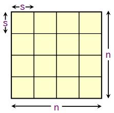
  ```cpp
  cilk_for(int ih = 0; ih < n; ih += s)
      cilk_for(int jh = 0; jh < n; jh += s)
          for (int kh = 0; kh < n; kh += s)
              for (int il = 0; il < s; ++il)
                  for (int kl = 0; kl < s; ++kl)
                      for (int jl = 0; jl < s; ++jl)
                          C[ih + il][jh + jl] += A[ih + il][kh + kl] * B[kh + kl][jh + jl];
  ```  
  for a two-level cache, unlike the 1D tiling where binary search can be used for the tuning parameter, in 2D tiling we need exhaustive experimentation (of all possibilities) to arrive at best tuning parameters  
  
- **recursive matrix multiplication (divide & conquer):** tile for every power of 2 simultaneously  
example: so 8 multiplications of n/2 x n/2 and 1 addition of n x n matrix  
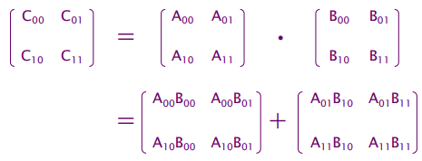  
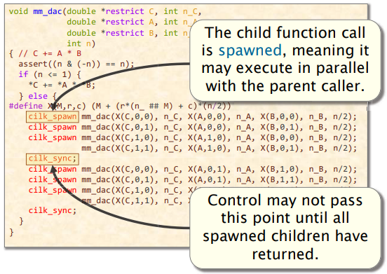  
but performance is degraded because we have a very small base case (`n == 1`) leading to higher function-call overhead, so we must coarsen the recursion by introducing a threshold  
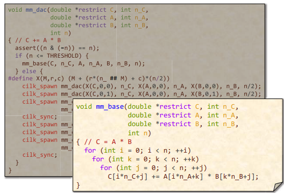
- **vector hardware:** modern processors incorporate vector hardware to process data in single-instruction stream multiple-data stream fashion  
compilers use vector instructions automatically when compiling at optimization level `-O2` or higher, but many machines don't support the newest set of vector instructions so the compiler uses vector instructions conservatively by default  
**intrinsic instructions:** C-style functions that provide direct access to hardware vector operations
- so performance engineering is the cycle of think -> code -> run to test & measure  
with above discussed optimizations, we received a speedup of 53292x  
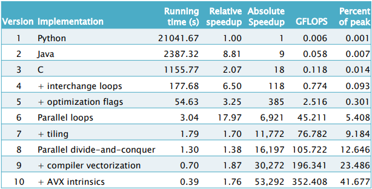

## Bentley optimization rules
- **work:** of a program on a given input is the sum total of all the operations executed by the program
- algorithm design can produce dramatic reductions in the amount of work it takes to solve a problem, example: a `O(nlogn)`-time quick sort replacing `O(n^2)`-time insertion sort  
reducing the work of a program doesn't automatically reduce its running time due to the complex nature of computer hardware (ILP, caching, vectorization, speculation, branch prediction, etc), but reducing the workload serves as a good heuristic for reducing overall running time
- 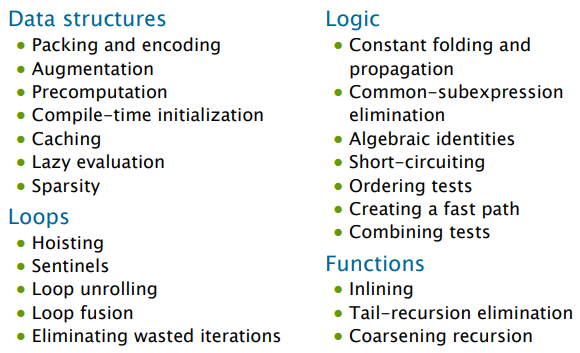

### data structures
- **packing & encoding:** idea of packing is to store more than one data value in a machine word and of encoding is to convert data values into a representation requiring fewer bits  
example: encoding date in a string `september 11 2008` will need 18 bytes, but assuming years are from 4096BC to 4096AD then there are `365.25 * 404096 * 2 ≈ 3x10^6` which can be encoded in `log2(3x10^6) ≈ 22` bits  
to make fetching of data easier it can be packed into bitfields where individual fields can be extracted much more quickly than if we had encoded the 3M dates as sequential integers
  ```cpp
  typedef struct
  {
      int year : 13;
      int month : 4;
      int dat : 5;
  } date_t;
  ```
- **augmentation:** add information to a data structure to make common operations do less work  
example: appending one singly linked list to another requires walking the length of the first lost to set its null pointer to the start of the second, instead augment the list with a tail pointer that allows appending to operate in constant time  
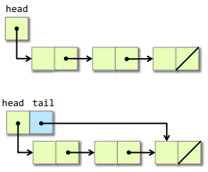
- **precomputation:** perform calculations in advance so as to avoid doing them at mission critical times  
example: if a function needs binomial coefficients at runtime, instead precompute the coefficients (Pascal's triangle) for a certain size when initializing and perform table look-up at runtime  
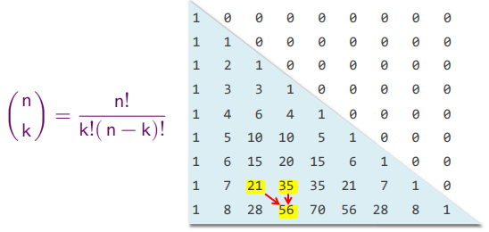
  ```cpp
  // function used for precomputation
  int choose(int n, int k)
  {
      if (n < k) return 0;
      if (n == 0) return 1;
      if (k == 0) return 1;
      return choose(n - 1, k - 1) + choose(n - 1, k);
  }
  ```
- **compile-time initialization:** store values of constants during compilation saving work during execution time  
example: store hardcoded binomial coefficients from previous example in a 2D array  
large static tables can be created using metaprogramming or if you don't want to copy the structure then implement it in macros so compiler does the work of computing them
  ```cpp
  printf("int choose[10][10] = {\n");
  for (int a = 0; a < 10; ++a)
  {
      initialize_choose();
      printf("  {");
      for (int b = 0; b < 10; ++b)
      {
          printf("%3d, " choose[a][b]);
      }
      printf("  },\n");
  }
  printf("};\n");
  ```
- **caching:** store results that have been accessed recently so that the program need not compute them again  
example: to get hypotenuse of a right-angled triangle `sqrt(A^2 + B^2)` but square-root operator is expensive so cache the previous results, realistically cache size will be larger to increase hit rate
  ```cpp
  double hypotenuse(double A, double B)
  {
      if (A == cached_A && B == cached_B)
      {
          return cached_h;
      }

      cached_A = A;
      cached_B = B;
      cached_h = sqrt(A * 2 + B * 2);

      return cached_h;
  }
  ```
- **sparsity:** avoid storing and computing on zeroes, *the fastest way to compute is not to compute at all*  
example: matrix-vector multiplication of a sparse matrix, dense matrix-vector multiplication performs `n^2` scalar multiplications but only 14 entries are non-zero  
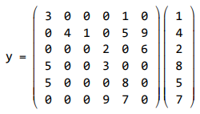  
we can check if one of the arguments is zero, but this needs to check every matrix entry  
**compressed sparse row:** a sparse matrix is compressed into a `rows` (storing offset to that row in `cols` array), `cols` array (storing positions with non-zero values) and `vals` array with actual matrix position values  
to get a row's size just take the difference of current & next row offsets, we have 6th row here so we can calculate size of last row  
`nnz` is number of non-zero elements, storage is `O(n + 2 * nnz)` instead of `O(n^2)` and multiplications are `nnz` instead of `n^2`  
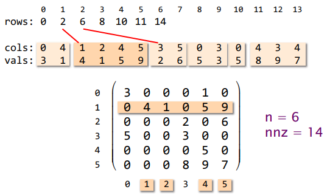  
  ```cpp
  typedef struct
  {
      int n, nnz;
      int *rows;     // size n
      int *cols;     // size nnz
      double *vals;  // size nnz
  } sparse_matrix_t;

  void spmv(sparse_matrix_t *A, double *x, double *y)
  {
      for (int i = 0; i < A->n; i++)
      {
          y[i] = 0;
          for (int k = A->rows[i]; k < A->rows[i + 1]; k++)
          {
              int j = A->cols[k];
              y[i] += A->vals[k] * x[j];
          }
      }
  }
  ```

### logic
- **constant folding & propagation:** evaluate constant expressions and substitute the result into further expressions all during compilation, with a sufficiently high optimization level all expressions are evaluated at compile-time  
example: building a orrery (model of a solar system) assuming earth's constant radius
  ```cpp
  void orrery()
  {
      const double radius = 6371000.0;
      const double diameter = radius * 2;
      const double circumference = M_PI * diameter;
      const double cross_area = M_PI * radius * radius;
      const double surface area = circumference * diameter
  }
  ```
- **common-subexpression elimination:** avoid computing the same expression multiple times buy evaluating the expression once and storing the result for later use  
example: same calculation repeated
  ```cpp
  // normal
  a = b + c;
  b = a - d;
  c = b + c;
  d = a - d;

  // improved
  a = b + c;
  b = a - d;
  c = b + c;  // cannot be eliminated as b has changed
  d = b;      // common-subexpression elimination
  ```
- **algebraic identities:** replace expensive algebraic expressions with algebraic equivalents that require less work  
example: calculating if two balls collide
  ```cpp
  typedef struct
  {
      double x;
      double y;
      double x;
      double r;
  } ball_t;

  double square(double x) { return x * x; }

  // normal
  bool collides(bal_t* b1, ball_t* b2)
  {
      double d = sqrt(square(b1->x - b2->x) + square(b1->y - b2->y) +
                      square(b1->z - b2->z));
      return (d <= b1->r + b2->r);
  }

  // improved
  // sqrt(u) <= v  is equivalent to  u <= v^2
  // square requires much less work compared to sqrt
  bool collides(bal_t* b1, ball_t* b2)
  {
      double dsquared = square(b1->x - b2->x) + square(b1->y - b2->y) +
                      square(b1->z - b2->z);
      return (dsquared <= square(b1->r + b2->r));
  }
  ```
- **short-circuiting:** when performing a series of tests stop evaluating as soon as you know the answer, `&&` & `||` are short circuiting logical operators  
example: check if sum of a array of non-negative numbers is larger than limit, improve it by checking partial sum, this will be slower if most of the times we add entire/most of the array
  ```cpp
  // normal
  bool sumExceeds(int* A, int size, int limit)
  {
      int sum = 0;
      for (int i = 0; i < size; i++)
      {
          sum += A[i];
      }

      return (sum > limit);
  }

  // improved
  bool sumExceeds(int* A, int size, int limit)
  {
      int sum = 0;
      for (int i = 0; i < size; i++)
      {
          sum += A[i];
          if (sum > limit)
          {
              return true;
          }
      }

      return false;
  }
  ```
- **ordering tests:** if a code executes a sequence of logical tests then perform those tests that pass most often first, similarly inexpensive tests should precede expensive ones  
example: check if character is whitespace, space and newline occur more than other two so check for them first, carriage-return is always never used so last
  ```cpp
  bool isWhitespace(char c)
  {
      if (c == ' ' || c == '\n' || c == '\t' || c == '\r')
      {
          return true
      }

      return false;
  }
  ```
- **creating a fast path:** create an alternate route that would help us reach the result quicker  
example: in the balls colliding example, add a extra check if bounding boxes overlap  
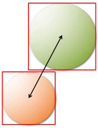
  ```cpp
  bool collides(bal_t* b1, ball_t* b2)
  {
      if ((abs(ba->x - b2->x) > (b1->r + b2->r)) ||
          (abs(ba->y - b2->y) > (b1->r + b2->r)) ||
          (abs(bz->x - b2->z) > (b1->r + b2->r)))
      {
          return false;
      }

      double dsquared = square(b1->x - b2->x) + square(b1->y - b2->y) +
                      square(b1->z - b2->z);

      return (dsquared <= square(b1->r + b2->r));
  }
  ```
- **combining tests:** replace a sequence of tests with one test or switch  
example: for a full adder truth table implementation, instead of a large if else table for each combination combine them into a switch case  
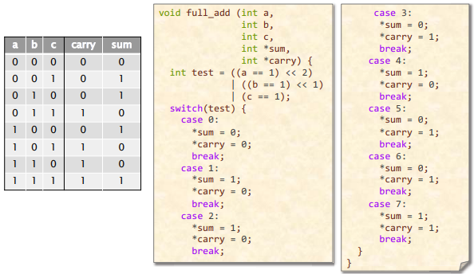

### loops
- **hoisting (loop-invariant code motion):** avoid recomputing loop-invariant code each time through the body of a loop, usually compiler can take care of this  
example: scaling a array
  ```cpp
  // normal
  void scale(double* x, double* y, int n)
  {
      for (int i = 0; i < n; i++)
      {
          y[i] = x[i] * exp(sqrt(M_PI / 2));
      }
  }

  // improved
  void scale(double* x, double* y, int n)
  {
      double factor = exp(sqrt(M_PI / 2));
      for (int i = 0; i < n; i++)
      {
          y[i] = x[i] * factor;
      }
  }
  ```
- **sentinels:** are special dummy values placed in a data structure to simplify logic of boundary conditions and in particular handling of loop-exit tests  
example: check if sum of array of non-negative values has overflowed (will be negative due to wrap around), improve it by having only one check per iteration
  ```cpp
  // normal
  bool overflow(int64_t* a, size_t n)
  {
      int64_t sum = 0;
      for (size_t i = 0; i < n; i++)
      {
          sum += a[i];
          if (sum < a[i]) return true;
      }

      return false;
  }

  // improved
  // assume a[n] & a[n+1] exist
  bool overflow(int64_t* a, size_t n)
  {
      a[n] = INT64_MAX;  // to force overflow
      a[n + 1] = 1;      // or any positive number
                         // to handle corner case of all elements 0

      size_t i = 0;
      int64_t sum = a[0];
      while (sum >= a[i])
      {
          sum += a[++i];
      }

      if (i < n) return true;  // check early exit

      return false;
  }
  ```
- **loop unrolling:** save work by combining several consecutive iterations of a loop into a single iteration thereby reducing the total number of iterations and hence reducing execution of the loop control instructions
example: for a array sum
  ```cpp
  int sum = 0;
  for (int i = 0; i < 10; i++)
  {
      sum += a[i];
  }
  ```
  - **full:** all iterations unrolled, usually for small loops, will pollute instruction cache for large loops
    ```cpp
    int sum = 0;
    sum += a[0];
    sum += a[1];
    sum += a[2];
    sum += a[3];
    sum += a[4];
    sum += a[5];
    sum += a[6];
    sum += a[7];
    sum += a[8];
    sum += a[9];
    ```
  - **partial:** several but not all iterations are unrolled, loop exit conditions need to be done only every 4 iterations  
  much bigger benefit it allows more compiler optimizations since it increases the size of loop body that gives compiler more freedom to play around with code  
  will pollute instruction cache if loop body is too large (too much unrolling)
    ```cpp
    int sum = 0;
    int j;
    for (j = 0; j < n - 3; j += 4)
    {
        sum += a[j];
        sum += a[j + 1];
        sum += a[j + 2];
        sum += a[j + 3];
    }

    for (int i = j; i < n; ++i)  // deal with remaining elements
    {
        sum += a[i];
    }
    ```
- **loop fusion (jamming):** combine multiple loops over the same index range into a single loop body thereby saving the overhead of loop control  
example: computing lane-wise minimum & maximum among two arrays, improves cache locality as well
  ```cpp
  // normal
  for (int i = 0; i < n; ++i)
  {
      c[i] = (a[i] <= b[i]) ? a[i] : b[i];  // minimum
  }
  for (int i = 0; i < n; ++i)
  {
      d[i] = (a[i] <= b[i]) ? b[i] : a[i];  // maximum
  }

  // improved
  for (int i = 0; i < n; ++i)
  {
      c[i] = (a[i] <= b[i]) ? a[i] : b[i];  // minimum
      d[i] = (a[i] <= b[i]) ? b[i] : a[i];  // maximum
  }
  ```
- **eliminating wasted iterations:** modify loop bounds to execute iterations over essentially empty loop bodies  
example: matrix transpose, half iterations will fail the check in normal code, improve it by changing loop condition to include the condition in loop control
  ```cpp
  // normal
  for (int i = 0; i < n; ++i)
  {
      for (int j = 0; j < n; ++j)
      {
          if (i > j)
          {
              int temp = a[i][j];
              a[i][j] = a[j][i];
              a[j][i] = temp;
          }
      }
  }

  // improved
  for (int i = 0; i < n; ++i)
  {
      for (int j = 0; j < i; ++j)
      {
          int temp = a[i][j];
          a[i][j] = a[j][i];
          a[j][i] = temp;
      }
  }
  ```

### functions
- **inlining:** avoid the overhead of a function-call by replacing a call to the function with the body of the function itself  
need not be done manually set function to `static inline`, inline functions can be just as efficient as macros and are better structured  
example: sum of squares
  ```cpp
  // normal
  double square(double x) { return x * x; }

  double sumOfSquares(double* a, int n)
  {
      double sum = 0.0;
      for (int i = 0; i < n; ++i)
      {
          sum += square(a[i]);
      }
  }

  // improved 1
  double sumOfSquares(double* a, int n)
  {
      double sum = 0.0;
      for (int i = 0; i < n; ++i)
      {
          sum += a[i] * a[i];
      }
  }

  // improved 2
  static inline double square(double x) { return x * x; }
  ```
- **tail-recursion elimination:** replace a recursive function call that occurs as the last step of the function with a branch saving function-call overhead (additional stack frame)  
example: factorial of a number, replace regression with loop  
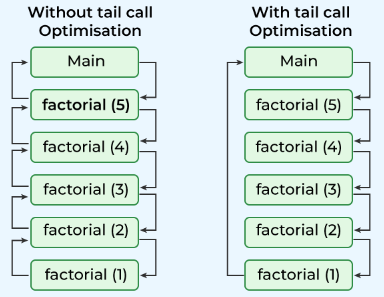
  ```cpp
  // normal
  // accum passed as 1
  uint32_t factorial(uint32_t n, uint32_t accum)
  {
      if (n <= 1) return accum;

      return factorial((n - 1), (accum * n));
  }

  // improved
  uint32_t factorial(uint32_t n, uint32_t accum)
  {
      while (1)
      {
          if (n <= 1) return accum;
          accum = accum * n;
          n--;
      }
  }
  ```
- **coarsening recursion:** increase the size of the base case (when the recursion stops) and handle it with more efficient code that avoids function-call overhead  
idea is to avoid recursing all the way down to the base case, instead we can make the base case coarser  
example: quicksort will switch to a simple loop-based insertion sort algorithm once the number of items to be sorted is sufficiently small  
  ```cpp
  // normal
  void quickSort(int* a, int n)
  {
      while (n > 1)
      {
          int r = partition(a, n);
          quicksort(a, r);
          a += r + 1;
          n -= r + 1;
      }
  }

  // improved
  void quickSort(int* a, int n)
  {
      while (n > 1)
      {
          int r = partition(a, n);
          quicksort(a, r);
          a += r + 1;
          n -= r + 1;
      }

      // insertion sort for small arrays
      for (int j = 1; j < n; ++j)
      {
          int key = a[j];
          int i = j - 1;
          while (i >= 0 && a[i] > key)
          {
              a[i + 1] = a[i];
              --i;
          }
          a[i + 1] = key;
      }
  }
  ```

[continue](https://www.youtube.com/watch?v=ZusiKXcz_ac&list=PLUl4u3cNGP63VIBQVWguXxZZi0566y7Wf&index=3)