- [introduction](#introduction)
- [procedures \& processes](#procedures--processes)
- [higher order procedures](#higher-order-procedures)
- [compound data](#compound-data)
- [Henderson-Escher example](#henderson-escher-example)
- [clean code](#clean-code)
- [misc](#misc)

# links  <!-- omit from toc -->
- [[playlist] structure and interpretation of computer programs
](https://ocw.mit.edu/courses/6-001-structure-and-interpretation-of-computer-programs-spring-2005/) ([notes](https://mk12.github.io/sicp/lecture/1a.html))
- [scheme interpreter](https://try.scheme.org/)
- [SICP distilled](https://www.sicpdistilled.com/)
- [SICP video notes](https://nebhrajani-a.org/sicp/video_notes)

# introduction
- *The key to understanding complicated things is to know what not to look at and what not to compute and what not to think*
- ancient Egyptians began geometry using surveying instruments to measure earth (`geometry = gaia + metron`) but we now know that the essence of geometry is much bigger than the act of using these primitive tools  
we often conflate the essence of a field with its tools (like computers for computer science)
- computer science deals with idealized components unlike physical system where one has to worry about constraints of tolerance, approximation & noise  
so for building a large program there isn't much difference between what I can imagine & what I can build
- **declarative:** "what is true" knowledge, example: `y` is `sqrt(x)` iff `y^2 = x`  
**imperative:** "how to" knowledge, example: square-root by successive averaging of guess `g` & `x/g` until result doesn't change much
- **procedure:** is the description/recipe of the process  
**process:** is the result of applying a procedure to arguments  
example: procedure is the blueprint, while process is the actual building construction
- **techniques for controlling complexity:** make building very large programs possible
  - **black-box abstraction:** putting something in a box to suppress details to go ahead & build bigger boxes  
  OR if your "how-to" method is an instance of a more general thing  
  example: fixed point of a function (`f(y) = y`) by successive applying `f(g)` until result doesn't change much can be used for square-root if `f(g)` is average of `g` & `x/g` (average procedure as a argument to square root procedure)
  - **conventional interfaces:** agreed upon ways of plugging things together (generic operations, object-oriented programming)  
  example: use `(* x (+ a b))` to add-then-scale numbers, vectors, polynomial, analog signals etc
  - **metalinguistic abstraction:** pick/construct a new domain-specific design language that will highlight different aspect of the system (suppress some kind of details while emphasizing others)  
  process of interpreting lisp is like a giant wheel of two processes `apply` & `eval` which reduce expressions to each other  
  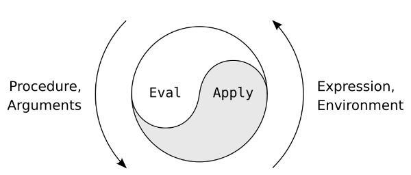
- **lisp basics:** for learning any language we need to know three things: primitive elements, means of combination & means of abstraction  
prefix notation `(+ x y)` used uniformly since it is more generic & can take multiple arguments  
lisp make no arbitrary distinction between built-in & user-defined procedures, example: using `square` after defining it similar to using built-in procedures
  ```lisp
  ; primitive elements
  5                            ; 5
  3.14                         ; 3.14
  +                            ; PrimitiveProcedure (functions)

  ; means of combination
  ; composition
  (+ 5 3.14 1)                 ; 9.14
  (+ 4 (* 3 6) 8 2)            ; 32
  ; case analysis
  ; using cond
  (define (abs x)
    (cond ((< x 0) (- x))      ; (cond ([predicate1] [action1]) (<predicate2> <action2>))
          ((= x 0) 0)
          ((> x 0) x)))
  ; using if for single case
  (define (abs x)              ; (if [predicate] <consequent> <alternative>)
    (if (< x 0)
        (- x)
        x))

  ; means of abstraction
  ; define variable
  (define pi 3.14)             ; pi
  (* pi pi)                    ; 9.869604403666765
  ; define procedure
  (define (square x) (* x x))  ; square
  (square (+ 1 4))             ; 25
  square                       ; (lambda (x) (* x x))
                               ; (square x) is same as square((lambda (x) (* x x)))
                               ; lambda is used to construct a anonymous/nameless procedure
                               ; earlier definition is syntactic sugar for this
  ```
- **syntactic sugar:** is syntax within a programming language that is designed to make things easier to read or to express
- combination can be visualized as a tree with operands (primitives & procedures) as branches  
example: `(- (* x1 (* x1 x1)) (- x2 2))`  
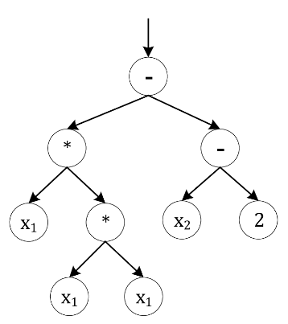
- **example: procedure vs primitive:**
  ```
  (define a (* 5 5))
  (define (b) (* 5 5))  ; procedure with no arguements
  a                     ; 25
  b                     ; CompoundProcedure
  (b)                   ; 25
  ```

# procedures & processes
- **formal parameter:** parameter written in function definition  
**actual parameter:** parameter written in function call
- **recursive definitions:** allows you to do infinite computations that go on until something is true  
**block structure:** package internals inside of definition to create a black-box
- **example: factorial using recursion:**
  ```lisp
  (define (factorial num)
    (if (< num 2)
        1 
        (* (factorial (- num 1)) num)))

  (factorial 10)  ; 3628800
  ```
- **example: square root by successive averaging:**
  ```lisp
  ; note: cannot run on online interpreters
  (define (sqrt x)                          ; block structure used
    (define (try g x)                       ; try
      (if (goodenough? g x)
          g
          (try (improve g x) x)))
    (define (improve guess x)               ; improve
      (average guess (/ x guess)))
    (define (goodenough? g x)               ; goodenough?
      (< (abs (- (square x) x))
         0.001))
    (define (square x) (* x x))             ; square
    (define (average x y) (* (+ x y) 0.5))  ; average
    (try 1 x))                              ; sqrt
  (sqrt 2)                                  ; 1.41421568
  ```
- **substitution model:** when we evaluate a name we substitute its definition in place of the name & then evaluate the resulting definition
  - **combinations:**
    ```lisp
    (define (sos x y) (+ (sq x) (sq y)))  ; sum of squares
    (define (sq a) (* a a))
    (sos 3 4)                             ; 25

    ; substitution model
    (sos 3 4)
    (+ (sq 3) (sq 4))
    (+ (sq 3) (* 4 4))
    (+ (sq 3) 16)
    (+ (* 3 3) 16)
    (+ 9 16)
    25
    ```
  - **special forms:** for conditionals evaluate predicate first then the consequent/alternative expression  
  other special forms are lambda expressions & definitions
    ```lisp
    (define (+ x y)
      (if (= x 0)
          y
          (+ (-1+ x) (1+ y))))         ; "-1+" is decrement operator & "1+" is the increment operator
                                       ; counting down "x" till "y" is the sum
    (+ 3 4)                            ; 7

    ; substitution model
    (+ 3 4)
    (if (= 3 0) 4 (+ (-1+ 3) (1+ 4)))
    (+ (-1+ 3) (1+ 4))
    (+ (-1+ 3) 5)
    (+ 2 5)                            ; recursion
    (if (= 2 0) 5 (+ (-1+ 2) (1+ 5)))
    (+ (-1+ 2) (1+ 5))
    (+ (-1+ 2) 6)
    (+ 1 6)                            ; recursion
    (if (= 1 0) 6 (+ (-1+ 1) (1+ 6)))
    (+ (-1+ 1) (1+ 6))
    (+ (-1+ 1) 7)
    (+ 0 7)                            ; recursion
    (if (= 0 0) 7 (+ (-1+ 0) (1+ 7)))
    7
    ```
- **example: peano arithmetic:** formalizes arithmetic operations on natural numbers & their properties  
there are two ways to add whole numbers, both are recursive definitions but lead to different process types: iteration & recursion  
number of steps is approximation for time it takes to execute and width is the the space that needs to be remembered
  - **iteration:** time `O(x)` (steps increase as `x` increases) & space `O(1)` (same width for any `x`)  
  has all of its state in explicit variables (formal parameters), example: can continue the computation from `(+ 1 6)`  
    ```lisp
    (define (+ x y)
      (if (= x 0)
          y
          (+ (-1+ x) (1+ y))))

    (+ 3 4)
    (+ 2 5)
    (+ 1 6)
    (+ 0 7)  ; consequent (exit condition)
    7
    ```
    ```mermaid
    graph LR
      a((start))
      b(loop)
      c(loop)
      d(loop)
      e(loop)

      a -- (+ 3 4) --> b
      b -- (+ 2 5) --> c
      c -- (+ 1 6) --> d
      d -- (+ 0 7) --> e
      e -- 7 --> a
    ```
  - **recursion:** time `O(x)` (steps increase as `x` increases) & space `O(x)` (deferred increments increase as `x` increases)  
  has its state not just in explicit variables but some information belongs to computer as well, example: cannot continue the computation from `(+ 1 4)` without knowing about deferred increments
    ```lisp
    (define (+ x y)
      (if (= x 0)
          y
          (1+ (+ (-1+ x) y))))

    (+ 3 4)
    (1+ (+ 2 4))
    (1+ (1+ (+ 1 4)))
    (1+ (1+ (1+ (+ 0 4))))  ; consequent (exit condition)
    (1+ (1+ (1+ 4)))
    (1+ (1+ 5))
    (1+ 6)
    7
    ```
    ```mermaid
    sequenceDiagram
      participant start
      participant call1
      participant call2
      participant call3
      participant call4

      start ->> call1: (+ 3 4)
      call1 ->> call2: (+ 2 4)
      Note over call1: 1+
      call2 ->> call3: (+ 1 4)
      Note over call2: 1+
      call3 ->> call4: (+ 0 4)
      Note over call3: 1+
      call4 ->> call3: 4
      call3 ->> call2: 5
      call2 ->> call1: 6
      call1 ->> start: 7
    ```
  - typically, an iterative process passes the answer around as a parameter (the accumulator) in such a way that the last recursive call has no pending operations left  
  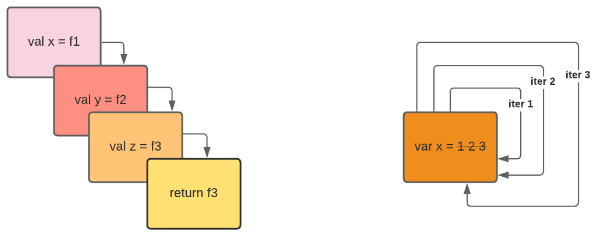
- **perturbation analysis:** making small changes to the program and see how it affects the process
- **example: fibonacci numbers:** this program consists of just two rules: breaking up a problem into two parts for `(> n 2)` and base case for `(< n 2)`  
time is denoted by each node that the dotted arrow follows `O(fib(x))` and space complexity is the longest path `O(n)` since we have to remember all the intermediate node values  
note that `fib(3)` subtree is being constructed twice so this is a extremely inefficient
  ```lisp
  ; [0 1] 1 2 3 5 8 13 21 34 . . .
  (define (fib n)
    if(< n 2)
      n
      (+ (fib (- n 1)) (fib (- n 2))))
  ```  
  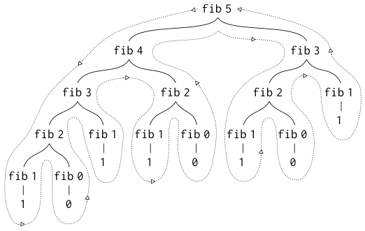
- *the way in which you would construct a recursive process is by wishful thinking, you have to believe*
- **example: towers of hanoi:** move `n` disks from tower `from` to tower `to` using an extra tower `spare`  
suppose we know how to move `n-1` disks, then we move `n-1` disks to `spare`, `n`th disk to `to`, then `n-1` disks on top of `n`th in `to`  
this is possible through recursion because we always count down and when we reach 0 high tower it requires no moves
  ```lisp
  (define (move n from to spare)
    (cond ((= n 0) "done")
          (else
            (move (-1+ n) from spare to)     ; move "n-1" disks "from" to "spare" using "to" as spare
            (single_move n from to)          ; move "n"th disk "from" to "to"
            (move (-1+ n) spare to from))))  ; move "n-1" disks "spare" to "to" using "from" as spare
  ```  
  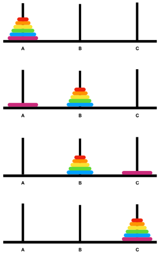  

# higher order procedures
- summation of integers & summation of squares have almost the same program with only term differing (`a` & `(square a)`)  
but we don't like repetition and no repetition means you only write it once (also only understand and debug it once)
  ```lisp
  ; Σ i, for i=a to i=b
  (define (sum_int a b)
    (if (> a b)
      0
      (+ a                       ; term
         (sum_int (1+ a) b))))

  ; Σ i^2, for i=a to i=b
  (define (sum_sq a b)
    (if (> a b)
      0
      (+ (square a)              ; term
         (sum_sq (1 + a) b))))
  ```
- *whenever trying to make complicated systems and understand them, it is crucial to divide the things up into as many pieces as I can, each of which I understand separately  
no repetition means you only write it once but also only understand and debug it once  
any time you see things that are almost identical think of an abstraction to cover them*
- **example: generic summation:** procedures are just another kind of data like numbers,so a more general pattern for summation is
  ```lisp
  (define (sum term a next b)           ; "term" & "next" are procedural arguments
    (if (> a b)
      0
      (+ (term a)                       ; "term" produces the value for a given index
         (sum term (next a) next b))))  ; "next" produces the next index
  ```
  procedure `sum` is then encapsulated in other procedures, so improving `sum` will automatically benefit all procedures using it
  ```lisp
  ; sum_int
  (define (sum_int a b)
    (define (identity a) a)      ; defined because sum expects procedure argument
    (sum identity a 1+ b))       ; 1+ gives next index
  
  ; sum_sq
  (define (sum_sq a b)
    (define (square a) (* a a))
    (sum square a 1+ b))
  ```
- **higher order procedures:** take procedural arguments & produce procedural values out, they help us clarify & abstract some otherwise complicated processes
- **example: square-root using fixed point:**
  ```lisp
  ; square root
  (define (sqrt x)
    (fixed_point 
      (lamdba (y) (average (/ x y) y))  ; y ⟶ (y + (x/y))/2
      1))                               ; initial guess
  
  ; fixed point
  (define (fixed_point f start)
    (define tolerance 0.001)
    (define (close_enough u v)
      (< (abs(- u v)) tolerance))
    (define (iter old new)
      (if (close_enough old new)
        new
        (iter new (f new))))       ; "new" becomes old & "f(new)" becomes new
    (iter start (f start)))
  ```
  **why `(y + (x/y))/2` should converge?:** for `(sqrt x)` we know `y^2 = x` so its equivalent form `y = x/y` can be used to search for the fixed point using `(fixed_point (lambda (y) (/ x y)) 1)`  
  but for initial guess `y1` this never converges, it keeps oscillating between `y1` & `y2` such that `y2 = x/y1` ⟶ `y3 = x/y2 = x/(x/y1) = y1`  
  average is used to damp out these oscillations
  ```lisp
  (define (sqrt x)
    (fixed_point
      (average_damp (lambda (y) (/ x y)))  ; procedure returned from average_damp used as "f"
      1))
  
  (define average_damp
    (lambda (f)                            ; takes procedure as an argument
      (lambda (x) (average (f x) x))))     ; and returns a procedure

  ; OR
  (define (average_damp f)                 ; takes procedure as an argument
    (define (foo x) (average (f x) x))
    foo)                                   ; and returns a procedure
  ```
- **top-down design:** allows us to use names of procedures that we haven't defined yet while writing a program
- **example: Netwon's method to find square roots:** used to find zeroes/roots of a function  
to find `y` such that `f(y) = 0`, start with a guess `y0` and then iterate with `yn+1 = yn - f(yn)/f'(yn)`
  ```lisp
  (define (sqrt x)
    (newton (lambda (y) (- x (square y)))  ; the value of "y" for which "x - y^2 = 0" or "y = sqrt(x)"
            1))

  (define (newton f guess)
    (define df (derive f))
    (fixed_point
      (lambda(x) (- x (/ (f x) (df x))))  ; x - f(x)/f'(x)
      guess))

  (define deriv                           ; compound procedure
    (lambda (f)
      (lambda (x)
        (/ (- (f (+ x dx))                ; (f(x+dx) - f(x))/dx
              (f x))
           dx))))

  (define dx 0.00001)

  ; newton without block structure
  (define (newton f guess)
    (fixed_point
      (lambda(x) (- x (/ (f x) ((deriv f) x))))  ; x - f(x)/f'(x)
      guess))
  ```
- Chris Strachey was an advocate for making procedures/functions first class citizens in a programming language, rights and privileges of first-class citizens are to be:
  - named by variables
  - passed as arguments to procedures
  - returned as values of procedures
  - incorporated into data structures

# compound data
- **layered system:** when we're building things we divorce the task of building things from the task of implementing the parts  
example:someone else could have written `goodenough?` for us when we wrote `sqrt`, as long as it works we don't know the implementation (abstraction layer)  
similarly we have means of combination for data as well
- **example: rational number arithmetic:** to express the arithmetic operators for fractions  
we already know that `n1/d1 + n2/d2 = (n1d2 + n2d1)/d1d2` and `n1/d1 * n2/d2 = n1n2/d1d2`  
so here computation is easy but to represent a fraction we apply the strategy of wishful thinking and just assume we already have `make_rat` to create fraction from numbers, `numer` to get numerator from rational number & `denom` to get denominator from rational number
  ```lisp
  ; "x" & "y" are rational numbers
  (define (+rat x y)
    (make_rat)
      (+ (* (numer x) (denom y))   ; numerator
         (* (numer y) (denom x)))
      (* (denom x) (denom y)))     ; denominator

  (define (*rat x y)
    (make_rat)
      (* (numer x) (numer y))      ; numerator
      (* (denom x) (denom y)))     ; denominator
  ```
  `make_rat` is called a constructor and `numer` & `denom` are called selectors  
- **why bother with these instead of passing four numbers:** with compound data `(x + y) * (s + t)` can be represented as `(*rat (+rat x y) (+rat s t))`  
but without:
  - we need to temporarily store two numbers (numerator & denominator) after evaluating `(x + y)` and two more after evaluating `(s + t)` and then those four need to be operated on, so we are spilling the internals of rational numbers in the program
  - more importantly we would like programming language  to explain concepts in our heads like rational numbers are things that you can add
  - now if we need a type having 10 rational numbers, then we cannot have 20 unrelated arguments which is also not scalable
- **list structure:** is a way of glueing things together (like numerator & denominator to form a rational number)  
it provides `cons` (constructor) which takes two arguments and returns a compound data object (pair) that contains the two arguments  
given a pair we can extract the two parts using the `car` & `cdr`
  ```lisp
  (cons 3 4)        ; (3 . 4)
  (car (cons 3 4))  ; 3
  (cdr (cons 3 4))  ; 4
  ```
  pairs can be represented with two boxes side by side with an arrow coming from each. This is called box-and-pointer notation  
  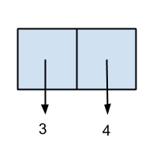
- **example: rational number arithmetic with list structure:**
  ```lisp
  (define (make_rat n d)
    (cons n d))
  (define (numer x) (car x))
  (define (denom x) (cdr x))
  ```
  but adding `3/4` and `1/4` gives `16/16` instead of `1` that we know, here `make_rat` should be responsible for reducing to lowest terms
  ```lisp
  (define (make_rat n d)
    (let ((g (gcd n d))))       ; get greatest-common-divisor (gcd)
      (cons (/ n g) ( / d g)))  ; reduce by dividing gcd
  ```
- *as systems designers you're forced with the necessity to make decisions about how you're going to do things, and in general the way you'd like to retain flexibility is to never make up your mind about anything until you're forced to do it, so you'd like to make progress but also at the same time never be bound by the consequences of your decisions  
the real power is that you can pretend that you've made the decision and then later on figure out which decision you ought to have made, and when you can do that you have the best of both worlds*
- **data abstraction:** most important thing in our rational arithmetic system is the abstraction layer with operators (`+rat`) on one side and pair ctor (`make_pair`) & selectors (`numer` & `denom`) on other  
we always separate the use of data objects from its representation  
one advantage of this is the flexibility to use alternative representations (like reduce fractions in `numer` & `denom` instead) hence letting us postpone decisions  
it is a way of controlling complexity in large systems, the real power comes from their use as building blocks for more complicated things  
example: use `cons`, `car` & `cdr` to represent points on a plane, then use points as building blocks to make line segments, now we have a multi-layered system of line segments, points and pair  
without data abstraction, the procedure for calculating length of a line segment is very hard to read and worse it locks you into decisions about representation
- the procedures we wrote earlier using `make_rat`, `numer` & `denom` were written using abstract data with only the assured property being if `x = (make_rat n d)` then `(numer x)/(denom x) = n/d`, beyond this basic interface contract we know nothing about its implementation  
they could even be implemented using lambdas without using any special primitives
  ```lisp
  (define (cons a b)
    (lambda (pick)
      (cond ((= pick 1) a)     ; car
            ((= pick 2) b))))  ; cdr
  (define (car x) (x 1))
  (define (cdr x) (x 2))
  ```
  so we don't data at all for data abstraction, this blurs the line between code & data  
  procedures are not just the act of doing something, they are conceptual entities or objects  
  using procedures as objects we can write  
  ```lisp
  (define make_rat cons)
  (define numer car)
  (define denom cdr)
  ```
- **closure:** means of combination in your system are such that when you put things together using them, you can then put those together with the same means of combination (things that we combine can themselves be combined)  
example: numbers combined to form pair, then we can combine to have pair of pairs as well

# Henderson-Escher example
- there are a lot of ways of building list structure (array) using pairs, but lisp has a convention for representing it as chained pairs  
**list:** `car` of pair is first item and `cdr` is the rest of the sequence, `cdr` of the last pair has a special marker `nil`, predicate `null?` can be used to check if list is empty `()`  
`list` procedure is an abbreviation for the nested pairs  
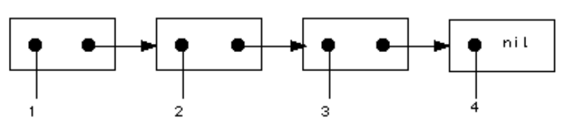
  ```lisp
  (define one_to_four (list 1 2 3 4))
  
  one_to_four             ; (1 2 3 4)
  (cdr (one_to_four))     ; (2 3 4)
  (car(cdr one_to_four))  ; 2
  ```
- **example: scale list:** multiply a scalar value with each item in the list
  ```lisp
  (define scale_list s l)
    (if (null? l)
        nil                             ; if input list empty
        (cons (* (car l) s)             ; first element
              (scale_list s (cdr l))))  ; rest of the scaled list
  ```
  **`map`:** rather than recursively transforming each element we can use a higher-order procedure, now we can support any mapping operation on lists
  ```lisp
  (define map p l)
    (if (null? l)
        nil
        (cons (p (car l))        ; apply procedure to first element
              (map p (cdr l))))  ; map down the rest of the list

  (define (scale_list s l)
    (map (lambda (elem) (* elem s))
         l))
  ```
  **`for_each`:** is like map but it doesn't build up a new list, it is just for side effects (like print list to screen)
  ```lisp
  (define (for_each p l)
    (cond ((null? l) "done")
          (else (p (car l))              ; do it for first element
                (for_each p (cdr l)))))  ; do it for the rest of the elements
  ```
- **example: Henderson-Escher painting language:** we have construct a design language for describing self-similar fractal like figures (metalinguistic abstraction)  
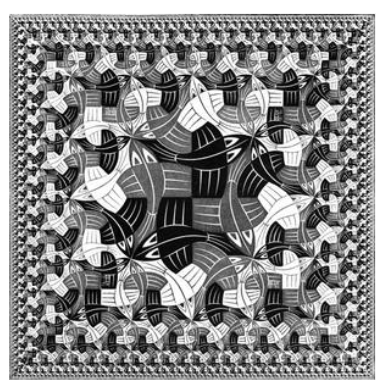  
this language has only one primitive: as figure scaled to fit any given frame, `painter` is a procedure that takes a frame and draws its image within the frame  
we have four means of combination: `rotate` (counter-clockwise), `flip` (across given axis), `beside` (merge/stitch images side by side in a certain ratio), `above` (same as beside but vertically)  
thanks to closure property we can build up complexity quickly  
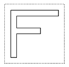
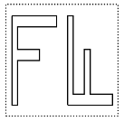
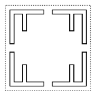  
since they are just procedures, everything that lisp supplies for procedures is automatically available to us in this painting language (like recursive painters)
- the difference between merely implementing something in a language and embedding something in the language is that you don't lose the original power of the language
- **software engineering methodology:** usually is to:  
figure out your task ⟶ break it into sub-tasks ⟶ repeat for each sub-task ⟶ work your way up to the top  
where each part does a specific task is supposed fit perfectly into the whole thing  
but with painting language we had a sequence of layers of language where each layer depends on the layers beneath it  
primitive picture ⟶ geometric combinators ⟶ schemes of combination  
here each level is doing a whole range of things not a single task, which makes the system more robust (easier to adapt to changes), whereas a small change in the top-down tree might cause the whole thing to fall down  
now we are talking about levels of language rather than a strict hierarchy where each level has its own vocabulary
- *lisp is a lousy language for doing any particular problem, what it's good for is figuring out the right language that you want and embedding that in lisp  
the design process is not so much implementing programs as implementing languages*


# clean code
- **fundamentals:**
  - write for clarity and correctness first
  - avoid premature optimization, by default prefer clear over optimal
  - prefer faster when equally clear
- **basics:**
  ```cpp
  int some_random_var;  // snake case
  int some-random-var;  // kebab case
  int someRandomVar;    // camel case
  int SomeRandomVar;    // pascal case
  ```
- **naming:**
  ```cpp
  // snake_case: variables
  int some_var;
  // CAPITALIZED_SNAKE_CASE: constants & macros
  const int SOME_CONSTANT_VAR = 10;
  // camelCase: functions & classes
  int someFunction(void);
  ```

# misc
- programming requires dividing a unit of work into smaller units of work with the goal to replace units of work with one of the programming constructs:
  - **sequential:** used if task can be broken down into two subtasks one following the other
  - **conditional:** used if the task consists of doing one of two subtasks but not both
  - **iterative:** used if the task consists of doing a subtask a number of times but only as long as some condition is true
  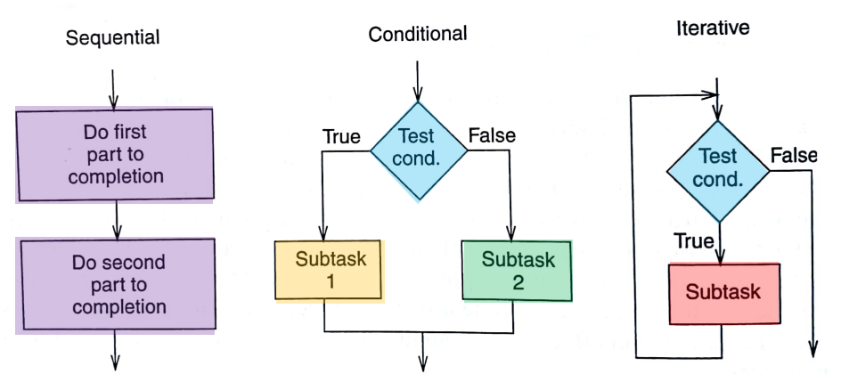
- **reentrancy:** a function/subroutine can be interrupted and then resumed before it finishes executing, this also means that the function can be called again before it completes its previous execution, so reentrant code needs to be safe & predictable when multiple instances of the same function are called simultaneously or in quick succession