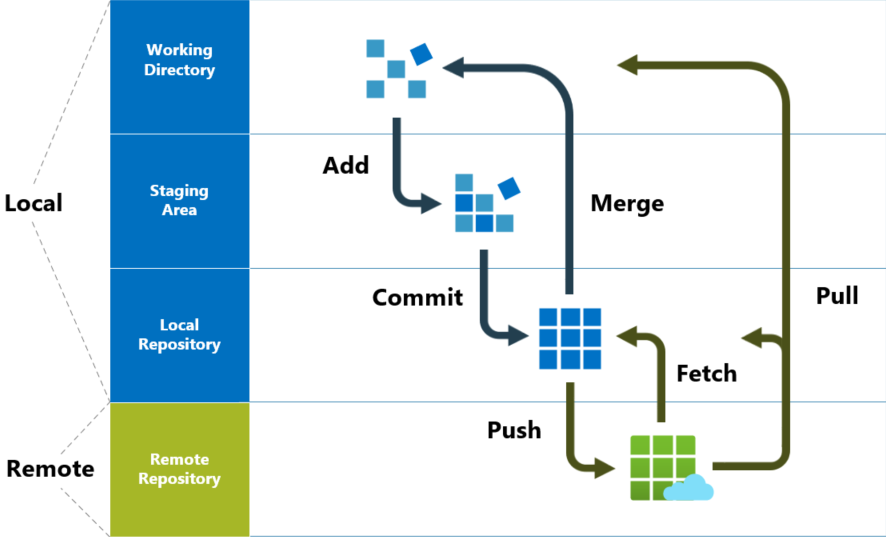

# tools
- [git](#git)

## links  <!-- omit from toc -->
- [git guide](http://rogerdudler.github.io/git-guide/)
- [git parable](httsps://www.youtube.com/watch?v=jm7QsI-nNjk)

## todo  <!-- omit from toc -->
- [undo (almost) anything with git](https://github.blog/2015-06-08-how-to-undo-almost-anything-with-git/)
- [regex basics](https://www.youtube.com/watch?v=sa-TUpSx1JA)
- linux commands (from archived ?)
- gdb
- cmake
- gtest
- gprof
- valgrind
- thread sanitizers
- basic linux commands
- bash scripting
- batch scripting
- python scripting

## git
- 
- **create a new repo:**
  ```sh
  git init  # create a new git repo
  ```
- **checkout a repo:**
  ```sh
  git clone /path/to/repo                # copy of a local repo
  git clone username@host:/path/to/repo  # from a remote server
  ```
- **workflow:** local repo consists of 3 trees maintained by git
  - **working directory:** holds actual files
  - **index:** acts as staging area
  - **head:** points to last commit made by you
- **add & commit:**
  ```sh
  git add   <filename>       # working -> index
  git commit -m "<message>"  # index -> head
  ```
- **pushing changes:**
  ```sh
  git push origin <branch>        # head -> remote
  git remote add origin <server>  # connect local repo to a remote server
  ```
- **branching:** used to develop features isolated from each other, `master` is the default branch, use other branches for development and merge them back to master upon completion
  ```sh
  git checkout <branch>     # checkout/switch-to a branch
  git checkout -b <branch>  # create a branch & switch to it
  git branch -d <branch>    # delete a branch
  ```
- **update & merge:** git always tries to auto merge, resolve conflicts manually then `git add <filename>` to mark them as merged
  ```sh
  git fetch <name>           # fetch changes (but doesn't change anything in workspace)
  git merge <name>/<branch>  # integrate changes from someone else
  git pull                   # detach & merge in a single command
  ```
- **diff:**
  ```sh
  git diff              # working vs index
  git diff --staged     # index vs commit
  git diff HEAD         # working vs head
  git diff <from> <to>  # commit vs commit
  ```
- **tagging:** recommended to create tags for software releases
  ```sh
  git tag -l              # list current tags
  git tag <tag> <commit>  # create a tag pointing to a commit
  ```
- **log:**
  ```sh
  git log                   # look at repo history
  git log --author=<user>   # only commits from certain author
  git log --pretty=oneline  # compressed log
  git log --name-status     # only see files that have changed
  ```
- **misc:**
  ```sh
  git checkout -- <filename>  # replace working directory file changes with one in HEAD
  git status                  # changes in working directory & index
  git fetch origin && git reset --hard origin/master  # drop all local changes & commits
  ```