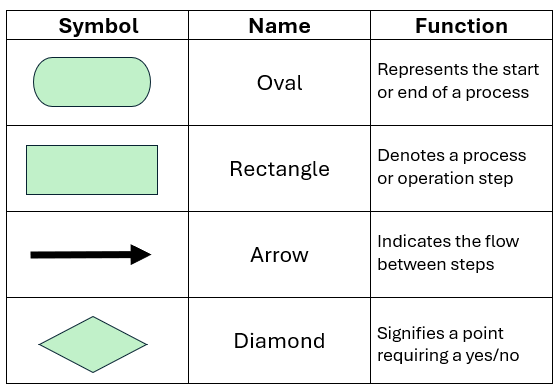

# table of contents  <!-- omit from toc -->
- [git](#git)
- [mermaid UML](#mermaid-uml)
- [powershell](#powershell)
- [ffmpeg](#ffmpeg)
- [vlc](#vlc)
- [youtube](#youtube)

# links  <!-- omit from toc -->
- [git guide](http://rogerdudler.github.io/git-guide/)
- [git parable](httsps://www.youtube.com/watch?v=jm7QsI-nNjk)
- [clang format](https://clang.llvm.org/docs/ClangFormatStyleOptions.html)

# todo  <!-- omit from toc -->
- [undo (almost) anything with git](https://github.blog/2015-06-08-how-to-undo-almost-anything-with-git/)
- [regex basics](https://www.youtube.com/watch?v=sa-TUpSx1JA)
- linux commands (from archived ?)
- gdb (check on cppcon)
- cmake (check on cppcon)
- gtest (check on cppcon)
- gprof (check on cppcon)
- valgrind (check on cppcon)
- thread sanitizers
- basic linux commands
- bash scripting
- batch scripting
- python scripting

# git
- 
- **create a new repo:**
  ```sh
  git init  # create a new git repo
  ```
- **checkout a repo:**
  ```sh
  git clone /path/to/repo                # copy of a local repo
  git clone username@host:/path/to/repo  # from a remote server
  ```
- **workflow:** local repo consists of 3 trees maintained by git
  - **working directory:** holds actual files
  - **index:** acts as staging area
  - **head:** points to last commit made by you
- **add & commit:**
  ```sh
  git add   <filename>       # working ⟶ index
  git commit -m "<message>"  # index ⟶ head
  ```
- **pushing changes:**
  ```sh
  git push origin <branch>        # head ⟶ remote
  git remote add origin <server>  # connect local repo to a remote server
  ```
- **branching:** used to develop features isolated from each other, `master` is the default branch, use other branches for development and merge them back to master upon completion
  ```sh
  git checkout <branch>     # checkout/switch-to a branch
  git checkout -b <branch>  # create a branch & switch to it
  git branch -d <branch>    # delete a branch
  ```
- **update & merge:** git always tries to auto merge, resolve conflicts manually then `git add <filename>` to mark them as merged
  ```sh
  git fetch <name>           # fetch changes (but doesn't change anything in workspace)
  git merge <name>/<branch>  # integrate changes from someone else
  git pull                   # detach & merge in a single command
  ```
- **diff:**
  ```sh
  git diff              # working vs index
  git diff --staged     # index vs commit
  git diff HEAD         # working vs head
  git diff <from> <to>  # commit vs commit
  ```
- **tagging:** recommended to create tags for software releases
  ```sh
  git tag -l              # list current tags
  git tag <tag> <commit>  # create a tag pointing to a commit
  ```
- **log:**
  ```sh
  git log                   # look at repo history
  git log --author=<user>   # only commits from certain author
  git log --pretty=oneline  # compressed log
  git log --name-status     # only see files that have changed
  ```
- **misc:**
  ```sh
  git checkout -- <filename>  # replace working directory file changes with one in HEAD
  git status                  # changes in working directory & index
  git fetch origin && git reset --hard origin/master  # drop all local changes & commits
  ```

# [mermaid UML](https://jojozhuang.github.io/tutorial/mermaid-cheat-sheet/)
- **flowchart:** graph direction: `TB` , `BT`, `RL`, `LR`  
nodes shape: rect `[ ]`, rounded rect `( )`, circle `(( ))`, rhombus `{ }`  
link types: link `---`, arrow `-->`, dotted arrow `-.->`  

  ```bash
  graph LR
    a((start))
    b[func1]
    c[func2]
    d{cond}
    e((end))

    a --> b
    b --> d
    d -- yes --> c
    d -- no --> e
    c --> e
  ```
  ```mermaid
  graph LR
    a((start))
    b[func1]
    c[func2]
    d{cond}
    e((end))

    a --> b
    b --> d
    d -- yes --> c
    d -- no --> e
    c --> e
  ```
- **sequence diagram:** participants in order of declaration  
message types: line `->`, dotted line `-->`, arrow `->>`, dotted arrow `-->>`  
show activation period by appending `+`/`-` to message  
notes can be added `Note [direction] [participants]: [message]` where direction can be `right of`, `left of`, `over`  
for `over` notes multiple comma-separated participants can be added  
for loops `loop <title>\n  statements...  \nend`
  ```bash
  sequenceDiagram
    participant thread1
    participant thread2
    participant thread3

    thread1 ->>+ thread2: frame_start

    loop busy_wait
        thread2 -->> thread3: reg_read
        thread3 -->> thread2: reg_val
    end

    thread2 ->>+ thread3: frame
    thread3 ->>- thread2: output

    Note over thread1, thread2: some comment
    thread2 ->>- thread1: frame_done
  ```
  ```mermaid
  sequenceDiagram
    participant thread1
    participant thread2
    participant thread3

    thread1 ->>+ thread2: frame_start

    loop busy_wait
        thread2 -->> thread3: reg_read
        thread3 -->> thread2: reg_val
    end

    thread2 ->>+ thread3: frame
    thread3 ->>- thread2: output

    Note over thread1, thread2: some comment
    thread2 ->>- thread1: frame_done
  ```

# powershell
- **replace string in all files:**
  ```sh
  get-childitem *.mp4 | foreach { rename-item $_ $_.Name.Replace("Lecture ","") }
  ```

# ffmpeg
- **mkv to mp4:**
  ```sh
  for %f in (*.mkv) do ffmpeg -i "%f" -codec copy "%f.mp4"
  get-childitem *.* | foreach { rename-item $_ $_.Name.Replace(".mkv.mp4",".mp4") }
  ```
- **concatenate multiple files:**
  ```sh
  ffmpeg -f concat -i merge.txt -c copy merged.mp4

  # merge.txt
  file '1.mp4'
  file '2.mp4'
  file '3.mp4'
  ```
- **change resolution:**
  ```sh
  ffmpeg -i input_720p.mp4 -s 640x360 -c:a copy output.mp4
  ffmpeg.exe -i input.mp4 -filter:v scale=-2:360 -c:a copy output.mp4
  ```

# vlc
- **filename as title:**  

- **always on top:** `View` ⟶ `Always on Top`
- **minimal view default:** `Tools` ⟶ `Preferences` ⟶ `All` ⟶ `Interface` ⟶ `Main interfaces` ⟶ `Qt` ⟶ `Start in minimal view`
- **always continue playback:** `Tools` ⟶ `Preferences` ⟶ `Interface` ⟶ `Continue Playback` ⟶ `Always`

# youtube
- **all channel uploads playlist:** copy channel ID from channel's about section, the second letter should be an `C` replace it with `U` & paste it after `https://www.youtube.com/playlist?list=`